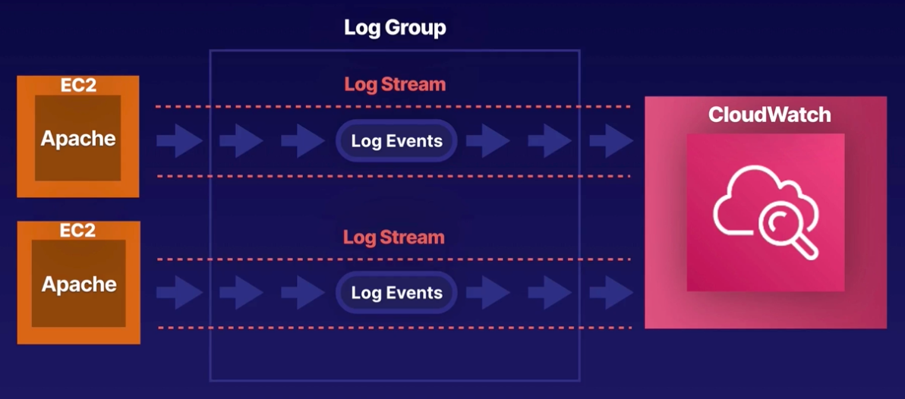
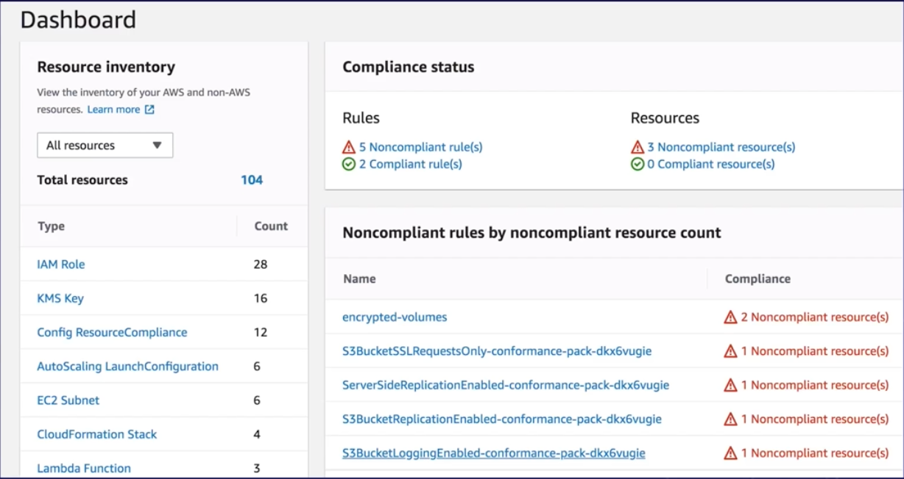
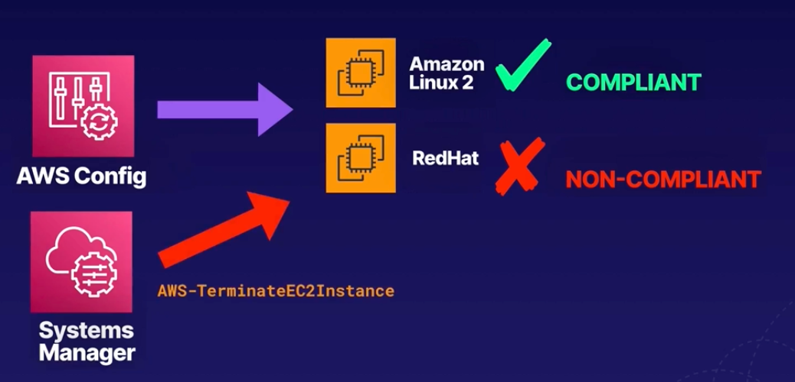
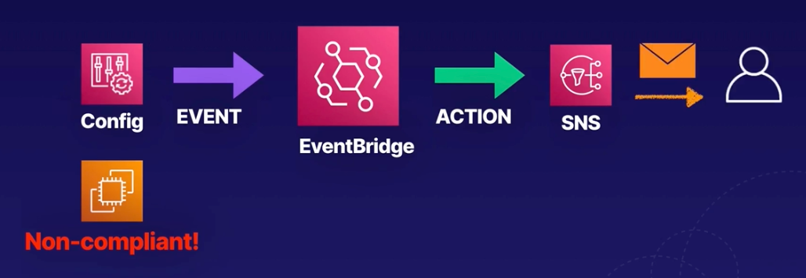

# CHAPTER 3 **Monitoring, Logging, and Remediation**

### Chapter Outline
- Section Introduction
- Introduction to CloudWatch
- `Demo` Creating CloudWatch Dashboards
- Exploring CloudWatch Logs
- `Demo` Collecting Metrics and Logs Using the CloudWatch Agent
- `Demo` Creating CloudWatch Metric Filters
- `Demo` Exploring CloudWatch Logs Insights
- `HANDS-ON LAB` Using CloudWatch for Resource Monitoring
- Receiving Notifications with CloudWatch
- `Demo` Creating CloudWatch Alarms
- Introduction to CloudTrail
- `Demo` Working with CloudTrail
- AWS Config 101
- `Demo` Using AWS Config
- `HANDS-ON LAB` Auditing Resource Compliance with AWS Config
- Remediation Using AWS Systems Manager and AWS Config
- `Demo` Configuring Automatic Remediation Using AWS Systems Manager and AWS Config
- What Is EventBridge?
- `Demo` Using Amazon EventBridge
- `Demo` Scheduling Automated Tasks Using EventBridge and AWS Config
- `Demo` Exploring Health Dashboards
- Section Review: Monitoring, Logging, and Remediation Summary - Part 1
- Section Review: Monitoring, Logging, and Remediation Summary - Part 2

   

## Section Introduction
The main services covered in this section are:
- `CloudWatch`
- `CloudTrail`
- `EventBridge`
- `Config`
- `System Manager`
- `Health Dashboards`

   

## Introduction to CloudWatch
### What is CloudWatch
**Amazon CloudWatch** is a monitoring service to monitor the health and performance of your AWS resources, as well as the applications you run on AWS, and in your own data center.

 

### What Can CloudWatch Monitor?
- **Compute**
  - EC2 instances
  - Auto Scaling groups
  - Elastic Load Balancers
  - Route 53 health checks
  - Lambda
- **Storage and CDN**
  - EBS volumes
  - Storage Gateway
  - CloudFront
- **Database and Analytics**
  - DynamoDB tables
  - ElasticCache nodes
  - RDS instances
  - Redshift
  - Elastic Map Reduce
- **Other**
  - SNS topics
  - SQS queues
  - API Gateway
  - Estimate AWS charges

 

### The CloudWatch Agent
- The **CloudWatch Agent** - define your own metrics. You can install CloudWatch Agent on your own data centers.
- **CloudWatch Logs** allows yous you to monitor operating system and application logs.

 

### CloudWatch and EC2
#### Host-Level Metrics
- All EC2 instances send key health and performance metric to CloudWatch.
- Default EC2 host-level metric consist of CPU, network, dick and status check.
- Metrics are stored indefinitely.
- You can retrieve data from any EC2 or Elastic Load Balancer instance, even after it has been terminated.
#### Operating System-Level Metric
Memory usage, processes running on your instance, amount of free disk space, CPI idle time, etc.
- **By Default** EC2 does not send operating system-level metric to CloudWath
- **CloudWatch Agent** By installing the CloudWatch agent on your EC2 instances, you can collect operating system metrics and send them to CloudWatch.

### Metric Frequency
- By **Default**, EC2 sends metric data to CloudWatch in 5-minute intervals.
- For an **Additional charge**, you can enable **detailed monitoring** that sends metrics at 1-minute intervals.
- For **custom metrics**, the default is 1-minute intervals, and you can configure **high-resolution** metrics that are sent at 1-second intervals.

   

## Exploring CloudWatch Logs

**1. CloudWatch Logs Overview:**
   - CloudWatch Logs provides centralized logging for:
     - **Application logs** (e.g., Apache logs).
     - **System logs** (e.g., operating system logs on EC2).
     - **AWS service logs** (e.g., CloudTrail or Route 53).
   - Allows users to view, search, and filter logs based on error codes or messages (e.g., 404 status codes in Apache logs).
   - Can configure CloudWatch Logs to send notifications when error rates exceed a predefined threshold.
   - Useful for monitoring and troubleshooting applications by analyzing system or application log files.
   - Logs can be customized for specific phrases, error codes, or patterns relevant to the user’s application.

**2. CloudWatch Logs Features:**
   - **Monitor in near real-time:** Ability to monitor log files in near real-time.
   - **Search and filter:** Search logs based on specific error codes or patterns.
   - **Notifications:** Configure notifications for log events based on thresholds.
   - **Customization:** Customize monitoring for specific application needs.

**3. Key Components of CloudWatch Logs:**

   - **Log events:** Each log event consists of an event message and a timestamp.
   - **Log stream:** A sequence of log events from a specific source (e.g., Apache log from a host). Must belong to a log group.
   - **Log group:** A collection of log streams with centralized management for retention, monitoring, and access control settings.
     - No limit on the number of log streams in a log group.

**4. Retention Settings:**
   - By default, CloudWatch Logs are retained indefinitely.
   - Custom retention periods can be set, ranging from `1 day - 10 years`.
   - Expired log events are automatically deleted.
   - Retention settings are applied at the log group level, avoiding the need to configure settings for each EC2 instance individually.

**5. CloudWatch Logs Scenario:**
   - Example: Two EC2 instances running Apache send log events from Apache logs to CloudWatch.
   - A sequence of log events from the same source forms a **log stream**.
   - Multiple log streams (e.g., from different EC2 instances) can be managed centrally as a **log group**.
   - Centralized management allows for easier control of retention, monitoring, and access settings across multiple log streams.

   

## Receiving Notifications with CloudWatch

### CloudWatch Alarms
You can create an alarm to monitor any CloudWatch metric in your account.
- **Alarms** This can include EC2 CPU utilization, Elastic Load Lancer latency, or even the chanrges on your AWS bill.
- **Thresholds** You can set appropriate thresholds to trigger the alarms and actions to be taken if an alarm state is reached.
- Use Case An alarm that sends an SNS notification or executes an Auto Scaling policy if CPU utilization exceeds 90% on your EC2 instance for more than 5 minutes.

 

### SNS Notifications
- CloudWatch integrates with SNS to send email notifications.

  
  - Event recorded (CPU usage exceeds 90% for 5 minutes)
  - CloudWatch send trigger to SNS service
  - SNS service sends an email to support team, notifying them about high CPU unilization event
  
 

### Service Quotas
- CloudWatch can be used to monitor your service quotas/limits and notify you if you are about to reach the limit.
- Use the Service Quotas console to configure a CloudWatch alarm to send an SNS notification.

  

 

### Health Events
- **AWS Health** (the API behind Personal Health Dashboard) can send health events to **EventBridge**, triggering a CloudWatch Alarm, which can trigger an action.

  

   

## Introduction to CloudTrail
### What is CloudTrail?
- Records user activity in your AWS account
- Enabled by default when you create AWS account
- Records events related to **creation**, **modification**, or **deletion** of resources (such as IAM users, S3 buckets and EC2 instances)

 

### CloudTrail Examples
- CloudTrail logs the API calls that are made in your AWS account
- The mojority of AWS services are supported

  

  > Calls from AWS console or via AWS CLI against resources are recorded in logs and displayed in CloudTrail
  >
  > However, the SSH/RDP sessions are not recorded in CloudTrail

 

### CloudTrail Use Cases
- **Incident investigation** After-the-fact investigation of incidents in your AWS account
- **Security Analysis** Near real-time security analysis of user activity
- **Compliance** Can be used to help you meet industry, regulatory compliance, and audit requirements

 

### Log Retention
- By default, log event records are kept for 90 days
- If you need to keep records longer, you can **Create a Trail**. When you create a trail in the console, the logs are saved indefinitely to an S3 bucket. Logs will be saved indefinitelly to `S3` bucket.
- **Secure By Default** Encrypted using Server Encryption. Log integrity validation means logs are digitaly signed, so you can detect if a log was changed or deleted.
- **All Regions** By default, a trail created in the console will apply to all regions.

 

### Near Real-Time?
- CloudTrail provides near real-time loggins
- After making an API call, it can take up to 15 minutes for the call to appear in CloudTrail
- CloudTrail publishes logs to S3 approximately every 5 minutes

   

## AWS Config 101
### What is AWS Config?
- **Configuration Monitoring** Continuously monitor rhe configuration of your AWS resources.
- **Desired State** Evaluates configurations against a desired state that you define.
- **Notifications** Sends events to EventBridge and SNS if a resource deviates from desired state, e.g. a non-compliant resource can trigger an SNS notification(s).
- **Automatic Remediation** Automatically remediate non-compliant resource by triggering an action that you define.
- **Change history** Change history is stored in an S3 bucket
- **Compliance** Great for compliance and security governance
- **Integrated** Integrated with loads of AWS services: `IAM`, `EC2`, `Elastic Block Store`, `Elastic Load Balancer`, `CloudFormation`,  `CloudFront`, `Cloud Trail`, `KMS`, `RDS`, `S3`, `Security Groups`, `SNS`, `VPC`

 

### Config Dashboard

- **Resource inventory** Config builds out an inventory of your resources.
- **Compliance status** The overal status of compliant and non-compliant resources.
- **Noncompliant rules by noncompliant resource count** List of all non compliant resources

 

### AWS Config Example Scenario
- Your company requires that EC2 instances in your VPC must not have public IP addresses.
- AWS Config evaluates all instances and discovers that one instance is non-compliant.
- Config can perform an automatic remediation action that you define - e.g. stop the instance

 

### AWS Config Terminology
1. **Rule** A Config rule represents the desired configuration for a specific resource.
2. **Managed Rules** AWS provides over 180 managed rules for pre-defined common best practices (you can also create your own).
3. Example:
   - `s3-bucket-public-read-prohibited`
   - `desired-instance-type` checks that all EC2 instances of desired type
   - `cloud-trail-encryption-enabled`
   - `ec2-ebs-encryption-by-default`
4. **Conformance Packs** A set of rules and remediation actions that can be deployed and managed as one.  Sample templates include:
   - Operational Best practices for S3
   - Operational Best Practices for EC2
   - Operational Best Practices for IAM
   - Operational Best Practices for PCI DSS
   - Operational Best Practices for AWS Well-Architected Framework Security Pillar

   

## Remediation Using AWS Systems Manager and AWS Config
### Recap of Systems Manager
- **Management** Visibility and control over your EC2 instances
- **Operations** Perform common operational tasks on groups of instances simultaneously woithout logging in to each one
- **Automation** Patching, installing applications, running scripts, stopping and starting instances, AWS API calls

 

### Systems Manager Pre-Defined Actions
- **EC2 Instance**
  - AWS-ResizeInstance
  - AWS-ReleaseElasticIP
  - AWS-StopEC2 Instance
  - AWS-TerminateEC2 Instance
- **EBS Volumes**
  - AWS-AttachEBSVolume
  - AWSConfigRemediation-DeleteUnusedEBSVolume
  - AWSConfigRemediation-EnableEbsEncryptionByDefault
  - AWSConfigRemediation-ModifyEbsVolumeType
- **Security Groups**
  - AWSConfigRemediation-DeleteUnusedSecurityGroup
  - AWS-DisableIncomingSSHOnPort22
  - AWS-DisablePublicAccessForSecurityGroup
- **Other Cool Things**
  - AWS-ConfigureCloudTrailLogging
  - AWS-CreateRdsSnapshot
  - AWS-PublishSNSNotification

> Any **pre-defined action** in `Systems Manager` can be leveraged by `AWS Config` to remediate non-compliant resources

 

### AWS Config and Systems Manager
- **AWS Config** monitors the configuration of resources in your AWS account for compliance with rules that you configure
- Config can also remediate non-compliant resources
- It utilizes System Manager to perform an automated remediation action that you define

 

### Example Scenario

- The company you working at only supports EC2 instances wunning Amazon Linux 2
- You have been asked to terminate any EC2 instances that are running a different operating system
- You configure the rule in AWS Config that check whether all EC2 instances are using AMI2
- Config will mark the offending instance (i.e. running RedHat) as non-compliant.
- We can also configure automatic remediation action within Config.
- Under the hood we will use `Systems Manager` to perform the remediation with predefined action `AWS-TerminateEC2Instance`

 

### Other Remediation Actions
- **Notification** Publish an SNS notification if a resource becomes non-compliant
- **Delete** Unused resource, e.g. unused EBS volumes, Elastic IPs, security groups, etc.
- **Enable** Encryption on an S3 bucket
- **Disable** Public access for a security group

   

## What is EventBridge

### What is EventBridge?
- EventBridge is all about event-driven architecture. An event is a change in state.

#### Workflow

- AWS services (`Config`, `CloudTrail`, `CloudWatch`) generate events. They can be sent to `EventBridge`
- Within `EventBridge` we can configure **rules** which match the events and route them to the correct target.
- Targets define an **action** that will be taken on an associated AWS service (`Lambda`, `AWS Config`, `SNS`).

 

### Scheduled events
- Event Bridge rules can also run on a schedule.
- e.g. Once an hour or day, or using a cron expression, we can set a rule to run at the same time on a specified day, week or month.
- Example: You want to reboot a particular instance once a month on specific time.

 

### Sound like CloudWatch Events?
- `EventBridge` is the preffered way to manage your events.
- `CloudWatch Events` and `EventBridge` are the same underlying service and API, but EventBridge provides more features.
- Changes you make in either CloudWatch or EventBridge will appear in each console.

 

### EventBridge Use Case
- **USE CASE 1** Your Company requires that all EC2 instances have encrypted disks
- -AWS Config detects that somebody has created a new instance without encryping the attached EBS volume.
- AN event is generated and sent to EventBridge, which triggers a rule that invokes an action to send you an email using SNS

 

- **USE CASE 2** CloudWatch detects that one of your EC2 instances is showing CPU utilization of 99%
- An event is generated and sent to EventBridge, which triggers a rule that invokes an action to send you an email using SNS

 