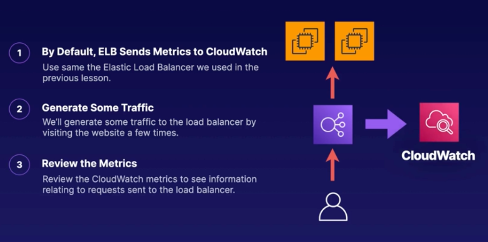

## Understanding Elastic Load Balancer CloudWatch Metrics

> **Note: Prerequisites Required**
> 
> This demo is a continuation of the previous demo titled "Demo 2.1: DeployELB." 

## Generate traffic
- Open few tabs with DNS record name of previously created Application Load Balancer
- This will generate log entries

 

## Review Monitoring tab in ELB
- Navigate to `EC2`>`Load Balancing`
- Select your previously created load banacer
- Towards the bottom of the page, select the `Monitoring` tab
- You will see the auto-generated metrics for your load balancer

 

## Review additional metrics in CloudWatch
- Navigate to `CloudWatch`
- Select `Metrics`>`All metrics`
- In the `Browse` tab you can find all collected metrics. In addition you can serach for the metrics available for a specific resource, by searching for it's name in serach tab (i.e. `my-load-balancer`)
