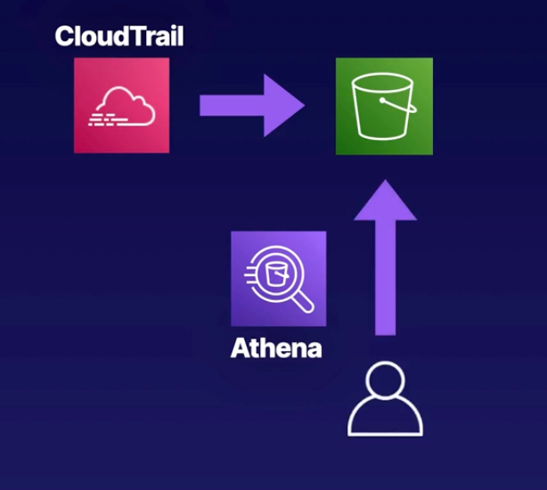

# Demo:<br>Working with Athena




<br>

### Objectives
1. **Configure a Trail in `CloudTrail`**<br>CloudTrail will generate an audit log of all activity on our account
2. **`CloudTrail` Sends Logs to `S3`**<br>Our trail will store the logs it creates in a new S3 bucket
3. **Create an `Athena Table`**<br>Use standard SQL to query the data stored in the S3 bucket

<br>

## Solution
### **Configure a Trail in CloudTrail**
1. Navigate to `CloudTrail` in AWS console and select `Dashboard`
2. Select `Create trail` and provide following details:
   - **Step 1<br>Choose trail attributes** 
   - Name: `management-events` 
   - Storage location: `Create new S3 bucket`
   - Log file SSE-KMS encryption: `Enabled`
   - Customer managed AWS KMS key: `New`
   - AWS KMS alias: `mykmskey`
   - Log file validation: `Enabled`
   - `Next`
   - **Step 2<br>Choose log events**
   - Event type:
     - [x] Management events
     - [ ] Data events
     - [ ] Insights events
   - API activity:
     - [x] Read
     - [x] Write
     - [ ] Exclude AWS KMS events
     - [ ] Exlude AMAZON RDS Data API events
   - `Next`
   - Review and create trail by selecting `Create trail`

    > In few minutes new log files will start appearing in new S3 bucket created for Trail

<br>

### Create S3 bucket to store Athena Query results
3. Navigate to `S3` and select `Create bucket`:
   - Name: `myathena-results-faye`
   - Region: `us-east-1`
   - Leave all other parameters on default
   - `Create bucket`

<br>

### Create an Athena Table
4. Navigate to `Athena` from AWS console.
5. Before running queries, you have to configure the query result location in S3:
   - On the left-hand menu select `Query editor`
   - `Edit settings`
   - In *Location of query result* section, select `Browse S3` and select previously create `myathena-results-faye` S3 bucket
   - `Save`
6. Navigate to `Editor` tab within Athena Query Editor
7. In editor box enter:
    ```sql
    CREATE DATABASE athenadb
    ```
8. Select `Run` to execute the query. 
 
    > You can validate the result of executed query by checking **Query results** at the bottom of the page.
    >
    > The **Database** dropdown should also be prefilled with `athenadb` 

9. In Query input window add *Query 2** by selecting `+` sign and create DB table by executing the following command:
    > The `LOCATION 's3://YOUR_BUCKET_NAME/AWSLogs/YOUR_ACCOUNT_NUMBER/'` attribute from code snippet below has to be updated with data from your own S3 bucket. In S3 select `Copy S3 URI` as shown on screenshot below and update LOCATION value:
    > 


    ```sql
    CREATE EXTERNAL TABLE cloudtrail_logs (
    eventversion STRING,
    useridentity STRUCT<
                type:STRING,
                principalid:STRING,
                arn:STRING,
                accountid:STRING,
                invokedby:STRING,
                accesskeyid:STRING,
                userName:STRING,
    sessioncontext:STRUCT<
    attributes:STRUCT<
                mfaauthenticated:STRING,
                creationdate:STRING>,
    sessionissuer:STRUCT<  
                type:STRING,
                principalId:STRING,
                arn:STRING, 
                accountId:STRING,
                userName:STRING>>>,
    eventtime STRING,
    eventsource STRING,
    eventname STRING,
    awsregion STRING,
    sourceipaddress STRING,
    useragent STRING,
    errorcode STRING,
    errormessage STRING,
    requestparameters STRING,
    responseelements STRING,
    additionaleventdata STRING,
    requestid STRING,
    eventid STRING,
    resources ARRAY<STRUCT<
                ARN:STRING,
                accountId:STRING,
                type:STRING>>,
    eventtype STRING,
    apiversion STRING,
    readonly STRING,
    recipientaccountid STRING,
    serviceeventdetails STRING,
    sharedeventid STRING,
    vpcendpointid STRING
    )
    ROW FORMAT SERDE 'com.amazon.emr.hive.serde.CloudTrailSerde'
    STORED AS INPUTFORMAT 'com.amazon.emr.cloudtrail.CloudTrailInputFormat'
    OUTPUTFORMAT 'org.apache.hadoop.hive.ql.io.HiveIgnoreKeyTextOutputFormat'
    LOCATION 's3://YOUR_BUCKET_NAME/AWSLogs/YOUR_ACCOUNT_NUMBER/';
    ```

    > Once created, you should see `cloudtrail_logs` table

10.  Add new query and run qury below to extract data from DB:

```sql
    SELECT
        useridentity.arn,
        eventname,
        sourceipaddress,
        eventtime
    FROM cloudtrail_logs
    LIMIT 100;
   ```
  > The results of the query will be visible at the bottom of the page in **Query results**
