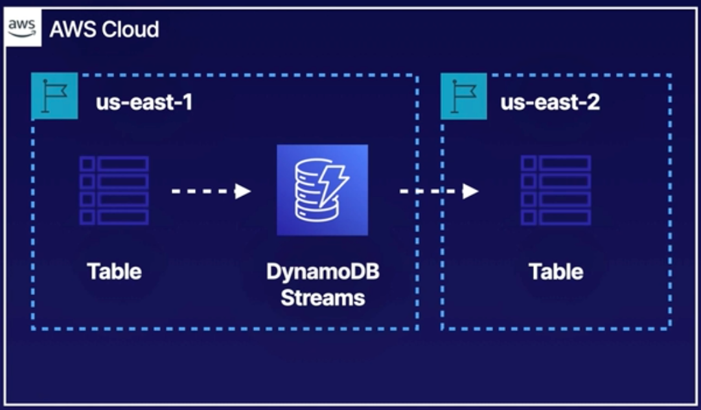

# Demo: Using DynamoDB Streams for Backing Up Your Table to Another Region

 

### Objectives:
1. Create a DynamoDB table in one region (us-east-1).
2. Enable DynamoDB Streams on the table.
3. Set up a replica of the table in a different region (us-east-2).
4. Verify replication by adding data and checking both regions.

 

## Solution
### Step 1: Create a DynamoDB Table

1. Open the **AWS Management Console** and go to **DynamoDB**.
2. Choose **Create Table**.
3. Name the table `dynamodb-streams-test-table`.
4. Set a **Partition Key** named `cloud_user` with data type **String**.
5. Choose **Create Table** to complete setup.

> **Note:** Ensure the table status shows as **Active** before moving on.

 

### Step 2: Enable DynamoDB Streams

1. Select the table you just created.
2. In the table’s dashboard, go to **Exports and streams**.
3. Scroll down to **DynamoDB stream details** and choose **Turn on**.
4. Select a **View Type**:
   - Choose **New and old images** to capture both before and after changes.
5. Confirm by selecting **Turn on stream**.

> **Tip:** Enabling streams will allow you to track inserts, updates, and deletes in a time-ordered sequence. 

 

### Step 3: Add a Replica Table in Another Region

1. In your DynamoDB table dashboard, select **Global tables** and then **Create replica**.
2. Set the source region to **us-east-1** (Northern Virginia).
3. Choose **us-east-2** (Ohio) for the replica region and confirm with **Create replica**.

> **Note:** Allow a few minutes for the replica table to be created and become active. You can refresh the view using the refresh button to check the status.

 

### Step 4: Add Data to the Table and Verify Replication

1. In **us-east-1**, navigate to **Explore items** for the `dynamodb-streams-test-table`.
2. Select **Create item**.
3. Add an item with the following attributes:
   - **cloud_user**: Set this to a name (e.g., "JohnDoe").
   - **mobile number**: Add a phone number in string format.
4. Confirm by choosing **Create item**.

5. To verify, switch to **us-east-2** (Ohio) in the console.
6. Check **dynamodb-streams-test-table** and ensure the item is visible in this region as well.

