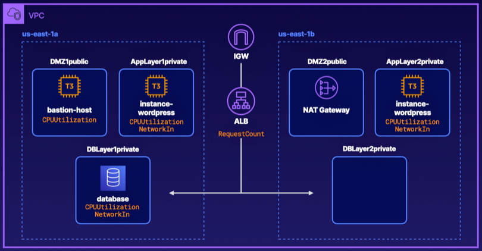

# Using CloudWatch for Resource Monitoring

### ABOUT THIS LAB
This lab provides practical experience creating and configuring multiple custom AWS CloudWatch dashboards and widgets. The primary focus will be on the following features within CloudWatch: CloudWatch dashboards, dashboard widgets, and CloudWatch metrics. CloudWatch dashboards built with custom widgets allow you to visually monitor resources and proactively take action, if needed. Overall, the dashboards give you a central, visual view of how your monitored resources are behaving at specific points in time.

### Solution 

## Create a CloudWatch Dashboard for the DMZ Layer

1. In the AWS Management Console, type CloudWatch in the search box at the top of the page, and click on **CloudWatch** from the drop-down menu.
2. In the CloudWatch Management Console, select **Dashboards** from the left navigation menu.
3. Click **Create dashboard** on the right.
4. In the Create new dashboard popup window, type *DMZLayer* in the **Dashboard name** field.
5. Click **Create dashboard**.
6. In the **Add widget** popup window, select the **Line** option.
7. For the data source, select **Metrics**.
8. Click **Next**.
9. Within the **Metrics** pane, select **EC2**.
10. Then, select **Per-Instance Metrics**.
11. In the search bar at the top right of the **Metrics** pane, type *CPUUtilization* and press **Enter**.
12. To bring up the Intstance name column, hover over any of the instance Ids and then click on the plus + sign that appears. After the results filter, click on the x to remove the filter and all of the instances will now show with the Instance name column.
13. In the list of instances below, select the checkbox next to **bastion-host**.
14. Click **Custom** at the top right-hand corner of the screen and select **15 Minutes**.
15. Click **Create widget** in the bottom right-hand corner of the screen.

 

## Create a CloudWatch Dashboard for the Application Layer
### Create the Dashboard
1. In the left navigation menu, select **Metrics > All metrics**.

    > Note: If your left navigation menu is collapsed, click the hamburger menu icon in the top left-hand corner of your screen to display it.

2. Within the **Metrics** pane, select **EC2**.
3. Then, select **Per-Instance Metrics**.
4. Scroll down to find **CPUUtilization** under **Metric Name** and click on it. In the popup menu that appears select **Search for this only**.
5. Select the **database** instance and all displayed **instance-wordpress** instances by clicking the checkboxes next to their names.
6. Click **Custom** at the top of the screen, and select **15 Minutes**.
7. Click the dropdown at the top of the screen with the word **Line** displayed. Select **Stacked area** from the list of options.
8. Click **Actions** in the top right-hand corner of the screen, and select **Add to dashboard**.
9. In the **Add to dashboard** popup window, click **Create new**. Then under **Create new dashboard**, enter *AppLayer* and click **Create**.
10. Click on **Add to dashboard**.
11. At the top of the screen click on the **Save dashboard** button to save your changes.
    
 

### Add the `RequestCount` Metric
1. Click the plus **+** sign in the top right-hand corner of the screen to add a widget.
2. In the **Add widget** popup window, select **Number**.
3. Click **Next**.
4. Within the **Metrics** pane, select **ApplicationELB**.
5. Then, select **Per AppELB Metrics**.
6. Find **RequestCount** under **Metric Name** and click on it. In the popup menu that appears, select **Search for this only**.

    > Note: If you see multiple, load balancers displayed in the list, follow the steps below to confirm which load balancer to select. If you only have one load balancer showing then you can skip these next steps.

7. Search for *EC2* in the top search bar in the CloudWatch Management Console.
8. Right-click **EC2** from the dropdown menu, and choose **Open Link in New Tab**.
9. Go to the new tab, and from the EC2 Management Console, select **Target Groups** under **Load Balancing**, in the left navigation menu.
10. Select the **TG1** target group.
11. On the **Details** page, click **load-balancer** under **Load balancer**.
12. This will open up your load balancer in a new tab.
13. In the new tab, under **Basic Configuration** in the bottom half of the screen, scroll down to locate the **ARN**.
14. Verify the identity of the correct load balancer by taking note of the last few digits of the **ARN**.
15. Navigate back to the first CloudWatch Management Console tab, and select the corresponding load balancer (the one that ends in the same last few digits) by clicking the checkbox next to it.
15. Click Create widget.

 

### Create the `NetworkIn` Metric
1. Click the **+** (plus) sign in the top right-hand corner of the screen to add a widget.
2. In the **Add widget** popup window, select Line.
3. Then, select **Metrics**.
4. Click **Next**.
5. Within the **Metrics** pane, select **EC2**.
6. Then, select **Per-Instance Metrics**.
7. Scroll down to find **Networkin** under **Metric Name**, and click on it. In the popup menu that appears select Search for this only.
8. Select the **database** instance and all displayed **instance-wordpress** instances by clicking the checkboxes next to their names.
9. Click **Create widget**.
10. In the top right-hand corner of the screen, select the down arrow next to the Refresh icon. Select **10s**, so the dashboard will refresh every 10 seconds.

 

### Test the Widgets
1. Navigate back to your EC2 Management Console tab.
2. Select **Load balancers** from the navigation menu on the left.
3. Click on the checkbox next to your load balancer.
4. Under **Basic Configuration** in the bottom half of the screen, copy the **DNS name** by clicking the copy icon to the right of the name.
5. Open a new tab, paste the load balancer into the address bar, and press Enter.
    - The WordPress setup should appear.
6. On the WordPress setup popup window, click **Continue**.
7. Type the following information:
    - **Site Title**: Metrics
    - **Username**: guru
    - **Password**: Password123
    - Click the box for **Confirm use of weak password**.
    - **Your Email**: test@test.com
8. Click **Install WordPress**.
9. Click **Log In**.
10. Enter the credentials just created above and click **Log In**.
    - Your new WordPress site should appear.
11. Navigate back to the CloudWatch Management Console in the first tab.
12. Within the console, optionally, click the refresh icon in the top-right corner.
    - You should be able to see that the **RequestCount** and **CPUUtilization** have gone up slightly, indicating that your CloudWatch dashboard and widgets are working as intended.

