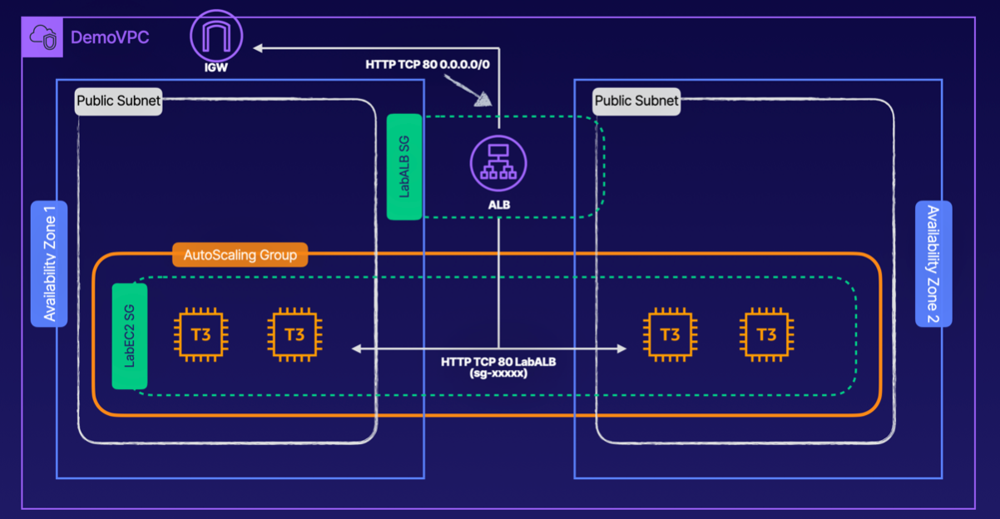

# Configure an Application Load Balancer and Auto Scaling Group



### ABOUT THIS LAB
Application Load Balancers (ALB) are a critical component in modern scalable infrastructures. In this lab, we will walk through the process to create security groups, launch configurations, Auto Scaling groups, an Application Load Balancer, and a target tracking scaling policy.

<br>

## Objectives
- Create a Security Group for the ALB Permitting HTTP from Anywhere
- Configure a Security Group for EC2 Instances
- Configure a Launch Template
- Create an Internet-Facing ALB
- Configure an Auto Scaling Group

<br>

## Solution
## Create a Security Group for the ALB Permitting HTTP from Anywhere
1. Navigate to **EC2**.
2. In the sidebar menu, navigate to `Network & Security` and select `Security Groups`.
3. On the right, click `Create security group`.
4. Fill in the `LabALB` security group details:
    - **Security group name**: In the text field, enter `LabALB`.
    - **Description**: In the text field, enter `LabALB`.
    - **VPC**: Leave the default VPC selected.
5. In the `Inbound rules` section, click `Add rule`.
6. Fill in the rule details:
    - **Type**: Use the dropdown to select `HTTP`.
    - **Source**: In the search field, select `0.0.0.0/0`.
7. Click `Create security group`.

> - **Purpose**: This security group defines the inbound traffic rules for the ALB, which acts as the entry point to your application.
> - **Why Allow HTTP from Anywhere (0.0.0.0/0)**:
>     - `0.0.0.0/0` allows traffic from any IPv4 address globally.
>     - This is necessary because the ALB must be accessible from external clients, including users on the internet.
>     - The HTTP rule ensures the ALB can accept web traffic on port 80 (standard for HTTP).

<br>

## Create a Security Group for EC2 Instances
1. Use the breadcrumb along the top of the page to select `Security Groups`.
2. On the right, click `Create security group`.
3. Fill in the `LabEC2` security group details:
    - **Security group name**: In the text field, enter `LabEC2`.
    - **Description**: In the text field, enter `LabEC2`.
    - **VPC**: Leave the default VPC selected.
4. In the `Inbound rules` section, click `Add rule`.
5. Fill in the rule details:
    - **Type**: Use the dropdown to select `HTTP`.
    - **Source**: In the search field, select the `LabALB` security group.
6. Click `Create security group`.

> - **Purpose**: This security group defines the inbound traffic rules for the EC2 instances in the Auto Scaling Group.
> - **Why Allow HTTP from LabALB Security Group**:
>     - By specifying the `LabALB` security group as the source, only traffic coming from the ALB is permitted to reach the EC2 instances.
>     - This setup ensures that the EC2 instances are not directly exposed to the internet, improving security by allowing access only through the ALB.
>     - The ALB handles tasks such as routing, load balancing, and terminating SSL/TLS (if configured), so EC2 instances only process traffic that has passed through the ALB.

<br>

## Configure a Launch Template
1. In the sidebar menu, navigate to **Auto Scaling** and select `Launch Templates`.
2. On the right, click `Create launch template`.
3. Fill in the Launch template name and description details:
    - **Launch template name**: In the text field, enter `ALBLaunchTemplate`.
    - **Template version description**: In the text field, enter `ALBLaunchTemplate`.
    - **Auto Scaling guidance**: Check the `Provide guidance to help me set up a template that I can use with EC2 Auto Scaling` checkbox.
4. In the **Application and OS Images** section, select `Amazon Linux` and ensure the `Amazon Linux 2` AMI is selected.
5. In the **Instance type** section, use the dropdown to select `t3.micro`.
6. Fill in the Network settings details:
    - **Firewall (security groups)**: Ensure that `Select existing security group` is selected.
    - **Security groups**: Use the dropdown to select the `LabEC2` security group.
7. Expand the **Advanced details** section and scroll down to the **User data** field.
8. In the **User data** field, paste the following bootstrap script:

    ```sh
    #!/bin/bash
    yum update -y
    yum install -y httpd
    systemctl start httpd
    systemctl enable httpd
    usermod -a -G apache ec2-user
    chown -R ec2-user:apache /var/www
    chmod 2775 /var/www
    cd /var/www/html
    echo "Welcome to your public facing webpage" > index.html
    ```

9. On the right, click `Create launch template`.
10. After the launch template is successfully created, click `View launch templates` and note that your template is now available.

<br>

## Create an Internet-Facing ALB
1. In the sidebar menu, navigate to **Load Balancing** and select `Load Balancers`.
2. On the right, click `Create load balancer`.
3. Below **Application Load Balancer**, click `Create`.
4. In the **Load balancer name** field, enter `LabALB`.<br>Leave the other Basic configuration options as the defaults (Internet-facing should be select for the Schema and IPv4 should be selected for the IP address type).
5. Fill in the Network mapping details:
    - **VPC**: Use the dropdown to select the `A Cloud Guru VPC`.
    - **Mappings**: Check the checkboxes for both the `us-east-1a` and `us-east-1b` Availability Zones.
6. Configure the Security groups details:
    - Click `X` to remove the default security group.
    - Use the **Security groups dropdown** to select the `LabALB` security group.
7. In the Listeners and routing section, click `Create target group`.<br>The EC2 Management Console automatically opens in a new browser tab.
8. Configure the group details for your target group:
    - **Choose a target type**: Ensure that `Instances` is selected.
    - **Target group name**: In the text field, enter `LabTargetGroup`.
    - **Health check path**: In the text field, enter `/index.html`.
9. Leave all the other default values and click `Next`.
10. Leave the Register targets page blank and click `Create target group`.
11. Navigate back to the **Load balancers** tab and click the `Refresh` button in the **Listeners and routing** section.
12. Use the Default action dropdown to select `LabTargetGroup`.
13. Scroll down to the Summary section and review your load balancer configuration.
14. Click `Create load balancer`.
15. After the load balancer is successfully created, click View load balancer and note that your load balancer is provisioning.<br>After a moment, your load balancer should become active.

<br>

## Create the Auto Scaling Group
1. In the sidebar menu, navigate to **Auto Scaling** and select `Auto Scaling Groups`.
2. On the right, click `Create Auto Scaling group`.
3. Fill in the basic Auto Scaling group details:
    - **Auto Scaling group name**: In the text field, enter `LabASG`.
    - **Launch template**: Use the dropdown to select `ALBLaunchTemplate`.
4. Click `Next`.
5. Fill in the instance launch options:
    - **VPC**: Use the dropdown to select the `A Cloud Guru VPC`.
    - **Availability Zones and subnets**: Use the dropdown to check both the `us-east-1a` and `us-east-1b` subnets.
6. Click `Next`.
7. Fill in the advanced options:
    - **Load balancing**: Select `Attach to an existing load balancer` and then ensure `Choose from your load balancer target groups` is selected.
    - **Existing load balancer target groups**: Use the dropdown to select `LabTargetGroup`.
    - **Health checks**: Check the `ELB` checkbox.
    - **Monitoring**: Check the `Enable group metrics collection within CloudWatch` checkbox.
8. Click `Next`.
9. Fill in the group size details:
    - **Desired capacity**: In the text field, enter `2`.
    - **Minimum capacity**: In the text field, enter `2`.
    - **Maximum capacity**: In the text field, enter `4`.
10. Fill in the scaling policy details:
    - **Scaling policies**: Select `Target tracking` scaling policy.
    - **Target valu**e: In the text field, enter 75.
11. Click `Next` until you reach the **Review page**.
12. Review your Auto Scaling group details and then click `Create Auto Scaling group`.<br>Your Auto Scaling group may take a few minutes to finish creating.

<br>

## Verify that the Auto Scaling Groups Works as Expected
1. While your Auto Scaling group is being provisioned, select the `LabASG` launch template name.
2. Select the `Instance management` tab and note that the Auto Scaling group has deployed two instances (one in **us-east-1a** and one in **us-east-1b**).
3. Navigate back to the `EC2 Management Console` tab.
4. In the sidebar menu, navigate to Instances and select `Instances`.<br>You should see that you have two instances running and that they're both initializing.
5. To test your Auto Scaling group, check the checkbox next to one of the instances.
6. Use the Instance state dropdown to select `Terminate instance`.
7. In the dialog, click `Terminate`.
8. Click the `Refresh` button to refresh your instance details.<br>You should now see that the instance you terminated is shutting down.
9. Navigate back to the Auto Scaling group tab and click the `Refresh` button on the right to refresh your instances.<br>You should see that one of the instances is now unhealthy, but it has already been replaced with a new healthy instance.<br>
10. Select the `Activity` tab and note the activity history.
11. Navigate back to the `EC2 Management Console` tab and click the `Refresh` button to refresh your instance details.<br>You should see that you have two running instances and one terminated instance, indicating that the Auto Scaling group works as expected.
