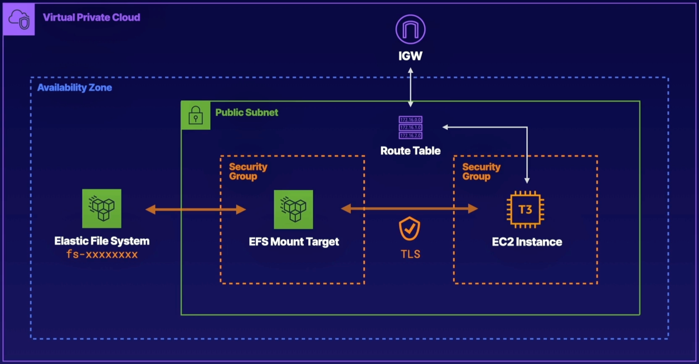

# Configure At Rest Encryption for EFS

 

### ABOUT THIS LAB
Amazon Elastic File System (EFS) provides incredible scalability for your storage requirements, making it easy to share data across hundreds or even thousands of EC2 instances. In this lab, you will create an Amazon Elastic File System in the us-east-1 Region with encryption enabled. You will also configure mount targets for this file system, enforce encryption in flight, and finally, mount the file system to a pre-created EC2 instance.

 

### Objectives
- Create an EFS File System Named devshare with Encryption Enabled
- Create a Mount Target for EFS Using EFSMountSecurityGroup
- Apply a File System Policy to the EFS Volume to Enforce In-Transit Encryption for All Clients
- Mount the EFS Volume to the EC2 Instance and Create a File on the Elastic File System

 

## Solution
## Create an EFS File System Named devshare with Encryption Enabled
1. From the AWS Management Console, search for and navigate to `EFS`.
2. On the right, click `Create file system`.
3. In the Name field, enter `devshare`.
4. Leave the other fields as the default settings and click `Create`. Your `devshare` file system is created with encryption enabled.

 

## Create Mount Targets for EFS Using the EFSMountSecurityGroup in Each Availability Zone
1. Select the `devshare` file system name to open the file system details.
2. Select the `Network` tab and *wait for the mount target state to become available*. This may take a few minutes, and you may need to click the **Refresh** icon on the right to update the status.
3. After the mount target state is available, click `Manage` on the right.
4. In the `Security` groups field, click `X` to clear the existing security group.
5. Use the `Security groups` dropdown to select the `EFSMountSecurityGroup` group.
6. Click `Save`. You should now see that the `EFSMountSecurityGroup` is applied to your mount target.

 

## Apply a File System Policy to the EFS Volume to Enforce In-Transit Encryption for All Clients
1. From the `devshare` file system details, select the `File system policy` tab.
2. To the right of the **Policy editor**, click `Edit`.
3. In the **Policy options** field, select `Enforce in-transit encryption for all clients`. The policy auto-populates in the policy editor on the right.
4. Review the policy details, and then click `Save`. You should now see that the file system policy has been applied to the EFS volume.

 

## Mount the EFS Volume to the EC2 Instance and Create a File on the Elastic File System
### Connect to Your EC2 Instance
1. Open `EC2` in a new tab.
2. In the `Resources` section, select `Instances (running)`.
3. Select the checkbox next to the `EFSManagementInstance` instance, and then click `Connect` at the top of the page.
4. Connect to the instance using the **EC2 Instance Connect tab** or the `SSH client`:
    - **EC2 Instance Connect**: Leave the User name as `root` and click `Connect`.

    > Note: If you have any issues authenticating, you can log in using the credentials provided for the lab.
    - **SSH client**: Log in to the terminal provided for the lab using the credentials provided for the lab:

    `ssh cloud_user@<PUBLIC_IP_ADDRESS>`

 

### Mount Your EFS Volume
1. Create a mount point for the volume:
    
    `sudo mkdir /efs`

2. Navigate to the root directory:

    `cd /`

3. List the files in the root directory:

    `ls`

    You should now see that you have an efs folder.

4. Navigate to the `EFS Dashboard`.
5. Copy your file system ID (located next to the devshare file system name).
6. Run the mount command, replacing `<FILE_SYSTEM_ID>` with your copied file system ID:

    `sudo mount -t efs -o tls <FILE_SYSTEM_ID> efs/`

7. Create the `llama.txt` file in the efs directory:

    `sudo touch /efs/llama.txt`

8. Navigate to the efs directory:
    
    `cd /efs`

9. List the files in the directory:
    
    `ls`

    You should see the **llama.txt** file.
10. (Optional) Navigate to the `/etc/fstab`:

    `vim /etc/fstab`

    This is where you would add an entry to make the mount persist a reboot.