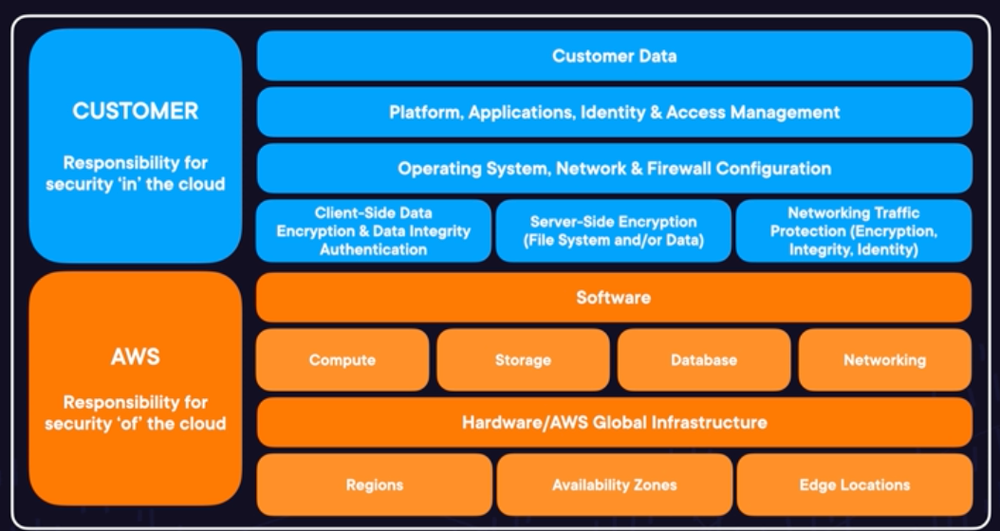
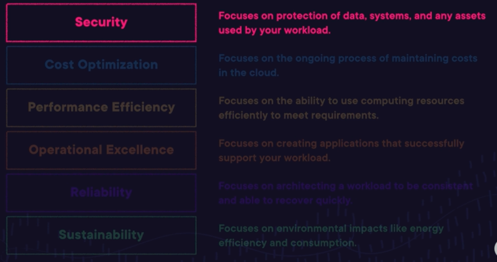

# Security, Compliance and Governance

- Security: The Bigger Picture
- What Do We Need To Secure on AWS?
- Illustrating the Principle of Least Privilege
- What Is IAM?
- `HANDS-ON LAB`<br>Troubleshooting an IAM Policy on an EC2 Instance
- Leveraging Existing Identity Providers
- Keeping Secrets Safe
- Exploring Network Security Services
- What Is Security Hub?
- `Demo`<br>Exploring Security Hub
- Responding to Security Events
- Growing Your Security Muscles
- Governing Multiple Accounts on AWS
- Understanding Compliance on AWS

<br>

## Security: The Bigger Picture

### Key Considerations

Securing cloud environments hinges on addressing two fundamental questions:

1. **Who can access?**
   - Define and manage user identities and roles.
   - Implement strong authentication mechanisms.

2. **What can they do?**
   - Assign permissions and policies to control actions.
   - Enforce the principle of least privilege to minimize access.

By focusing on these aspects, you can effectively safeguard your cloud infrastructure against unauthorized access and actions.

### The Shared Responsibility Model




### The Well-Architected Framework: Security



Here are a few key tenets of Security pillar:
- Identity and Access Management
- Data Stewardship and Encryption
- Network Security
- Application Security
- Compliance
- Security Management

<br>


## What Do We Need To Secure on AWS?

The Shared Responsibility Model:
- **Customer** (responsibility for security `in` the cloud):
  - **Customer Data** (Retention, Encryption, Backups, Access)
  - **Platform, Applications, Identity & Access Managment**
  - **Operating System, Networking & Firewall Configuration**
  - **Encryption**:
    - Client-Side Data Encryption & Data Integrity Authentication
    - Server-Side Encryption (File System and/or Data)
    - Networking Traffic Protection (Encryption, Integrity, Identity)
- **AWS** (responsibility for security `of` the cloud)
  - **Managed Services** lets you transfer responsibility of Operating System, Networking, Firewall and Encryption to AWS (instead of managing it as a customer).
  <br>Example:<br>
  You could choose to host database from `EC2` instance, where OS, Networking,etc would be your responsibility. Or you could choose to use managed DB instance on AWS (i.e. `RDS`)
    


<br>


## Illustrating the Principle of Least Privilege

### Introduction

Before diving into the security services on AWS, it's crucial to understand the Principle of Least Privilege. This principle ensures that users and resources are granted only the permissions necessary to complete their tasks. Let's explore this concept using the World Pizza Company as an example.

### What is the Principle of Least Privilege?

The Principle of Least Privilege states that you should grant only the permissions needed to complete a task. This minimizes the risk of unauthorized access and accidental changes to sensitive data or critical systems.

### Examples from World Pizza Company

World Pizza Company has various resources:
- Front door (access control)
- Pizza oven (production)
- Point-of-sales system (orders)
- Safe (secret recipe storage)

Here’s how the Principle of Least Privilege applies to different employees:

1. **Pizza Cook**
   - Needs access only to the pizza oven.
   - Does not require access to the front door, point-of-sales system, or the safe.

2. **Customer Service Employee**
   - Needs access only to the point-of-sales system to take orders.
   - Does not require access to the pizza oven, front door, or the safe.

3. **Manager**
   - Needs access to the front door to open the store.
   - May need access to the point-of-sales system and pizza oven.
   - Does not require access to the safe.

4. **Owner (Sage)**
   - Needs access to all resources, including the front door, pizza oven, point-of-sales system, and the safe.

### Importance of the Principle of Least Privilege

#### Risk Mitigation

By applying the Principle of Least Privilege, the potential impact of a compromised identity is minimized. For instance, if a bad actor impersonates the pizza cook, they would only have access to the pizza oven, not to the safe or point-of-sales system, thereby reducing the risk of significant damage.

#### Preventing Accidents

Limiting access also reduces the likelihood of accidental data exposure or system misconfiguration. Fewer permissions mean fewer chances for unintended actions that could lead to security breaches.

### Granular Permissions

Granular permissions allow you to specify precise actions that users or applications can perform. For example:

- **Point-of-Sales System**
  - Employees: Can enter orders, open the cash drawer, edit menu items, refund transactions, and receive payments.
  - Customers: Can only place orders and make payments.

### Identity and Access Management (IAM) on AWS

IAM (Identity and Access Management) is the AWS service that helps you apply the Principle of Least Privilege by managing permissions for users, resources, and applications.

- **Users**: Define permissions for AWS users logging into your account.
- **Resources**: Restrict access to specific AWS resources.
- **Applications**: Grant applications permissions to access resources within AWS.

### Conclusion

By adhering to the Principle of Least Privilege and leveraging IAM, you can effectively control who can enter your AWS environment and what actions they can perform. This approach enhances security by minimizing both the risk of unauthorized access and the potential for accidental damage.


<br>


## IAM: Identity and Access Management
### Introduction
IAM (Identity and Access Management) is a crucial AWS service for controlling user access to your AWS account and resources. It ensures that the right people and resources have the appropriate access levels.

### Root User and Multi-Factor Authentication (MFA)
- **Root User**: The root user is the initial user created when setting up your AWS account. It has unrestricted access and is the only user capable of deleting the account. Keeping the root user secure is paramount.
- **Multi-Factor Authentication (MFA)**: MFA adds an extra layer of security. Even if an attacker obtains your username and password, they can't access your account without the MFA device. Enforcing MFA through IAM ensures only authenticated users can log in.

### Granular Permissions with IAM
IAM enables the definition of granular permissions. For example, at World Pizza Company:

- **Employees**: Can enter orders, open the cash drawer, change menu items, reverse transactions, and process payments.
- **Customers**: Can only place orders or make payments.

IAM policies define these permissions in AWS.

### IAM Policies
IAM policies are JSON documents that specify permissions for entities (users, groups, or roles). Here's a simple example:

```json
{
  "Version": "2012-10-17",
  "Statement": [
    {
      "Effect": "Allow",
      "Action": "s3:*",
      "Resource": "arn:aws:s3:::example-bucket/*"
    }
  ]
}
```

This policy grants full access to an S3 bucket and its contents. Policies can be applied to:

- **IAM Users**: Directly granting permissions to individual users.
- **IAM Groups**: Simplifying management by applying policies to groups, which automatically apply to all group members.
- **IAM Roles**: Allowing AWS resources or applications to assume roles with specified permissions. Roles automatically rotate their access keys, enhancing security.

### Access Methods
IAM users can access AWS resources through:
- **Console**: Using a username and password.
- **Command Line Interface (CLI)**: Using access keys.

### Best Practices
- **Access Key Rotation**: Regularly rotate access keys to minimize security risks. Long-lasting access keys increase the chance of being leaked.
- **Use IAM Roles**: Roles automatically rotate their keys, providing better security for applications and resources.

### Additional IAM Tools
- **IAM Access Analyzer**: Identifies resources with external access, validates policies, and generates policies based on usage to adhere to the principle of least privilege.
- **IAM Policy Simulator**: Allows testing policies before applying them to users, groups, or roles, ensuring they work as intended.

### Conclusion
IAM is essential for managing access and permissions in your AWS environment. By leveraging IAM policies, MFA, roles, and additional tools like Access Analyzer and Policy Simulator, you can ensure secure and efficient access control for all your AWS resources.


<br>

## Leveraging Existing Identity Providers

### Introduction

In AWS, you can leverage existing identity providers to grant access to users. This process, known as federated identity, allows you to integrate AWS with your organization's identity management system for secure access.

### Federated Identity with IAM Identity Center

- **IAM Users vs. Federated Identity**: While you can create IAM users with unique usernames and passwords, federated identity allows you to use existing identity providers, such as Microsoft Active Directory, to grant access.
- **IAM Identity Center**: This service enables federated identity in AWS, providing a secure way to give users access to AWS resources by leveraging existing identity providers. Users log in via single sign-on (SSO) and temporarily assume IAM roles to access resources.

#### Key Benefits
- **Security**: IAM Identity Center is more secure than creating IAM users since it leverages roles that automatically rotate access keys.
- **Granular Permissions**: Define and attach IAM policies to roles for precise access control.

### Web Federated Identity with Amazon Cognito

- **Amazon Cognito**: This service allows developers to implement web federated identity for authentication. Users can log in with third-party web identity providers (e.g., Apple, Facebook, Google).
- **User Pools**: Create user pools in Amazon Cognito to manage user identities and grant temporary access to applications.
- **Enterprise Identity Providers**: In addition to social identity providers, Amazon Cognito supports enterprise identity providers for federated access.

### AWS Directory Service

- **Integration with Microsoft Active Directory**: AWS Directory Service connects your AWS environment with an existing Microsoft Active Directory.
- **Managed Active Directory**: If preferred, AWS Directory Service can manage Microsoft Active Directory within AWS.

### Temporary Access with Security Token Service (STS)

- **AWS STS**: This service is designed for granting temporary access to AWS resources.
  - **Use Case**: Ideal for situations requiring temporary permissions, such as third-party audits.
  - **Temporary Roles**: Users assume temporary roles with defined access levels, which expire after a set period.

### Summary

AWS offers several tools and services to leverage existing identity providers, enhancing security and simplifying user management:

- **IAM Identity Center**: For federated identity using existing identity systems.
- **Amazon Cognito**: For web federated identity and social or enterprise identity provider integration.
- **AWS Directory Service**: For connecting or managing Microsoft Active Directory within AWS.
- **AWS STS**: For granting temporary access to AWS resources.

By integrating these services, organizations can streamline user access management and enhance the security of their AWS environments.


<br>


## Keeping Secrets Safe in AWS

#### Introduction

In AWS, keeping secrets safe involves protecting sensitive data that is valuable to your company or could be a liability if leaked. This includes customer data and other confidential information. The two main strategies for keeping secrets safe are encryption and secure storage of secret parameters.

### Encryption in AWS

#### Encryption at Rest

**Amazon S3**
- **Default Encryption**: By default, Amazon S3 uses server-side encryption with S3 managed keys for all new buckets.
- **Custom Key Management**: Users can disable default encryption and manage encryption keys through different sources, such as AWS Key Management Service (KMS).

**Amazon Macie**
- **Data Scanning**: Macie uses machine learning to scan S3 buckets for sensitive information, such as personally identifiable information (PII). It helps identify and protect data that shouldn't be exposed.

**Elastic Block Store (EBS)**
- **Encryption**: EBS volumes can be encrypted using keys from KMS, protecting data stored on EC2 instances.

**Relational Database Service (RDS)**
- **Encryption**: RDS databases can be encrypted using KMS. Note that existing RDS instances cannot be encrypted directly; you must create a new encrypted copy.

By encrypting data at rest, you ensure that even if data is intercepted, it cannot be read without the encryption key.

#### Encryption in Transit

**Amazon VPC**
- **Default Encryption**: All traffic within an Amazon Virtual Private Cloud (VPC) is encrypted by default.

**Public Internet Traffic**
- **HTTPS Protocol**: Encrypts data in transit using Transport Layer Security (TLS). Ensure web applications support HTTPS to protect data moving over the internet.
- **AWS Certificate Manager**: Provisions and deploys TLS certificates to enable HTTPS on AWS-hosted web applications.

Using HTTPS ensures that data transmitted over the internet is secure and protected from interception.

### Secure Storage of Secret Parameters

**Systems Manager Parameter Store**
- **Purpose**: Stores secret parameters like usernames, passwords, and database strings.
- **Access Control**: EC2 instances and other resources can access these secrets programmatically, but only if they have the necessary IAM role.
- **Usage**: Securely store and reference sensitive values in your code.

**Secrets Manager**
- **Enhanced Security**: Similar to Parameter Store, but with additional features like automatic secret rotation.
- **Use Case**: Ideal for super-sensitive data where you want to ensure that even if a secret is discovered, it is quickly rotated to maintain security.

Secrets Manager allows for automated rotation of secrets, reducing the risk associated with long-lived credentials.

### Conclusion

AWS provides robust tools and services to keep secrets safe through encryption and secure parameter storage:

- **Encryption at Rest**: Utilize S3 default encryption, EBS and RDS encryption with KMS, and Amazon Macie for data scanning.
- **Encryption in Transit**: Ensure HTTPS for web applications using AWS Certificate Manager.
- **Secure Parameter Storage**: Use Systems Manager Parameter Store for basic secret management and Secrets Manager for advanced, auto-rotating secret storage.

By leveraging these AWS services, you can effectively protect sensitive data and maintain the security and integrity of your AWS environment.


<br>


## Network Security Services in AWS

#### Introduction

AWS provides a comprehensive suite of tools to secure your network and defend against various types of attacks. This documentation outlines the key network security services and how they work together to protect your AWS environment.

### Basic Network Security Controls

**Network Access Control Lists (NACLs)**
- **Function**: Provide stateless access control at the VPC and subnet levels.
- **Stateless Nature**: Each request is evaluated individually, regardless of its origin.
- **Use Case**: Limit sources that can access VPC resources by setting rules that stop all traffic not meeting specified filters.

**Security Groups**
- **Function**: Offer stateful access control for your resources.
- **Stateful Nature**: Once a connection is allowed, subsequent responses are automatically allowed.
- **Use Case**: Allow external sources to reach resources only if they pass the security group's filter. Responses to initiated connections are permitted even if they don't meet the filter criteria.

By layering NACLs and security groups, you can achieve granular access control within your Amazon VPCs.

### Advanced Network Security Tools

**AWS Network Firewall**
- **Function**: Provides enhanced network protection with complex rules to inspect traffic entering your VPC.
- **Use Case**: Detect and prevent unwanted access to your VPCs, offering more sophisticated controls beyond security groups and NACLs.

**AWS Web Application Firewall (WAF)**
- **Function**: Protects web applications from common exploits like SQL injection and cross-site scripting.
- **Use Case**: Secure public AWS endpoints, such as API Gateway Endpoints and application load balancers, against various web attacks.

**AWS Shield**
- **Function**: Protects against Distributed Denial of Service (DDoS) attacks.
- **Variants**:
  - **Shield Standard**: Provides basic DDoS protection at no extra cost.
  - **Shield Advanced**: Offers enhanced protection and access to a 24/7 DDoS response team.
- **Use Case**: Mitigate DDoS attacks in real-time to prevent your application from being overwhelmed by malicious traffic.

### Centralized Management

**AWS Firewall Manager**
- **Function**: Centralizes the management of AWS Network Firewall, AWS WAF, and AWS Shield.
- **Use Case**: Administer your network security services from a single service, streamlining the setup and maintenance across your organization.

### Conclusion

AWS offers a robust set of tools to ensure the security of your network:

- **Network Access Control Lists (NACLs)** and **Security Groups** provide foundational, layered security controls.
- **AWS Network Firewall** allows for complex traffic inspection rules.
- **AWS Web Application Firewall (WAF)** secures web applications from common vulnerabilities.
- **AWS Shield** protects against DDoS attacks, with advanced options for greater protection.
- **AWS Firewall Manager** centralizes the management of these services, simplifying administration and enhancing security across your AWS environment.

By leveraging these tools, you can effectively secure your network and protect your AWS resources from a wide range of threats.


<br>

## AWS Security Hub

#### Overview

AWS Security Hub is a comprehensive security service designed to provide a unified view of security alerts and compliance status across your AWS environment. By integrating various AWS security services, Security Hub allows you to monitor and manage security issues from a single service.

### Key Features

- **Centralized Management**: Integrates multiple AWS security services to provide a single pane of glass for security monitoring.
- **Prioritized Findings**: Aggregates findings from various services and prioritizes them based on severity, allowing you to focus on the most critical issues.
- **Actionable Insights**: Offers actionable recommendations to address security vulnerabilities and compliance issues.

### Integrated Services

Security Hub consolidates findings from several AWS security and configuration services, including:

1. **AWS Firewall Manager**: 
   - Monitors and manages firewall rules, AWS WAF, and AWS Shield.
   - Sends alerts about unprotected resources and ongoing DDoS attacks.

2. **Amazon GuardDuty**: 
   - Analyzes activity logs to detect malicious behavior.
   - Sends alerts for suspicious activities across your AWS accounts.

3. **Amazon Inspector**: 
   - Scans workloads for vulnerabilities and network exposure.
   - Reports findings on potential security issues.

4. **Amazon Macie**: 
   - Uses machine learning to discover sensitive data in S3 buckets.
   - Identifies and reports potential data exposure risks.

5. **AWS Systems Manager**: 
   - Provides insights into noncompliant resources within your AWS environment.
   - Reports findings related to configuration compliance.

6. **AWS Config**: 
   - Uses detective guardrails to monitor resource configurations.
   - Alerts on configuration changes that violate compliance rules.

7. **IAM Access Analyzer**: 
   - Detects resources with external access and unused access permissions.
   - Reports findings on potential access risks.

8. **AWS Health**: 
   - Provides information on service outages and maintenance events.
   - Sends relevant alerts affecting your AWS environment.

### Benefits

- **Enhanced Security Visibility**: Gain a holistic view of security across your AWS resources, improving your ability to detect and respond to threats.
- **Streamlined Incident Response**: Quickly identify and prioritize security issues, allowing for faster resolution and minimizing potential impact.
- **Compliance Monitoring**: Ensure your AWS environment meets compliance requirements by monitoring configuration and security policies.

### Conclusion

AWS Security Hub is an essential tool for maintaining a secure and compliant AWS environment. By integrating findings from various AWS security services, it provides a centralized and comprehensive view of your security posture. This unified approach helps you efficiently prioritize and address security issues, enhancing your overall cloud security management.


<br>


## Responding to Security Events on AWS

### Introduction to Security Services

AWS offers several services to help manage and secure your cloud environment. However, some of these services have similar names and overlapping functionalities, which can be confusing. This guide clarifies the roles and functions of four key AWS security services: AWS Trusted Advisor, Amazon GuardDuty, Amazon Detective, and Amazon Inspector. Understanding these services will help you effectively respond to security events and optimize your cloud security.

### AWS Trusted Advisor

#### Overview
AWS Trusted Advisor is a comprehensive advisory service that provides best practice recommendations across multiple domains, including security, performance, cost optimization, fault tolerance, and operational excellence.

#### Key Features
- **Security Checks**: Ensures MFA is enabled on the root account, checks for publicly exposed resources like S3 buckets and EC2 instances.
- **Performance**: Advises on improving the performance of your AWS environment.
- **Cost Optimization**: Provides recommendations to help reduce costs.
- **Fault Tolerance**: Suggests ways to improve fault tolerance of your AWS resources.
- **Operational Excellence**: Offers guidance to improve the operational efficiency of your infrastructure.

#### Summary
**AWS Trusted Advisor provides best practice advice across security, performance, cost, fault tolerance, and operational excellence.**

### Amazon GuardDuty

#### Overview
Amazon GuardDuty is a threat detection service that continuously monitors your AWS accounts for malicious activity and unauthorized behavior using machine learning, anomaly detection, and integrated threat intelligence.

#### Key Features
- **Log Analysis**: Analyzes CloudTrail logs, VPC flow logs, and DNS logs to identify suspicious activity.
- **Threat Detection**: Detects threats such as compromised instances and reconnaissance activities.
- **Alerts**: Generates alerts when a threat is detected.

#### Summary
**Amazon GuardDuty detects active threats by analyzing logs and using machine learning to identify suspicious activities.**

### Amazon Detective

#### Overview
Amazon Detective simplifies the process of investigating security incidents. It uses machine learning and graph theory to analyze and visualize the relationships between resources and activities, helping you to understand the root cause and impact of security events.

#### Key Features
- **Incident Analysis**: Helps you understand the full scope of security events.
- **Event Correlation**: Automatically correlates data from AWS CloudTrail, Amazon VPC Flow Logs, and Amazon GuardDuty.
- **Visualizations**: Provides visualizations to help understand the sequence of events and their impact.

#### Summary
**Amazon Detective investigates security events that have already happened, helping you understand the cause and extent of the damage.**

### Amazon Inspector

#### Overview
Amazon Inspector is an automated security assessment service that helps improve the security and compliance of applications deployed on AWS. It continuously scans your workloads for vulnerabilities and exposures.

### Key Features
- **Vulnerability Scanning**: Scans EC2 instances, containers, and Lambda functions for software vulnerabilities.
- **Network Exposure**: Identifies resources with public network exposure.
- **Continuous Monitoring**: Continuously monitors your environment and alerts you to new vulnerabilities.

### Summary
**Amazon Inspector detects workload vulnerabilities by continuously scanning your resources for software vulnerabilities and network exposure.**

### Summary of the Four Services

- **AWS Trusted Advisor**: Provides best practice recommendations across multiple domains, including security.
- **Amazon GuardDuty**: Detects active threats in your AWS environment by analyzing logs.
- **Amazon Detective**: Investigates security events that have already occurred, helping to understand the cause and impact.
- **Amazon Inspector**: Continuously scans workloads for vulnerabilities and network exposures.

Understanding the unique roles and functionalities of these services will help you effectively manage and respond to security events in your AWS environment, ensuring a robust and secure cloud infrastructure.


<br>


## Groving Your Security Muscles

### Introduction

Security is a continuous journey rather than a binary state of having or not having it. In the cloud, maintaining a robust security posture requires constant assessment, learning, and adaptation to new threats and defense mechanisms. AWS offers a variety of resources to help you stay informed and improve your security practices continually. Think of these resources as your "Security Dojo," where you can strengthen your security skills.

### AWS Cloud Security

#### Overview
AWS Cloud Security is the central hub for all things related to security on AWS. This resource provides a wealth of information, including the latest white papers, best practice guides, and videos from AWS re:Invent conferences. These materials are essential for staying current with the latest developments in cloud security.

#### Key Features
- **White Papers**: Detailed documents covering security frameworks, compliance, and best practices.
- **Best Practice Guides**: Step-by-step guidance on securing your AWS environment.
- **re:Invent Videos**: Access to recorded sessions from AWS re:Invent, focusing on security topics and new services.

### AWS Security Blog

#### Overview
The AWS Security Blog is a valuable resource for staying up to date with the latest innovations and announcements in AWS security. The blog features posts by AWS security experts and practitioners who share their insights and experiences.

#### Key Features
- **Cutting-Edge Innovations**: Learn about the newest security features and updates from AWS.
- **Expert Perspectives**: Gain insights from experienced AWS users and security professionals.
- **Announcements**: Stay informed about new security services and features as they are released.

### AWS Marketplace

#### Overview
AWS Marketplace offers a selection of pre-built security solutions from third-party vendors. These solutions can save time and resources compared to building custom security tools from scratch. Depending on your team's size and capabilities, purchasing a pre-built solution may be the most efficient and cost-effective option.

#### Key Features
- **Pre-Built Solutions**: Access a wide range of security tools and services developed by third-party vendors.
- **Total Cost of Ownership**: Consider the operational efficiency gains and potential cost savings from using pre-built solutions.
- **Variety of Options**: Choose from various security categories, including network security, endpoint protection, and compliance tools.

### Conclusion

Security in the cloud is an ongoing process that requires continuous learning and adaptation. AWS provides numerous resources to help you stay informed and enhance your security posture. By leveraging AWS Cloud Security, the AWS Security Blog, and the AWS Marketplace, you can keep growing your security muscles and stay ahead of emerging threats.

Remember, security is a journey, not a destination. Keep learning, keep improving, and don't stop growing.

#### Next Steps
This concludes the lesson on growing your security muscles. Stay tuned for more insights and strategies to bolster your cloud security. This has been David Blocher, and I look forward to seeing you in the next lesson.


<br>

## Governing Multiple Accounts in AWS

### Introduction
In AWS, an account is a collection of resources that many users can log into and contribute to. Unlike social media or email accounts, AWS accounts are not designed for single users but for managing and accessing resources collectively.

### The Challenge of Multi-Project Management

#### Scenario
Imagine you have a company with an AWS account for developing an application. Your company decides to start a second project. Instead of provisioning new resources within the same AWS account and managing complex IAM policies to separate access between teams, there's a better solution: creating separate AWS accounts for each project.

#### Solution
Splitting projects into their own AWS accounts ensures:
- **Principle of Least Privilege**: Team A cannot access Team B's resources and vice versa.
- **Clear Resource Management**: It's easier to see which resources belong to which project.
- **Accident Prevention**: Reduces the risk of accidentally affecting another team's resources.

This practice is not only simpler but is considered a best practice for managing multiple projects.

### Managing Multiple Accounts with AWS Organizations

#### Overview
Organizations often have many AWS accounts, and managing these centrally is essential. AWS Organizations is designed to help administer multi-account environments efficiently.

#### Key Features
1. **Consolidated Billing**: Combine billing across all accounts in your organization, allowing you to take advantage of bulk discounts and shared reserved capacity.
2. **Config Rules**: Apply compliance rules at the organization level, which will be inherited by all child accounts. This helps in detecting non-compliant resources across the organization.
3. **Service Control Policies (SCPs)**: Prevent specific actions across your organization. SCPs override IAM policies and are used to enforce organization-wide restrictions. For example, you can deny all actions related to EC2 if your organization is serverless.

#### Organizational Units
- **Organizational Units (OUs)**: Group accounts to apply specific rules or policies. This allows for hierarchical management and tailored control over different sets of accounts.

### Automating Multi-Account Management with AWS Control Tower

#### Overview
AWS Control Tower automates multi-account management, providing a guided setup to adhere to best practices.

#### Key Features
- **Best Practice Automation**: Suggested config rules and SCPs to help enforce best practices.
- **Account Enrollment**: Easily enroll existing accounts or create new ones that follow predefined guardrails.
- **Guardrails**: Predefined rules and policies to ensure compliance and security.

### Security Integration with AWS Organizations

### Overview
AWS Organizations integrates seamlessly with security services like AWS Security Hub.

#### Benefits
- **Centralized Security Findings**: Security Hub consolidates findings from various services across multiple accounts, simplifying security management across your organization.
- **Comprehensive Monitoring**: Monitor and act on security issues across all accounts from a single point.

### Conclusion

Managing multiple AWS accounts is not only common but also a best practice for maintaining security and organizational clarity. AWS provides robust tools like AWS Organizations, AWS Control Tower, and Security Hub to help manage these environments effectively. By adopting these practices and tools, you can ensure that your organization's resources are secure, compliant, and well-organized.

Remember, effective multi-account management:
- **Enforces Principle of Least Privilege**: By separating resources and access.
- **Simplifies Resource Management**: By reducing complexity and confusion.
- **Enhances Security and Compliance**: Through centralized control and automation of best practices.


<br>

## Understanding Compliance on AWS

### Introduction to Compliance on AWS
While following best practices for security on AWS is crucial, some industries require adherence to specific compliance programs. Common compliance standards include HIPAA, FedRAMP, and GDPR. AWS supports over 140 compliance programs, but understanding where the responsibility lies is essential.

### The Shared Responsibility Model
AWS operates under the Shared Responsibility Model, where AWS manages the security of the cloud, and customers are responsible for security in the cloud.

#### AWS Responsibilities
AWS is responsible for:
- The underlying infrastructure
- The interconnections that form the AWS Cloud
- The software that your cloud resources run on

AWS ensures its infrastructure complies with numerous standards, but this does not automatically make your solutions compliant.

#### Customer Responsibilities
Customers are responsible for:
- Identity and Access Management (IAM)
- Data Security and Encryption
- Security and Compliance Management

### Achieving Compliance on AWS
To achieve compliance, you need to understand the specific standards your company must adhere to and how to prove compliance to third parties.

#### Key AWS Services for Compliance
1. **AWS Artifact**: 
   - A repository of compliance documents.
   - You can download these documents for auditors or to inform your architecture.
   - Commonly appears on exams as a distractor, so understanding its purpose is crucial.

2. **AWS Audit Manager**: 
   - Automates assessments against various frameworks.
   - Helps ensure your environment meets common compliance standards.

3. **AWS Security Token Service (STS)**: 
   - Grants temporary credentials for limited permissions within your AWS accounts.
   - Useful for auditing and ensuring compliance.

#### In-Scope Services for Compliance Programs
Not all AWS services are in scope for all compliance programs. Here are some specific considerations:

1. **FIPS 140-2 Level 3**:
   - Encrypting data with KMS is not compliant with this program.
   - Use Cloud HSM for dedicated hardware that aligns with strict regulations, though it is more expensive.

2. **HIPAA**:
   - Patient data must be moved from on-premises to the cloud securely.
   - Use Snowball Edge to avoid transporting data over the public internet, ensuring HIPAA compliance.

### Proving Compliance
Demonstrating compliance is ultimately the customer's responsibility. AWS provides tools to help adhere to compliance standards, but customers must implement and manage these standards within their cloud environment.

#### Practical Steps
- **Utilize AWS Artifact**: Access and present necessary compliance documentation.
- **Leverage AWS Audit Manager**: Regularly assess your environment against compliance frameworks.
- **Use Cloud HSM and Snowball Edge**: When higher compliance standards or specific regulations require it.

### Conclusion
Compliance in the cloud involves both AWS and customer responsibilities. AWS provides numerous tools and services to help you meet compliance standards, but you must implement and manage these standards effectively. Understanding the Shared Responsibility Model and leveraging AWS services like Artifact, Audit Manager, and STS will aid in achieving and demonstrating compliance.

**Remember**: Achieving compliance is a continuous process requiring constant vigilance and adaptation to new regulations and standards. Use AWS's resources to stay informed and compliant.