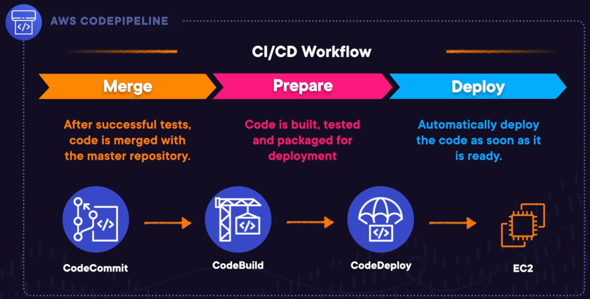
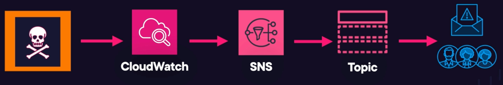

# Development, Messaging, and Deployment Technology and Services
- What Is CI/CD?
- AWS Development Tools
- `Demo`<br>Working with AWS CloudShell and the AWS Command Line Interface (AWS CLI)
- `Demo`<br>Using AWS Cloud9
- Understanding AWS CodeArtifact
- Decoupling Application Components
- Introducing Amazon Simple Notification Service (SNS)
- `HANDS-ON LAB`<br>Create and Subscribe to an AWS SNS Topic
- Introducing Amazon Simple Queue Service (SQS)
- Standard And FIFO Queues
- Short Polling vs Long Polling
- What Is Amazon Simple Email Service (SES)?
- Introducing Amazon EventBridge
- Understanding Step Functions
- Deploying Infrastructure as Code with AWS CloudFormation
- `HANDS-ON LAB`<br>Create a DynamoDB Table Using CloudFormation
- What Is AWS Elastic Beanstalk?
- `Demo`<br>Deploying an Application Using Elastic Beanstalk
- `Demo`<br>Using AWS X-Ray to Identify Performance Issues

<br>


## What is CI/CD?

### Introduction to CI/CD

Continuous Integration (CI) and Continuous Deployment (CD) are widely accepted as best practices in software development and are essential for implementing DevOps. The core idea behind CI/CD is to automate the integration, testing, and deployment processes, ensuring faster, more reliable, and scalable software delivery.

### Benefits of CI/CD

1. **Automation**: Automating the integration, testing, and deployment processes ensures they are fast, repeatable, and scalable.
2. **Reduced Manual Effort**: Automation minimizes manual intervention, reducing the likelihood of errors and inconsistencies.
3. **Frequent Small Changes**: Applying small, incremental changes frequently (at least once a day) helps in quickly identifying and fixing bugs, reducing the risk of significant issues.

### Continuous Integration Workflow

1. **Development Team**: Multiple developers work on different parts of the code downloaded from a central repository and saved locally on their machines.
2. **Local Build and Test**: Developers build and test their code locally. If no bugs are found, the code is committed to the shared code repository.
3. **Code Commit**: Multiple developers commit their changes to the shared repository, integrating their work with that of others.

### Continuous Deployment Workflow

1. **Code Merging**: After successful local testing, code is merged with the master repository.
2. **Build and Test**: The merged code is built, tested again, and packaged for deployment.
3. **Automatic Deployment**: The final step involves automatically deploying the code as soon as it is ready, ensuring continuous delivery of new features and bug fixes.

### Key Concepts

- **Continuous Integration**: The practice of frequently integrating small code changes (at least once a day) into the shared code repository. This helps in catching bugs early while they are still small and easy to fix.
- **Continuous Deployment**: The practice of automating the build, test, and deployment functions, ensuring that code is automatically deployed as soon as it is ready.

### Conclusion

CI/CD practices are fundamental for implementing DevOps, ensuring efficient, reliable, and scalable software development. By automating integration, testing, and deployment, developers can focus on writing code and delivering new features quickly and safely.

<br>


## AWS Development Tools

The four main development tools that you need to be familiar with are `CodeCommit`, `CodeBuild`, `CodeDeploy`, and `CodePipeline`.

### CodeCommit

CodeCommit serves as a central code repository akin to a private Git repository hosted in the cloud. It provides a secure location for centrally storing source code, binaries, images, and software libraries. Key features of CodeCommit include:

- Managing updates from multiple developers
- Enabling effective collaboration
- Tracking and managing code changes
- Maintaining comprehensive version history

### CodeBuild

CodeBuild is a fully managed build service that executes a defined set of commands to compile code, run tests, and produce deployable artifacts. It can reference code stored in your CodeCommit repository and build deployable artifacts such as packages or Docker images.

### CodeDeploy

CodeDeploy is an automated deployment service that facilitates the deployment of software to EC2 instances, on-premises systems, and Lambda functions. By automating the deployment process, developers can swiftly release new features, minimize downtime, and reduce the risks associated with manual processes.

### CodePipeline

CodePipeline is an automated CI/CD pipeline that orchestrates the entire CI/CD process. The pipeline is triggered whenever there is a change to your code, involving:

- Integrating code changes using CodeCommit
- Building and testing code using CodeBuild
- Automatically deploying packages using CodeDeploy

CodePipeline functions as a conductor in an orchestra, coordinating the software release process to ensure it is fast, consistent, and error-free. It integrates seamlessly with other AWS services, including CodeCommit, CodeBuild, and CodeDeploy.

### Example CI/CD Workflow

In a typical CI/CD workflow:



1. **CodeCommit** is used to merge or integrate code changes.
2. **CodeBuild** is utilized to build, test, and package the code for deployment.
3. **CodeDeploy** automatically deploys the code in a repeatable and reliable manner.
4. **CodePipeline** orchestrates the entire process, managing the end-to-end CI/CD workflow.

### Conclusion

It is crucial to understand the purpose and functionality of each of these AWS developer tools:

- **CodeCommit**: A source control service that enables teams to collaborate on code, scripts, images, and binaries.
- **CodeBuild**: Compiles source code, runs tests, and produces deployable packages.
- **CodeDeploy**: Automates code deployments to EC2 instances, Lambda functions, and on-premises servers.
- **CodePipeline**: Manages the CI/CD workflow, orchestrating the build, test, and deployment processes automatically with every code change.

<br>

# Documentation: AWS CodeArtifact

## Overview

AWS CodeArtifact is an artifact repository service that enables developers to securely store, publish, and share software packages required for the software development process. CodeArtifact supports various package types, including Maven, npm, and Python packages, facilitating easy access and management of both open-source and in-house developed software packages.

## What is CodeArtifact?

CodeArtifact is designed to help developers manage and share software packages efficiently. It supports open-source packages from public repositories and proprietary packages developed within an organization. By using CodeArtifact, development teams can:

- **Securely store and share software packages:** Ensures that only authorized users can access and modify the packages.
- **Publish packages:** Developers can publish their own software packages to the repository.
- **Share packages:** Makes it easy for different development teams to access the necessary software packages.

### Benefits of Using CodeArtifact

#### Easy Access to Packages

CodeArtifact simplifies the process of finding and using the correct software packages by providing a centralized repository. For example, if multiple development teams are working on different parts of an application, they can easily retrieve the specific versions of packages they need from CodeArtifact.

#### Version Control

Using CodeArtifact ensures that developers are using the correct versions of packages, which is crucial for maintaining compatibility and stability. For instance, if teams need to use a specific version of the Express framework for Node.js, they can retrieve it from the repository without accidentally using an incorrect version.

#### Saves Time

Developers do not need to search the internet for the required software versions. They can quickly access the approved versions from CodeArtifact, which enhances productivity and reduces the risk of errors.

#### Supports Multiple Artifact Types

In the context of CodeArtifact, artifacts refer to various items such as:

- Documentation
- Compiled applications
- Deployable packages
- Libraries

### Approved Packages

IT leaders can use CodeArtifact to make approved packages available to developers. Approved packages are typically those that the engineering team has tested and verified to work correctly. This practice ensures:

- **Reliability:** The software behaves as expected.
- **Supportability:** The engineering team is prepared to support the software.

Allowing developers to use only approved versions prevents issues that may arise from using the latest, untested versions of libraries and packages.

### Conclusion

AWS CodeArtifact provides a robust solution for managing software packages, ensuring that developers have easy access to the correct versions of the packages they need. By centralizing package management, CodeArtifact improves productivity, reduces errors, and enhances the overall software development process.


<br>

## Decoupling Application Components

In modern application architecture, decoupling components is essential to improve scalability, flexibility, and maintainability. Decoupling refers to the practice of separating the different components of an application so they can operate independently, communicate asynchronously, and be updated or replaced without affecting other parts of the system.

### What is **Tight Coupling**?

**Tight coupling** occurs when components in a system are directly dependent on each other. Changes in one component often require changes in another, which can make the system less flexible and harder to maintain. Tight coupling can lead to the following issues:

- **Reduced Scalability:** As the system grows, tightly coupled components can become a bottleneck, limiting the system's ability to scale.
- **Difficult Maintenance:** Modifying one component often necessitates changes in other components, increasing the complexity and time required for maintenance.
- **Increased Risk:** Failures in one part of the system can cascade to other parts, increasing the risk of widespread outages.

### What is **Loose Coupling**?

**Loose coupling** refers to designing components in a way that reduces dependencies between them. Components interact through well-defined interfaces and protocols, allowing them to be modified or replaced independently. Benefits of loose coupling include:

- **Improved Scalability:** Independent components can scale separately, allowing for more efficient resource utilization.
- **Easier Maintenance:** Changes in one component do not necessitate changes in others, simplifying maintenance and reducing downtime.
- **Enhanced Resilience:** Failures in one component are less likely to affect others, improving the overall resilience of the system.

### Application Integration Services

AWS provides several services that facilitate decoupling and integration of application components. These services enable asynchronous communication, event-driven architectures, and notification systems, allowing for a more modular and scalable application design.

#### **Simple Queue Service (SQS) for Queues**

Amazon Simple Queue Service (SQS) is a fully managed message queuing service that enables you to decouple and scale microservices, distributed systems, and serverless applications. SQS ensures the delivery of messages between software components, acting as a buffer to handle varying loads and reducing direct dependencies between components.

- **Asynchronous Communication:** SQS allows components to communicate without waiting for a response, improving application performance and resilience.
- **Scalability:** Automatically scales to handle large volumes of messages without additional infrastructure.
- **Reliability:** Guarantees message delivery and supports fault-tolerant applications by storing messages in multiple availability zones.

**Example Usage:**

```bash
# Create a new SQS queue
aws sqs create-queue --queue-name MyQueue

# Send a message to the queue
aws sqs send-message --queue-url https://sqs.<region>.amazonaws.com/<account-id>/MyQueue --message-body "Hello, SQS!"

# Receive a message from the queue
aws sqs receive-message --queue-url https://sqs.<region>.amazonaws.com/<account-id>/MyQueue
```

#### **Simple Notification Service (SNS) for Notifications**

Amazon Simple Notification Service (SNS) is a fully managed messaging service for both application-to-application (A2A) and application-to-person (A2P) communication. SNS enables the decoupling of message producers and consumers by using topics and subscriptions.

- **Fan-out Model:** Allows messages to be sent to multiple recipients simultaneously by publishing to a topic.
- **Multiple Protocols:** Supports various protocols, including HTTP/S, email, SMS, and Lambda functions.
- **Scalability:** Handles high-throughput and low-latency message delivery.

**Example Usage:**

```bash
# Create a new SNS topic
aws sns create-topic --name MyTopic

# Subscribe an email endpoint to the topic
aws sns subscribe --topic-arn arn:aws:sns:<region>:<account-id>:MyTopic --protocol email --notification-endpoint example@example.com

# Publish a message to the topic
aws sns publish --topic-arn arn:aws:sns:<region>:<account-id>:MyTopic --message "Hello, SNS!"
```

#### **EventBridge for Events**

Amazon EventBridge is a serverless event bus service that makes it easy to connect application data from various sources. EventBridge enables event-driven architectures by routing events from multiple sources to targets such as Lambda functions, ECS tasks, and more.

- **Event-Driven Architecture:** Facilitates the creation of loosely coupled, event-driven applications.
- **Integration:** Supports a wide range of AWS services and third-party applications as event sources and targets.
- **Filtering and Transformation:** Allows for filtering and transforming events before they reach their targets, enabling more efficient processing.

**Example Usage:**

```bash
# Create an EventBridge rule to trigger a Lambda function
aws events put-rule --name MyRule --event-pattern '{"source": ["aws.ec2"], "detail-type": ["EC2 Instance State-change Notification"]}'

# Add a target to the rule (e.g., a Lambda function)
aws events put-targets --rule MyRule --targets "Id"="1","Arn"="arn:aws:lambda:<region>:<account-id>:function:MyFunction"

# Test the rule by putting an event
aws events put-events --entries '[{"Source": "aws.ec2", "DetailType": "EC2 Instance State-change Notification", "Detail": "{\"instance-id\": \"i-1234567890abcdef0\",\"state\": \"running\"}"}]'
```

By leveraging these AWS services, you can build decoupled, scalable, and resilient applications that are easier to maintain and extend.


<br>

## Introducing Simple Notification Service (SNS)

### Overview

Amazon Simple Notification Service (SNS) is a fully managed service that enables you to set up, operate, and send notifications from the cloud. SNS supports a variety of notification types, including SMS text messages and email. This service is designed to facilitate the process of sending notifications both to users and other applications in a reliable and scalable manner.

### Key Features of SNS

#### Types of Notifications

SNS supports sending notifications via:
- **SMS Text Messages:** Directly to mobile phones.
- **Email:** To email addresses.

#### Examples of Use Cases

- **Automated Notifications:** Businesses can use SNS to send automated notifications, such as booking confirmations or marketing messages. For example, car repair services can notify customers about their booking status via SMS.
- **Marketing Messages:** Companies can use SNS to send promotional messages, such as discounts and product launches, to customers via SMS or email.

#### Pub-Sub Model

SNS operates on a **publish-subscribe (pub-sub)** model, which involves:
- **Publishers:** Applications or systems that send messages to a topic.
- **Subscribers:** Endpoints or users that receive messages from a topic.

#### Topics

A **topic** in SNS is an access point that enables subscribers to receive identical copies of the same notification. It acts as an intermediary that manages the delivery of messages to subscribers.

### How SNS Works

#### Publishing Messages

Applications publish (push) messages to a topic. For instance, a pizza delivery service like World Pizza can notify customers of their order status via email or SMS by publishing messages to a topic.

#### Subscribing to Topics

Subscribers must subscribe to a topic to receive notifications. Subscriptions can be configured to send notifications via SMS, email, or other supported protocols.

#### Example Scenarios

- **Order Notifications:** When a customer places an order, they receive notifications about the estimated delivery time via email or SMS.
- **System Alerts:** If an EC2 instance in an application crashes, CloudWatch can send an alert to SNS, which then emails the support team.

#### Integration with CloudWatch

SNS can be integrated with Amazon CloudWatch to monitor and respond to system health issues. For example:
- If an EC2 instance fails, CloudWatch can trigger an SNS notification to alert the support team.
- 

### Summary

- **SNS allows for sending notifications via SMS and email.**
- **It uses a pub-sub model where applications publish messages to a topic and subscribers receive notifications from that topic.**
- **Topics act as access points for subscribers to receive identical notifications.**

This service is essential for applications that need to send notifications quickly and reliably to users and systems.

By understanding and utilizing Amazon SNS, you can enhance the communication capabilities of your applications, ensuring timely and efficient notification delivery.