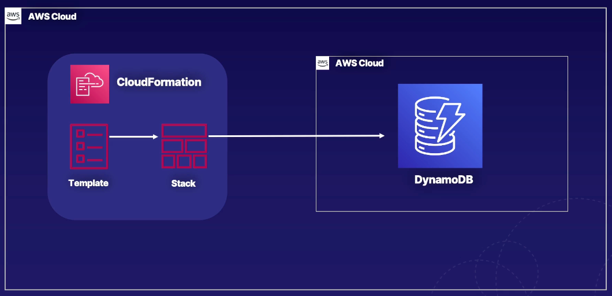

# Create a DynamoDB Table Using CloudFormation

### ABOUT THIS LAB
In this lab scenario, Alfredo of Alfredo's Pizza is building a web application to manage his supply and food inventory. He's looking for help to provision his database infrastructure, which will hold his data. You'll use CloudFormation to write the desired state of the infrastructure using code, which includes a DynamoDB table to hold inventory items. You’ll first launch the resources in his development environment, but the template can later be used to launch a stack in the test and production environments as well. By the end of this lab, you'll have a good understanding of infrastructure as code using CloudFormation.




<br>

## Solution

### Review and Download the CloudFormation Template
1. Create `CloudFormation` template for this lab: `acg-dynamodb-template.yaml`.

```yaml
AWSTemplateFormatVersion: 2010-09-09
Description: CloudFormation Template To Create Alfredo's Inventory DynamoDB Table

Resources:
  InventoryTable:
    Type: AWS::DynamoDB::Table
    Properties:
      TableName: Inventory
      AttributeDefinitions:
        - 
          AttributeName: !Ref HashKeyElementName
          AttributeType: !Ref HashKeyElementType
      KeySchema:
        - 
          AttributeName: !Ref HashKeyElementName
          KeyType: HASH
          
      ProvisionedThroughput:
        ReadCapacityUnits: 5
        WriteCapacityUnits: 5 
        
Parameters:
  HashKeyElementName:
    Type: String
    Default: InventoryId
    Description: Hash Key Name
  HashKeyElementType:
    Type: String
    Default: S
    Description: Hash Key Type

Outputs:
  Inventory:
    Description: Alfredo's Inventory Table
    Value: !Ref InventoryTable
```

<br>

### Launch the CloudFormation Stack
1. From the top search bar in the AWS Management Console, search for and navigate to `CloudFormation`.
2. Click `Create stack` > `With new resources (standard)`.
3. Select `Choose an existing template`.
4. Select `Upload a template file`.
5. Click `Choose file`.
6. Select the YAML file you downloaded.
7. Click `Open`.
8. Click `Next`.
9. For `Stack name`, enter `MyStack`.
10. Click `Next`.
11. On the `Configure stack options` page leave everything as-is, and click `Next`.
12. On the `Review and create` page, click `Submit`.
13. Click the refresh icon in the upper-right section of the `Events` list to check the status of the stack being created.
> Note: It will take a few minutes for the stack to create. You can view the progress of the stack creation in the Status column of the Events list.

<br>

### Verify the DynamoDB Table Was Created
1. Once the stack is created, use the top search bar within the console to search for and navigate to `DynamoDB`.
2. From the left menu, click `Tables`.
3. Click the listed `Inventory` table. While there aren't currently any items within the table, it is ready for items to be added.
