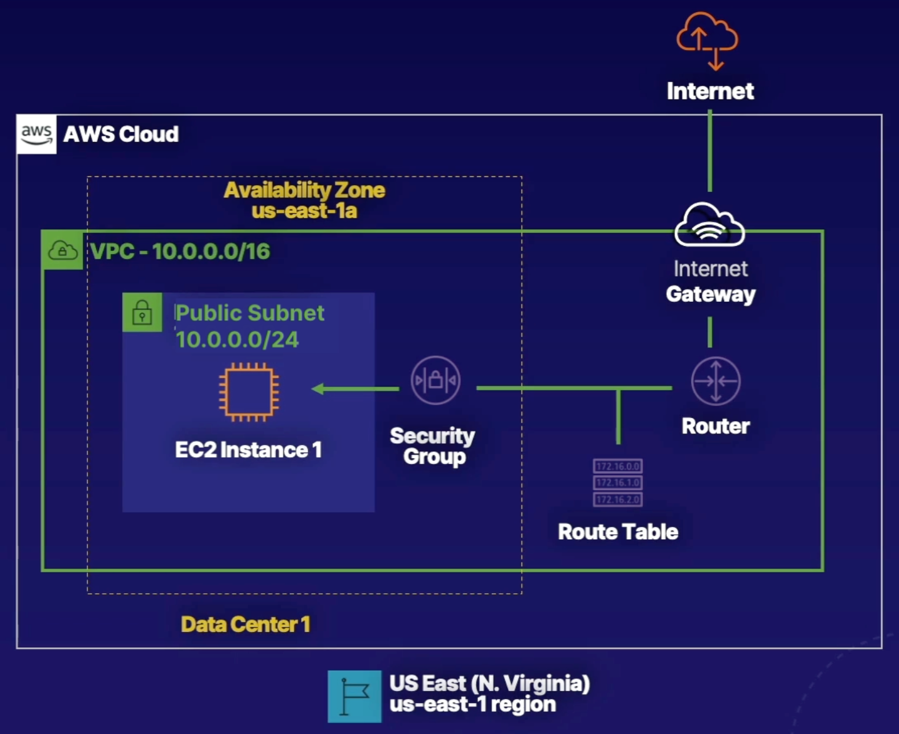

# Launch EC2 Instance in VPC

### ABOUT THIS LAB
In this lab scenario, Alfredo of Alfredo's Pizza is looking to set up a website to advertise his pizza shop. We are going to help him by getting the server primed and ready to host his website. During this lab, you'll have the opportunity to explore and understand foundational and compute services provided by AWS. We will create a virtual private cloud (VPC), subnets across multiple Availability Zones (AZs), routes and an internet gateway, and more. These services are the foundation of networking architecture inside of AWS and cover concepts such as infrastructure, design, routing, and security.

##  Solution

Log in to the live AWS environment.
Make sure you're in the N. Virginia (us-east-1) region throughout the lab.

## Create a VPC

1. Navigate to VPC > Your VPCs.
.2 Click Create VPC, and set the following values:
    - Select: VPC Only
    - Name tag: my-vpc
    - IPv4 CIDR block: 10.0.0.0/16
3. Leave the IPv6 CIDR block and Tenancy fields as their default values.
4. Click `Create VPC`.

## Create a Public Subnet

1. Click Subnets in the left-hand menu.
2. Click Create subnet, and set the following values:
    - VPC ID: my-vpc
    - Subnet name: my-public-subnet
    - Availability Zone: us-east-1a
    - IPv4 CIDR block: 10.0.0.0/24
3. Click Create subnet.

##Create Routes and Configure Internet Gateway
1. With my-public-subnet selected, click Actions > Edit subnet settings.
2. Check the box to Enable auto-assign public IPv4 address.
3. Click Save.
4. Click Internet Gateways in the left-hand menu.
5. Click Create internet gateway.
6. Set Name tag as "my-internet-gateway".
7. Click Create internet gateway.
8. On the next screen, click Actions > Attach to VPC.
9. In the Available VPCs dropdown, select my-vpc.
10. Click Attach internet gateway.
11. Click Route Tables in the left-hand menu.
12. Click Create route table, and set the following values:
    - Name: publicRT
    - VPC: my-vpc
13. Click Create route table.
14. On the next screen, click Edit routes.
15. Click Add route, and set the following values:
    - Destination: 0.0.0.0/0
    - Target: Internet Gateway, my-internet-gateway
16. Click Save changes.
17. Click the Subnet associations tab.
18. Click Edit subnet associations.
19. Select the box for my-public-subnet.
20. Click Save associations.

## Launch EC2 Instance in Subnet
1. Navigate to EC2 > Instances.
2. Click Launch instances.
3. EC2 Instance name my-public-instance.
4. On the AMI page, select the Amazon Linux AMI.
5. Ensure t2.micro is selected.
6. Click Create new key pair.
7. Give it a Key pair name of "my-keypair".
8. Click Create Key Pair.
9. Click Launch Instance.
10. Click View Instances, and give it a few minutes to enter the Running state.
    
    
## Access EC2 Instance

1. Once the instance has a Running state, select the box next to it.
2. Click Connect at the top.
3. In the EC2 Instance Connect section, click Connect.
    - This will open a new browser tab showing a command line interface.
