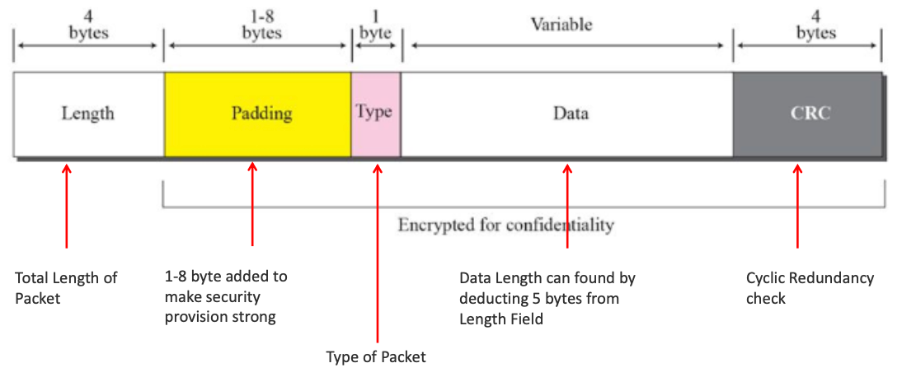

# Networking

### Topic
- OSI Layers
- Protocols
- DNS
- ICMP
- Packet Capturing Tools
- Linux Firewalls
- Iptables
- Linux Security

### Objectives
- Understand about OS model
- Learn about various protocols
- Understand about Packet Capturing tools
- Learn about Linux firewalls
- Know more about Linux Security

## OSI Layers
- Open system Connection (OSI) is a model for how various application will interact over a network.
- It divides the architecture in seven segments.
- The lower layer deals with chunks of binary data and routing these data.
- Higher levels are responsible for network requests, network representation and protocol's as seen from a user's point of view.
- Each layer interacts with the layer above and below it.

|Layer|Description|
|---|---|
|**Application**|To allow access to network layers. Example - FTP, HTTP, DNS, SNMP|
|**Presentation**|To translate, encrypt and compress data.|
|**Session**|Establish, manage and terminate session.|
|**Transport**|Reliable process to process message delivery and error recovery. Ex - TCP, UDP|
|**Network**|Move packets from source to destination. Ex -IP, ICMP, ARP|
|**Data Link**|Organize bits into frame to provide hop-to-hop delivery.|
|**Physical**|To transfer bits over an electrical medium.|

<br>

## Protocols
### TCP
- Transmission control protocol which delivers data from end-to-end in order, reliably.
- It establishes a virtual path between source and destination.
- It uses the underlying layer to deliver individual segments but control is with itself, and IP is unaware of the re-transmission or out-of-order packets.
- Each TCP port is bound to at most one socket, avoiding duplication.

#### TCP Features
|Feature|Details|
|---|---|
|**Maximum segment size**|This is shared between both parties and is tha largest amount of data in bytes to be sent in one single segment|
|**Rate Limits**|The rate a sender sends data to guarntee reliable data|
|**Ordered data transfer**|It sends data as stream of bytes with numbering|
|**Retransmission of lost data**|It uses an acknowledgment mechanism to check arrival of data. Error free data transfer. Error control is received through checsum, acknowledgment and time out.|
|**Congestion control**|Data sending rate also depends on the congestion of the network|

#### TCP Connection Establishment


- **SYN**<br>It is synchronization for the sequence numbers. It carries one sequence number. No data is present.
- **SYN + ACK**<br>SYN for communication in other direction and ACK for received SYN. It consumes one sequence number.
- **ACK**<br>ACK segment for received SYN. It doesn't consume any sequence number.

<br>

### UPD
- User Datagram Protocol have a fixed size header of 8 bytes.
- Prior communications are not required to set up a communication channel.
- It has no hand-shaking, so it is unreliable. Hence, there is no guarantee of delivery.
- UD avoids the overhead of protocol processing like error detection.
- Time-sensitive application often use UDP where dropping packet is a better choice than waiting for the packet to be retransmitted.
- Live broadcast, multi-player games generally use UDP.

#### UPD Features
- No connection establishment is done. Data is sent right away.
- Packates are sent individually and checked when received.
- UPD does not avoid cingestion and it needs to be taken care at the application level.
- The messages are not ordered.
- It is very lightweight and fast.
- It is useful for broadcast as connection establishment is not required. 

<br>

### IPv4
- Internet Protocol version 4 is used to identify devices on a network through an addressing system.
- It is a connectionless protocol used on a packet switched network.
- It fragments packets when required.
- Ipv4 address is a 32-bit address uniquely defines the connection of a device universally.
- It doesn't g uarantee end to end message reliability or flow control.

#### IPv4 Address
- IPv4 are 32 bit integer and most commonly written in 4 octets with dot separated integer values.
- IP address has the format <Network><Host>
- Some of the numbers like 0.0.0.0 and 255.255.255.255 are reserved for default gateway or broadcast IP.
- The network part is centrally administered by InterNIC and is unique through out the Internet.

#### Issues with IPv4
- No encryption of data is done in packets.
- IP packet can be easily sniffed from a network.
- Most of the networks have already been assigned and there is a resource crunch.
- Ipv4 doesn't implement quality of service functionality.
- No authentication of user done at the server.
- Maximum packet size is of 65,535 bits which is smaller compared to the new faster networks.

<br>

### IPv6
- IPv6 is the sixth revision to the Internet Protocol and follows IPv4.
- It has long addresses of 128 bits. It supports billion of users now.
- Simplified fixed size headers to process packets faster.
- Support for authenticity and privacy.
- Flow control and quality of service provides high reliability.
- Encryption headers allows better security of data.
- Extension headers allows large packet sizes.
- Standard authorization of users to server.

<br>

### FTP
- File Transfer Protocol is standard protocol to transfer file over a computer network.
- It is built on client-server model and uses separate data and control connections.
- FTP is a two-way system. Transferring file from client to server is called uploading and from server to client is called downloading.
- In Unix, the service is provided by a daemon called ftpd which runs in background.
- It allows to have ownership and access restrictions.
- Come FTP client tools are Filezilla, dreamweaver, etc.

<br>

### TFTP
- Trivial file transfer protocol is a simpler version of FTP.
- It doesn't provide user authentication.
- It works on client-sever model by establishing connection between them.
- Listing, renaming and deleting is generally not supported at TFTP.
- TFTP uses UDP port 69 while FTP uses TCP ports 20 and 21.
- There is a size restriction in TFTP which is quite smaller.

<br>

### Telnet
- It provides a bi-directional command line interface with a remote network.
- The configuration for telnet in Linux is in `/etc/xinetd.d/telnet`.
- The communication between client and server is handled by internal commands and which is not visible to the user.
- It allows a user at one site to log in to a remote computer that is part of the same network, and then to interact as if they were sitting directly at that computer.
- It is a not a secure protocol.
- Once the connection is established, the client program sends commands with one character at a time.
- The Telnet server uses port 23 of TCP.

> Telnet was widely used in the early days of the Internet for remote access and administration of Unix-based systems. However, due to its lack of security, it has been largely replaced by more secure protocols such as SSH (Secure Shell).


<br>

### SSH
- Secure shell is a cryptographic protocol to secure data over a network.
- A password sniffing attack led to development of initial version of SSH.
- It allows users to securely login in an unsecure network and execute commands.
- Has client-server communication over TCP and provides authentication and encryption.
- There is cryptographic integrity check via md5, sh1 keyed hash algorithms.
- It is free for non-commercial use.
- It only supports the known port numbers.

#### SSH Packet Format


<br>

### HTTP - Hyper Text Transfer Protocol
- An application layer protocol which is the base for data communication for World Wide Web
- Stateless
- Works on port 80 of TCP
- Supports authentication and stores it in browser till the browser is closed or triggered to be deleted
- Protocol for transferring various forms of data between server and the client like: plaintext, images, videos, sounds, etc.

#### HTTP - URLs

`<protocol*>://<host_name**>:<port***>/<path****>`
`https://www.mynetwork.com:80/index.html

\* http, ftp, dns, etc<br>
\** domain name<br>
\*** usually 80 but many on 8080<br>
\**** resource name with exact path

<br>

### DNS
- Domain name system provides a symbolic mapping between names and IP address in the world wide web
- DNS is a distributed system with many servers working worldwide
- Name are organized in a tree structure allowing faster retrieval
- A user will know the email address but IP protocol needs IP address and DNS resolves the email address to corresponding IP address to be sent to.
- The name assigned to machines must be unique
- A name can consist of two or more components spared by a dot. Example: `www.google.co.in`<br><br>
- Demo: 
  - 8.8.8.8 IP has DNS google-public-dns-a.google.com<br>`nslookup 8.8.8.8`
 
<br>

### DHCP
- Dynamic Host Configuration Protocol is used to dynamically assign IP address and other network configurations to devices in a network
- Used port 67 and 68 for server and client and runs on UDP
- It is primarily used in setup where user connection comes and leaves frequently.
- It was designed to povide computers with temporary address
- It relieves the network administrator from manual configuration job
- A large pool of users can be supported by fewer IP address based on their availability

<br>

### ARP
The ARP (Address Resolution Protocol) is a network protocol used to resolve network layer addresses (IPv4 addresses) into link layer addresses (MAC addresses) on a local area network (LAN). Its primary function is to map a known IP address to a MAC address, allowing devices to communicate with each other on the same network.

Here's how the ARP protocol works:

- **Address Resolution**<br>When a device wants to communicate with another device on the same local network, it needs to know the MAC address of the target device. However, devices typically only know the IP address of the target device.

- **ARP Request**<br>To resolve the MAC address associated with an IP address, the sending device broadcasts an ARP request packet to the entire network. This ARP request contains the sender's IP and MAC address and the target IP address.

- **ARP Reply**<br>The device with the IP address specified in the ARP request responds with an ARP reply packet. This packet contains the MAC address associated with the specified IP address.

- **Caching**<br>After receiving an ARP reply, the sending device stores the mapping of the IP address to the MAC address in its ARP cache. Subsequent communications with the same IP address can use this cached mapping without needing to send another ARP request.

- **ARP Cache**<br>The ARP cache is a table maintained by the operating system that stores the mappings of IP addresses to MAC addresses. This cache helps improve network efficiency by avoiding the need to send ARP requests for frequently accessed devices.

- **Aging**<br>ARP cache entries have a finite lifetime, known as the ARP cache timeout or aging time. Entries in the ARP cache expire after a certain period of time if they are not used. When an entry expires, the device must send a new ARP request to refresh the mapping.

Overall, the ARP protocol plays a crucial role in facilitating communication between devices on the same local network by dynamically mapping IP addresses to MAC addresses. It is a fundamental protocol in the TCP/IP protocol suite and is widely used in Ethernet and Wi-Fi networks.


> To check ARP table entries:<br>`arp -an`

<br>

### ICMP
ICMP stands for Internet Control Message Protocol. It is a network layer protocol used for diagnostic and error reporting purposes in IP networks, such as the Internet. ICMP is an integral part of the Internet Protocol Suite (TCP/IP) and is used by network devices, including routers and hosts, to communicate status and error information to other devices.

Here are some key aspects of ICMP:

- **Error Reporting**<br>ICMP is primarily used for reporting errors and delivering status information related to IP packet processing. For example, when a router encounters an issue while forwarding an IP packet, it sends an ICMP message back to the source of the packet to notify it of the problem.

- **Ping and Traceroute**<br>ICMP includes two commonly used utilities: Ping and Traceroute. Ping sends ICMP echo request messages to a destination host and waits for an echo reply, allowing devices to check if a remote host is reachable. Traceroute uses ICMP time exceeded messages to trace the route taken by packets to reach a destination, helping diagnose network routing issues.

- **Control Messages**<br>ICMP includes various control message types, each serving a specific purpose. Some common ICMP message types include:
   - Echo request/reply: Used by Ping to test reachability.
   - Destination unreachable: Indicates that a packet cannot reach its destination.
   - Time exceeded: Indicates that the TTL (Time to Live) value of a packet has expired.
   - Parameter problem: Indicates an issue with the IP header of a packet.
   - Redirect: Instructs a host to use a different router for a specific destination.

- **ICMP Headers**<br>ICMP messages consist of an ICMP header followed by a variable-length data field. The ICMP header contains fields such as the message type, code, and checksum. The data field may contain additional information specific to the message type.

- **Stateless Protocol**<br>ICMP is a stateless protocol, meaning it does not maintain any connection state between devices. Each ICMP message is processed independently, and there is no need for sequence numbers or acknowledgments.

Overall, ICMP plays a critical role in network troubleshooting, diagnostics, and error reporting, providing essential mechanisms for communication between network devices and hosts.

> `ping 8.8.8.8 -t 5`
> `traceroute 8.8.8.8`

<br>

## Packaet Capturing tools
### Packet Sniffing
- It is a techinque to monitor every packet taht crosses the network, in promiscuous mode
- Some common sniffing tools are `tcpdump`, `Ip spoofing`, etc
- It can be used to trace IP address to their destination
- One can monitor all internet traffic from your system to the internet

#### Sniffing methods
- IP based
- MAC based
- ARP based

#### Packet Sniffing Uses
- Network intrusion detection to find if someone has unauthorized connection to our system.
- Performance analysis to improve the network.
- Detection of clear text password and username from network.
- Conversion of data sent over the network to human readable format.
- Used to make network secure as some malicious content can be filtered out.
- Finding out the details about the different system connected to your system.

#### Wireshark
1. It is most popular network analyzer
2. It lets you capture traffic and analyze the network on your computer
3. It is available for both Linux and Windows
4. Displays data with detailed protocol information
5. Lots of filter options available to sort out the relevant information
6. Colorize packets based on the filter
7. It doesn't manipulate anything and just provide measurements

<br>

### `tcpdump`

|Option|Description|
|---|---|
|`-i`|tells the interface we are using|
|`-q`|stay quiet rather than printing more info|
|`-t`|rename time stamp|
|`-l`|buffers one line at a time on output|
|`-c`|count of packet to capture|
|`-w`|write to a file than printing on the screen|
|`-r`|read the content of the file|
|`-x`|dumps the entire datagram captured with the default snaplen in hexadecimal|

`tcpdump` is a powerful command-line packet analyzer tool used for capturing and analyzing network traffic in real-time. It is available on most Unix-like operating systems, including Linux, macOS, and BSD. `tcpdump` allows users to capture and display packets that are transmitted or received on a network interface.

Here's an overview of `tcpdump` and its features:

1. **Packet Capture**<br>`tcpdump` captures packets flowing through a network interface in real-time. It can capture packets from Ethernet, Wi-Fi, loopback, and other types of network interfaces.

2. **Filtering**<br>`tcpdump` provides various filtering options to specify which packets to capture. Users can filter packets based on criteria such as source or destination IP addresses, port numbers, protocol types, packet size, and more. Filters can be specified using BPF (Berkeley Packet Filter) syntax.

3. **Output Control**<br>`tcpdump` offers flexibility in controlling the format and verbosity of output. Users can specify options to control how packet information is displayed, including packet headers, timestamps, and packet payloads. Output can be directed to the terminal or saved to a file for later analysis.

4. **Protocol Support**<br>`tcpdump` supports a wide range of network protocols, including TCP, UDP, ICMP, IPv4, IPv6, ARP, DNS, HTTP, SSH, and many others. It can capture and analyze packets for virtually any protocol used on a network.

5. **Post-Capture Analysis**<br>After capturing packets, `tcpdump` allows users to analyze the captured data using other tools or utilities. Captured packet data can be imported into packet analysis software such as Wireshark for detailed inspection and troubleshooting.

Here's a basic usage example of `tcpdump`:

```bash
sudo tcpdump -i eth0 -n -nn -vvv
```

- `-i eth0`: Specifies the network interface (`eth0` in this example) from which to capture packets.
- `-n`: Disables reverse DNS resolution, displaying IP addresses instead of hostnames.
- `-nn`: Disables port number translation, displaying port numbers instead of service names.
- `-vvv`: Increases the verbosity level, providing more detailed output.

`tcpdump` is a versatile tool commonly used by network administrators, security professionals, and system administrators for troubleshooting network issues, monitoring network traffic, analyzing network protocols, and performing network security audits.

<br>

### `netstat`

|Option|Details|
|---|---|
|`-a`|display all active connections|
|`-t`|display only TCP connections|
|`-l`|display all active listening ports|
|`-u`|display UDP connections|
|`-s`|display satatistics by protocol|
|`-r`|display kernel routing table|
|`-i`|display network interface packet transactions|
|`-p`|display which process is using which socket|
|`-n`|no dns resolution done|
|`-c`|to keep printing netstat information every few seconds|


It is a command used to display very detailed information about how your computer is interacting with other network devices.

Netstat provides statistics for the following:
- The name of the protocol (TCP or UDP).
- The IP address of system and port number being used. An asterisk (*) is shown for the host if the server is listening on all interfaces.
- If the port is not yet established, the port number is shown as an asterisk(*).
- The IP address and port number of the remote network to which the socket is connected.
- Indicates the state of a TCP connection.
- The possible states are as: CLOSE_ WAIT, CLOSED, ESTABLISHED, FIN_WAIT_1, FIN_WAIT_2, LAST_ACK, LISTEN, SYN_RECEIVED, SYN_SEND, and TIME_WAIT.

<br><br>

## Lunix Firewall

A firewall is a program which restricts the incoming and outgoing connections based on rules that have been pre-configured in the rule-set.

- Firewall can log accesses and provide valuable information about network usage
- Firewall can be hardware level or at software level. Software level firewall are cheaper and easier to configure
- It reduces risks by blocking the insecure services reducing chances of malicious content entering system
- The default Linux firewall is `iptables`
- Multiple GUI version are also available for Linux

###