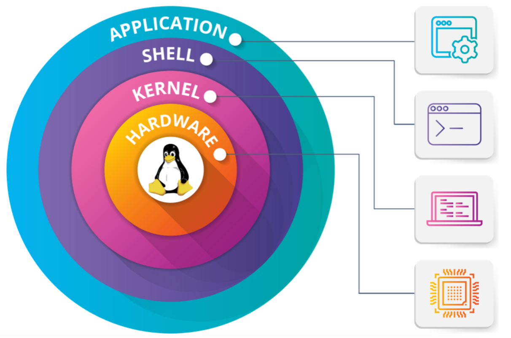
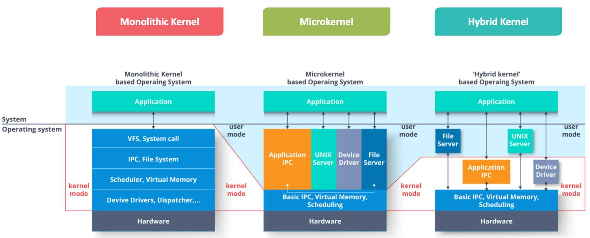

# Linux fundamentals

### Topics
- History of Linux
- Linux VS Unix
- Features of Linux
- Components of Linux OS
- Architecture of Linux OS
- Linux Distribution
- Shell Scripting
- User Interface in Linux
- Linux Commands

### Objectives
- Understand the History of Linux
- Differentiate between Linux and Unix
- Learn the Architecture of Linux
- Choose the appropriate Linux Distribution
- Create a Shell Script
- Understand User Interface in Linux
- Implement basic and advance Linux Commands and Tools

## Linux introduction

Linux is an **Open Source Operating System** modelled on Unix, and developed in C language

**Open Source**
1. A software becomes open source if its source code is freely available
2. The free software movement was started in 1983 and 1998. Some developers coined the term "Open-Source" to make it less ambiguous and everyone adapted to it
3. Open source projects are generally a collaborative effort by multiple sets of developers to enhance the product and allow others to get benefit of it
4. The owner may put restrictions on usage, modification and distribution by various licensing, but it should be available to study for everyone

## Linux History
- **1969 and 1970**

    Unix OS was conceived, implemented and released by Ken Thompson and Dennis Ritchie
- **1977**

    BD (Berkeley software Distribution) contained Unix code that was developed by UC Berkeley
- **1983 and 1986**

    Stallman started a GNU project for Unix like OS, which was free for copying and modification. In 1986, Maurice J published the design of Unix OS
- **1987**

    MINIX, which similar to Unix was developed by Andrew Tanenbaum, where copying of code was allowed
- **1991**

    Torvalds created a Linux Kernel in 1991. Linux Kernel along with GNU Tools became Linux Operating System

## Linux vs UNIX
|**Parameters**|**Linux**|**UNIX**|
|---|---|---|
|Cost|Free|Not Free Different vendors have different prices|
|Flexibility|Yes|Not Flexible Compatible with lesser hardware|
|Source Code|Available|Not available As it is not a freeware|
|Installation|Economical|Uneconomical Unix requires specific hardware|
|Community|Wide network of developers|Limited commercial developers|
|Support|Depends on forums and community for|Vendors usually provide technical support support for commercial Unix|
|Bug Fixes|Bug fixing is much faster in Linux than in Unix||

## Features of Linux
- Linux is an open-source
- Significantly reduces the monitory cost
- Huge base of developers that freely provide support
- It is Reliable as it runs smoothly and no need to reboot it repeatedly
- Licensing freedom to re-use and re-publish the code
- Can be Customized if you want to change your system's look
- New enhancements happening and updates come frequently
- More Secure than other Operating Systems

## Components of Linux
1. **Init Program**
   
   The first program, which is responsible for the initialization of the system. Ex: sysvinit, systemd
2. **Bootloader**

    A program which loads the operating system when the system is turned on. Ex: GNU Grub, Syslinux
3. **Software Libraries**

    Set of programming code used to develop and design software programs and applications.
4. **Package Management System**

    A collection of tools for Installation, Deletion, Configuration, and Upgradation of software. Ex: dpkg, RPM
5. **Other Interface and application**

    Various applications and interfaces are used for various task performed by user.

## Linux architecture

- **Hardware**
  - **RAM** 
    It is volatile memory space that stores the data which is directly accessed by CPU
  - **CPU** It is a Electronic Component that carries out the instructions of computer program
  - **Hard Disk Drive** It is non-volatile memory, where the Operating System is stored
- **Kernel** The kernel is the Interface between the Applications and the actual process done at the Hardware level.

    **Tasks performed by the Kernel**
  - **Resource Allocation** Manage the computer's resources and allow other programs to run and use these resources
  - **Security Management** Provides security and protection from faults and malicious behaviours
  - **Process management** Allows the execution of applications and support them with features such as hardware abstraction
  - **Device Management** Maintains a list of available devices and allow drivers to physically access their devices
  - **Scheduling** Gives every program specific amount of time and can switch from one process to another
  - **Memory Management** Allows processes to safely access the memory according to their requirements

  Types of Kernel
  

- **Shell**
    The shell is the interface which takes user-command and sends it to the kernel

    - Shell has got its own programming language and you can combine multiple commands in a single script
    - The shell takes the command in human readable format and provides it to kernel in binary language
    - The user generally interacts via shell, but direct interaction with hardware is also possible
    - The first shell created was `sh` for Unix systems. Linux still provide support for `sh` shell, but `bash` is more popular within the Linux users

    Types of shell:
    - **Bash**
      - Bourne-Again-shell was written as part of the GNU project to enhance the functionality of sh (Bourne-shell)
      - Some enhancements like command completion and complete command history are done
      - It supports all sh functionalities and has its own script for startup
      - It can perform integral calculations without invoking any external process
      - One can enter "#! /bin/bash" at the top of the file to tell Linux to run with bash interpreter
    - **C shell**
      - It was written by Bill Joy and is widely distributed with BSD Unix
      - Syntax and control statement are modeled and designed like C
      - It is executed in a text window, which allow users to provide commands
      - It can also read commands from the script
      - It is linked to tcsh shell which is an improved version
    - **Korn shell**
      - Korn shell includes C shell's major advantages and its own features
      - It has command line editing which allows you to use vi or Emac style editing commands
      - It enables common programming tasks to be done cleanly without creating extra processes
      - A feature like debugging primitive make it possible to write tools that help the programmer to debug their shell code
    - **tsch shell**
      - It is a native root shell of BSD based systems
      - It is essentially a C shell with programmable command line completion, command line editing and other new features
      - tsch is backward compatible with original C shell
      - csh is actually a Tcsh shell on many systems such as Mac OS and Red Hat Linux

## Linux distributions

- There are more than 600 distribution available based on:
    - The development group
    - Their specific requirement and
    - Customization
- They are community and commercial supported distros
- Some of the popular Linux Distros are **Ubuntu**, **Fedora**, **RedHat**, **Debian**, **CentOS**, etc.

### Distinguishing Factors for Linux Distro
1. **Enterprise users or home users**
  - Home user distro has user-friendly GUI and it is easy to use
  - Enterprise edition gives more importance to performance
2. **Hardware support**
  - Most of the distros are portable to multiple hardware, but some of them are designed for specific vendors
3. **Designed for Servers, Desktops and Embedded devices**
  - Server distro generally don't have a GUI
  - Some of the packages of server distro are different from desktop distro
4. **Targeted at a specific user community**
  - Some may have enhanced firewall securities while some may be more dedicated towards scientific computing packages
5. **Commercial**
  - If it is to make available commercially or non-commercially

## Miscellaneous Linux Concepts

**File**
- You don't need a command to check the CPU info, but can print the file `/proc/cpuinfo` like a simple plain text file
- There are some special files that represent hardware devices, system information, etc.
- The `/proc` filesystem in Linux gives detail about the kernel's run-time operations in form of plain text files

**Types of files in LInux**
|Type|Description|
|---|---|
|`-`|Normal file|
|`d`|Normal directory|
|`l`|Symbolic link (shortcut to a file/directory)|
|`s`|Socket(pass the data between two processes)|
|`p`|Pipe(it is similiar to a socket, but users cannot work with it directly)|
|`c`|Processess character hardware communication|

