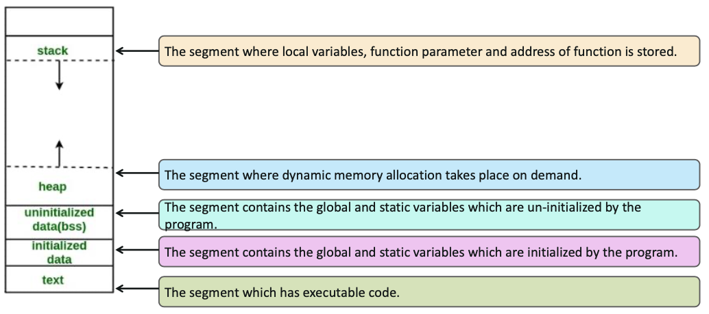

# Shell Scripting

### Topics:
- Process Management
- Process Synchronization
- Some Basic Linux Commands
- Scripting
- BASH Scripting
- Expect Scripting

### Objectives
- Perform Process Management
- Learn Basic Linux Commands
- Understand system related commands
- Learn basic shell scripting

  

## Process Managment
### What is a Process?
- A process is a series of commands to instruct the processor, what to do
- It may use any available resources that Linux kernel has and allows to go ahead with the execution
- The process management involves scheduling, interrupt handling, signaling, process prioritization, process switching, process memory, etc
- Every process has its own life-cycle such as:
  - Creation
  - Execution
  - Termination
  - Removal

### Process States
|State|Description|
|---|---|
|`TASK_RUNNING`|The process is executing or about to be executed|
|`TASK_INTERUPTIBLE`|The process is waiting for a signal or a resource|
|`TASK_UNINTERRUPTIBLE`|The process is forced to halt for certain condition|
|`TASK_KILLABLE`|Allows waiting task to respond to a signal to be killed|
|`TASK_STOPPED`|The process is stopped by receiving certain signals|
|`TASK_TRACED`|The process is being debugged and temporarily stopped|
|`EXIT_ZOMBIE`|The process is terminated but information available in process table|
|`EXIT_DEAD`|The process is released completely|

### Process Memory Area
The process memory are is broadly divided in these segments:

### Process Synchronization
Multiple processes running on system share resources which may lead to issues like:
- Resource blocking
- Data inconsistency
- Race condition

 

Process synchronization can be achieved by:
- **Semaphores**
  - A variable or data type used to control access to common resource in a multi-processing operating system
  - It is a signaling mechanism
  - Semaphores are mainly of two types:
    - binary semaphore
    - counting semaphore
- **Mutex locks**
  - Entire section of code is locked and no-one can access it until the lock is released by the process who applied the lock
  - Multiple locks can be applied in a part of the code. It is a locking mechanism.

 

### `ps`

  `ps <option>`
  |Option|Description|
  |---|---|
  |`-e`|every active process|
  |`-f`|full format list for the process
  |`-x`|all processes owned by the owner
  |`-r`|all running processes
  |`-T`|all processes associated with this Terminal
  |`-g`|all processes owned by particular group
  |`-p`|process by particular PID
  |`--forest`|display how processes are linked to each other
  

  - Process status is used to check infomration related to various processes running on system
  - It is primarily user for process monitoring
  - The information generally displayed are:
    - **PID** Unique process ID
    - **TTY** terminal type used is logged into
    - **TIME** amount of CPU in minutes and seconds that the process has been running
    - **CMD** name of command that launched the process

 

### `top`

|Option|Description|
|---|---|
|`-u`|append option ot display specific user process details|
|`c`|press `c` to view absolute path of the process|
|`d`|press `d` to change refresh interval|
|`SHIFT+p`|Sort by CPU utilization|
|`-n`|append the option to limit the number of iteration|
|`q`|exit|
    
- The command show the processor and memory being used by the system
  
 

### `kill`

`kill <signal> <PID>`

- The command is used to terminate a particular process
- Common signal to a process are:
  - **SIGHUP** numeric value 1, hang up the process
  - **SIGKILL** numeric value 9, kills the process without saving
  - **SIGTERM** numeric value 15, terminate the process
- Use `ps` to find the process ID or use the command `pidof` (i.e. `pidof mysql`)

 

### Some Common Process Commands
- `bg`
  - Starts running a suspended process in the background
- `fg`
  - Brings the suspended or the background running process to the foreground
- `jobs`
  - Display the status of jobs in the current shell

 

### System Calls
It can be grouped into five major categories
- **Process Control**
  - create process
  - load
  - execute
  - terminate, etc
- **File Managment**
  - create file
  - open
  - read
  - write
  - delete, etc
- **Device Management**
  - request device
  - release
  - read
  - write, etc
- **Information Maintenance**
  - get time/date
  - system data
  - process attributes, etc
- **Communication**
  - create connection
  - send
  - receive
  - delete
  - transfer, etc

- System calls run in different memory-space and with different privileges
- The instructions are generally available as assemble language instructions

 

### `tee`

- It is used to store and view the output to another command
- We can also write output to multiple files:
  - `ls | tee file1.txt file2.txt file3.txt`
- It can also be used to pass it to multiple commands
  - `cat file1.txt | tee file2.txt | sed 's/hello/hi/' | sed 's/file/text/'`

 

### `cron`

- `cron` is a deamon which checks every fixed interval for scheduled tasks in cron table
- `cron` consists of six fields separated ty tab or space:
  - Minute (0-59)
  - Hour (0-23)
  - Day of the month (1-31)
  - Month of the year (1-12 or Jan-Dec)
  - Day of week (0-6 or Sun-Sat)
  - Command
- Use `crontab -e` to add a new entry

  

## Scripting
### What is Scripting?
- A script is a series of commands within a file which can be executed without being compiled
- Scripts are general text document in human readable format that need to be executed by a certain program to achieve desired results
- They can be written with any normal text editor
- Each has their own specific extension or tags embedded inside the file
- For ex - `.py` extension is for python scripts and `.sh` is for shell scripts
- Scripting is done to automate the task of a user
- A sequence of commands which is given as an input on regular intervals can be bundled together as a script and executed as a single file when required
- This reduces the chances of typing error while pacing-up the process of command execution as the next command is immediately executed after finishing the current execution
- Scripts can provide with help/suggestions in case of the user doing some error with a particular command

### Scripting in Linux
- Each distribution of Linux has shell which executes commands
- We provide a command to shell as input and it executes them
- The shell supports scripting and we can bundle a set of commands to be executed together by writing in a file with shell details
- Each script should have execute permission set to it
- The script can also be added to be executed during boot or specific process execution
- We can also install various tools like python and write their own scripts
