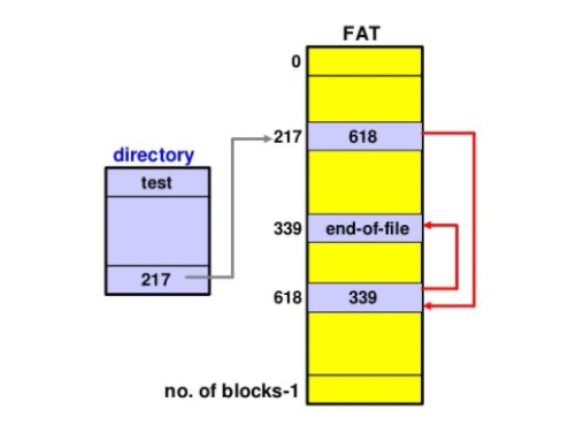
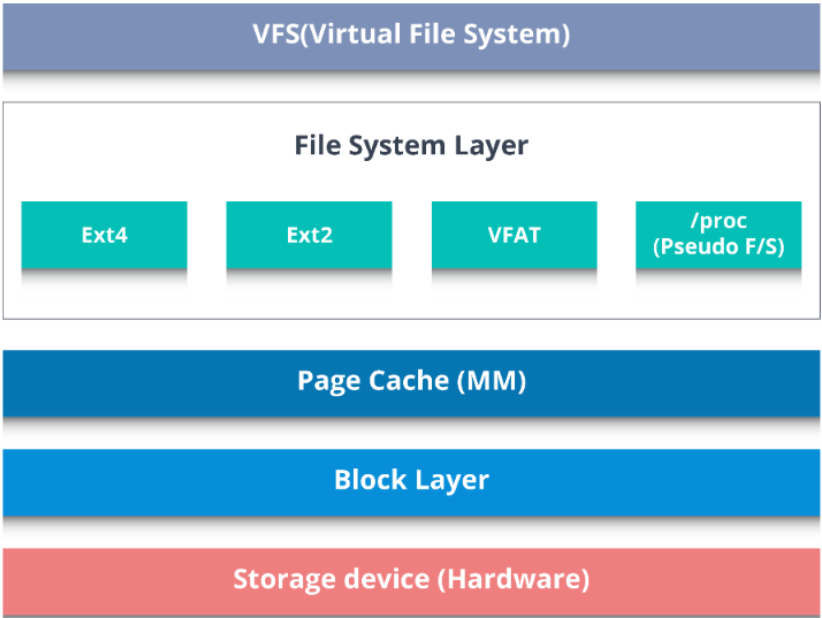
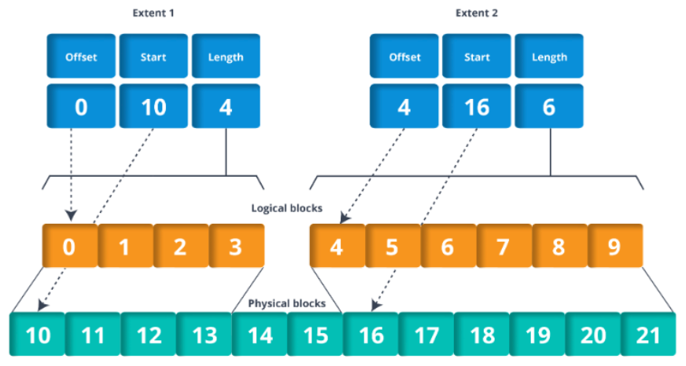
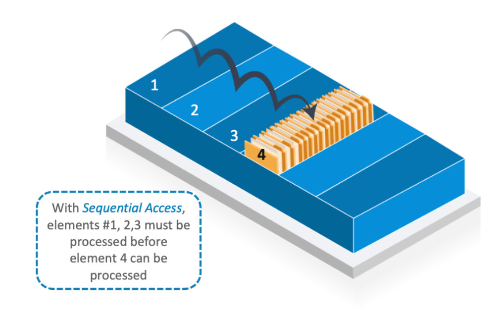
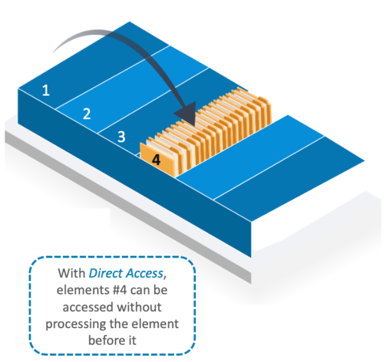
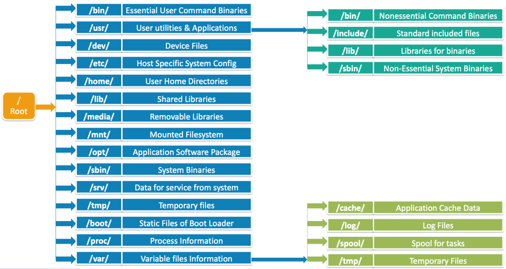
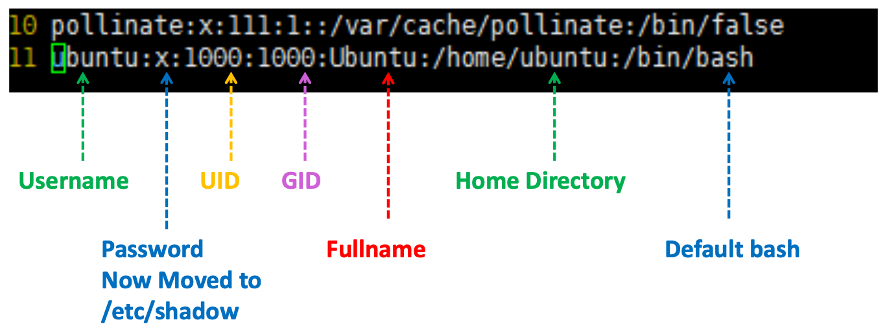
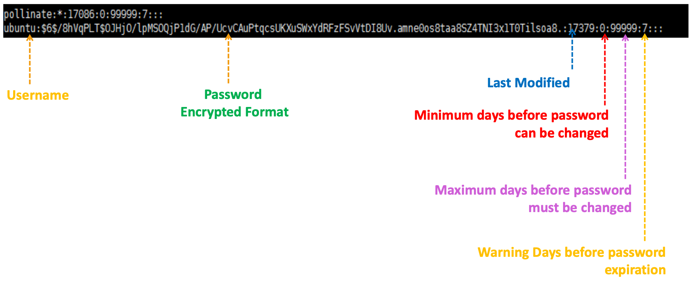
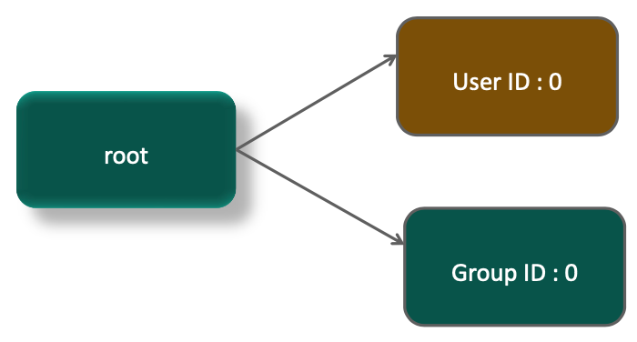

# User Administration

### Topics
- File Systems and its Types
- Software Package Management
- Users in Linux
- User Groups in Linux
- File/Folder Permissions
- Special Permissions

### Objectives
- Understand File System in the OS
- Learn Packaging Management in Linux
- Understand where user information is stored
- Use Commands to Add a New User, Delete a user, Modify User and Change Password
- Use Linux Group Mechanism to Organize a Collection of Users
- Manage Permissions for Files and Directories

## File System
The file system is a logical arrangement to store and retrieve data

- The file system can be local data storage via a network protocol or virtual files
- Most of the file systems use hard disks which are made of small fixed size blocks. Each block has an identifier to describe the start and end of the block
- Depending upon the file system architecture, file fragmentation occurs when some files are in noncontiguous clusters or some file are deleted
- Each file has a metadata consisting of size, date and time of creation, file type, access permission, owner of a file, etc.

### Type of file systems

- **Disk File System**
  
  It manages data on a permanent storage device. Accessing the data for multiple request can be handled Ex - NTFS, FAT, etc.

- **Network File System**

  It allows a user on a client computer to access the files over a computer network using NFS protocol Ex - AFS, SMB

- **Special Purpose File System**

  The system API/device is given a file type representation to use according with Unix OS

  

### Examples of File Systems

- **FAT**

  - File Allocation Table (FAT) uses indexing for a contiguous area of disk store
  - Each entry has index of the next cluster or indicates end of the file
  - The top directory has a number of clusters of each file in the particular directory
  - FAT may lead to fragmentation and has better alternatives for larger file systems

    

  **Comparison of FAT versions**

  |Attribute|FAT12|FAT16|FAT32|
  |---|---|---|---|
  |Used For|Floppies, small hard drives|Small to large hard drives|Large to very large hard drives|
  |Size of each FAT entry|12 bits|16 bits|28 bits|
  |Maximum number of Clusters|~4,096|~65,536|~268,435,456|
  |Supported cluster size|512 B to 4 KB|2 KB to 32 KB|4 KB to 32 KB|
  |Maximum volume size|16,736,256B (16MB)|2,147,123,200B (2GB)|~2^41B (2TB)|
  
  - There are multiple version of FAT like FAT 12, FAT 16, FAT 32 with FAT 32 more suited for device with larger memory chunks
  - It is best suited for file system of smaller sizes and primarily used in floppies, cameras, media players, etc.

  

- **NTFS**

  **N**ew **T**echnology **F**ile **S**ystem (NTFS) uses advanced data structure to improve performance, reliability and disk space usage

  - Each file operation is broken down into transaction so that recovery is allowed
  - Whenever it is needed each file or folder can be expanded or compressed automatically

  

  **NTFS - Features**
  |Feature|Description|
  |---|---|
  |**Self Healing NTFS**|Detects and corrects corrupted NTFS volume file|
  |**ACL(Access Control List)**|Determines who else can access or modify your files|
  |**File level encryption**|Protects your file content from unauthorized access|
  |**Disk Quotas**|It keeps track of disk space being used and enables administrator to limit disk space that a user may use|
  |**Reliable File System**|Automated recovery operations and checks for consistency by using transaction log and journal file|
  |**File Compression**|Compression of large file is allowed so that disk space is used efficiently|

  

- **ext4**

  - Fourth Extended File System (ext4) is designed for Linux Kernel
  - It supports huge individual file size and go to TB's and almost one directory can contain 64,000 sub-directories

  

  **Features**
  - Less chances of file corruption during a crash and transparent encryption is supported
  - When data is copied to disk, it supports delayed allocation and create blocks
  - There are very low chances of fragmentation in ext4
  - It is faster as it skips the unallocated blocks reducing the retrieval time

  

- **XFS**

  - It is a journaling file system that uses a B-tree (balance tree) to allocate data as fast as possible
  - It supports huge individual file size allocation
  - It allows to reserve bandwidth and adjusts its operation based on existing reservations
  - It is designed for data storage server and recommended for home systems

    

  

- **Comparison of ext4 and XFS**

  |Feature|ext4|XFS|
  |---|---|---|
  |Architecture|Hashed B-tree|B+tree|
  |Emerged|2006|1994|
  |Max volume size|1 Ebytes|8 Ebytes|
  |Max file size|16 Tbytes|8 Ebytes|
  |Max number of files|4 billion|2^64|
  |Max file name size|255 bytes|255 bytes|
  |Attributes|Yes|Yes|
  |Transparent Compression|No|No|
  |Transparent Encryption|Yes|No|
  |Copy-on-Write(COW)|No|Planned|
  |Snapshots|No|Planned|

  

- **File systems comparisons**

  |Attribute|NTFS|FAT32|XFS|ext4|
  |---|---|---|---|---|
  |**Max Filename Length**|255|255|255|255|
  |**Max File Size**|16 EB|4 GB|8 EB|16 GB - 16 EB|
  |**Max Volume Size**|16 EB|512 MB - 16 TB|8 EB|1 EB|
  |**Access Control List**|Yes|No|Yes|Yes|
  |**Symbolic Links**|Yes|No|Yes|Yes|
  |**Filesystem-level Encryption**|Yes|No|No|Yes(experimental)|
  |**Online grow**|No|No|Yes|Yes|
  |**Offline grow**|Yes|With third party tools|No|Yes|
  |**Transparent Compression**|Yes|No|No|No|
  |**Copy on Write**|No|No|Yes(On request)|No|
  |**OS Support**|Windows, Linux,MAC|DOS, Windows,Linux, MAC|Linux|Linux, MAC|

- **File attributes**
  |Attribute|Details|
  |---|---|
  |**File name**|A human readable name assigned to a file|
  |**File Type**|Identifies the category of the application required|
  |**Permission**|The user has the permission to access every file|
  |**File size**|Memory allocated on the disk to store the file|
  |**File location**|A pointer to find out the file|
  |**File date**|Date of creation or last modification of file|
  |**File Owner**|The user who currently has owner permission over the file|

  

- **File Operations**

  |Operation|Description|
  |---|---|
  |**Create**|Allocate space on disk and make an entry|
  |**Write**|Write the data in the file|
  |**Read**|Read the data from the file|
  |**Delete**|Delete the file to free the allocated memory|
  |**Move**|Move files to a different location|

  

- **File System Characteristics**

  - Linux is a multiuser system where every file in a Linux file system belongs to a user and a group with respective permissions
  - Files in Linux may have a file extension, such as `.txt` and hidden files are indicated by a dot in front. Example - `.hiddenfile`
  - Linux distinguishes between uppercase and lowercase letters in the file system
  - Modern Linux and UNIX limits filename to 255 characters (255 bytes)
  - Linux does not use drive letters which cannot tell whether you are addressing a partition, a drive/device, a network device, etc. from pathname

  

- File Access Methods

  - **Sequential Access**

    - A file is processed in order, one record after the other
    - If p is the pointer to a record, then next, record will be p+1

      

  - **Direct Access**
    
    - Such files are generally made up of fixed logical length
    - Reposition the pointer to a particular record number to identify reach record

      

  - **Indexed Access**

    - In such files, each record has a key associated with it
    - We can search the index table to locate the block that contains the desired record

  

- **Linux File Hierarchy Structure**

  

  
## Package Management

### Software Package Management
- Linux comes along with a set of tools and software and it is the primary method to install tools in Linux
- It provides the freedom of installation based on your requirements
- Package management in Linux takes care of installing, upgrading and removing the package from the system
- Different Linux distro use different package management systems.  For example:
  - `apt-get` : Ubuntu, Debian, etc 
  - `yum` : RedHat, Fedora, etc

### Task of Package Management System
- **Tool Installatiion** Installing new tools and software in the system
- **SW Upgrade** Upgrading software to the latest version
- **Checksum Verification** To confirm that a package has been installed successfully
- **Digital Signature Verification** To check the authenticity of the package
- **Manage Dependencies** To verify that all dependent packages are isntalled
- **Remove old/unused SW/SW version** Remove and old version of the package if new version is installed

  

`apt-get`

- Apt-get is the command line interface to handle package using APT library.
- It is an efficient way of handling packages in your system.
- Upgrades and removal are handled carefully to maintain the stability of the system.
- It is the default package management system for Debian-like distro like Ubuntu.
- Dependencies are managed automatically.
- It has an external GUI support with tools like synaptic, aptitude, etc.

`apt-cache`

- Apt-cache is the command line interface to search apt software packages.
- This tool is used to search software packages and get information about them.
- The data is fetched from different sources listed in `sources.list` file.
- One can search for package without having exact name of the package.
- `/var/cache/apt/archives/` contains already downloaded packages to avoid downloading them again if one needs to re-install a package after removing it.

#### List & Search Packages

- Use command `pkgnames` to lsit packages starting with a particular string
  - Syntax `apt-cache pkgnames <package_name>`
  - Example `apt-cache pkgnames python`
- Use command `search` to search for a package with aprticular name
  - Syntax `apt-cache search python`

#### Check Package information
- Use command `show` to get details about a package
  - Syntax `apt-cache show <package_name>`
  - Example `apt-cache show python`
- To check dependencies of a package use `showpkg` option
  - Syntax `apt-cache showpkg python`

#### Update Package
- Use command `update` to update a package
  - Sytnax `apt-get update <package_name>`
  - Example `apt-get update python`
- To update the whole system, don't provide package name
  - `apt-get update`
- To install a package but prevent from upgrading if already installed use `--no-upgrade` option
  - `apt-get install python --no-upgrade`

#### Install Package
- Use command `install` to install a package
  - Syntax `apt-get isntall <package_name>`
  - Example `apt-get install python`
- To install multiple packages together, provide multiple package names after install
  - `apt-get isntall python mysql`
- To install multiple packages having a particular string, use wildcard
  - `apt-get install `*name`

#### Upgrade Package
- Use command `upgrade` to upgrade the system. It may remove or update the installed packages.
  - Syntax `apt-get upgrade`
- To upgrade only specific package without installation of any packages use `--only-upgrade` option
  - `apt-get install python --only-upgrade`

#### Remove Package
- Use command `remove` to remove a particular package
  - Syntax `apt-get remove <package_name>`
  - Example `apt-get remove python`
- Removing a package does not remove its configuration file. To remove configuration files along with it, append `purge` option
  - `apt-get remove --purge python`

#### Download Package
- Use command `download` to download a package without installing it
  - Syntax `apt-get download python`
  - Example `apt-get download python`
- To download and unpack source code of a package use `source` option
  - `apt-get source python`

#### Check Dependencies
- Use command `check` to check for dependencies
  - Sytnax `apt-get check`
  - Example `apt-get download python`
- To install dependencies use `build-dep` option
  - `apt-get build-dep python`

  

## Users in Linux
### User Accounts
- One can create multiple accounts for logging-in the Linux
- Each user can have different privileges.
- The user having the highest authority can restrict the other user to add new users or the data he has access to.
- By default, one account named `root` has access to all the files and perform every action.

### User infromation storage files
- `/etc/passwd` Stores the user account information for the system. 
- `/etc/shadow` Stores the password for the various accounts. By default, it is not accessible to anybody except root user. 
- `/etc/group` Contains your system groups.

 

### Superuser
- Superuser is commonly known as root
- It is created by default and has user & group ID as 0
- It doesn't have a password by default. One can assign it by `sudo passwd root`
- Give a strong password for root
- One should only use this privilege for small interval for specific task and then go back to normal user
- Inexperienced user can cause serious harm to OS and may also leave security vulnerability
- 

 

### Switch user

`su <option> <username>`
- If username not provided, it takes root by default
- Once the command is given, it asks for the password of the user. If correct password is provided, it opens the shell for that user
- Type `exit` to return back to original user
- Root doesn't require the password to switch to other
users

 

### Super user do - sudo

- Adding `sudo` runs the command with the user privileges
- By default, it is root if user not mentioned
- Permission for `sudo` access is stored in `/etc/sudoers`
- By default new added user don't have sudo permission

 

- Syntax `sudo <options> <-u user> command`

#### Add/remove sudo privileges
- To give sudo permission use `sudo gpasswd -a student sudo`
- To remove sudo permission use `sudo gpasswd -d student sudo`

 

###