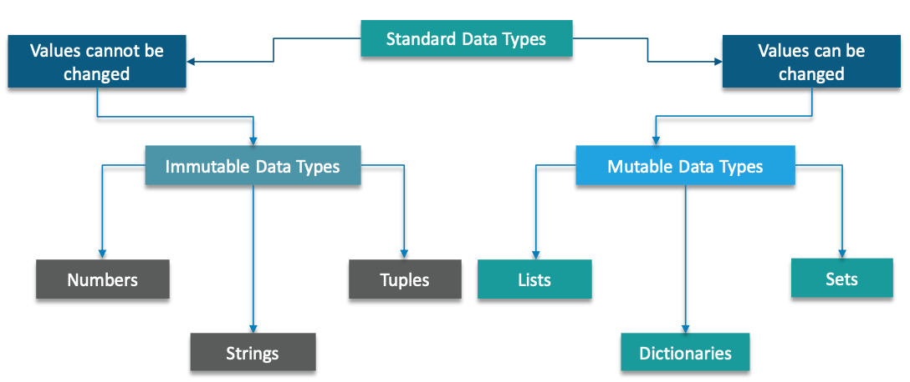

# Python Scripting Certification Training

### Course outline
1. Introduction to Python
2. Sequences and File Operations
3. Deep Dive - Functions, OOP, Modules, Errors and Exceptions
4. Introduction to NumPy and Pandas
5. Data visualization

### Python Interpreter
- Python Interpreter is a program that reads and executes code
- This includes source code, pre-compiled code and scripts
- Example: `help('for')`

### Standard Data Types

## Data Types

### Immtutable
#### Numeric data type
- Python supports three different numerical values
  - int (signed integer) e.g. 10
  - float (real numbers) e.g. 10.65
  - Complex Numbers e.g. 10+6j
- In Python you can represent numbers in multiple ways
  - Binary
  - Octal
  - Hexedecimal

#### String
- The continuous set of characters represented within quotation is called as String. Python allows for either pairs of single or double quotes. Python does not support a character type, these are treated as strings of length one
- Python cannot differentiate between single and double quotes

#### Tuple
- Tuple consists of a number of values separated by comma(s). It is enclosed with parenthesis. i.e. `(1,2,3.15,'Python')`
- Tuple can have objects of different data types, unlike Arrays in C.
