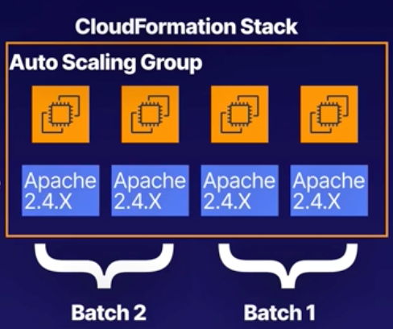

# CHAPTER 2<br>**Deployment, Provisioning, and Automation**

### Chapter outline
- Section Introduction
- `Demo` Deploying an Elastic Compute Cloud (EC2) Instance
- `HANDS-ON LAB` Create and Secure an EC2 Instance
- Understanding EBS Volumes
- What Is a Bastion Host?
- Exploring Elastic Load Balancer
- Understanding Elastic Load Balancer Error Messages
- `Demo` Deploying an Elastic Load Balancer
- `Demo` Understanding Elastic Load Balancer CloudWatch Metrics
- `Demo` Working with Elastic Load Balancer Access Logs
- Understanding Sticky Sessions
- Load Balancing Based on an IP Address
- Discovering EC2 Image Builder
- `Demo` Creating an AMI Using EC2 Image Builder
- Introducing CloudFormation
- `Demo` Provisioning AWS Resources Using CloudFormation
- `HANDS-ON LAB` Deploying an EC2 Instance with CloudFormation
- Troubleshooting CloudFormation
- `Demo` CloudFormation Errors
- Introducing CloudFormation StackSets
- CloudFormation Best Practices
- Exploring Blue/Green Deployments
- Understanding Rolling Deployments
- When to Use Canary Deployments
- Automating Tasks Using AWS Systems Manager
- `Demo` Implementing Automated Patching Using AWS Systems Manager
- `Demo` Using AWS Systems Manager EC2 Run Command
- Section Review: Deployment, Provisioning, and Automation Summary - Part 1
- Section Review: Deployment, Provisioning, and Automation Summary - Part 2


<br><br>

## `Demo` Deploying an Elastic Compute Cloud (EC2) Instance

1. Launch an EC2 Instance
    - Explore the options available.
    - Configure the security group to allow HTTP traffic.
2. Use a Bootstrap Script
    - Install http and create /var/www/index.html.
    - Navigate to Advanced Option, and enter the following bootsrap script below:

        ```sh
        #!bin/bash
        dnf update -y
        dnf install httpd -y
        echo "<html><body><h1>Hello Cloud Gurus</h1></body></html>" > /var/www/html/index.html
        systemctl start httpd
        systemctl enable httpd
        ```
3. Test Our Website
    - Access the website using the public IP address.
      - Open `EC2>Instances>Instances`
      - Check box of created instance and view details
      - Copy Public IP and access resource in browser.


<br><br>

## Understanding EBS Volumes

### What Is EBS?
- Storage volumes that you can attach to your EC2 instance.
- When you create EC2 instance, it has at least one EBS volume attached, and that is where your OS gets installed.<br>You can add more volumes
- You can use EBS the same way you would use any system disk:
  - Create a file system
  - Run a database
  - Run an operating system
  - Store data
  - Install applications

<br>

### EBS Features
- **Mission Critical**
  1. **Production workloads**<br>Designed for mission critical worloads.
  2. **High Availability**<br>Automatically replicated within a single Availability Zone to protect against hardware failures.
  3. **Scalable**<br>Dynamically increase capacity and change the type volume with no downtime or performance impact to your live system. 

<br>

### EBS Volume Types - Solid State Disk
- **General Purpose SSD `gp2`**
  - A balance of price and performance.
  - 3 IOP per GiB, up to a maximum of 16,000 IOPS per volume.
  - gp2 volumes smaller than 1TB can burst up to 3,000 IOPS.
  - Good for boot volumes or development and test applications which are not latency sensitive.

<br>

- **General Purpose SSD `gp3`**
  - Baseline of 3,000 IOPS for **any volume size** (1GB - 16TB)
  - Delivering up to 16,000 IOPS
  - 20% cheaper than `gp2`
  - Like `gp2`, they are good for boot volumes or development and test applications which are not latency sensistive.

<br>

- **Provisioned IOPS SSD `io1`**
  - The high performance option, and the most expensive.
  - Up to 64,000 IOPS per volume. 50 IOPS per GiB.
  - Use if you need more than 16,000 IOPS.
  - Designed for I/O intensive applications, large databases, and latency-sensitive workloads.

<br>

- **Provisioned IOPS SSD `io2`**
  - Latest generation.
  - Higher durability and more IOPS.
  - Similar to `io1` it is up to the same maximum of 64,000 IOPS per volume.
  - `io2` is the same prive as `io1`.
  - `io2` is more durable and more performant.
  - Up to 64,000 IOPS per volume. 500 IOPS per GiB (10x more than `io1`)
  - `io2` offers 99.999% durability instead of up to 99.8-99.9% offered by all other EBS solutions.
  - I/O intensive apps, large databases, and latency-sensitive workloads. Applications which need high levels of durability.

<br>

- **Provisioned IOPS SSD `io2 Block Express`**
  - Relatively new offering from AWS.
  - SAN (Storage Area Network) in the cloud.
  - Highest performance, sub-millisecond latency.
  - Uses EBS Block Express architecture.
  - 4x throughput IOPS and capacity of regular `io2` volumes.
  - Up to 64TB, 256,000 IOPS per volume.
  - 99.999% durability.
  - Great for the largest, most critical, high-performance applications like **SAP HANA**, **Oracle**, **Microsoft SQL Server** and **IBM DB2**.

<br>

### EBS Volume Types - Hard Disk Drive (Mb/s-Intensive)

- **Throughput Optimized HDD `st1`**
  - Low-cost HDD VOlume.
  - Baseline throughput of 40 MB/s per TB.
  - Ability to burst up to 250 MB/s per TB.
  - Maximum throughput of 500 MB/s per volume.
  - Ideal for frequently-accessed, throughput-intensive workloads (i.e. Big Data, data warehouses, ETL and log processing)
  - A cost effective way to store mountains of data.
  - **Cannot be a boot volume**

<br>

- **Cold HDD `sc1`**
  - Lowest cost option.
  - Baseline throughput of 12 MB/s per TB.
  - Ability to burst up to 80 MB/s per TB.
  - Max throughput of 250 MB/s per volume.
  - A good choice for colder data requiring fewer scans per day.
  - Good for applications that need the lowest cost and performance is not a factor. 
  - **Cannot be a boot volume**

<br><br>

### IOPS vs Throughput

|**IOPS**|**Throughput**|
|---|---|
|Measure the number of read and write operations per second|Measures the number of bits read or written per second (MB/s)|
|Important metric for quick transactions, low latency apps, transactional workloads|Important metric for large datasets, large I/O sizes, complex queries|
|The ability to action reads and writes very quickly|The ability to deal with large datasets|
|Choose Provisioned IOPS SSD (`io1` or `io2`)|Chose Throughput Optimized HDD (`st1`)|


<br><br><br>

## What is a Bastion Host?

**Bastion Host** - a public-facing instannce which enables you to SSH or RDP to your private instance from an untrusted network.


- A bastion host has a public IP address and is connected to the internet / untrusted network.
- It is security hardened with any unnecessary services removed to reduce the attack surface.
  
<br>

*Example scenario*


<br><br><br>

## Exploring Elastic Load Balancer
A load balancer distributes network traffic across a group of servers.


### Elastic Load Balancer Types:
- **Application Load Balancer**
  - HTTP/S
- **Network Load Balancer**
  - TCP and high performance option
- **Classic Load Balancer** (Legacy option)
  - HTTP/S and TCP
- **Gateway Load Balancer**
  - Allows you to load balance workloads for third-party virtual appliances wunning in AWS, such as:
    - Virtual applicances purchased using the AWS Marketplace
    - Virtual firewalls from companies like Fortiner, Palo Alto, Juniper, Cisco.
    - Intrusion detection or intrusion prevention (IDS/IPS) systems from companies like CheckPoint, Trend Micro, etc.

<br>

### 7 Layer OSI Model

|Layer|Functionality|
|**Layer 7**<br>Application| What the end user sees HTTP, web browser |
|**Layer 6**<br>Presentation| Data is in a usable format. Encryption, SSH |
|**Layer 5**<br>Session| Maintain connections and sessions |
|**Layer 4**<br>Transport| Transmit data using TPC and UDP |
|**Layer 3**<br>Network| Logically routes packets, based on IP address |
|**Layer 2**<br>Data Link| Physical transmits data based on MAC address |
|**Layer 1**<br>Physical| Transmits bits and bytes over physical devices |


<br>

### Application Load Balancer
- Used for load balancing HTTP/HTTPS traffic. They operate at Layer 7 (Application Layer) and are application-aware.
- They support advanced request routing to specific web servers based on the HTTP header.
- 

<br>

### Network Load Balancer
- Used for load balancing TCP traffic where extreme performance is required.
- Operating at Layer 4 (Transport Layer)
- Capable of handling millions of requests per second while maintaining ultra-low latencies.

<br>

### Classic Load Balancer
- Classic Load Balancer are the legacy option but may still appear in the exam.
- HTTP/S, supports layer 7-specific features such as, `X-Forwarded-For` headers and sticky sessions.
- Support Layer 4 (Transport Layer) load balancing for applciations that rely purely on the TCP protocol.

> `X-Forwarded-For` header
> Identify the originating IP address of a client connecting through a load balancer

### Gateway Load Balancer traffic flow
- **Inbound Traffic (From the Internet to Your Application)**
    - **Incoming Request**:
        - A request comes in from the internet to your VPC. This request first hits the Internet Gateway (IGW) if it’s coming from outside.
    - **Gateway Load Balancer Endpoint (GWLBE)**:
        - The request is then directed to the GWLBE in the public subnet. The GWLBE is a virtual interface that routes the traffic to the Gateway Load Balancer.
    - **Gateway Load Balancer (GWLB)**:
        - The GWLBE forwards the request to the GWLB. The GWLB then distributes the traffic to one of the firewall EC2 instances for inspection.
    - **Firewall EC2 Instance**:
        - The selected EC2 instance running the firewall software inspects the incoming traffic based on your security rules.
        - If the traffic passes the inspection, the firewall instance forwards it back to the GWLB.
    - **Forwarding to the Application**:
        - The GWLB then forwards the inspected and approved traffic directly to the application server in the private subnet (this is usually done without involving the GWLBE again).
    - **Application Receives the Request**:
        - The application server processes the request and generates a response.
- **Outbound Traffic (Response from Your Application to the Internet)**
    - **Application Response**:
        - The application server in the private subnet sends the response back to the GWLB.
    - **Traffic Inspection by Firewall**:
        - The GWLB forwards the response to a firewall EC2 instance for inspection, just as it did with the incoming request.
    - **Post-Inspection**:
        - After the firewall inspects and approves the outbound traffic, it sends the response back to the GWLB.
    - **Forwarding to the GWLBE**:
        - The GWLB forwards the approved traffic to the GWLBE.
    - **Internet Gateway (IGW)**:
        - The GWLBE then sends the traffic out of the VPC via the Internet Gateway (IGW), where it reaches the requester on the public internet.


#### Summary
- Inbound Traffic: <br>
    **Internet** → **IGW** → **GWLBE** → **GWLB** → **Firewall EC2 Instance** → **GWLB** → **Application Server**
- Outbound Traffic: <br>
    **Application Server** → **GWLB** → **Firewall EC2 Instance** → **GWLB** → **GWLBE** → **IGW** → **Internet**
- **Key Points**:
    - The GWLBE is primarily the entry and exit point for traffic between your VPC and the internet. It handles traffic routing to and from the GWLB.
    - The GWLB manages the distribution of traffic to your firewall instances, ensuring all traffic is inspected before reaching your application servers or leaving your VPC.
    - The firewall EC2 instances inspect traffic and enforce security policies.
    - This setup ensures that all traffic (both incoming and outgoing) is filtered and inspected, providing a secure environment for your application within the VPC.


<br><br><br>

## Understanding Elastic Load Balancer Error Messages

### Server-Side or Client-Side?
- **Server-side issues**, you will generally see a 5xx error code (either in the browser or in the ELB logs)
- Incoming HTTP request issues (client-side), we see 4xx error code.


### Common Errors
- `504 Gateway Timeout`<br>Target of the ELB failed to respond
  - The Elastic Load Balancer could not establish a connection to the target, e.g., the web server, database, or Lambda function.
  - Your application is having issues.
  - Identify where the application is failing, and fix the problem.
- `502 Bad gateway`<br>The target host is unreachable.
  - Check whether traffic is allowed from load balancer subnets to the targets, on the target port.
- `503 Service unavailable`<br>No registered targets.
  - Check you have targets registered.
- `400 Bad request`<br>Malformed request
  - Maybe the header is too long or there's something missing.
- `408 Request timeout`<br>The client did not send data before the idle timeout period expired. 
  - Lets say you are buyng tickets, and session is opened for 10 minutes, if server does not receive all necessary data within that period of time, it will cause **408 Request timeout** error. 
- `464`<br>The incoming request protocol is incompatible with the target group protocol.


<br><br><br>


## Understanding Sticky Sessions
### Load Balancing Algorithms
- **Round Robin**
  - The default load balancing algorithm, which distributes requests to each target in turn.
  - Great if the requests are similar in complexity and targets are all the same size.
- **Least Outstanding Requests (LOR)**
  - Sends requests to the web server with the least outstanding requests.
  - Great if requests vary in complexity, or your targets are not the same size.

### Sticky Sessions (aka Session Affinity)
  - Override the load balancing algorithm. A **session cookie** identifies that session belong to the same user.
  - Sticky Sessions **is not a load-balancing algorithm** but rather a session management feature that works in conjunction with one of the load-balancing algorithms.
  - While the cookie is valid, all requests from the same user are sent to the same target.
  - Use when your application stores session data locally on the web server. And you want to send requests that are part of the same session to the same target.


<br><br><br>

## Discovering EC2 Image Builder
### What is EC2 Image Builder?
1. **Create EC2 Images**<br>Virtual machine images (AMIs) and container images.
2. **Simple to use**<br>Graphical  interface
3. **Vlidate Your Image**<br>Test and validate the images, e.g., for security compliance and functionality, using AWS provided tests or your custom tests.

<br>

### Why Is It Cool?
- EC2 Image Builder automates the process of creating and maintaining your images.
- When software updates are available, Image Builder can automatically create a new image, run validation tests on the new image, and make it available it to the AWS regions of your choice.
- Image Builder allows you to share your AMIs with other AWS accounts that you own.

<br>

### How Does It Work?
1. **Base OS**
   - Provide a base OS image, e.g. Amazon Linux 2 AMI.
2. **Software**
   - Define software to install e.g. .NET, Node.js, Python, latest security updates, latest kernel, security settings.
3. **Test**
   - Run tests on the same new image. For example, does it boot correctly?
4. **Distribute**
   - Distribute the image to the regions of your choice (by default, the region you are operating in).

<br>

### EC2 Image Builder Terminology
- **Image Pipeline**<br>Defines the configuration and end-to-end process of building images. Including the image recipe, distribution and test settings.
- **Image Recipe**<br>Image Builder creates a recipe for each image, which can be shared, version controlled, and re-used.<br>Source image - e.g. Amazon Linux 2 AMI.<br>Build Components - e.g. Apache Tomcat.
- **Build Components**<br>The software components to include in the image.


<br><br><br>


## Introducing CloudFormation

**CloudFormation** is service to manage, configure and provision AWS Infrastructure as Code.
- Resources are defined using a CloudFormation template
- CloudFormation interprets the template and makes the appropriate API calls to create the resources you have defined
- CloudFormation supports JSON and YAML

<br>

### CloudFormation Benefits
- **Consistent**<br>Intrastructure is provisioned consistently, with fewer mistakes.
- **Quick and Efficient**<br>Less time and effort than configuring things manually.
- **Version Control**<br>You can version control and peer review your templates.
- **Free to Use**<br>Free to use but you are charged for the AWS resources you create using CloudFormation.
- **Manage Updates**<br>Can be used to manage updates and dependencies.
- **Rolling Bacl**<br>You can roll back to a previous state and delete entire stack as well.

<br>

### CloudFormation Process
- **YAML or JSON Template**<br>YAML or JSON template are used to desribe the end state of the infrastructure you are either provisioning or changing.
- **S3**<br>After creating the template, you upload it to CloudFormation using S3.
- **API Calls**<br>CloudFormation reads the template and makes the API calls on your behalf.
- **CloudFormation Stack**<br>The resulting set of resources that CloudFormation builds from your template is called a "stack".

> **Useful URLs**
>
> [Template Snippets](https://docs.aws.amazon.com/AWSCloudFormation/latest/UserGuide/CHAP_TemplateQuickRef.html)
>
> [AWS::Include Transform](https://docs.aws.amazon.com/AWSCloudFormation/latest/UserGuide/create-reusable-transform-function-snippets-and-add-to-your-template-with-aws-include-transform.html)

<br>

### CloudFormation Template Structure(YAML)
- **Parameters**<br>Input custom values
- **Conditions**<br>e.g. provision resources based on environment
- **Mappings**<br>Allows you to create custom mapping like Region-AMI
- **Transform**<br>Allows you to reference code located in S3, e.g., Lambda code or reusable snippets of CloudFormation code
- **Resources**<br>This section is mandatory and describes the AWS resources that CloudFormation will create


```yaml
AWSTemplateFormatVersion: "2010-09-09"
Description: "Template to create an EC2 instance"
Metadata:
  Instances:
  Description: "Web Server Instance"

# Use Parameters to define input values, like an environment type of prod or test.
Parameters: #input values
  EnvType:
    Description: "Environment type"
    Type: String
    AllowedValues:
      - prod
      - test

# You can test if a condition is true and use the result to determine a course of action.
Conditions:
  CreateProdResources: !Equals [ !Ref EnvType, prod ]

# Create a mapping between values (e.g., set values based on Region). 
Mappings:  #e.g. set values based on a region
  RegionMap:
    eu-west-1:
      "ami": "ami-Obdb1d6c15a40392c"

# Reference code from outside the main template. 
Transform: # include snippets of code outside the main template
  Name : 'AWS::Include'
  Parameters:
    Location: ' s3://MyS3BucketName/MyFileName.yaml'

# Define the AWS resources you are deploying.
Resources:
  EC2 Instance:
    Type: AWS::EC2::Instance
    Properties:
    Outputs:
  InstanceID:
    Description: "The Instance ID"
    Value: !Ref EC2Instance
      InstanceType: t3.micro
      ImageId: ami-Obdb1d6c15a40392c

# Useful information for CloudFormation to output, like the instance ID of a new instance. 
Outputs:
  InstanceID:
    Description: "The Instance ID"
    Value: !Ref EC2Instance
      InstanceType: t3.micro
      ImageId: ami-0bdb1d6c15a40392c
```

<br><br><br>

## Troubleshooting CloudFormation

### Overview
- Where to find error messages for CloudFormation
- Common error scenarios, including `UPDATE_ROLLBACK_FAILED`
- A failed rollback scenario
- Exam tips


### Finding CloudFormation Error Messages

1. **CloudFormation Console**:  
   - The first place to check for error messages is the CloudFormation console.
   - Each CloudFormation event includes a status, and you can view these to troubleshoot issues.
   
2. **Example**:  
   - In the console, if there’s an issue creating an EC2 instance, the **status reason** will show why CloudFormation failed.
   - Example error: *AMI does not exist* (Could be due to incorrect AMI name or using an AMI not available in the region).

<br>

### Common CloudFormation Failure Scenarios

1. **IAM Permissions**:
   - Many errors in AWS are due to insufficient permissions.
   - To create AWS resources (e.g., EC2 instances), the necessary permissions must be granted.  
   - **Tip**: Ensure permissions for the resources you're trying to create are correct.

2. **Resource Limits**:
   - Hitting a resource limit can cause a failure.
   - Example: If your template creates more EC2 instances than the region’s limit (e.g., default limit is 20), you’ll get a *Resource limit exceeded* error.

3. **Failed Rollback**:
   - If CloudFormation fails to complete a rollback, you'll see the `UPDATE_ROLLBACK_FAILED` error.
   - **Rollback**: CloudFormation automatically reverts to the previous state if an operation fails.

<br>

### Detailed Look: Failed Rollback Scenario

1. **Why might rollback fail?**  
   Rollback can fail if manual changes were made outside CloudFormation.  
   - Example: You manually modified the infrastructure (e.g., deleted a resource) that CloudFormation is unaware of.

2. **What to do if rollback fails**:
   - You need to fix the issue that caused the rollback failure before proceeding.
   - Example: If you’re rolling back to a database instance that no longer exists, you'll need to manually recreate that instance with the same properties.


<br><br><br>

## Introducing CloudFormation StackSets

### What are CloudFormation StackSets?
CloudFormation StackSets allow you to **Create**, **Delete**, and **Update** your CloudFormation stacks across multiple AWS accounts and regions using a single operation.

<br>

### Cross-Account Roles
1. In order to launch a CloudFormation stack in another AWS account, you wil need to use cross-account roles.<br>**Configure** IAM permissions using cross-account roles. 
2. In your **administration account**, create the IAM role: `AWSCloudFormationStackSetAdministrationRole`
3. In your **target accounts**, create the Service role: `AWSCloudFormationStackSetExecutionRole`
4. `AWSCloudFormationStackSetAdministrationRole` is allowed to assume `AWSCloudFormationStackSetExecutionRole` and provision resources in the target account.


### Permission configuration
**Administrator Account - IAM Policy**
- `AWSCloudFormationStackSetAdministrationRole` policy
Following policy allows the Administrator account to assume `"arn:aws:iam::*:role/AWSCloudFormationStackSetExecutionRole"` role.
  ```json
  {
    "Version": "2012-10-17",
    "Statement": [
        {
            "Action": [
              "sts:AssumeRole"
            ],
            "Resource": [
              "arn:aws:iam::*:role/AWSCloudFormationStackSetExecutionRole"
            ],
            "Effect": "Allow"
        }
    ]
  }
  ```

<br>

- **Administrator Account - Trust Relationship - Trust Policy**
This role allows CloudFormation in the administrator account to assume the `StackSetExecutionRole` role.
  ```json
  {
    "version": "2012-10-17",
    "Statement": [
        "Effect": "Allow",
        "Principal": {
            "Service": "cloudformation.amazonaws.com"
        },
        "Action": "sts:AssumeRole"
    ]
  }
  ```
<br>

**Target Account - Service Role Policy**

- `AWSCloudFormationStackSetExecutionRole` - Service Role
  
  Provides permission for specific CloudFormation actions. Define the action you are permitting in the target account. Scope for the type of resources you want to create using StackSet.
  ```json
  {
    "Version": "2012-10-17",
    "Statement": [
        {
            "Effect": "Allow",
            "Action":
              [
                "cloudformation:*",
                "s3:*",
                "sns:*",
                "ec2:*"
              ],
            "Resource": "*"
        }
    ]
  }
  ```

- **Trust Relationship - Trust Policy**

  Allows the Administrator account to call STS:AssumeRole and assume the AWSCloudFormationStackSetExecutionRole role.
  ```json
  {
    "Version": "2012-10-17",
    "Statement": [
        {
          "Effect": "Allow",
          "Principal": {
            "AWS": "arn:aws:iam::12345676789:root"
          },
          "Action": "sts:AssumeRole"
        }
    ]
  }
  ```

> **Trust configuration**
> When Account A (Administrator) needs to assume a role in Account B (Target) to provision resources, Account B’s role (the execution role) must trust Account A. This trust is configured using a trust policy.

<br>

## Resource Access Manager
- Resource Access Manager shares resources across AWS accounts.
- For example, EC2 instances, S3 buckets and EC2 Image Builder images.
- You  can share AWS resources with any other AWS account of your choice. Create a resource share, and then send an invitation to the account that you would like to share your resources with.
- After accepting the invitation, the account will have access to the shared resources.

<br><br><br>

## CloudFormation Best Practices
### Best Practices
- **IAM**<br>Control access to CloudFormation using IAM
- **Be Aware of Service Limits**<br>If you hit a limit, CloudFormation will fail to create your stack (i.e. 20 EC2 instances per region limit)
- **Avoid Manual Updates**<br>Manual changes create a mismatch between your stack template and the current state of the stack. This cause errors when you try to udpate or delete the stack.
- **Use CloudTrail**<br>Log call to CloudFormation using CloudTrail, so you have a trail of all changes, along with who made them.

<br>

### Stack Policy
- Specify a stack policy whenever you create a stack that has critical resources. 
- A stack policy is a JSON document that describes what update action can be performed on designated resource.
- Stack policies help to protect critical stack resources from unintentional updates and mistakes caused by human error.
- Example stack policy:
  
  ```json
  {
    "Statement": [
      {
        "Effect": "Allow",
        "Action": "Update:*",
        "Principal": "*",
        "Resource": "*"
      },
      {
        "Effect": "Deny",
        "Action": "Update:*",
        "Principal": "*",
        "Resource": "LogicalResourceID/ProductionDatabase"
      }
    ]
  }
  ```

  > Following policy (second part) prevent anyone from udpates on production database
- **Setting a stack policy**<br>When creating the stack in the AWS console, you can write it in directly or update it as a text file.


<br><br><br>

## Exploring Blue/Green Deployment
### What is a Blue/Green Deployment?
- 2 Identical Environemnts
- **Blue** is the  current version of our application
- **Green** is the new version of our application
- **Live traffic** - Blue<br>**Test traffic** - Green
- After testing is complete on the green environemnt, live traffic is directed to the green environment and the blue environemnt becomes deprecated.
- If something later goes wrong with the new version (that wasn't picked up in testing), you easily can roll back to the original version of your application.

### When would you use the Blue/Green Deployment Strategy
- **Introducing a New Version**<br>You are deploying a new version of your application.
- **Fast Rollback**<br>You want a simple and fast rollback process
- **Reduce risk**<br>You want to reduce risk and avoid outages.

<br><br><br>

## Understanding Rolling Deployments
### What is a Rolling Deployment

It allows you to make your changes in *batches* and deploy to *only a portion* of your environemnt, instead of all-or-nothing approach.

### Deploying Changes in an Existing Environemnt

e.g. An existing CloudFormation stack


- Our web servers are running a very old version of Apache
- We want to deploy the latest version
- We can use CloudFormation to deploy our change in batches using rolling deployment
- We can set a minimum number of services we want to keep in service - e.g. `2`
- We can set a maximum batch side - e.g. `2`



<br>

### Disadvantages of rolling deployment
- During the deployment, you will have old and new versions of your application running side by side.
- If deployment fails, you will need to redeploy the previous version to get back to your original configuration.

<br>

### When to use Rolling Deployment Strategy
- Cost effective, only maintaining a single environment, unlike a Blue/Green deployment
- If you don't mind operating in a mixed environemnt, i.e. with some instances running a new version of your application and others running an older version.


<br><br><br>

## When to Use Canary Deployments
### What is Canary Deployment
- Imagine that you have 10 servers behind Elastic Load Balancer
- With Canary deployment you deploy the new version to a samll number of web servers (i.e. 2)
- And you direct only a small proportion of custoemr traffic to the new version. (i.e. 10%)
- This allows you to test new version in production before fully committing.

- In case any issues discovered with new deployment, you can switch all traffic back to other 8 server, while you are fixing the problem.
- If there are no issues with the new version, deploy to the remaining servers, and direct all traffic to the new version.

### Benefits
- Canary deployment provide an early indication that something is wrong in your application.
- Reduces the risk of deploying new application version or changes when working with a production environment.
- Rolling back is easy, simply direct all customers back to the original version.