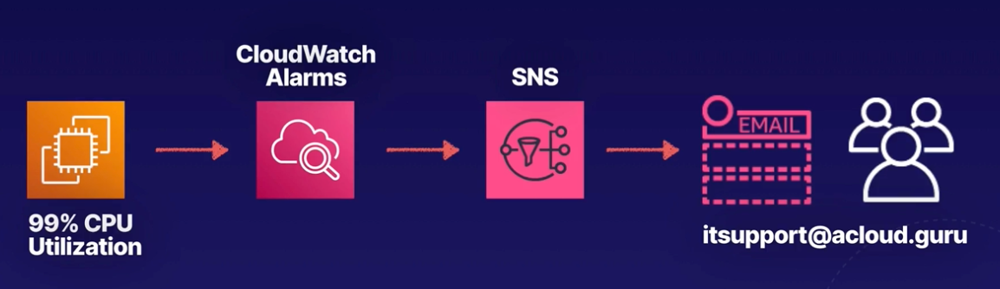
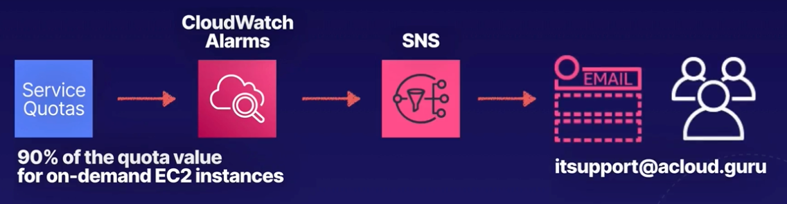
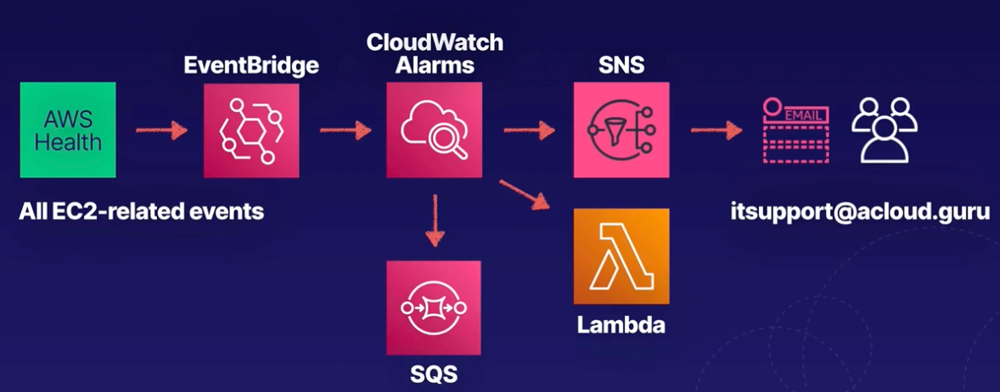

# CHAPTER 3 **Monitoring, Logging, and Remediation**

    ### Chapter Outline
    - Section Introduction
    - Introduction to CloudWatch
    - `Demo` Creating CloudWatch Dashboards
    - Exploring CloudWatch Logs
    - `Demo` Collecting Metrics and Logs Using the CloudWatch Agent
    - `Demo` Creating CloudWatch Metric Filters
    - `Demo` Exploring CloudWatch Logs Insights
    - `HANDS-ON LAB` Using CloudWatch for Resource Monitoring
    - Receiving Notifications with CloudWatch
    - `Demo` Creating CloudWatch Alarms
    - Introduction to CloudTrail
    - `Demo` Working with CloudTrail
    - AWS Config 101
    - `Demo` Using AWS Config
    - `HANDS-ON LAB` Auditing Resource Compliance with AWS Config
    - Remediation Using AWS Systems Manager and AWS Config
    - `Demo` Configuring Automatic Remediation Using AWS Systems Manager and AWS Config
    - What Is EventBridge?
    - `Demo` Using Amazon EventBridge
    - `Demo` Scheduling Automated Tasks Using EventBridge and AWS Config
    - `Demo` Exploring Health Dashboards
    - Section Review: Monitoring, Logging, and Remediation Summary - Part 1
    - Section Review: Monitoring, Logging, and Remediation Summary - Part 2
    

   

## Section Introduction
The main services covered in this section are:
- `CloudWatch`
- `CloudTrail`
- `EventBridge`
- `Config`
- `System Manager`
- `Health Dashboards`

   

## Introduction to CloudWatch
### What is CloudWatch
**Amazon CloudWatch** is a monitoring service to monitor the health and performance of your AWS resources, as well as the applications you run on AWS, and in your own data center.

 

### What Can CloudWatch Monitor?
- **Compute**
  - EC2 instances
  - Auto Scaling groups
  - Elastic Load Balancers
  - Route 53 health checks
  - Lambda
- **Storage and CDN**
  - EBS volumes
  - Storage Gateway
  - CloudFront
- **Database and Analytics**
  - DynamoDB tables
  - ElasticCache nodes
  - RDS instances
  - Redshift
  - Elastic Map Reduce
- **Other**
  - SNS topics
  - SQS queues
  - API Gateway
  - Estimate AWS charges

 

### The CloudWatch Agent
- The **CloudWatch Agent** - define your own metrics. You can install CloudWatch Agent on your own data centers.
- **CloudWatch Logs** allows yous you to monitor operating system and application logs.

 

### CloudWatch and EC2
#### Host-Level Metrics
- All EC2 instances send key health and performance metric to CloudWatch.
- Default EC2 host-level metric consist of CPU, network, dick and status check.
- Metrics are stored indefinitely.
- You can retrieve data from any EC2 or Elastic Load Balancer instance, even after it has been terminated.
#### Operating System-Level Metric
Memory usage, processes running on your instance, amount of free disk space, CPI idle time, etc.
- **By Default** EC2 does not send operating system-level metric to CloudWath
- **CloudWatch Agent** By installing the CloudWatch agent on your EC2 instances, you can collect operating system metrics and send them to CloudWatch.

### Metric Frequency
- By **Default**, EC2 sends metric data to CloudWatch in 5-minute intervals.
- For an **Additional charge**, you can enable **detailed monitoring** that sends metrics at 1-minute intervals.
- For **custom metrics**, the default is 1-minute intervals, and you can configure **high-resolution** metrics that are sent at 1-second intervals.

   

## Exploring CloudWatch Logs

**1. CloudWatch Logs Overview:**
   - CloudWatch Logs provides centralized logging for:
     - **Application logs** (e.g., Apache logs).
     - **System logs** (e.g., operating system logs on EC2).
     - **AWS service logs** (e.g., CloudTrail or Route 53).
   - Allows users to view, search, and filter logs based on error codes or messages (e.g., 404 status codes in Apache logs).
   - Can configure CloudWatch Logs to send notifications when error rates exceed a predefined threshold.
   - Useful for monitoring and troubleshooting applications by analyzing system or application log files.
   - Logs can be customized for specific phrases, error codes, or patterns relevant to the user’s application.

**2. CloudWatch Logs Features:**
   - **Monitor in near real-time:** Ability to monitor log files in near real-time.
   - **Search and filter:** Search logs based on specific error codes or patterns.
   - **Notifications:** Configure notifications for log events based on thresholds.
   - **Customization:** Customize monitoring for specific application needs.

**3. Key Components of CloudWatch Logs:**

   - **Log events:** Each log event consists of an event message and a timestamp.
   - **Log stream:** A sequence of log events from a specific source (e.g., Apache log from a host). Must belong to a log group.
   - **Log group:** A collection of log streams with centralized management for retention, monitoring, and access control settings.
     - No limit on the number of log streams in a log group.

**4. Retention Settings:**
   - By default, CloudWatch Logs are retained indefinitely.
   - Custom retention periods can be set, ranging from `1 day - 10 years`.
   - Expired log events are automatically deleted.
   - Retention settings are applied at the log group level, avoiding the need to configure settings for each EC2 instance individually.

**5. CloudWatch Logs Scenario:**
   - Example: Two EC2 instances running Apache send log events from Apache logs to CloudWatch.
   - A sequence of log events from the same source forms a **log stream**.
   - Multiple log streams (e.g., from different EC2 instances) can be managed centrally as a **log group**.
   - Centralized management allows for easier control of retention, monitoring, and access settings across multiple log streams.

   

## Receiving Notifications with CloudWatch

### CloudWatch Alarms
You can create an alarm to monitor any CloudWatch metric in your account.
- **Alarms** This can include EC2 CPU utilization, Elastic Load Lancer latency, or even the chanrges on your AWS bill.
- **Thresholds** You can set appropriate thresholds to trigger the alarms and actions to be taken if an alarm state is reached.
- Use Case An alarm that sends an SNS notification or executes an Auto Scaling policy if CPU utilization exceeds 90% on your EC2 instance for more than 5 minutes.

 

### SNS Notifications
- CloudWatch integrates with SNS to send email notifications.

  
  - Event recorded (CPU usage exceeds 90% for 5 minutes)
  - CloudWatch send trigger to SNS service
  - SNS service sends an email to support team, notifying them about high CPU unilization event
  
 

### Service Quotas
- CloudWatch can be used to monitor your service quotas/limits and notify you if you are about to reach the limit.
- Use the Service Quotas console to configure a CloudWatch alarm to send an SNS notification.

  

 

### Health Events
- **AWS Health** (the API behind Personal Health Dashboard) can send health events to **EventBridge**, triggering a CloudWatch Alarm, which can trigger an action.

  