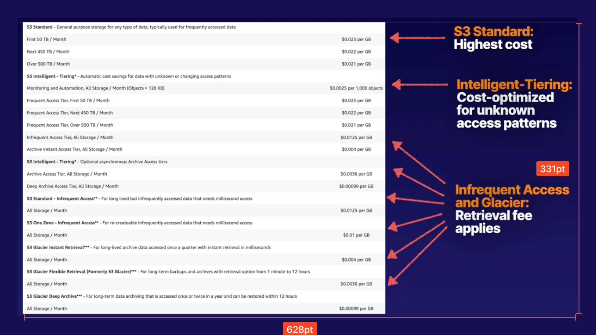

# CHAPTER 4 Storage and Data Management

### Chapter Outline
- Section Introduction
- S3 101
- Reviewing S3 Storage Classes
- `Demo` Creating an S3 Bucket
- Working with S3 Lifecycle Policies
- Protecting Data from Accidental Deletion Using S3 Versioning
- Protecting Data from Accidental Deletion with MFA Delete
- S3 Encryption
- `Demo` Configuring Encryption on an S3 Bucket
- `Demo` Configuring Static Website Hosting Using S3
- Introduction to Elastic File System (EFS)
- `Demo` Working with EFS
- Advanced EFS
- EFS and Multi-AZ Applications
- Introducing Athena
- `Demo` Working with Athena
- Introducing Amazon OpenSearch Service (Formerly Amazon Elasticsearch Service)
- OpenSearch Deployment Best Practices
- `Demo` Creating an Amazon OpenSearch Service Domain
- `HANDS-ON LAB` Create a Static Website Using Amazon S3
- `Demo` Leveraging Presigned URLs with S3
- Restricting S3 Accessibility with IP Addresses
- Introducing S3 Inventory
- `Demo` Using S3 Inventory
- `Demo` Using AWS Config with S3
- Overview of Storage Gateway
- Introducing AWS Backup
- `Demo` Using AWS Backup

   

## Section Introduction
The main services covered in this section are:
- S3
- Elastic File System
- Athena
- Amazon OpenSearch
- Storage Gateway

  

## S3 101
### What is S3?
- `S3` stands for Simplate Storage Service
- **Object Store** S3 provides secure, durable, highly-scalable object store.
- **Simple** Amazon S3 is easy to use, with a simple web services interface.
- **Scalable** S3 allows you to store and retrieve any amount of data from anywhere on the web at a very low cost.
- S3 is object-based storage Manages data as objects rather than in file systems or data blocks.
- You can upload any type of file to S3(i.e. photos, videos, code, documents, text files)
- It cannot be used to run operating system or database.

 

### S3 Basics
1. **Unlimited Storage** The total volume of data and the number of objects you can store is unlimited
2. **Objects Up to 5 TB in Size** S3 objects can range in size from a minimum of 0 bytes to a maximum of 5 terabytes
3. **S3** Store files in buckets (similar to folders)

 

### Working with S3 Buckets
1. **Universal Namaspace** All AWS accounts share the same S3 namespace. Each S3 bucket name is globally unique.
2. **Example S3 URLS**:
   - https://bucket-name.s3.Region.amazonaws.com/key-name
   - https://fayecloudguru.s3.us-east-1.amazonaws.com/Ralphie.jpg
3. **Uploading Files** When you upload a file to an S3 bucket, you receive an HTTP 200 code if the uplaod was successful.

 

### S3 Is a Key0Value Data Store
- **Key** The name of the object, for example: `Ralphie.jpg`
- **Value** This is the data itself, which is made up of a sequence of bytes.
- **Version ID** Important for storing multiple versions of the same object.
- **Metadata** Data about data you are storing, e.g. content-type, last-modified, etc
  
 

### A Safe Place
- S3 is a safe place to store your files
- The data is spread across multiple devices and facilities to ensure availability and durability
- **Highly Available** is all about the service being available when you need it. Built for 99.5%-99.99% service availability depending on the S3 tier
- **Hihly Durable** is all about your data stored safely and not getting lost or corrupted. Designed for 99.999999999% (11 9's) durability for all data store in S3.

 

### S3 Characteristics
- **Tiered Storage** S3 offers a range of storage classes designed for different use cases.
- **Lifecycle Management** Define rules to automatically transition objects to cheapter storage tier or delete objects that are no longer required after a set period of time.
- **Versioning** With versioning, all versions of an object are stored and can be retrieved, including deleted objects.

 

### Secure Your Data
1. **Server-side Encryption** You can set default encryption on bucket to encrypt all new objects when they are stored in the bucket
2. **Access Control List (ACLs)** Define which AWS accounts or groups are granted access and the type of access. You can attack S3 ACLs to individual objects within a bucket.
3. **Bucket Policies** S3 bucket policies specify what actions are allowed or denied (e.g. allow user Alice to PUT but not DELETE objects in the bucket)

   

## Reviewing S3 Storage Classes
### `S3 Standard`
- **High Availability and Durability** Data is stored redundantly across multiple devices in multiple dacilities (>=3 AZs)
   - 99.99% Availability
   - 99.999999999% Durability (11 9's)
- **Designed for Frequent Access** Perfect for frequently accessed data
- **Suitable for Most Workloads**
   - The default storage class
   - Use cases include websites, content distribution, mobile and gaming applications, and big data analytics

 

### `S3 Standard-Infrequent Access (S3-IA)`
- **Rapid Access** Used for data that is accessed less frequently but requires rapid access when needed
   - 99.9% Availability
   - 99.999999999% Durability (11 9's)
- **You Pay to Access the Data** There is a low per-GB storage price and a per-GB retrieval fee
- **Use Cases** Great for long-term storage, backups, and disaster recovery files. Minimum storage duration: 30 days

 

### `S3 One Zone-Infrequent Access`
- Like `S3-IA`, but data is stored redundantly within a single AZ.
  - 99.5% Availability
  - 99.999999999% (11 9's) Durability
- Cost 20% less than regular S3-IA
- Great for long-lived, infrequently accessed, non-critical data
- Minimum storage duration: 30 days

 

### `Glacier` Options
  - Glacier is very cheap storage
  - Optimized for data that is very infrequently accessed
  - You pay each time you access your data
  - Use only for archiving data

1. `Glacier Instant Retrieval` Long-lived data, accessed approximately once per quarter, and needs millisecond retrieval time. 
   - 99.9% Availability
   - 99.999999999% Durability
   - Minimum storage duration: 90 days
2. `Glacier Flexible Retrieval` Long-term data archiving that occasionally needs to be accessed within a few hours or minutes.
   - 99.99% Available
   - 99.999999999% Durable
   - Minimum storage duration: 90 days
3. `Glacier Deep Archive` Long-term archiving for rarely accessed data
   - 99.99% Availability
   - 99.999999999% (11 9's) Durability
   - Default retrieval time **12 hours**
   - Good for financial records that may be accessed once or twice per year.
   Minimum storage duration: 180 days.

 

### `S3 Intelligent-Tiering`
- 2 tiers: **frequent** and **infrequent** access
- Automatically moves your data to the most cost-effective tier based on how frequently you access each object.
- Optimized Cost Added monthly fee of $0.0025 per 1000 objects.
- 99.9% Availability
- 99.999999999% (11 9's) Durability

 

### Relative Storage Costs

   

## Working with S3 Lifecycle Policies
### What are S3 lifecycle policies?

A cost-effective way to store your files in S3.

- **Save Money** Ensure your files are stored using the most cost-effective S3 option throughout their lifecycle
- **Lifecycle Rules** Use lifecycle rules to tell S3 to transition objects to less expensive storage classes, archive them or delete them
- *Use Case* Great for objects with a well-defined lifecycle, e.g. log files, which may not be useful once they reach a certain age

 

### Examples
- Transaction logs Transition log files to an Infrequent Access stoage class 90 days after you create them
- Archive Archive objects to Glacier, or Glacier Deep Archive 1 year after creating them
- Expiry Date Configure objects to expire 1 year after creating them - S3 will auto-delete expired objects on your behalf
- Housekeeping S3 buckets which have Server Access Loggins enabled can accumulate large log files over time. This is where you log all your requests to your S3 buckets. Once logs reach a certain age, you can set an expiry date and delete them for you. 