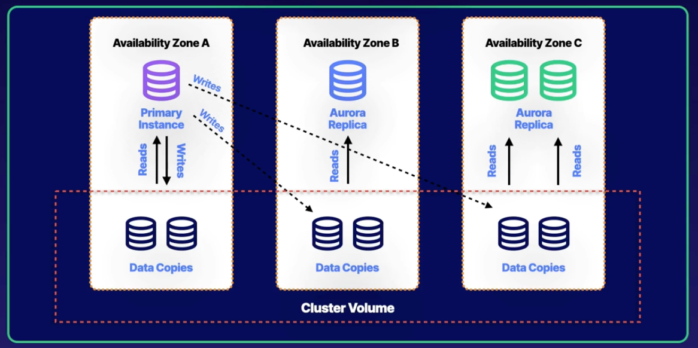

# CHAPTER 5 Reliability and Business Continuity

### Chapter Outline
- Section Introduction
- Elasticity and Scalability 101
- Introducing AWS Auto Scaling
- `Demo` Creating Auto Scaling Plans
- Troubleshooting Auto Scaling Issues
- Vertical Scaling vs. Horizontal Scaling
- Using AWS ElastiCache
- Aurora 101
- `HANDS-ON LAB` Creating an Amazon Aurora RDS Database (MySQL Compatible)
- Understanding Aurora Auto Scaling Options
- RDS and Multi-AZ Failover
- RDS and Read Replicas
- `HANDS-ON LAB` Deploy an Amazon RDS Multi-AZ and Read Replica in AWS
- `Demo` Creating and Encrypting RDS Snapshots
- Differentiating Single Availability Zones vs. Multi-AZ Deployments
- Implementing Fault Tolerant Workloads Using Amazon Elastic File System (EFS)
- Building Fault Tolerance Using Elastic IPs
- Readying for Disaster Recovery
- AWS Service Maintenance Windows
- Configuring S3 Cross-Region Replication
- Implementing Loosely Coupled Architectures with SQS
- `Demo` Automating EBS Snapshots Using Data Lifecycle Manager
- Using DynamoDB Streams for Backing Up Your Table to Another Region

   

## Section Introduction
- Elasticity and Scalability
- Auto Scaling in AWS
- Horizontal and Vertical Scaling
- ElastiCache
- RDS
- High Availability
- Fault Tolerance and Disaster Recovery

  

## Elasticity and Scalability 101
### What is Elasticity?
- Stretching and retracting your infrastructure based on demand(**Short term**)
- Allow you to **pay as you go**
- Typically used during a short period of time, hours or days

### What is Scalability?
- Building your infrastructure to meet your demands over **longer time**

### AWS Services: ELasticity vs Scalability
||**Elasticity**|**Scalability**|
|---|---|---|
|**EC2**|Configure Auto Scaling to increase and decrease the number of EC2 instance|Increase instance sizes Use Reserved instances|
|**DynamoDB**|Increase/decrease IOPS based on traffic spikes|Unlimited amount of storage|
|**RDS**|Can't scale on demand|Increase instance size Add number of instances|
|**Amazon Aurora**|Autoscale up or down to meet varying demand on the database|Modify the instance type|

   

## Introducing AWS Auto Scaling

> 

### What is AWS Auto Scaling?
An AWS Service which allows you to configure pland to automatically scale your resources
- EC2 Auto Scaling launches and terminates instances dynamically
- Scaling is horizontal (scales out)
- Provides elasticity and scalability
- Responds to EC2 status checks and CloudWatch metrics
- Can Scale based on demand (performance) or on a schedule
- Auto scaling group definescollection of EC2 instances that are scaled and managed together

### Understanding Scaling Plans
- **Scaling Plans** A set of directions for scaling your resources.
- **Scaling Strategy** (within scaling plan) Instructs AWS Auto Scaling on how to optimize resources in your scaling plan for availability, cost or both.
- There are three types of scaling available:
    - **Dynamic Scaling** - automatically scales based on demand
    - **Predictive Scaling** - uses Machine Learning to predict
    - **Scheduled** - scales based on a schedule

### Creating Scaling Plans
- **Cloud Formation Scripting** **Find scalable resources** through existing CloudFormation templates
- **EC2 Auto Scaling Group** **Select one or more** existing EC2 Auto Scaling groups to be included in your scaling plans
- **Tagged Resources** **Search for scalable resources** using the tags applied to them

### Scalable AWS Services
|Service|Description|
|---|---|
|**EC2**|Maintain an Auto Scaling group through launching or terminating instances|
|**DynamoDB**|Enable tables or secondary indexes to increase or decrease read and write capacity|
|**Elastic Container Services**|Adjust ECS service count up/down|
|**Aurora**|Automatically adjust the number of read replicas in the Aurora DB cluster|

### Health Checks
- EC2 = EC2 status checks
- ELB = Uses the ELB health checks in addition to EC2 status checks
  
### Health check grace period
- How long to wait before checking the health status of the instance
- Auto Scaling does not act on health checks until grace period expires

### Types of policies
- **Target tracking scaling** - Increase and decrease the current capacity of the group based on an Amazon Cloud Watch metric and a target value. E.g., keeping the aggregate CPU usage of your ASG at 70%
- **Step scaling** - Increase and decrease the current capacity of the group based on a set of scaling adjustments, known as step adjustments, that vary based on the size of the alarm breach
- **Simple scaling** - Increase and decrease the current capacity of the group based on a single scaling adjustment, with cooldown period between each scaling activity

### Auto Scaling - Monitoring
#### Group metrics (ASG)
- Data points about the Auto Scaling group
- 1-minute granularity
- No charge
- Must be enabled
#### Basic monitoring (Instances)
- 5-minute granularity
- No Charge
#### Detailed monitoring (Instances)
- 1-minute granularity
- Charges apply

### Additional Scaling Settings
- **Cooldowns** - Used with simple scaling policy to prevent Auto Scaling from launching or terminating before effects of previous activities are visible. Default value is 300 seconds (5 minutes)
- **Termination Policy** - Controls which instances to terminate first when a scale-in event occurs 
- **Termination Protection** - Prevents Auto Scaling from terminating protected instances
- **Standby State** - Used to put an instance in the InService state into the Standby state, update or troubleshoot the instance
- **Lifecycle Hooks** Used to perform custom actions by pausing instances as the ASG launches or terminates them
- Use case:
    - Run a script to download and install software after launching
    - Pause an instance to process data before a scale-in (termination)

   

## Trhoubleshooting Auto Scaling Issues
### Common Issues with Auto Scaling
1. Auto Scaling Group not found
2. Auto Scaling Service not enabled in your account (common with accounts enrolled within AWS Organization or may have active service control policies preventing you from the use of the service)
3. Auto Scaling config not working correctly

### Compute/Storage Issues
1. Invalid EBS device mapping
2. Instance type not compatible in AZ
3. Attempting to attach an EBS block device to an instance-store AMI
4. AZ no longer supported

### Security Issues
1. Associated key pair does not exist
2. Security group does not exist

   

## Vertical vs Horizontal Scaling
### Vertical vs. Horizontal Scaling: Real-World Analogy
- Imagine planning a trip with friends:
  - **Vertical Scaling**: Booking a larger house to accommodate everyone. In computing, this equates to upgrading a machine’s capacity to handle increased demand.
  - **Horizontal Scaling**: Booking multiple houses to share the group. This method distributes the load across several instances, balancing demand.

### Vertical Scaling
- Involves increasing the capacity of a single system to handle greater load.
- Technical resources that might be upgraded include **CPU, memory, storage, and disk I/O**.
- **Example with AWS EC2**: To vertically scale, increase the instance size, adding more compute power to a single EC2 instance.
- **Example with AWS RDS**: Increase the database instance size to provide more processing capacity.

### Horizontal Scaling
- Entails adding multiple systems or instances to share the load.
- Implements **load balancing**, **Auto Scaling groups**, and **multi-availability zones** to manage demand.
- **Example with AWS EC2**: Horizontally scale by configuring an Auto Scaling group to add instances as demand increases.
- **Example with AWS RDS**: Implement read replicas to share read traffic, enhancing overall system performance.

### AWS Service Application
- **EC2**:
  - *Vertical Scaling*: Increase instance size.
  - *Horizontal Scaling*: Configure Auto Scaling groups to add instances dynamically.
- **RDS**:
  - *Vertical Scaling*: Increase the database instance size.
  - *Horizontal Scaling*: Create read replicas for distributing read traffic.

   

## Using AWS ElastiCache
### **What is AWS ElastiCache?**
   - **Definition** AWS ElastiCache is a managed caching service that allows users to deploy, scale, and manage in-memory data caches in the cloud, facilitating quick access to the most frequently requested data.
   - **Purpose** ElastiCache improves performance by storing critical, frequently accessed data in-memory, reducing the load on databases and enhancing response times.

 

### **Understanding Caching**
   - **Example** Similar to a barista quickly answering frequently asked questions, caching serves commonly accessed data without needing to query the database each time.
   - **Cache Hit** When data is found in ElastiCache, it’s quickly returned to the application.
   - **Cache Miss** If data is not found in ElastiCache, the application retrieves it from a database (e.g., RDS), adding latency.

 

### **Benefits of Using ElastiCache**
   - **Improved Latency and Throughput** Ideal for read-heavy applications like social networking, gaming, and media sharing.
   - **Enhanced Application Performance** Stores critical data in memory, speeding up data retrieval for I/O-intensive queries and computationally heavy processes (e.g., machine learning models).

 

### **Types of ElastiCache Engines**
   - `Memcached`
     - Multithreaded and suitable for distributed caching.
     - Does not support snapshots or replication.
   - **Redis**:
     - Supports advanced data structures, snapshots, and replication, but no multithreading is available.
     - Offers more functionality for applications requiring persistent storage.
   - Both engines support **data partitioning** and **sub-millisecond latency**.

 

### **Launching ElastiCache**
   - **Configuration Steps**:
     1. Select the cache engine (Redis or Memcached) and define cluster settings.
     2. Configure node type and replica count.
     3. Set up multi-AZ deployment if needed and configure security groups.
     4. Enable inbound traffic, connect to the cluster, and load data.

 

### **Monitoring ElastiCache**
   - **Key Metrics**:
     - **CPU Utilization**: If CPU usage exceeds thresholds, consider scaling out with additional nodes.
     - **Swap Usage**: If swap usage surpasses 50 MB, allocate more memory.
     - **Evictions**: Address cache evictions by adding nodes or increasing node size. If non-expired items are being removed from the cache, either add additional nodes or increase the size of the nodes to accommodate the data.
     - **Concurrent Connections**: High connection counts may indicate issues with application access to the cache.

   

## Aurora 101
### **What is Aurora?**
   - **Definition**: Aurora is Amazon's proprietary, MySQL- and PostgreSQL-compatible relational database designed to offer high speed, performance, and scalability.
   - **Reliability**: Aurora provides a fault-tolerant, self-healing storage system, reducing the risk of data loss and enhancing durability.
   - **Positioning**: Aurora combines the power of commercial databases with the ease of open-source solutions.

 

### **Aurora Scaling**
   - **Cluster Volumes** Aurora’s data is distributed across multiple Availability Zones through cluster volumes
   - **Storage Auto Scaling** MySQL- and PostgreSQL- compatible database engines are customized to take advantage of fast distributed storage, which grows as needed up to 128TiB.
   - **Self-Healing Storage** Data is replicated across multiple zones, and disks are continuously scanned and repaired automatically, ensuring reliability.
   - **Cache Warming** Aurora pre-populates its in-memory page cache with frequently accessed queries, optimizing read performance during provisioning.

 

### **Reliability and Business Continuity**
   - **Database Clustering** Aurora distributes data across three Availability Zones, ensuring redundancy and high availability.
      - **Primary and Replicas** The primary instance is located in one zone, with replicas in others. Each replica reads from local data copies, while the primary instance manages write operations across zones.
   - **Cluster Volume** Defined by data copies in each Availability Zone, it enables high availability by allowing each replica to access its respective data copy.

 

### **Maintenance - Aurora 100% Utilization**
   - **Handling Write Bottlenecks** To address high write utilization, **scale up** by increasing the instance size.
   - **Handling Read Bottlenecks** For read-related issues, **scale out** by adding more read replicas.

 

### **Aurora Serverless**
   - **Overview**: Aurora Serverless automatically adjusts capacity to meet application demands, providing scalability for workloads that are unpredictable or infrequent.
   - **Features**: Supports key Aurora features, including multi-Availability Zone deployments, read replicas, and global databases.
   - **Ideal Use Cases**: Suitable for applications needing high availability with unpredictable load patterns.

   

## Understanding Aurora Auto Scaling Options
### **What is Aurora Auto Scaling?**  
   - Aurora Auto Scaling is a feature for **automatic addition/removal of Aurora replicas** based on **defined metrics**, enhancing the Aurora database’s ability to manage sudden read workload spikes.
   - This feature supports **MySQL and PostgreSQL-compatible Aurora** clusters, adjusting replicas as workload increases or decreases. Only replicas added through auto scaling will be removed when demand drops.

 

### **Auto Scaling Policy & Metrics**  
   - To configure Aurora Auto Scaling, a **Auto Scaling Policy** must be created.
   - Aurora Auto Scaling leverages **Amazon CloudWatch metrics**, tracking targets like **Average CPU Utilization of Aurora Replicas** or **Average connections od Aurora Replicas**.
   - Aurora then adjusts replicas to maintain these values as close to the **specified targets** as possible.
   
 

### **Target Tracking Options**  
   - You specify the **Target value** in percentage (e.g. `80%`).
   - **Target Metric** Choose between:
     - `Average CPU utilization of Aurora Replicas`
     - `Average connections of Aurora Replicas`
   - **Scale in**: Enable to allow this Auto Scaling policy to remove Aurora Replicas. Aurora Replicas created by you are not removed by Auto Scaling.
   - **Cooldown Period**: Default cooldown is **300 seconds** (adjustable), limiting the time between scaling actions (**in** or **out**).
   - **Replica Count Limits**: Set **minimum and maximum replica limits** (up to 15 replicas) to control the auto scaling range.

 

### **Example Scenario**  
   - If an **Aurora cluster** with a **primary instance and one replica** has an auto scaling policy with a target of **5,000 average connections**:
     - **Scaling Up**: When the average number of connections exceeds 5,000, Aurora Auto Scaling adds a new replica.
     - **Scaling Down**: If connections drop below 5,000, Aurora removes only the replicas it created.

   

## RDS and Multi-AZ Failover
### **Purpose of Multi-AZ in RDS**
   - **Disaster Recovery**: Multi-AZ creates a standby copy of the **primary database** in a separate Availability Zone (AZ), providing redundancy and automatic failover in case of **instance failure** or **AZ outage**.
   - **Automatic Failover**: AWS manages failover automatically by updating the DNS endpoint to point to the standby instance in the available AZ.

 

### **Replication Methods by Database Engine**
   - `MySQL`, `Oracle`, and `PostgreSQL`: Use **synchronous physical replication** to keep standby data up-to-date with the primary instance (data written to backup at the same time as write event to primary).
   - **SQL Server**: Utilizes **logical replication** and **native mirroring** for synchronization, maintaining the standby instance in real time (Replication happens after transaction to primary was completed).

 

### **How Failover Works**
   - In case of a disaster (e.g., **local weather events**), RDS detects the issue and **re-routes traffic to a standby instance** in a different AZ by updating the DNS endpoint. 
   - **Note**: Multi-AZ is **not for performance improvements** but solely for disaster recovery. Use **read replicas** to scale and improve performance.

 

### **Advantages of Multi-AZ Failover**
   - **High Availability**: Protects data persistence and database uptime during outages and natural disasters.
   - **Backups & Restores**: Reduces the chance of **downtime** by managing backups and restores on the **standby instance** instead of the primary, preventing I/O suspension on the main database instance.

   

## RDS and Read Replicas
### What are Read Replicas?
- **Read replicas** are read-only copies of a database.
- They leverage built-in replication to **scale read-heavy workloads**.
- Help offload read requests from the primary database, allowing it to focus on **data storage and persistence**.

> Read replicas are read-only copies of your database

 

### When to Use Read Replicas
- **Scaling**: To extend beyond the compute and I/O limits of a single database instance.
- **Maintenance and Backup**: Allows uninterrupted read traffic while the primary database undergoes maintenance or backups.
- **Business Reporting**: Useful for running **business reporting queries** on read replicas, preserving the primary instance's performance.

 

### Supported RDS Engines
- **MySQL, PostgreSQL, MariaDB, SQL Server**: Use native synchronization replication for updates.
- **Amazon Aurora**: Utilizes a virtualized SSD-backed storage layer, which allows lower costs by sharing the primary instance's storage with the replicas.

 

### Creating and Connecting to Read Replicas
- **Creating**: A snapshot of the primary database is taken. 
  - With **Multi-AZ enabled**, the snapshot uses the secondary database, minimizing performance impact.
  - Without **Multi-AZ**, the snapshot affects the primary database briefly (~1 min).
- **Connecting**: Each read replica is assigned a unique **DNS endpoint** and can be accessed via the AWS Console or CLI.

   

## Differentiating Single Availability Zones vs. Multi-Availability Zone Deployments

### Overview of Single and Multi-AZ Deployments
- **Single Availability Zone (AZ)**: All resources are hosted in a single AZ, which minimizes cost but has limited fault tolerance.
- **Multi-Availability Zone (Multi-AZ)**: Resources are distributed across multiple AZs to enhance fault tolerance and availability.

### Key Considerations
- **Fault Tolerance**: 
  - Important for applications that need high availability during failures.
  - Consider if components should be replicated across multiple AZs to prevent service disruption.
- **Cost**:
  - Single AZ can reduce expenses, suitable for less critical applications.
- **Traffic Demand & Availability**:
  - Multi-AZ deployments can help meet high traffic demands by distributing the load and providing resilience.

### Factors for EC2 and Auto Scaling
- **Single AZ Deployment**:
  - Suitable for **non-critical workloads** (e.g., development or testing).
  - Offers **low fault tolerance**, **low availability**, and **lower cost**.
- **Multi-AZ Deployment**:
  - Offers **automatic traffic distribution** across AZs via Elastic Load Balancers.
  - Ensures **high availability** and **fault tolerance** for production environments.

### Factors for RDS
- **Single AZ Deployment**:
  - Best for **non-critical workloads**; however, it presents a **single point of failure**.
- **Multi-AZ Deployment**:
  - Provides **limited downtime** during failures.
  - Prevents interruptions for backups, patches, or upgrades, maintaining consistent availability.
