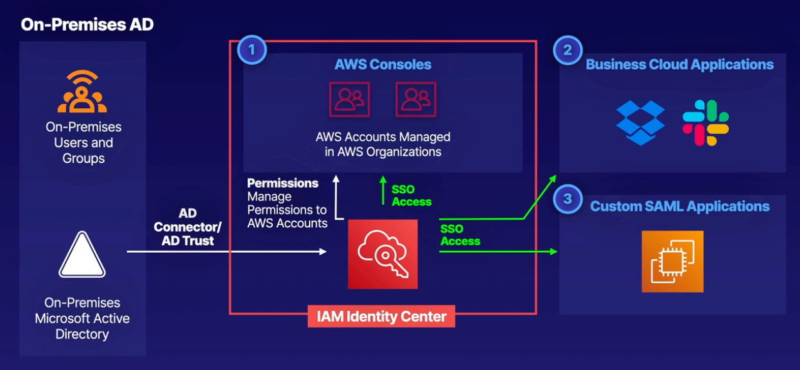
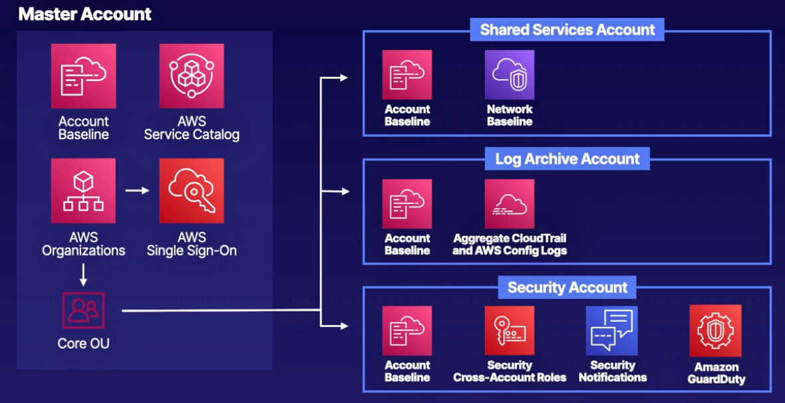

# CHAPTER 6<br>Security and Compliance

### Chapter Outline
- Section Introduction
- Compliance on AWS
- Understanding Distributed Denial of Service (DDoS)
- AWS Marketplace Security Products
- IAM Refresh
- `HANDS-ON LAB` Introduction to AWS Identity and Access Management (IAM)
- `Demo` Creating Custom IAM Policies and Roles
- `Demo` Enabling MFA and Reporting with IAM
- Introducing AWS Identity Center
- Auditing and Troubleshooting Access Issues
- AWS Inspector vs. Trusted Advisor
- Introducing AWS Organizations
- Service Control Policies
- Securing Multiple Accounts with AWS Control Tower and Organizations
- Security Token Service (STS)
- AWS Key Management Service (KMS)
- AWS Certificate Manager
- AWS Web Application Firewall (WAF)
- `Demo` Configuring AWS Web Application Firewall (WAF)
- Differentiating Dedicated Instances vs. Dedicated Hosts
- Using AWS Systems Manager Parameter Store
- Understanding AWS Service Quotas
- Reviewing the AWS Shared Responsibility Model
- Protecting Logs within CloudTrail
- `Demo` Introducing AWS Security Hub
- Exploring Amazon GuardDuty
- `Demo` Working with Amazon GuardDuty
- `Demo` Securely Storing Secrets Using AWS Secrets Manager

<br><br><br>

## Section introduction
- Compliance on AWS
- Understanding DDOS
- AWS Marketplace Security Products
- Identity and Access Management (IAM)
- Multi-Factor Authentication
- AWS Inspector and Trust Advisors
- AWS Organizations
- AWS Single Sign-On (SSO)
- Service Control Policies
- Securing Multiple Accounts with AWS Control Tower and Organizations
- Security Token Service (STS)
- AWS Key Management Service (KMS)
- AWS Certificate Manager
- AWS Web Application Firewall (WAF)
- AWS Shield
- AWS Hypervisor
- AWS Systems Manager Parameter Store
- Understanding AWS Service Limits
- Reviewing AWS Shared Responsibility Model
- Protect Logs with Cloud Trail
- AWS Security Hub
- Amazon guard Duty
- Security Reporting in AWS
- Security and Compliance Summary

<br><br><br>

## Compliance on AWS
### Compliance on AWS
   - **Compliance on AWS** is a set of controls, standards, and frameworks designed to help customers meet security and compliance requirements.
   - Key components:
     - **Shared Responsibility Model**: AWS manages infrastructure security, while customers are responsible for securing their applications and data.
     - **Compliance Frameworks**: AWS is certified under several frameworks, but additional application-specific compliance may be needed.

<br>

### Compliance Frameworks Overview
   - **ISO 27001**: 
     - Developed by the International Organization for Standardization and the International Electrotechnical Commission.
     - Requires third-party audits to verify a system’s compliance.
     - AWS is certified, but systems built on AWS must be audited separately.
   - **HIPAA (Health Insurance Portability and Accountability Act)**:
     - Ensures the confidentiality and security of healthcare information.
     - Essential for applications handling patient data.
   - **PCI DSS (Payment Card Industry Data Security Standard)**:
     - Focuses on securing credit and debit card transactions.
     - Key for e-commerce businesses accepting online payments.

### PCI DSS Compliance Requirements (v3.2)
   - **12 Requirements**:
     1. **Firewall**<br>Install firewall configurations to protect cardholder data.
     2. **Password Protection**<br>Avoid default passwords for system security.
     3. **Protect data**<br>Secure stored cardholder data (at rest).
     4. **Encrypt transmission**<br>Encrypt transmission of cardholder data over public networks.
     5. **Update antivirus**<br>Regularly update anti-virus software.
     6. **Develop and maintain**<br>Develop secure applications and systems.
     7. **Restrict access**<br>Restrict access to data on a need-to-know basis.
     8. **Unique identifiers**<br>Assign unique IDs for each user with system access.
     9. **Physical data protection**<br>Limit physical access to cardholder data.
     10. **Track and monitor**<br>Monitor and log access to network resources (CloudTrail and CloudWatch).
     11. **Regular security testing**<br>Regularly test security systems.
     12. **Maintain security policy**<br>Maintain a security policy for personnel.

<br>

### Other Notable Compliance Frameworks
   - **FIPS 140-2**: US standard for cryptographic security, with AWS CloudHSM meeting level 3.
   - **SOC1, SAS70, and FISMA**: Various standards focused on financial, audit, and government data security.

<br>

### FedRAMP on AWS
   - **FedRAMP (Federal Risk and Authorization Management Program)**:
     - Federal compliance framework for cloud service security, designed to support US government agencies.
     - **AWS GovCloud**: A FedRAMP-certified AWS region tailored for government compliance and data protection.

<br><br><br>

## Understanding Distributed Denial of Service (DDoS)

> 

### What is a DDoS Attack?
- **DDoS (Distributed Denial of Service)**: An attack aimed at making a website or application unavailable to end-users by overwhelming it with traffic.
- Achieved through methods like:
  - **Packet floods**: High volume of packets to overload the system.
  - **Botnets**: Large networks of compromised devices used to flood the target.

<br>

### Amplification/Reflection Attacks
- **Amplification and Reflection**: Attacker sends a spoofed request (appearing as the victim's IP) to a third-party server.
- Common attack methods:
  - **NTP (Network Time Protocol)**: Attackers use spoofed IP addresses to get amplified responses.
  - **SSDP, DNS, Chargen, SNMP**: Other services that can amplify requests.

#### NTP Amplification Attack Example
- **Hacker's IP**: 190.1.2.3
- **Victim's IP**: 245.1.2.3 (used as a spoofed source)
- Hacker sends 64 bytes to the NTP server, which returns 3,456 bytes to the victim, overloading the victim's system.


<br>

### Application Layer (Layer 7) Attacks
- **Layer 7 Attack**: Overloads a web server by sending floods of GET requests, causing a slowdown or denial of service.
- **Slowloris Attack**: Attacker opens multiple connections but never completes requests, filling the server's connection limit and preventing access to legitimate users.

<br>

### Mitigating DDoS Attacks on AWS
#### Five Key Mitigation Steps
1. **Minimize Attack Surface Area**:
   - Use AWS Web Application Firewall (WAF) to monitor and create rules for web traffic.
2. **Scale to Absorb the Attack**:
   - Use auto-scaling groups and plans to ensure sufficient resources are available.
3. **Safeguard Exposed Resources**:
   - Implement additional AWS security services to protect resources.
4. **Monitor Application Behavior**:
   - Learn normal behavior patterns to identify abnormal (attack) patterns.
5. **Plan for Abnormal Behavior**:
   - Create a response plan based on detected anomalies.

### AWS Services for DDoS Mitigation
- **Amazon Shield**: Provides DDoS protection on Elastic Load Balancing, Amazon CloudFront, and Route 53.
- **Amazon Web Application Firewall (WAF)**: Pairs with Shield to monitor and filter unwanted traffic.
- **Amazon CloudWatch**: Offers visibility into accounts and resources through alerts and metrics.

### AWS Shield Levels
- **AWS Shield Standard**: Protects all AWS customers on ELB, CloudFront, and Route 53 against basic DDoS attacks like SYN/UDP floods, reflection attacks and other layer 3/4 attacks
- **AWS Shield Advanced**: 
  - Enhanced protection for applications on ELB, CloudFront, and Route 53.
  - Provides additional support against larger and more sophisticated attacks.
  - Costs $3,000 per month but includes extended support.


<br><br><br>


## AWS Marketplace Security Products
### Overview of AWS Marketplace Security Products
- **AWS Marketplace**: A platform where users can purchase pre-configured security solutions packaged within EC2 Amazon Machine Images (AMIs).
- **Types of Security Solutions Available**:
  - **Application Security**: Manages security throughout application life cycles, including CI/CD pipelines.
  - **Cloud Infrastructure Security**: Helps protect containers and cloud-native applications through discovery, inspection, and security.
  - **WAF and Edge Security**: Shields applications and Edge devices from cyber threats.
  - **Endpoint Security**: Protects endpoints from exploits, incidents, and data loss.
  - **Identity and Access Management (IAM)**: Manages user access to resources, monitoring, and enforcing IAM policies.
  - **Firewall**: Enhances network security through deep packet inspection, intrusion prevention, and detection.

### Procurement and Licensing of Security Products
- **Licensing Options**:
  - Licensing for vendor products can be procured through the AWS Marketplace or negotiated through the vendors directly.
- **Pricing Models**:
  - Varies by product: options include free, hourly, monthly, annually, or Bring Your Own License (BYOL) for vendor-negotiated licenses.
- **Support Options**:
  - Marketplace Security products offer direct vendor support if installed on-premises. However, increased support maybe available through vendor offerings.

### Center for Internet Security (CIS)
- **CIS**: Vendor specializing in OS hardening for various operating systems, providing enhanced security configurations.
- **Supported Operating Systems**:
  - Amazon Linux 2, Red Hat, Ubuntu, and Microsoft Windows Server.
- **Availability**: CIS-hardened images are available on AWS Marketplace for purchase.

## Navigating the AWS Marketplace
### Accessing AWS Marketplace
1. Go to **AWS Management Console** and search for "Marketplace."
2. Navigate to **AWS Marketplace Subscriptions**.
3. In the left pane, select **Discover Products** to browse available products.

### Filtering Security Products
- **Category Filtering**:
  - Go to **Infrastructure Software** and select **Security Products** (approximately 1,797 products available).
- **Additional Filters**:
  - Filter by delivery method (e.g., AMI, SaaS, CloudFormation, container, or professional services).
  - Filter by vendor, pricing model, operating system, support level, or free trial availability.
- **Vendor Search**:
  - Example: Center for Internet Security (CIS) provides AMIs with hardened operating systems.


<br><br><br>


## IAM Refresh
### Overview
- **Objective**: A high-level review of Identity and Access Management (IAM) fundamentals for those familiar with AWS basics.

### Identity and Access Management (IAM) Basics
- **Purpose of IAM**: Manages users and access levels within AWS.
  - **Analogy**: Similar to receiving a hotel key with permissions for specific amenities.
- **Centralized Management**: IAM centralizes control over AWS account access and permissions.
- **Shared Access**: Provides the ability to manage and share access across an AWS account.
- **Granular Permissions**: Allows for detailed control over which AWS services and specific functions users can access.
- **Identity Federation**: Supports integration with identity providers like Active Directory, Facebook, and LinkedIn.

### Core Features
- **Multifactor Authentication (MFA)**<br>Provides increased security for your AWS account settings and resources
- **Temporary Access**<br>Provides temporary access for users/devices and services, as necessary
- **Password Policies**<br>Allows you to set up your own password rotation policy
- **Integration**<br>Integrates with many different AWS services
- **Compliance**<br>Supports PCI DSS compliance

### Users, Groups, and Roles
- **Users**: Represents end users or individuals who need AWS account access.
- **Groups**: Collections of users with a shared set of permissions.
- **Roles**: Assignable to users, applications, and services for accessing AWS resources.

### IAM Policy
- **Definition**: A document specifying one or more permissions.
- **Attachment**: Policies can be attached to users, groups, or roles.
- **Resource Policies**: Policies attached directly to resources.


<br><br><br>


## Introducing IAM Identity Center
### **Federated Identity**  
- **Definition:** Federated identity allows users to authenticate once and access multiple systems/applications with a single set of credentials.  
- **Example:**  
  - Instead of managing separate usernames/passwords for email, social media, and banking accounts, services like Google Single Sign-On (SSO) enable access to all accounts with a single identity.  
  - Simplifies login processes across platforms.  

<br>

### **What is IAM Identity Center?**  
- **Purpose:** IAM Identity Center manages identity federation within AWS, enabling Single Sign-On (SSO) for multiple AWS accounts and cloud applications.  
  - **Integrates with AWS Organizations**<br>Streamline access and permissions across Organizational Units, AWS accounts and other AWS API operations.
  - **Simplifies Application Sign-On**<br>Easily manage sign-on to multiple AWS accounts, and custom SAML 2.0 applications.
  - **Leverages Existing Active Directories**<br>User your existing corporate Active Directory Service and credentials.
  - **Streamlines User and Group Creation**<br>Create and manage user groups within the console by provisioning external identities.

> Previously known as **AWS Single Sign-On (SSO)**.  

<br>

### **How IAM Identity Center Works**  
**Steps to Enable IAM Identity Center:**  
1. **Enable Identity Center:** Activate it within **AWS Organizations**.  
2. **Select Identity Source:**  
   - AWS Managed Active Directory.  
   - On-premises Active Directory (e.g., Microsoft AD).  
3. **Centrally Manage Permissions:**  
   - Centralized control for user access to AWS accounts and SAML apps.  
4. **Single-Click User Access:**  
   - Users get unified login access to multiple AWS accounts and applications via the console.  

<br>

### **Use Cases**  



1. **AWS Account Management:**  
   - Streamline user permissions for accessing AWS console resources across accounts managed by **AWS Organizations**.  

2. **Cloud Applications:**  
   - Single-click SSO access for third-party apps like Dropbox, Slack, Jenkins, Atlassian tools, and Office 365.  

3. **Custom SAML Applications:**  
   - Enable SSO for custom-built applications hosted on AWS (e.g., EC2, Elastic Beanstalk).  

4. **Active Directory Integration:**  
   - Use existing **on-premises Active Directory** with AWS via:  
     - **AD Connector:** Connects on-premises AD to AWS.  
     - **AD Trust Relationship:** Establishes trust between on-premises AD and **AWS Directory Service** in your account.  


<br><br><br>

## AWS Inspector vs Truested Advisor
### **1. AWS Inspector**  
- **Purpose**: Automated **security assessments** for **EC2 instances**.  
- **Use Case**: Detect vulnerabilities in applications hosted on EC2.  
- **What It Checks**:  
  - Common Vulnerabilities and Exposures (CVEs).  
  - Network security best practices.  
  - Application security best practices.  

- **How It Works**:  
  1. **Install Agent**: AWS Inspector Agent installed on EC2 instances.  
  2. **Run Assessments**: Check EC2 instances for vulnerabilities and security misconfigurations.  
  3. **Analyze Findings**: Review reports and remediate issues.  

- **Reporting Includes**:  
  - Vulnerability findings (CVE-based).  
  - Open network configurations (e.g., public ports).  
  - Authentication flaws (weak passwords).  
  - OS hardening and PCI DSS 3.0 compliance.  

<br>

### **2. AWS Trusted Advisor**  
- **Purpose**: **Management and governance** recommendations across AWS resources.  
- **Use Case**: Provide optimization guidance for security, cost, performance, fault tolerance, and service limits.  
- **What It Checks**:  
  - **Security**: E.g., public snapshots, S3 permissions, MFA on root, unrestricted ports.  
  - **Performance**: Overutilized resources, CloudFront optimization.  
  - **Cost Optimization**: Identify idle or underutilized resources.  
  - **Fault Tolerance**: Backup, Multi-AZ, health checks.  
  - **Service Limits**: Alert when nearing limits for EC2, RDS, VPCs, etc.  

- **Reporting Includes**:  
  - Security misconfigurations across **all AWS resources**.  
  - Cost-saving opportunities (idle EC2, saving plans).  
  - Fault tolerance suggestions for critical systems.  

<br>

### **Key Differences**  
|**Feature**|**AWS Trusted Advisor**|**AWS Inspector**|  
|---|---|---|  
|**Focus**| AWS account-wide optimization.| Security of **EC2 instances**.|  
|**Scope**|Multiple services/resources.|Focused on EC2 vulnerabilities.|  
|**Security Audits**| Public snapshots, S3 permissions, IAM security.| Host-level security and network access.|  
|**Other Checks**| Cost, fault tolerance, service limits, performance.| Vulnerable software and configurations.|  
|**Output**| Recommendations across account-level resources.| Findings for EC2 instance security.|  

<br><br><br>


### **Introducing AWS Organizations**  
AWS Organizations is a service that allows centralized management of **multiple AWS accounts**. It helps control access, enforce policies, and manage costs across an organization.

<br>


### **Key Features**  
#### **Centralized Account Management**  
- **Root Account**: The top-level account in the hierarchy.  
- **Organizational Units (OUs)**: Sub-groups under the root account, divided by function or purpose (e.g., Marketing, Finance, IT).  
- **Accounts**: Individual AWS accounts within OUs.  

#### **Controlling Access and Permissions**
- **IAM Identity Center**<br>IAM Identity Center allows you to grant access to multiple AWS accounts using Active Directory and customize permissions based on job roles.
- **Service Control Policies**<br>Service control policies can be applied to users, accounts, or OUs to control access to AWS resources, services, and Regions within your organization.
- **Share Resources across Accounts**<br>Accounts within AWS Organizations can share resources, such as AWS Transit Gateways, VPC subnets, Route 53 Resolver rules, and more using AWS Resource Access Manager (RAM).


#### **Policies in AWS Organizations**  
- **Service Control Policies (SCPs)**: Restrict access to AWS resources.  
- **AI Opt-Out Policies**: Control whether AI services store or use your content.  
- **Backup Policies**: Enforce organization-wide backup standards.  
- **Tagging Policies**: Ensure consistent tagging across all accounts.  

#### **Service Integrations**  
**Security Services**:  
- **AWS GuardDuty**: Threat detection.  
- **AWS Macie**: Identify sensitive data in S3.  
- **AWS Resource Access Manager (RAM)**: Share resources like Transit Gateways and VPC subnets.
- **AWS Artifact**: Provides compliance documentation for AWS services
- **AWS Firewall Manager**: Manages firewalls and security rules.
- **AWS Directory Service**: Provides Microsoft Active Directory.
- **Security Hub**: Centralized security checks automation and alerts.  
- **IAM Identity Center**: Single Sign-On using Active Directory.  

**Management & Governance**: 
- **AWS Config**: Configuration management and tracking.  
- **AWS Systems Manager**: Centralized EC2 management.  
- **AWS Service Catalog**: Approved IT service deployments, that your team is allowed to use.  
- **AWS License Manager**: Centrally manage software licenses
- **CloudTrail**: Logging and auditing.  
- **CloudFormation StackSets**: Manage stacks across accounts and regions.  

**Billing & Cost Management**:  
- **Consolidated Billing**: enables you to set up a single payment method for all the AWS accounts in your organization through consolidated billing, as well as monitor their usage and cost through.
- **AWS Compute Optimizer**: Analyze resource utilization.  
- **AWS Cost Explorer**: Create budgets and cost alarms.  

<br><br><br>


## Service Control Policies
### **Introduction**
- **Service Control Policies (SCPs):** Policies in AWS Organizations that help manage access to AWS services across accounts.
- **Key Features:**
  - Grant and deny access to AWS services.
  - Operate through **allow lists** or **deny lists**.
  - Inherit permission boundaries across accounts.

<br>

### **Purpose of SCPs**
- SCPs are used to control which AWS services and actions are accessible within AWS accounts.
- They can:
  - Block access to unnecessary services to optimize security and cost.
  - Enable specific services required for account functionality.

<br>

### **SCP Strategies**
1. **Deny List (Default Strategy):**
   - All services and actions are allowed by default.
   - Explicitly specify which services or actions are denied.
   - Example use case: Blocking access to DynamoDB while allowing all other services.

2. **Allow List:**
   - All services and actions are denied by default.
   - Explicitly specify which services and actions are allowed.
   - Example use case: Allowing only ECS and CloudWatch access.

<br>

### **Example Use Cases**
- **Production Workload Organizational Unit (OU):**
  - Enable VPN along with necessary monitoring services.
- **Development Workload OU:**
  - Disable machine learning services to control costs.
- **Security OU:**
  - Block compute resources to focus on security reporting.

<br>

### **Allow vs Deny Lists (JSON Examples)**

- **Allow List JSON Example:**
  ```json
  {
      "Version": "2012-10-17",
      "Statement": [
          {
              "Effect": "Allow",
              "Action": ["ecs:*", "cloudwatch:*"],
              "Resource": "*"
          }
      ]
  }
  ```
  - Grants access to ECS and CloudWatch for all resources.
  - All other services are denied.

- **Deny List JSON Example:**
  ```json
  {
      "Version": "2012-10-17",
      "Statement": [
          {
              "Effect": "Allow",
              "Action": "*",
              "Resource": "*"
          },
          {
              "Effect": "Deny",
              "Action": ["dynamodb:*"],
              "Resource": "*"
          }
      ]
  }
  ```
  - Allows access to all services except DynamoDB.

<br>

### **Inheritance of SCPs**
- SCPs cascade through the hierarchy of OUs and accounts:
  - A parent OU's SCP applies to all child OUs and accounts.
  - SCPs in child OUs are restricted by the parent SCP.
  - **Example:**
    - Parent SCP: Allows Machine Learning, CloudTrail, and EC2.
    - Child SCP: Allows EC2, Aurora, and EFS.
    - Result: Only EC2 access is granted due to restrictions inherited from the parent SCP.

<br><br><br>

## Securing Mutiple Accounts with AWS Control Tower and Organizations

## Securing Multiple Accounts with AWS Control Tower and Organziations
### **What is AWS Control Tower?**
AWS Control Tower is a service that allows you to:  
- **Create, configure, and manage multiple AWS accounts securely**.  
- Automate **policy management** and apply **guardrails**.  
- Leverage **AWS Organizations** to create accounts, consolidate billing, and enforce policies.

<br>

### **Why Use a Multi-Account Framework?**
1. **Team Segmentation**: Isolates resources based on team responsibilities.  
2. **Service Limits**: Ensures each application or team has sufficient resource allocation.  
3. **Billing Separation**: Simplifies tracking costs for teams or business units.  
4. **Environment Isolation**: Differentiates production, QA, and development environments.  
5. **Enhanced Security**: Enforces data isolation and applies security controls.  

<br>

### **Key Terminology**
1. **Landing Zone**:<br>A framework for creating a multi- account architecture within AWS to configure default accounts, account structure, and network and security layouts.
   A framework for:  
   - Building a multi-account structure.  
   - Configuring default accounts, network, and security.  
   - Managing account creation and future configurations.  

2. **Account Factory**:<br>An account template which helps provision new accounts with pre- approved standardized account configurations.
   A standardized account template for:  
   - **Provisioning and managing accounts.**  
   - Automating IAM roles.  
   - Configuring VPCs and using Service Catalog.  

3. **Guardrails**:<br>Rules which provide governance within your AWS environment. Guardrails are applied to Organizational Units (OU) and the accounts within them.
   Pre-configured governance rules for security and compliance.  
   - Applied to **Organizational Units (OUs)** and their accounts.  

<br>

### **Landing Zones Features**
1. **Multi-Account Creation**: Built using **AWS Organizations**.  
2. **Identity Management**: Federated access via **AWS Single Sign-On (SSO)**.  
3. **Consolidated Logging**: Centralized logs using **CloudTrail** and **Config** stored in S3.  
4. **Cross-Account Audits**: Enabled via **IAM** and **AWS SSO**.

<br>

### **Default Landing Zone Structure**


- **Master Account**:  
   Houses the AWS service catalog and Organizations structure.  

- **Core Accounts**:  
   1. **Shared Service Account**: Contains default VPC and network baselines.  
   2. **Log Account**: Aggregates logs from all accounts via CloudTrail and Config.  
   3. **Security Account**: Manages cross-account roles, security notifications, and services like GuardDuty.  

<br>

### **Guardrails in AWS Control Tower**
1. **Preventative Guardrails**:  
   - Enforced via **Service Control Policies (SCPs)** or **CloudFormation**.  
   - Prevent policy violations by blocking specific actions (e.g., blocking AI services).  

2. **Detective Guardrails**:  
   - Monitored via **AWS Config Rules**.  
   - Identify and alert about policy violations (e.g., compliance checks).  
   - Displayed in the AWS Control Tower dashboard.  

<br><br><br>


## AWS Organziations vs Control Tower
Both **AWS Organizations** and **AWS Control Tower** are used for managing multiple AWS accounts, but they serve different purposes and provide varying levels of control and automation. Here’s a detailed comparison to help you understand when to use **Control Tower** and what it offers over **Organizations**.

<br>

### **AWS Organizations**
- **Purpose**: A foundational service for managing multiple AWS accounts under a single structure.
- **Key Features**:
  1. **Account Management**: Create and group accounts into **Organizational Units (OUs)**.
  2. **Consolidated Billing**: Manage billing for all accounts centrally.
  3. **Service Control Policies (SCPs)**: Apply policies to control which services and actions can be used in specific accounts or OUs.
  4. **Delegated Administration**: Delegate certain administrative tasks to specific accounts.
- **Use Case**: When you only need **basic account structure, billing management**, and **permissions control**, AWS Organizations is sufficient.

<br>

### **AWS Control Tower**
- **Purpose**: A higher-level service built on top of AWS Organizations, providing **turnkey automation, best practices, and governance** for multi-account management.
- **Key Features**:
  1. **Landing Zone Setup**: Automatically sets up a secure and compliant multi-account environment.
  2. **Account Factory**: Simplifies provisioning of new accounts with pre-configured settings and guardrails.
  3. **Guardrails**: Predefined, best-practice policies for security and compliance (implemented via SCPs and AWS Config rules).
  4. **Monitoring and Auditing**: Automatically configures logging and monitoring through AWS CloudTrail and AWS Config.
  5. **Integration with Other Services**: Includes default configurations for services like AWS Single Sign-On (SSO), centralized logging, and security.
- **Use Case**: When you need a **streamlined, automated setup and governance** for multi-account management and want to enforce AWS best practices without extensive manual configuration.

<br>

### **Why Use Control Tower Over Organizations?**
Think of **Control Tower** as an **enhanced and automated version** of AWS Organizations that adds:
1. **Ease of Setup**: 
   - Organizations alone requires you to manually create OUs, configure SCPs, set up logging, and ensure compliance.
   - Control Tower automates this setup with **Landing Zones** and pre-applied best practices.
2. **Governance at Scale**:
   - Control Tower enforces guardrails automatically and ensures accounts comply with organizational standards.
3. **Consistency**:
   - Every new account provisioned through Control Tower's **Account Factory** adheres to the same baseline configuration.
4. **Integrated Security and Logging**:
   - Control Tower automatically provisions centralized logging and monitoring accounts.

<br>

### When to Use Each?
#### Use **AWS Organizations**:
- If you want full control and are comfortable setting up and managing your environment manually.
- If you have **custom requirements** or a more advanced multi-account setup beyond what Control Tower supports.

#### Use **AWS Control Tower**:
- If you’re looking for a **turnkey solution** to manage and secure your multi-account strategy.
- If your organization values **automation**, **standardization**, and **best practices** out of the box.
- If you’re starting fresh or migrating to a modern multi-account framework and want to do so efficiently.

<br>

### **Analogy**
- **AWS Organizations** is like building a car from parts. You have full control over every component, but it takes effort and expertise.
- **AWS Control Tower** is like buying a pre-built car with safety features, navigation, and controls already installed—it’s ready to drive with minimal setup.

Both are powerful, but the choice depends on your organization's **needs for automation, governance, and customization**.

<br><br><br>


## Security Token Service (STS)
### **What is AWS STS?**
AWS Security Token Service (STS) is a service that provides **temporary, short-lived security credentials** (tokens) for users or applications to access AWS resources securely. These credentials consist of:
1. **Access Key ID**
2. **Secret Access Key**
3. **Session Token**

These credentials are valid for a specific duration (1 minute to 36 hours) and expire automatically after use, reducing the risk of long-term exposure.

<br>

### **Key Use Cases for STS**
1. **Identity Federation**:
   - Integrate external identity providers (e.g., Active Directory, SAML, or custom brokers) with AWS.
   - Example: Employees log in to an enterprise app using their organization credentials and gain temporary AWS access.

2. **Web Identity Federation**:
   - Users can log into applications via third-party identity providers like **Google**, **Facebook**, or **Amazon Login**.
   - Example: A mobile app allows users to authenticate using their Google account, and STS generates temporary credentials for AWS access.

3. **Cross-Account Access**:
   - Allow users in **Account A** to access resources in **Account B** securely without sharing permanent credentials.
   - Example: A developer in one account assumes a role to perform operations in another account.

4. **EC2 Role-Based Access**:
   - Applications running on EC2 instances assume **IAM roles** to access other AWS services securely without hardcoding credentials.
   - Example: A Lambda function uses STS to access an S3 bucket.

<br>

### **Key Concepts in STS**
1. **Federation**:
   - Combines multiple identity domains (e.g., Active Directory with IAM) to enable seamless user access across systems.
   - Example: Single Sign-On (SSO) using Google or Facebook accounts.

2. **Identity Broker**:
   - A service that connects two identity systems, allowing users to authenticate and gain AWS access.
   - Example: An organization's identity broker validates credentials against its LDAP directory and issues temporary AWS credentials.

3. **Identity Store**:
   - A repository of user identities, such as Active Directory, Facebook, or Google.

4. **Temporary Security Credentials**:
   - The core output of STS. These include an **access key**, **secret access key**, and **session token**, with a predefined duration.

<br>

### **How Does STS Work? (Use Case Walkthrough)**
1. **Authentication**:
   - A user logs into an application (e.g., reporting app) with their credentials.
2. **Validation**:
   - The application sends the credentials to an **Identity Broker**.
   - The broker validates the credentials using an LDAP directory or equivalent system.
3. **Token Request**:
   - The broker uses its **IAM credentials** to request a temporary security token from STS.
   - The request includes:
     - Duration of the token (e.g., 12 hours).
     - Permissions policy for the token.
4. **Token Issuance**:
   - STS validates the request and returns:
     - Access Key
     - Secret Access Key
     - Session Token
     - Token Duration
5. **Resource Access**:
   - The application uses the token to access AWS resources (e.g., an S3 bucket).
   - AWS verifies the token and its permissions before granting access.

<br><br><br>


## AWS Key Management Service (KMS)
## Overview
- **AWS KMS**: Fully managed service for creating, storing, and managing cryptographic keys.
- **Purpose**:
  - Centralized management of encryption keys.
  - Simplifies encryption through AWS service integration.
  - Logs key usage via **AWS CloudTrail** for compliance and auditing.

<br>

### Customer Master Key (CMK)
- **Definition**: Logical representation of a master key holding cryptographic material.
- **Key Facts**:
  - Can encrypt **up to 4 KB** of data directly.
  - Used to generate, encrypt, and decrypt **data keys**.
  - **CMKs cannot be exported** — they always reside within KMS.

### CMK Components
1. **Alias**: Human-readable name for the key (e.g., `S3-CMK`).
2. **Creation Date**: Timestamp when the CMK was created.
3. **Description**: Optional description of the CMK.
4. **Key State**: Status of the CMK:
   - Enabled, Disabled, Pending Deletion, or Unavailable.
5. **Key Material**:
   - **AWS-Provided**: Managed by AWS.
   - **Customer-Provided**: Imported by the user via **CloudHSM**.

<br>

### Types of Keys in KMS
1. **AWS-Managed Keys**:
   - Created and managed automatically by AWS for services integrated with KMS.
2. **Customer-Managed Keys**:
   - Created and managed by customers.
   - Provides more control (e.g., manual key rotation, access policies).

<br>

### Accessing KMS
#### Methods
- **AWS Console**: User-friendly interface for managing keys.
- **AWS CLI**: Programmatic interaction with KMS via commands.

<br>

### CLI Commands
1. **Encrypt Data**<br>Encrypt plain text into ciphertext using CMK:
   ```bash
   aws kms encrypt
   ```
2. **Decrypt Data**<br>Decrypts ciphertext encrypted by CMK:
   ```bash
   aws kms decrypt
   ```
3. **Re-Encrypt**<br>Decrypts ciphertext and re-encrypts using a different CMK:
   ```bash
   aws kms re-encrypt
   ```
4. **Enable Key Rotation**<br>Enables automatic key rotation every 365 days:
   ```bash
   aws key enable-key-rotation
   ```
<br>

### AWS Services Integrated with KMS
KMS integrates with several AWS services for data encryption at rest:
    - EBS
    - S3
    - CloudTrail
    - DynamoDB
    - EFS
    - RDS
    - AWS Backups
    - AWS Lambda
#### Use Cases
- Encrypt snapshots for RDS, EBS, and other storage services.
- Secure backups and sensitive logs.
- Simplify encryption using CMKs in services like S3 and CloudTrail.

<br><br><br>


## AWS Certificate Manager
### Overview
AWS Certificate Manager (ACM) is a managed service that helps provision, manage, and deploy SSL/TLS certificates to secure data in transit. It integrates seamlessly with AWS services, making it easy to enable HTTPS for your applications.

<br>

### Importance of SSL/TLS Certificates
- **Why Use SSL/TLS?**
  - **Secure Websites**: Helps users identify secure websites and applications.
  - **Encrypt Data in Transit**: Protects sensitive information during transmission.
  - **Network Security**: Ensures secure communication over the internet.

- **How HTTPS Works with TLS Encryption**:
  - TLS encrypts data transmitted between users and your website.
  - Certificates are attached to resources like **EC2 instances** to enable HTTPS traffic.

<br>

### AWS Certificate Manager (ACM)
#### Key Features
1. **Provision Certificates**:
   - Simplifies the creation, storage, and renewal of SSL/TLS certificates.
   - Ensures a secure web presence by automating certificate lifecycle management.

2. **Private Certificate Authority (Private CA)**:
   - Allows organizations to create a **custom certificate authority (CA)**.
   - Issues private certificates for internal authentication and resource security.

3. **Integration with AWS Services**:
   - ACM integrates with:
     - **Elastic Load Balancer (ELB)**
     - **Amazon CloudFront**
     - **API Gateway**
     - **AWS Nitro Enclaves**
     - **AWS CloudFormation**


<br><br><br>


## AWS Web Application Firewall (WAF)

### Overview
AWS Web Application Firewall (WAF) is a service that helps monitor and manage HTTP and HTTPS requests. It provides protection against common web exploits and malicious traffic by filtering web traffic based on configurable rules.

<br>

### Key Features of AWS WAF
1. **Traffic Monitoring**:
   - Monitors HTTP and HTTPS requests to detect and mitigate web-based attacks.

2. **Web Traffic Filtering**:
   - Allows configuration of conditions such as:
     - Which **IP addresses** are permitted or blocked.
     - Required **query string parameters**.

3. **Full API Support**:
   - Enables creating and maintaining rules via API.
   - Rules can be deployed and managed using **AWS CloudFormation**.

4. **Real-Time Visibility**:
   - Provides metrics and detailed logs for:
     - IP addresses.
     - URIs.
     - Geolocation.
     - Referrer data.
   - Integration with **Amazon CloudWatch** for monitoring.

<br>

### How AWS WAF Works
1. **Managed via AWS Firewall Manager**:
   - Simplifies managing multiple AWS WAF deployments across accounts.

2. **Policy and Rule Creation**:
   - Rules can be built using:
     - **Code**.
     - **Visual Rule Builder**.
   - Policies allow centralized management of rules.

3. **Blocking and Filtering**:
   - Mitigates vulnerabilities and exploits by:
     - Blocking unwanted traffic.
     - Defining patterns and acceptable IP addresses.

4. **Monitoring**:
   - Uses **Amazon CloudWatch** for metrics and logging.

<br>

### AWS WAF Integrations
AWS WAF integrates with the following services:
- **Amazon Application Load Balancers (ALB)**.
- **Amazon CloudFront**.
- **Amazon API Gateway**.

#### Limitations:
- **Does NOT integrate** with:
  - Classic Load Balancers (CLB).
  - Network Load Balancers (NLB).

<br><br><br>


## Differentiating Dedicated Instance vs. Dedicated Hosts
### Overview
AWS provides two options for enhanced security and control in EC2 environments: **Dedicated Instances** and **Dedicated Hosts**. Both provide physical hardware dedicated to a single customer but differ in terms of control, visibility, and use cases.

<br>

### Dedicated Instances
- **Definition**: Reserved physical hardware for EC2 instances that provide a portion of the server.
- **Key Features**:
  - Runs within a **VPC** on hardware dedicated to a single customer.
  - Physically isolated from instances belonging to other AWS accounts.
  - **Billing**: Billed on a **per-instance** basis.
  - Allows sharing of hardware across **instances in the same account**.
  - Provides **automatic instance placement** on dedicated hardware.

<br>

### Dedicated Hosts
- **Definition**: Reserved entire physical server for EC2 instances.
- **Key Features**:
  - Complete control of the **physical hardware**.
  - Instances can be deployed to the **same physical server** over time.
  - Provides **visibility and control** over instance placement on the server.
  - Enables **Bring Your Own License (BYOL)** for server-bound software.
  - Meets **corporate compliance and regulatory requirements**.
  - **Billing**: Billed on a **per-host** basis.
  - Offers details about **sockets, cores, and host IDs** for compliance.

<br>

### Side-by-Side Comparison

| **Feature**| **Dedicated Instances**| **Dedicated Hosts**|
|---|---|---|
| **Hardware Usage**| Portion of a server| Entire server|
| **Billing**| Per instance| Per host|
| **Instance Placement**| Automatic| Manual|
| **Hardware Sharing**| Shared across the same account| No sharing; single customer access|
| **Licensing**| Not applicable| BYOL supported|
| **Control**| Limited| Full visibility and control|
| **Compliance**| Limited support| Full corporate compliance support|


<br><br><br>


## Using AWS Systems Manager Parameter Store
### What is AWS Systems Manager?
AWS Systems Manager simplifies and centralizes the management of AWS resources. Key functionalities include:
- **Maintenance Windows**: Schedule and manage regular system tasks.
- **Patch Management**: Automate operating system and application patching.
- **Run Command**: Execute commands remotely on AWS resources.
- **Parameter Store**: Securely manage parameters and secrets.

<br>

### Features of AWS Systems Manager Parameter Store
1. **Secure Storage**:
   - Store parameters (e.g., database connection strings, API keys).
   - Use **optional encryption** with AWS Key Management Service (KMS).

2. **Access Control**:
   - Define fine-grained permissions using IAM.
   - Control which users, roles, or services can access specific parameters.

3. **AWS Service Integration**:
   - Parameters can be referenced by services such as **Lambda**, **ECS**, **CloudFormation**, and more.

<br>

### How Parameter Store Works
1. **Plain Text Parameter Retrieval**:
   - An application (e.g., Lambda or ECS) sends a parameter request to **Parameter Store**.
   - Parameter Store validates IAM permissions.
   - Returns the parameter in plain text.

2. **Encrypted Parameter Retrieval**:
   - The application sends an encrypted parameter request to **Parameter Store**.
   - Parameter Store checks IAM permissions.
   - Parameter Store requests decryption from **KMS**.
   - Decrypted parameter is returned to the application.

<br>

### Parameter Store vs. AWS Secrets Manager
| Feature| Parameter Store| Secrets Manager|
|---|---|---|
| **Storage Cost**| Free for parameter storage| Charged per secret stored|
| **Encryption**| KMS| KMS|
| **Password Generation**| No| Yes|
| **Automatic Secret Rotation** | No| Yes|
| **Cross-Account Access**| Limited| Yes|
| **Value Length**| Up to 4,096 characters| Up to 4,096 characters|
| **CloudFormation Integration**| Yes| Yes|

<br><br><br>


## Understanding AWS Service Quotas
### What Are Service Quotas?
Previously known as **service limits**, AWS Service Quotas allow you to:
1. Centrally manage quotas across multiple AWS services.
2. Request quota increases directly from the AWS console.

### Key Features of the Service Quotas Console:
1. **Dashboard**:
   - View quotas for recently used AWS services.
   - Monitor pending and recently resolved quota requests.
2. **AWS Services**:
   - View detailed quota information for each AWS service.
3. **Quota Request History**:
   - Review quota increase requests made in the past 90 days.

<br>

### Demo: Using AWS Service Quotas Console
1. **Access Service Quotas**:
   - Open the AWS Management Console.
   - Search for **Service Quotas**.

2. **Dashboard Overview**:
   - See quotas for recently used services.
   - Monitor pending and resolved quota requests.

3. **View Quotas for a Service**:
   - Navigate to the **AWS Services** tab.
   - Search for a service (e.g., `VPC`).
   - Review applied quota values, default values, and adjustability.

4. **Request a Quota Increase**:
   - Select the quota name.
   - Click **Request Quota Increase**.
   - Specify a new value and submit the request.

5. **Quota Request History**:
   - View open and closed requests from the past 90 days.

6. **Organizational Quotas**:
   - Manage quotas at the organization level (if applicable).

<br>

### Trusted Advisor Overview
AWS **Trusted Advisor** provides checks for:
- Service limits usage.
- Alerts when usage exceeds 80% of the limit.

### Steps to Use Trusted Advisor:
1. Search for **Trusted Advisor** in the AWS Console.
2. Open the **Service Limits** section.
3. Review high-level recommendations for action (if usage exceeds 80% of a limit).

<br><br><br>


## Review the AWS Shared Responsibility Model
The AWS Shared Reponsibility model separates responsibilities between AWS and customers.

<br>

### Customer Responsibilities (Security **in** the Cloud)
You are responsible for securing resources within the AWS environment:
1. **Customer Data**:
   - Safety and security of data.
2. **Platform Applications & IAM**:
   - Controlling user access to applications.
3. **Operating Systems, Network & Firewall**:
   - Configuring VPCs and Web Application Firewalls (WAF).
4. **Client-Side Data Encryption**:
   - Using services like AWS KMS for encryption.
5. **Server-Side Encryption**:
   - Encrypting file systems like EFS.
6. **Network Traffic Protection**:
   - Ensuring data encryption in transit using AWS Certificate Manager.

<br>

### AWS Responsibilities (Security **of** the Cloud)
AWS ensures the foundational security of the infrastructure:
1. **Global Infrastructure**:
   - Compute, storage, database, and networking resources.
   - Data center security, including staffing and maintenance.
2. **Hardware and Facilities**:
   - Cooling, hardware, and networking.
3. **Managed Services**:
   - Maintenance of AWS-managed services like RDS and S3.
4. **Regions, Availability Zones & Edge Locations**:
   - Managing and securing these global infrastructure components.

<br>

### Exceptions to the Model
Responsibilities vary based on service type:
1. **Infrastructure Services**:
   - Services: EC2, EBS, Auto Scaling, VPC.
   - **Customer Responsibilities**:
     - Operating system, AMIs, applications.
     - Data encryption, IAM, and configurations.

2. **Container Services**:
   - Services: ECS, EKS, EMR, Lambda, RDS, Elastic Beanstalk.
   - **Customer Responsibilities**:
     - Network controls (e.g., firewall rules).
     - Platform-level IAM management.

3. **Abstracted Services**:
   - Services: S3, Glacier, DynamoDB, SQS, SES.
   - **AWS Responsibilities**:
     - Operating systems and management layers.
   - **Customer Responsibilities**:
     - Accessing APIs and endpoints.

<br><br><br>


