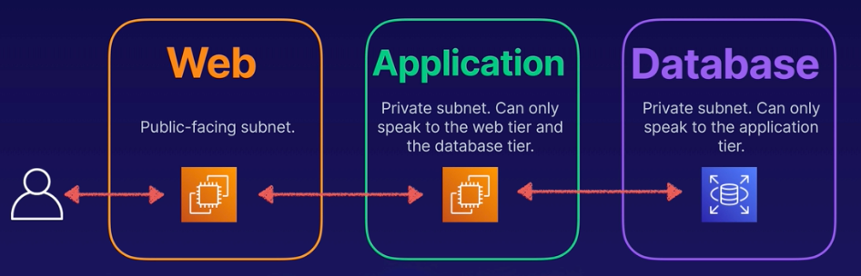
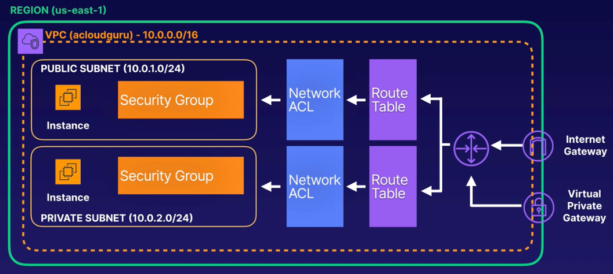
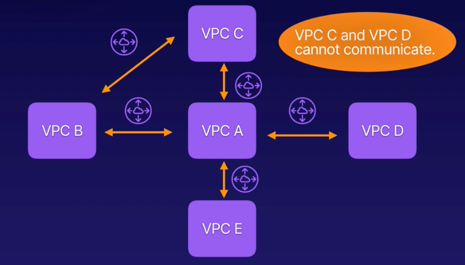

# CHAPTER 7 Networking and Content Delivery

### Chapter Outline 
- Section Introduction
- Virtual Private Cloud (VPC) Overview
- `Demo` Building Your Own Custom VPC - Part 1
- `Demo` Building Your Own Custom VPC - Part 2
- `Demo` Building Your Own Custom VPC - Part 3
- `HANDS-ON LAB` Creating a Basic VPC and Associated Components in AWS
- `Demo` Configuring Network ACLs - Part 1
- `Demo` Configuring Network ACLs - Part 2
- `Demo` Connecting to an EC2 Instance Using Systems Manager Session Manager
- `Demo` Introducing VPC Endpoints
- `HANDS-ON LAB` Create a VPC Endpoint and S3 Bucket in AWS
- Understanding VPC Peering
- Securely Connecting to a VPC Using a Virtual Private Network (VPN)
- What Is Direct Connect?
- Understanding VPC Flow Logs
- `Demo` Using VPC Flow Logs
- `HANDS-ON LAB` Work with AWS VPC Flow Logs for Network Monitoring
- Introducing Domain Name System (DNS)
- Introducing Route 53
- Exploring Route 53 Resolver
- Understanding Route 53 Routing Policies
- `Demo` Route 53 Simple Routing Policy
- `Demo` Route 53 and Weighted Routing Policy
- `Demo` Route 53 Failover Routing Policy
- `Demo` Route 53 Geolocation Routing Policy
- `Demo` Configuring Route 53 Alias
- Understanding Route 53 Failover Alias Records
- `Demo` Configuring Route 53 Failover Alias Records
- Overview of CloudFront
- `Demo` Configuring Amazon CloudFront
- `Demo` Configuring Amazon CloudFront with Origin Access Control
- `Demo` Interpreting CloudFront Logs
- Identifying CloudFront Caching Errors
- CloudFront Cache Hit Ratio
- Advanced CloudFront
- Improving CloudFront Cache Hit Ratio When Forwarding Request Headers and Cookies

   

## Section Introduction
- Domain 5 of the Exam Guide
- Building Your Own Custom VPC
- VPC Flow Logs
- VPNs and Direct Conenct
- DNS and Route 53
- CloudFront

   

## Virtual Private Cloud (VPC) Overview
### VPC Introduction
- Think of VPC as a virtual data center in the cloud
- Logically isolated part of the AWS Cloud where you can define your own network, and install your own resources
- Have complete control of the virtual network including your own IP address range, subnets, route tables, and network gateways.

 

### Networking
- **Fully Customizable Network**
  - Enables multi-layered security, using network access control lists (network ACLs) and security groups, to control access to the EC2 instances in your subnets.
  - Example 3-tier architecture:
    

 

### VPNs
- Additionally, you can establish a **hardware Virtual Private Network (VPN)** connection between your own data center and your VPC. This enables you to utilize the Cloud as an extension of your own data center.
- VPN allow you to establish secure, private, encrypted tunnel between your data center and AWS.

 

### Network Diagram
- **VPC with Public and Private Subnet(s)
    

> In example above access to the Private subent is only allowed from VPN connection

 

| AWS Recommended Internal CIDR Ranges |
|---|
|10.0.0.0 - 10.255.255.255 (10/8 prefix)|
|172.16.0.0 - 172.31.255.255 (172.16/12 prefix)|
|192.168.0.0 - 192.168.255.255 (192.168/16 prefix)|

> Use  to check your CIRD ranges

 

### VPC Features
- **Launch Instances** Launch instances into a subnet of our choosing
- **Custom IP Addresses** Assign custom IP address ranges in each subnet
- **Route Tables** Configure route tables between subnets
- **Internet Gateway** Create an internet gateway and attach in to our VPC
- **Control** Control which networks can access our AWS resources
- **Security Mechanisms** Network Access Control Lists. Security Groups.

 

### Comparing VPCs
|Default VPC|Custom VPC|
|---|---|
|Default VPC is user friendly|Fully customizable|
|All subnets in default VPC have route out to the internet|You can configure the way you want|
|Each EC2 instance has both public and private IP address|You decide if subnets will be public or private|
||Takes time to set up|

   

## Understanding VPC Peering
### What is VPC Peering?
**VPC Peering** allows you to route traffic between 2 VPCs using private IP address:
    - Enables EC2 instances in one VPC to communicate with instances in another
    - Instances behave as if they were on the same private network
    - The VPCs do not need to be in the same account or AWS Region
> VPCs must have different IP ranges and not have duplicate IP addresses

 

### How it Works

> Connectivity has to be explicitly enables between VPC X and VPC Y, as other VPC cannot be configured as tranceivers

   

## Securely Connecting to a VPC Using a Virtual Private Network (VPN)
### **What is a Site-to-Site VPN?**
- **VPN (Virtual Private Network)**: A secure connection between on-premises networks, remote offices, client devices, and AWS resources.
- **AWS Site-to-Site VPN**:
  - Creates an encrypted tunnel between your **network** and **VPC**.
  - Uses **IPsec (Internet Protocol Security)**, an industry-standard protocol for encrypting communications between two devices.
  - Provides secure communication over the **internet**.

#### **Components Required for Configuration**
1. **Virtual Private Gateway (AWS Side)**:
   - Configured within your **VPC**.
   - Acts as the entry point to your VPC for VPN connections.

2. **Customer Gateway Device (On-Premises Side)**:
   - Located in your **data center** or **remote office**.
   - Can be a physical device or a virtual software appliance.
   - Common vendors: Cisco, Fortinet, Palo Alto, Juniper, Netgate, etc.
   - Must support the **IPsec protocol**.

 

### **Example Use Case**
- **Scenario**: Connecting a corporate data center to an AWS VPC.
1. Deploy a **Virtual Private Gateway** in the VPC.
2. Set up a **Customer Gateway Device** in the data center (physical or virtual).
3. Establish a secure **IPsec tunnel** between the two gateways:
   - Ensures all network packets passing through the tunnel are encrypted.
   - Provides a **secure connection** between the corporate data center and AWS resources.

   

## What is Direct Connect?
#### **What is AWS Direct Connect?**
- A **dedicated private connection** between:
  - Your corporate **data center**.
  - Your **AWS VPC**.
- **Avoids the internet** entirely.
- **Enables** communication with AWS resources like EC2 and RDS without internet dependency.

 

#### **Benefits of Direct Connect**
1. **Enterprise-grade solution**:
   - Designed for organizations with high-throughput needs.
2. **Private Connection**:
   - Offers a dedicated link into the AWS network.
3. **Increased Network Throughput**:
   - Speed options: **1 Gbps, 10 Gbps, 100 Gbps**.
4. **Consistency**:
   - Reliable and predictable network performance.
   - Eliminates fluctuations seen in internet-based connections.
5. **Improved Stability**:
   - Ideal for workloads experiencing issues like:
     - Slow speeds.
     - Unreliable connections with site-to-site VPNs.

 

#### **Direct Connect Architecture**
1. **Core Components**:
   - **VPC**: AWS environment containing resources (EC2, RDS).
   - **Corporate Data Center**: On-premises infrastructure.
   - **Direct Connect Location**: Physical co-location facilities hosting AWS Direct Connect routers.

2. **Direct Connect Locations**:
   - Facilities where AWS has a presence.
   - Examples of co-location providers:
     - **Equinix**, **Cologix**, **CoreSite**, etc.
   - Full list: [AWS Direct Connect Locations](https://aws.amazon.com/directconnect/locations).

3. **Setup Requirements**:
   - **Customer Router**:
     - Installed in the same Direct Connect location as the AWS router.
     - Communicates directly with AWS Direct Connect routers.
   - **Network Link**:
     - Connection between your data center and the Direct Connect router.
     - **Delivery Partners**:
       - Providers like Colt, BT, Equinix, Telstra, or Zayo.
       - Full list: [AWS Direct Connect Delivery Partners](https://aws.amazon.com/directconnect/partners/).

4. **Setup Timeline**:
   - Provisioning often takes **weeks**, not days.
   - Engage third-party partners for smooth setup.

   

## Understanding VPC Flow Logs
#### **1. What Are VPC Flow Logs?**  
- **Definition**: VPC flow logs capture information about the traffic going to and from network interfaces within your VPC.  
- **Examples of logged traffic**:
  - User connections to web servers.  
  - SysOps Admin SSH sessions.  
  - On-premises systems connecting to RDS databases.  
  - Traffic between VPCs.  
- **Granularity**: Can log at the following levels:  
  - **VPC**  
  - **Subnet**  
  - **Network Interface (ENI)**  

 

#### **2. Why Are VPC Flow Logs Useful?**  
- **Diagnostics**: Troubleshoot overly restrictive security groups or blocked connections.  
- **Monitoring**: Analyze accepted and rejected traffic patterns.  
- **Traffic Analysis**: Determine direction and flow of traffic through your network interfaces.  

 

#### **3. Types of Traffic Logged**  
You can configure VPC flow logs to capture:  
- **Accepted traffic**: Successfully reaching its destination.  
- **Rejected traffic**: Blocked traffic.  
- **All traffic**: Both accepted and rejected traffic.  

 

#### **4. Example Flow Log Records**  
- **Accepted Traffic Example**:  
  - **Destination ENI**: `eni-1234567890abcdef`  
  - **Source IP**: `192.168.1.100`  
  - **Destination IP**: `10.0.0.5`  
  - **Source Port**: `56789`  
  - **Destination Port**: `22 (SSH)`  
  - **Protocol**: `6 (TCP)`  
  - **Start Time**: `1412202000`  
  - **End Time**: `1412202020`  
  - **Log Result**: `ACCEPT`  
  - **Status**: `OK` (Log successfully recorded).  

- **Rejected Traffic Example**:  
  - **Destination ENI**: `eni-1234567890abcdef`  
  - **Source IP**: `192.168.1.101`  
  - **Destination IP**: `10.0.0.6`  
  - **Source Port**: `45678`  
  - **Destination Port**: `3389 (RDP)`  
  - **Protocol**: `6 (TCP)`  
  - **Start Time**: `1412202030`  
  - **End Time**: `1412202045`  
  - **Log Result**: `REJECT`  
  - **Status**: `OK` (Log successfully recorded).  

 

#### **5. Where Are Flow Logs Stored?**  
- **CloudWatch**: Enables real-time monitoring and alerting.  
- **S3**: Facilitates long-term storage and advanced analytics.  

   

## Introducing Domain Name System (DNS)
### **What Is DNS?**  
- **Definition**:  
  - DNS translates human-friendly domain names (e.g., `http://acloud.guru`) into machine-readable IP addresses (e.g., `82.124.53.1`).  
  - It is often called the "phone book of the internet."  
- **Purpose**:  
  - Computers use IP addresses to identify each other on a network. DNS bridges the gap between user-friendly names and these addresses.  

 

### **IP Address Types**  
- **IPv4 (Internet Protocol version 4)**:  
  - Format: `192.168.1.1`  
  - Limited to ~4.3 billion unique IP addresses.  
  - Developed in the 1980s, and now almost exhausted due to the explosive growth of internet-connected devices.  

- **IPv6 (Internet Protocol version 6)**:  
  - Format: `2001:0db8:85a3:0000:0000:8a2e:0370:7334`  
  - Provides **340 undecillion addresses** (340 with 36 zeros).  
  - Aims to ensure there will be enough addresses for the foreseeable future.  

 

### **Top-Level Domains (TLDs)**  
- **Definition**:  
  - The last part of a domain name (e.g., `com` in `google.com`).  
- **Examples**:  
  - Generic TLDs: `.com`, `.org`, `.edu`, `.gov`.  
  - Specialty TLDs: `.guru`, `.tech`.  
  - Country TLDs: `.uk`, `.ca`.  

- **Hierarchy in Domain Names**:  
  - Example: `bbc.co.uk`  
    - `uk` = Top-Level Domain (TLD).  
    - `co` = Second-Level Domain.  

 

### **Domain Management**  
- **IANA (Internet Assigned Numbers Authority)**:  
  - Oversees and manages top-level domains globally.  
  - Maintains the **root zone database** of all TLDs.  
  - Database is available at [www.iana.org/domains/root/db](https://www.iana.org/domains/root/db).  

- **Domain Registrars**:  
  - Companies authorized to register domain names under TLDs.  
  - Examples:  
    - Popular registrars: GoDaddy, Google Domains, eNom, AWS Route 53.  
  - All domain names must be unique and are stored in a central **WHOIS database**, containing registration and contact information.  

   

## Introducing Router 53
### **What Is Route 53?**  
- **Definition**:  
  - Amazon's DNS service for managing domain names and routing traffic.  
  - Features include:  
    - Registering and purchasing domain names.  
    - Mapping domain names to AWS resources (e.g., EC2, Elastic Load Balancers, S3).  
- **Hosted Zones**:  
  - A container for DNS records in Route 53.  
  - Automatically includes:  
    - **SOA (Start of Authority) Record**: Contains basic domain info (e.g., admin contact, refresh/retry settings).  
    - **NS (Name Server) Record**: Defines Route 53 name servers authoritative for the hosted zone.  

 

### **Common DNS Records in Route 53**  
- **SOA (Start of Authority) Record**:  
  - Basic information about the domain.  
  - Includes:  
    - Name server that created the SOA record.  
    - Domain admin’s email address.  
    - Settings like refresh, retry, and TTL.  

- **NS (Name Server) Record**:  
  - Identifies DNS servers authoritative for the domain.  
  - Used by the top-level domain (TLD) to direct traffic to the correct DNS server.  

- **A (Address) Record**:  
  - Maps a domain name to an **IPv4** address.  
  - Example: `www.acloud.guru → 123.10.10.80`.  

- **CNAME (Canonical Name) Record**:  
  - Resolves one domain name to another.  
  - Example:  
    - `m.acloud.guru` → `mobile.acloud.guru`.  
  - **Limitations**: Cannot be used for the **zone apex** (root domain, e.g., `acloud.guru`).  

- **Alias Record**:  
  - AWS-specific feature.  
  - Maps DNS names to AWS resources (e.g., Elastic Load Balancers, CloudFront, S3).  
  - Can be used for the **zone apex**.  
  - No additional charges for alias queries to AWS resources.  

 

### **Alias Records vs. CNAME Records**  
| **Feature**| **Alias Record**| **CNAME Record**|
|---|---|---|
| AWS Specific| Yes| No|  
| Zone Apex Support| Yes| No|  
| Use Case| Map domain to AWS resources like ELB or CloudFront| Map one domain to another|  
| Charges| No charges for alias queries to AWS resources| Charges apply for all queries|  

 

#### **TTL (Time to Live)**  
- **Definition**:  
  - Time (in seconds) DNS resolvers cache Route 53 record information.  
- **Impact**:  
  - **Shorter TTL**:  
    - Faster propagation of DNS changes.  
    - Increases number of queries to Route 53 (higher cost).  
  - **Longer TTL**:  
    - Reduces DNS queries and cost.  
    - Slower propagation of DNS changes.  

   

## 