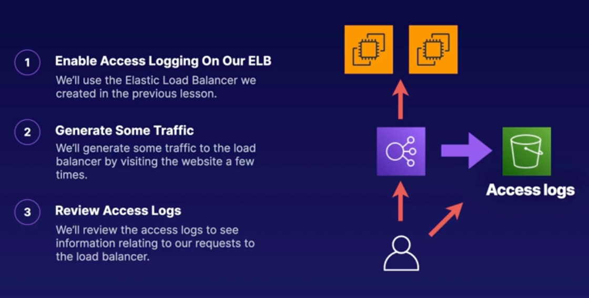

## Working with Elastic Load Balancer Access Logs

> **Note: Prerequisites Required**
> 
> This demo is a continuation of the previous demo titled "Demo 2.1: DeployELB." 



<br>

**Access Logging is an optional feature of Elastic Load Balancer, and it is not enabled by default.**

## Enable Access Logging On Our ELB
- You can serach for load balancers directly from search bar: `Load Balancers` (You will find it in the `Features` section)
- Select previously created ELB (i.e. `my-load-balancer`)
- In `Actions` select `Edit load balancer attributes`
- Scroll down to `Monitoring` and switch toggle for `Access logs` to `ON`
- You need to provide `S3` bucket where Access Logs will be stored. 
- If you don't have `S3` bucket ready, select `View` (this will redirect you to S3 bucket creation screen)
    - Select `Create bucket`
    - Name: `my-elb-access-logs-XXXXX`
    - Select `Create bucket`
    - Once bucket is created, you need to create bucket policy
    - Select created bucket
    - Navigate to `Permissions` tab
    - Scroll down to `Bucket policy` and select `Edit`
    - Use following policy configuration (**Note: the value within Resource key `<<...>>` has to be replaced with your S3 bucket ARN visible on the top of the Policy screen**):
        ```json
        {
            "Version": "2012-10-17",
            "Statement": [
                {
                    "Effect": "Allow",
                    "Principal": {
                        "AWS": "arn:aws:iam::127311923021:root"
                    },
                    "Action": "s3:PutObject",
                    "Resource": "<<arn:aws:s3:::bucket-name>>/*"
                }
            ]
        }
        ```
        - `Save changes`
- Back in the ELB configuration screen, slect `Browse S3` and select created bucket.
- Save changes

## Generate Some Traffic
- One few new tabs with DNS record of the load balancer. This will generate traffic, and new entries in access log.


## Review Access Logs
- Navigate to `S3` bucket
- In the `View` tab open `AWSLogs/xxx/`
- Open `ELBAccessLogTestFile` (can take 5-10 minutes before logs are published)
- After some time you you should see `elasticloadbalancing/` directory next to `ELBAccessLogsTestFile`
- Navigate to `elasticloadbalancing/us-east-1/202x/xx/xx` and you will find the logs file.
- Select the file available
- And press `Download`
