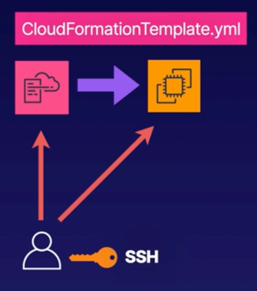

# Demo: Provisioning AWS Resources Using CloudFormation



1. **Create and Download an SSH Key Pair**<br>Use this later to log in to an EC2 instance.
- Search for `EC2` in AWS console. 
- In Resources select `Key pairs` (ensure you are working in the correct region)
- Select `Create key pair` and provide following details
  - Name: `mynvkp`
  - Key pair type: `RSA`
  - Private key file format: `.pem`
  - Create key with provided details by selecting `Create key pair` at the bottom of the screen
  > The key will be automatically downloaded to your downloads folder

<br>

2. **Create a CloudFoundation Stack**<br>Use the provided template to provision an EC2 instance with SSH access enabled
- Navigate to `CloudFormation` from AWS console
- Select `Create stack` > **With new resources (standard)**
- In `Create stack` menu provide following details:
  - **Prerequisite - Prepare template**: 
    - [x]Template is ready
    - [] Use a sample template
    - [] Create template in Designer
  - **Specify template**:
    - [] Amazon S3 URL
    - [x] Upload a template file
      - `Choose file` and select file with template code (content provided below)
    - > Once file is uploaded, you will receive S3 URL in the configuration. CloudFormation created S3 to store template file for you.
  - **Specify stack details**
    - Stack name: `my-cf-stack`
    - **Parameters**:**KeyName**: <provide value from line 9(i.e. `mynvkp`)>
    - `Next`
  - **Configure stack options**
    - Tags (optional)
    - Permissions (not required for this demo)
    - Stack failure options:
      - [x] Roll back all stack resources
      - [ ] Preserve successfully provisioned resources
    - Advanced options:
      - **Stack policy**<br>Define the resources that you want to prevent from unintentional update during a stack update.
      - **Rollback configuration**<br>Specify alarms for CloudFormation to monitor when creating and updating the stack. If the operation breaches an alarm threshold, CloudFormation rolls it back.
      - **Notification options**<br>Select SNS topic if you like to receive notifications.
      - **Stack creation option**
        - Timeout (The number of minutes before a stack creation times out)
        - Termination protection (prevent the stack from being accidentally deleted. Once created, you can update this through stack actions)
    - **Review and create** by selecting `Submit`
        > **Check status**<br>
        > You can check status of stack creation by checking `Events` tab.
        > Initially status will be `CREATE_IN_PROGRESS` that will change to `CREATE_COMPLETED` once resources provisioned
        >
        > In `Resources` you can find all resources that have been created via CF stack
        >
        > In template we've configured the output value, and this value can be seen in `Outputs` tab


Template file:
```yaml
AWSTemplateFormatVersion: 2010-09-09

Description: Template to create an EC2 instance and enable SSH

Parameters: 
  KeyName:
    Description: Name of SSH KeyPair
    Type: 'AWS::EC2::KeyPair::KeyName'
    ConstraintDescription: Provide the name of an existing SSH key pair

Resources:
  MyEC2Instance:
    Type: 'AWS::EC2::Instance'
    Properties:
      InstanceType: t3.micro
      ImageId: ami-0b5eea76982371e91
      KeyName: !Ref KeyName
      SecurityGroups:
        - !Ref InstanceSecurityGroup
      Tags:
        - Key: Name
          Value: My CF Instance
  InstanceSecurityGroup:
    Type: 'AWS::EC2::SecurityGroup'
    Properties:
      GroupName: MyDMZSecurityGroup
      GroupDescription: Enable SSH access via port 22
      SecurityGroupIngress:
        IpProtocol: tcp
        FromPort: 22
        ToPort: 22
        CidrIp: 0.0.0.0/0

Outputs: 
  InstanceID:
    Description: The Instance ID
    Value: !Ref MyEC2Instance
```

1. **Review Our CloudFormation Stack**<br>Identify the new instance in the AWS console and test that we can log in using SSH and the key pair we create at the beginning.

