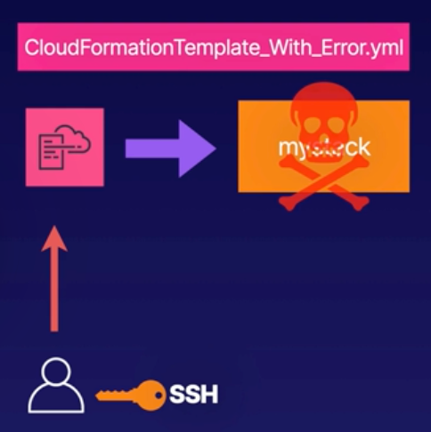

# Demo: Cloud Formation Errors



<br>

> Documentation
>
> 


<br><br>

1. Create and Donwload an SSH key pair
Use this later when create our stack
    - Navigate to `EC2` -> `Key pairs`
    - Create `mycfkp` key pair:
      - Key pair type: `RSA`
      - Private key file format: `.pem`

2. Launch a CloudFormation Stack
Use the previded template to launch a Cloud Formation stack.
    - Create a stack with tempalte provided below (Note, stack deliberatelly contains error(s))

        ```yaml
        AWSTemplateFormatVersion: 2010-09-09

        Description: Template to create an EC2 instance and enable SSH

        Parameters: 
        KeyName:
            Description: Name of SSH KeyPair
            Type: 'AWS::EC2::KeyPair::KeyName'
            ConstraintDescription: Provide the name of an existing SSH key pair

        Resources:
        MyEC2Instance:
            Type: 'AWS::EC2::Instance'
            Properties:
            InstanceType: t3.micro
            ImageId: ami-0a606d8395a538502
            KeyName: !Ref KeyName
            SecurityGroups:
                - !Ref InstanceSecurityGroup
            Tags:
                - Key: Name
                Value: My CF Instance
        InstanceSecurityGroup:
            Type: 'AWS::EC2::SecurityGroup'
            Properties:
            GroupName: MyDMZSecurityGroup
            GroupDescription: Enable SSH access via port 22
            SecurityGroupIngress:
                IpProtocol: tcp
                FromPort: 22
                ToPort: 22
                CidrIp: 0.0.0.0/0

        Outputs: 
        InstanceID:
            Description: The Instance ID
            Value: !Ref MyEC2Instance
        ```
    - Use default config for all other parameters
    
3. View the CloudFormation Events