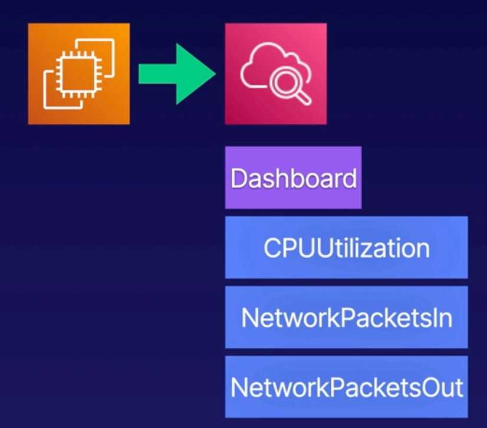

# Demo: Creating CloudWatch Dashboards

  

1. **Launch EC2 Instance** Generate some activity on our instance to create some metrics.
    - Launch EC2 instance (AMI2, t3.micro), no key pair.
    - Select instance in **EC2 > Instances** view and connect to it (using EC2 instance connect).
    - To generate CPU load, run the following command in connected EC2 instance:
        `while true; do echo; done`

2. **Create a CloudWatch Deshboard** Explore the metrics that are available.

3. **Add Some Widgets** Add some widgets to the dashboard to display metrics about our EC2 instance.