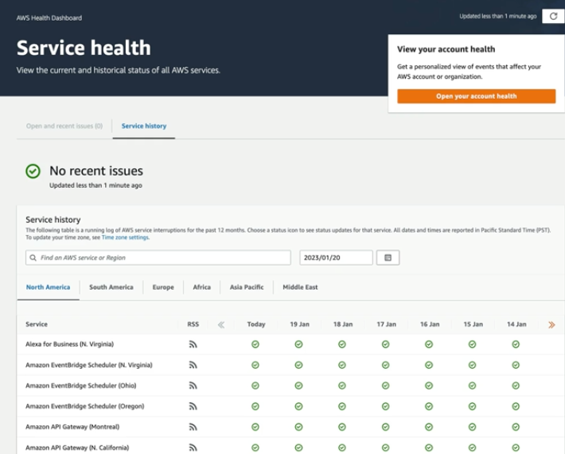

# Demo: Exploring AWS Health Dashboard

### Objectives
1. **Explore the AWS Health Dashboard** View the status of all AWS services per region
2. **Explore Your Account Health** View issues with AWS services that will impact you, based on the resources you are using.

  

## Solution
1. **Explore the AWS Health Dashboard**
   - Navigate to `AWS Health Dashboard`
   - Select `Open and recent issues` in left-hand side menu under `Service health`:

    

   - This view provides a view of current status of all the AWS services, and it's organized by region.
   - It provides a log of AWS services interruptions over the last 12 months.

2. **Explore your AWS aaccount Health Dashboard**
   - On the left-hand side navigate to `Your account health`:
     - **Open and recent issues** View events that might affect your AWS infrastructure.
     - **Scheduled changes** View upcoming events and ongoing events from the past seven days that might affect your AWS infrastructure, such as scheduled maintenance activities.
     - **Other notifications** View other notifications and ongoing events from the past seven days that might affect your AWS account, such as certificate rotations, billing notifications, and security vulnerabilities.
     - **Event logs** You can view issues with services in the past 3 month. As well as potential impact of those issues on your infrastructure. To view affected resource, you can open event and navigate to **Affected resource** tab.

