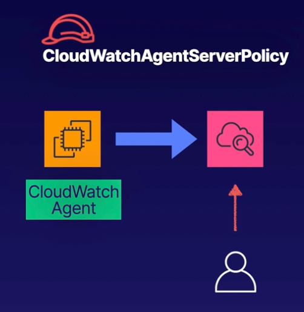

# CloudWatch Demo



<br><br>


### Objectives
- **Launch an EC2 Instance**<br>Attach an IAM role with permissions to send CloudWatch Agent metrics to CloudWatch
- **Install the CloudWatch Agent**<br>Configure the agent to send operating system metrics and logs to CloudWatch
- **View Metrics in CLoudWatch**We should be able to see the EC2 default metrics as well as the metrics and logs sent by the CloudWatch Agent.

<br>

## Launch an EC2 Instance (IAM preparation)
- Navigate to `IAM` in AWS console.
- In `Access managment` select `Roles`
- Select `Create role`
  - **Step 1**:
    - Trusted entity type: `AWS service`
    - Use case `EC2`
    - `Next`
  - **Step 2**:
    - Add `CloudWatchAgentServicePolicy`
    - `Next`
  - **Step 3**:
    - Role name: `EC2CWRole`
    - `Create role`

<br>

## Launch an EC2 Instance
- Name: `My EC2 Instance`
- OS: `AMI2`
- Type: `t3.micro`
- Key pair: `Proceed without a key pair`
- Advanced details:
  - IAM instance pofile: `EC2CWRole`
  - User data:<br>Add bootstrap script 
    
    ```bash
    #!/bin/bash
    dnf update -y
    ```
<br>

## Install CloudWatch Agent
- Open created instance by using **EC2 instance connect**
- Install `rsyslog` which will generate a readable text file of the operating system messages in var/log/messages
    ```sh
    sudo su
    dnf install rsyslog
    systemctl start rsyslog
    systemctl enable rsyslog
    ```

- Install the CloudWatch Agent:
    ```sh
    sudo dnf install amazon-cloudwatch-agent -y
    ```

- Configure the CW Agent:
    ```sh
    /opt/aws/amazon-cloudwatch-agent/bin/amazon-cloudwatch-agent-config-wizard
    ```

    ```md
    On which OS  are you planning to use the agent?
    **1. linux**
    2. windows
    3. darwin

    Are you using EC2 or On-Premises hosts?
    **1. EC2**
    2. On-Premises

    Which user are you planning to run the agent?
    **1. root**
    2. cwagent
    3. others

    Do you want to turn on StatsD deamon? (collects metrics on your system)
    **1. yes**
    2. no

    Wich port do you want StatD daemon to listen to?
    **8125**

    What is the collect interval for StatD daemon?
    **1. 10s**
    2. 30s
    3. 60s

    What is the aggregation interval for metrics collected by StateD daemon?
    1. Do not aggregate
    2. 10s
    3. 30s
    **4. 60s**

    Do you want to monitor metrics from CollectD? WARNING: CollectD must be installed or the Agent will fail to start
    1. yes
    **2. no**

    Do you want to monitor any host metrics? e.g. CPU, memory, etc.
    **1. yes**
    2. no

    Do you want to monitor cpu metricsper core?
    **1. yes**
    2. no

    Do you want to add ec2 dimensions (ImageId, Instance Id, InstanceType, AutoScalingGroupName) into all of your metrics if the info is available
    **1. yes**
    2. no

    Do you want to aggregate ec2 dimensions (InstanceId)?
    **1. yes**
    2. no

    Would you like to collect your metrics at high resolution (sub-minute resolution)? This enable sub-minute resolution for all metrics, but you can customize for specific metrics in the output json file.
    **1. 1s**
    2. 10s
    3. 30s
    4. 60s

    Which default metrics config do you want?
    1. Basic
    **2. Standard**
    3. Advanced
    4. None    

    Are you satisfied with the above config? Note: it can be manually customized after the wizard completes to add additional items.
    **1. yes**
    2. no

    Do you have any existing CloudWatch Log Agent configuration file to import for migration?
    1. yes
    **2. no**

    Do you want to monitor any log files?
    **1. yes**
    2. no

    Log file path:
    `/var/log/messages`

    Log group name:
    `default choice: [messages]`

    Log stream name:
    `default choice: [{instance_id}]

    Log Group Retention in days:
    **2. 1**

    Do you want to specify any additional log files to monitor?
    1. yes
    **2. no**

    Do you want to store the config in the SSN parameter store?
    1. yes
    **2. no**
    ```

- View the CloudWatch agent config file:

    ```sh
    cd /opt/aws/amazon-cloudwatch-agent/bin
    cat config.json
    ```

- Start the CloudWatch Agent

    ```sh
    /opt/aws/amazon-cloudwatch-agent/bin/amazon-cloudwatch-agent-ctl -a fetch-config -m ec2 -s -c file:/opt/aws/amazon-cloudwatch-agent/bin/config.json
    ```

- Generate some activity on our system by installing stress:

    ```sh
    dnf install stress -y
    stress --cpu 1
    ```


