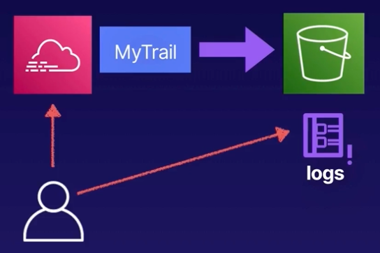

# Demo:<br>Working with CloudTrail



<br>

### Objectives
1. **Review CloudTrail Event History**<br>Review the past 90 days' event history using the CloudTrail console
2. **Create a Multi-Region Trail**<br>Create a trail to store exncrypted CloudTrail logs indefinitely in a new S3 bucket
3. **View CloudTrail Logs in S3**<br>After a few minutes, we should be able to see the Cloudtrail logs appear in S3

<br>

## Soulution
1. **Review CloudTrail Event History**
    - Navigate to `Services` icon in AWS Console.
    - You will find `CloudTrail` under `Management & Goveranance`
    - Go to `Event history`
    - You can see all the activity ran against AWS APIs in the past 90 days.
    - You can filter activity by one of the following:
        - AWS access ky
        - Event ID
        - Event name
        - Event source
        - Read-only
        - Resource name
        - Resource type
        - User name

<br>

2. **Create a Multi-Region Trail**
    - Select `Trails` in `CloudTrail` window
    - `Create trail` and provide configuration:
    - Step 1<br>**Choose trail attributes**:
      - Trail name: `management-events`
      - Storage location: `Create new S3 bucket`
      - Trail log bucket and folder: `aws-cloudtrail-logs`
      - Log file SSE-KMS encryption (Server Side Encryption): `Enabled`
      - Customer managed AWS KMS key: New
      - AWS KMS alias: `MyKMSKey`
      - Additional settings:
        - Log file validation: `Enabled`
        - SNS notification: `Disabled`
      - `Next`
    - Step 2<br>**Choose log events**:
      - Event type:
        - [x] Management events
        - [ ] Data events
        - [ ] Insights events
      - API activity:
        - [x] Read
        - [x] Write
      - [ ] Exclude AWS KMS events
      - [ ] Exclude Amazon RDS Data API events
      - `Next`
    - Step 3<br>**Review and create**
        > Note that by default Trail is created in `multi-region` mode, and that is recommended action
      - `Create trail`


3. **View CloudTrail Logs in S3**

    - In `CloudTrail` -> `Trails` view, find recently created trail.
    - In the `S3 bucket` column, click on the hyperlink of attached S3 bucket.
    - Content of the S3 bucket:
        ```sh
        aws-cloudtrail-logs
        ├── Cloudtrail-Digest
        └── CloudTrail
        ```

    - `CloudTrail-Digest` is location where CloudTrail stores digest file every hour. Digest file used for log file integrity validation.
    - `CloudTrail` is where logs are stored.The content of the folder will be organized by regions (i.e. **us-east-2** and **us-west-2** ) and date, stored in json format.