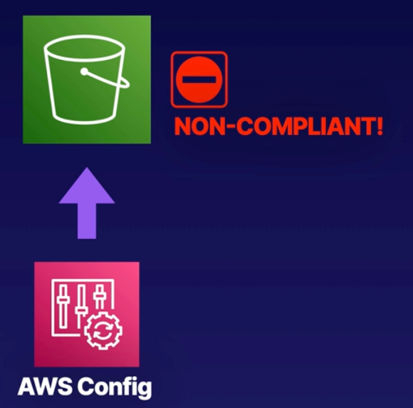

# Demo: Using AWS Config

  

### Objectives
1. **Create an S3 Bucket** Accept the default settings
2. **Create an AWS Config Rule** Create a rule in AWS Config which checks that bucket versioning is enabled. We'll use the `s3-bucket-versioning-enabled` managed rule
3. **After the Rule Is Evaluated** Config should report that our S3 bucket is non-compliant

 

## Solution
1. **Create an S3 Bucket**

2. **Create an AWS Config Rule**

3. **After the Rule Is Evaluated**

