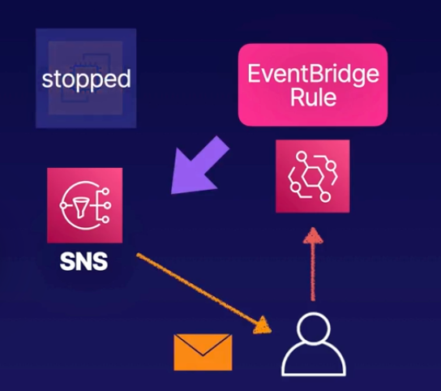

# Demo: Using Amazon EventBridge

### Objectives
1. **Launch an EC2 Instance**
2. **Create an SNS Topic** Subscribe to the topic using our email address, and confirm the subscription
3. **Create a Rule** Create an EventBridge rule to notify us if any EC2 state changes using SNS
4. **Stop the Instance** Stop our instance and check if we have received an email notification

   

## Solution
1. **Launch an EC2 Instance**

2. **Create an SNS Topic**
    - Navigate to `SNS` > `Topics`
    - Select `Create topic` and provide following configuration:
      - Type: `Standard`
      - Name: `MyTopic`
      - `Create topic`
    > In order to receive notifications, you need to subscribe to the topic
    - Select `Subscriptions` > `Create subscription`:
      - Topic ARN: `<select previously created topic ARN>`
      - Protocol: `Email`
      - Endpoint: `<your receiver's email>`
      - `Create subscription`
    > You will have to confirm subscription (received on receivers email) by clicking the link in email

3. **Create a Rule**
    - Navigate to `EventBridge` > `Rules`
    - Select event bus: `default`
    - Select `Create rule` and provide the following:
      - **Step 1** Define rule detail
        - Name: `ec2-state-change-rule`
        - Event bus: `default`
        - [x] `Enable the rule on the selected event bus`
        - Rule type: `Rule with an event pattern`
        - `Next`
      - **Step 2** Build event pattern
        - Event source: `AWS events or EventBridge partner events`
        - Skip sample event
        - Creation method: `Use pattern form`
          - **Event pattern**:
            - Event source: `AWS service`
            - AWS service: `EC2 Instance State-change Notification`
            - `Any state`
            - `Any instance`
            - `Next`
      - **Step 3** Select target(s)
        - Target 1:
          - Target type: `AWS service`
          - Select a target: `SNS topic`
          - Topic: `MyTopic`
          - `Next`
      - Review and create by selectin `Create rule` in section 5

4. **Stop the Instance**
    - Navigate to `EC2` and stop the isntance to generate the event
    - You should received an email from `AWS Notifications` for `stopping` status, and later another one for `stopped`

> CloudWatch and EventBridge
>   
> If you navigate to `CloudWatch`>`Rules` you should find the same rule that was created in `EventBridge`