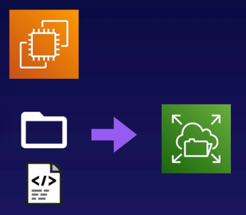

# Demo: Working With EFS

 

### Objectives
1. **Create an EFS File System** Note that in the console, encryption is enabled by default.
2. **Launch an EC2 Instance** Install the Amazon EFS utilities on our instance.
3. **Mount the File System** Create a new directory on our EC2 instance. Mount the EFS file system to our new directory and create a file.

 

## Solution
1. **Create an EFS File System**
   - 