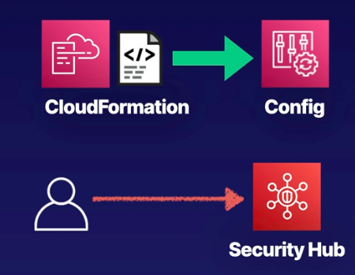

# Demo: Introducing AWS Security Hub
### Objectives
1. **Configure AWS Config** Use a CloudFormation template to configure Config
2. **Review the Security Standards** Review the security standards that Security Hub uses to measure security compliance
3. **Enable Security Hub** Review integrations with AWS and third-party services. Review the Security Hub findings.

 

 

### Prerequisites
- An AWS account with sufficient permissions to create resources in **CloudFormation**, **AWS Config**, and **Security Hub**.

 

## Step 1: Configure AWS Config Using CloudFormation
1. **Copy CloudFormation Template from appendix 1**

2. **Create a CloudFormation Stack:**
   - Navigate to the **CloudFormation Console**.
   - Select **Create Stack** > **With New Resources (Standard)**.
   - Choose **Upload a template file** and upload the downloaded template.
   - Click **Next**.

3. **Specify Stack Details:**
   - Enter a stack name (e.g., `Enable-AWS-Config`).
   - Click **Next** to proceed without making changes to the default configuration.

4. **Review and Create:**
   - Review the stack details and acknowledge that **IAM resources** might be created.
   - Click **Submit** and wait for the stack creation to complete (approximately 2 minutes).

5. **Verify Configuration:**
   - After the stack is created, check the **Resources** tab in CloudFormation to view the created resources (e.g., S3 bucket, IAM roles, SNS topic).
   - Navigate to **AWS Config** and confirm that it has started recording resource configurations.

 

## Step 2: Enable AWS Security Hub
1. **Navigate to Security Hub:**
   - Open the **Security Hub Console**.
   - Click **Go to Security Hub**.

2. **Enable Standards and Integrations:**
   - Ensure AWS Config is enabled (already configured in Step 1).
   - Select the desired security standards (e.g., **AWS Foundational Security Best Practices**, **CIS Benchmarks**, **PCI DSS**).
   - Review and acknowledge permissions to integrate findings from AWS services.

3. **Enable Security Hub:**
   - Click **Enable Security Hub** to start the security checks.
   - Be aware that findings and results might take up to 2 hours to populate fully.

 

## Step 3: Review Findings and Insights
1. **View Security Standards:**
   - Navigate to **Security Standards** to see the enabled standards and their compliance status.
   - Once assessments are completed, review the compliance scores.

2. **Explore Insights:**
   - Go to **Insights** for a high-level overview of findings (e.g., S3 buckets with public read/write access).

3. **Analyze Findings:**
   - Click **Findings** to view individual security issues.
   - Use filters to sort findings by severity (e.g., critical, high, medium).
   - Drill down into individual findings for detailed remediation steps.

 

## Step 4: Explore Integrations
1. **AWS Service Integrations:**
   - Security Hub integrates with services like:
     - **AWS Config**: Compliance checks.
     - **GuardDuty**: Threat detection.
     - **Inspector**: Vulnerability management.
     - **Macie**: Data classification and protection.

2. **Third-Party Integrations:**
   - Security Hub can also integrate with tools like **Alert Logic**, **Check Point**, and **CyberArk**.

 

## Step 5: Monitor Security Scores
1. **Review Security Scores:**
   - Navigate to the **Security Standards** section to see compliance scores for each standard.
   - Example: **77% compliant** with AWS Foundational Security Best Practices.

2. **Take Action:**
   - Use the findings and recommendations to address critical security issues and improve compliance scores.
