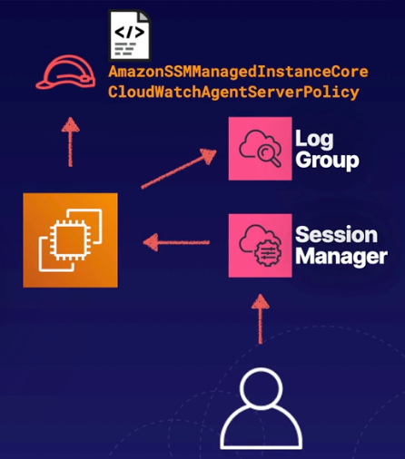

# Demo: Connecting to an EC2 Instance Using systems Manager Session Manager

 

 

### Objectives
- **Create an IAM Role** Create a role with permissions to communicate with Session Manger and CloudWatch:
  - `AmazonSSManagedInstanceCore`
  - `CloudWatchAgentServerPolicy`
- **Launch an EC2 Instance** Associate the instance with the IAM role
- **Configure a CloudWatch Log Group** This will allow us to our sessions
- **Connect to the EC2 Instance** Use Session Manager to connect to the instance and review the session logs

   

## Solution
### **1. Create an IAM Role for Session Manager**
1. **Navigate to IAM**:
   - Go to the AWS Management Console and search for **IAM**.
2. **Create a Role**:
   - Select **Roles** > **Create Role**.
   - Choose **AWS Service** as the trusted entity and **EC2** under Common Use Cases.
3. **Attach Policies**:
   - Search and attach the following policies:
     - **AmazonSSMManagedInstanceCore**: Enables communication between the EC2 instance and Session Manager.
     - **CloudWatchAgentServerPolicy**: Allows EC2 to send logs to CloudWatch.
4. **Finalize Role**:
   - Name the role (e.g., `SSM-CloudWatch-Role`), review attached policies, and create the role.

 
