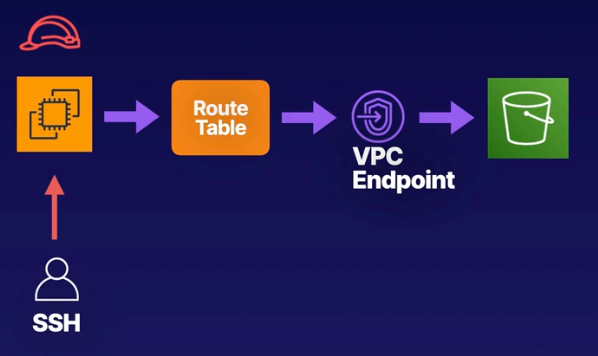

# Demo: Introducing VPC Endpoints

 

 

### Objectives
- **Launch an EC2 Instance** Attach a role enabling access to S3
- **Create a VPC Endpoint for S3** Enable secure access to S3
- **Review the Route Table** Check that an updated route to S3 has been added
- **Test S3 Access** Test access from our EC2 instance

   

## Solution
### **1. Launch EC2 Instance**
- **Instance Details:**
  - Name: `EC2 S3 Access`
  - AMI: Amazon Linux
  - Instance Type: `t3.micro`
  - IAM Role: Create and attach a role with Amazon S3 Full Access.
    - **Steps to Create IAM Role:**
      1. Go to IAM -> Create Role.
      2. Select **AWS Service** and **EC2** as the use case.
      3. Attach the **AmazonS3FullAccess** policy.
      4. Name the role (e.g., `MyEC2S3Role`) and create it.
      5. Attach the role to the instance during its configuration.
- No SSH key pair is needed as this is managed via the AWS console.
- **Networking Configuration:**
  - Ensure the instance is in the default VPC.
  - Leave default security group settings.

 
