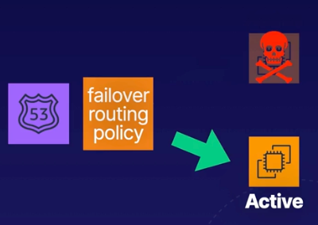

# Demo:<br>Route 53 Failover Routing Policy

<br>



<br>

### Objectives
- **Launch Two EC2 Instances**<br>Install `httpd`
- **Configure a Route 53 Health Check**<br>This will enable Route 53 to check that the website is reachable on our primary instance
- **Configure Failover Based Routing**<br>Create an A record using a failover routing policy

## Solution
### Lesson: Configuring Route 53 with a Failover Routing Policy

---

#### Objectives
In this lesson, we will:
1. Launch two EC2 instances and configure them as web servers.
2. Set up a Route 53 failover routing policy.
3. Test the configuration to ensure proper failover between instances.

---

### Launch Two EC2 Instances
1. Log in to the AWS Management Console.
2. Navigate to **EC2** and click **Launch Instance**.

#### Configure the First Instance (WS1):
- **Name**: `WS1`
- **AMI**: Amazon Linux 2
- **Instance Type**: `t3.micro`
- **Key Pair**: Proceed without a key pair
- **Network Settings**:
  - Create a new security group named `Web DMZ`.
  - Allow **HTTP (port 80)** and remove the default SSH rule.
- Scroll down to **Advanced Details** and locate the **User Data** section.
- Copy and paste the following bootstrap script:

```bash
#!/bin/bash
yum update -y
yum install -y httpd
echo "Hello from WS1" > /var/www/html/index.html
systemctl start httpd
systemctl enable httpd
```

- Click **Launch Instance**.

#### Configure the Second Instance (WS2):
- **Name**: `WS2`
- **AMI**: Amazon Linux 2
- **Instance Type**: `t3.micro`
- **Key Pair**: Proceed without a key pair
- **Network Settings**:
  - Use the existing `Web DMZ` security group.
- Scroll down to **Advanced Details** and locate the **User Data** section.
- Copy and paste the following bootstrap script:

```bash
#!/bin/bash
yum update -y
yum install -y httpd
echo "Hello from WS2" > /var/www/html/index.html
systemctl start httpd
systemctl enable httpd
```

- Click **Launch Instance**.

<br>

### Access the Route 53 Hosted Zone
1. Navigate to **Route 53** in a new tab.
2. Under **Hosted Zones**, locate the hosted zone provided by the Cloud Playground.
3. Select the hosted zone to view its records:
   - **SOA (Start of Authority)** record
   - **NS (Name Server)** records

<br>

#### Create Health Checks
1. Navigate to **Health Checks** from the left-hand menu in Route 53.
2. Create a health check for `WS1`:
   - **Name**: `Web Server 1 Health Check`
   - **Monitor Endpoint**: IP address
   - **Protocol**: HTTP
   - **IP Address**: Public IPv4 of `WS1` (from the EC2 console)
   - **Host Name**: Domain name of the hosted zone
   - **Path**: `index.html`
   - **Request Interval**: Fast (10 seconds)
   - **Failure Threshold**: 1
   - Click **Create Health Check**.
3. Repeat the steps for `WS2` using its public IPv4 address.

<br>

### Configure Failover Routing Policy
1. Navigate back to **Hosted Zones** and select your hosted zone.
2. Select **Create Record**.
3. Configure the primary record:
   - **Name**: Leave blank to route traffic to the root domain.
   - **Record Type**: `A` (IPv4 address).
   - **Value**: Public IPv4 address of `WS1`.
   - **TTL**: 10 seconds (to allow for quick failover).
   - **Routing Policy**: Failover.
   - **Failover Record Type**: Primary.
   - **Health Check**: Web Server 1 Health Check.
4. Configure the secondary record:
   - **Name**: Leave blank.
   - **Record Type**: `A` (IPv4 address).
   - **Value**: Public IPv4 address of `WS2`.
   - **TTL**: 10 seconds.
   - **Routing Policy**: Failover.
   - **Failover Record Type**: Secondary.
   - **Health Check**: Web Server 2 Health Check.
5. Click **Create Records**.
