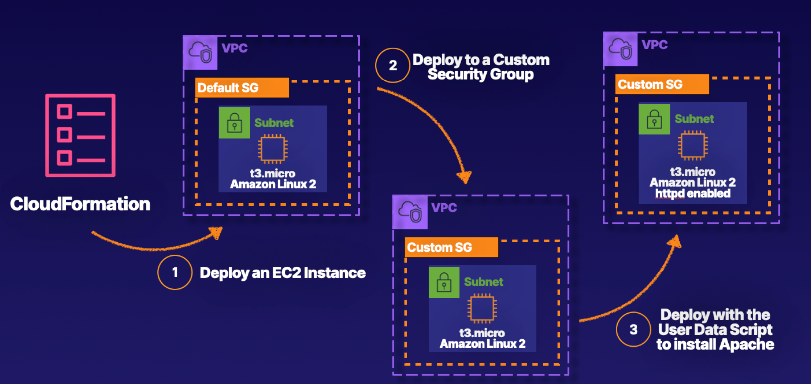

# Deploying An EC2 Instance With CloudFormation

### Introduction
In this hands-on lab, you are taking on the role of a developer working with a CloudFormation template to deploy an EC2 instance along with other resources.



<br>

### Solution

## Specify the AMI and Instance Type and Deploy an EC2 Instance

### Specify the Instance Type

1. Open the !(CloudFormation template)[https://github.com/ACloudGuru-Resources/HOL-Deplying-an-EC2-Instance-with-CloudFormation/blob/main/base.yaml] in GitHub.
2. In the upper right corner, click **Raw**.
3. On the new page, right-click and on the screen and select **Save As**.
4. Save the file on your local machine, and if possible, save the file in a text editor with syntax highlighting (e.g., Visual Studio Code).
5. Open the CloudFormation template in your chosen text editor, and review the network resources being deployed: **VPC**, **subnets**, **internet gateway**, **public route table**, **subnet route table associations**, etc.
6. Scroll down to `EC2Instance1` at the bottom of the template, and notice how the `InstanceType` is set to `t3.micro`; you will update that setting to a parameter.
7. To do this, scroll all the way to the top of the template.
8. At the end of the `Description: Deploys basic networking and an EC2 instance` line, press `Enter`.
9. Enter the following parameter settings:

    ```yaml
    Parameters:
      InstanceTypeParameter:
        Type: String
        Default: t3.micro
        AllowedValues:
          - t3.micro
          - t3.small
          - t3.medium
          - t3.large
        Description: "Select an Instance Type"
    ```
10. Copy `InstanceTypeParameter`, and scroll down to `EC2Instance1` at the bottom of the template.
11. Highlight `t3.micro` and delete that value.
12. Type `!Ref` and a space, and then paste in `InstanceTypeParameter`. The `InstanceType` value should now look like this: `InstanceType: !Ref InstanceTypeParameter`.

<br>

### Specify the AMI ID
1. Navigate to the **AWS Management Console** tab.
2. In the search bar at the top of the AWS portal, type and select `EC2`.
3. Under **Launch instance**, click on dropdown menu and select **Launch instance**.
4. Under **Application and OS Images (Amazon Machine Image) > Quick Start**, ensure the **Amazon Linux** tile is selected. Specify the use of the **Amazon Linux 2023 AMI**. Under **AMI ID**, copy the listed **AMI ID**.
5. Navigate back to your text editor (e.g., Visual Studio Code).
6. Under `EC2Instance1`, at the bottom of the template, replace `<INSERT AMI>` with the AMI ID you just copied. Make sure you leave the single quotes around the AMI ID.
7. Save your CloudFormation template file.

<br>

### Deploy the Resources to the AWS Account

1. Navigate back to the **AWS Management Console** tab.
2. Open **CloudFormation** by either selecting it in the upper left shortcuts bar, or searching for and selecting **CloudFormation**.
3. In the upper right corner, click on **Create stack > With new resources (standard)**.
4. Under **Prerequisite - Prepare template > Prepare template**, ensure **Template is ready** is selected.
5. Under **Specify template > Template source**, select **Upload a template file**.
6. Under Upload a template file, click Choose file.
7. Select your `base.yml` file (i.e., the CloudFormation template file you just saved) and click **Open**.
8. Click **Next**.
9. Under **Stack name**, enter `MyStack`.
10. Under **InstanceTypeParameter**, ensure **t3.micro** is selected.
11. Click **Next** until you get to the **Review** page.
12. Click **Submit**.
13. In the upper right corner, click the **Refresh** icon to confirm your stack is being deployed. It may take a few minutes until the **MyStack** status is shown as **CREATE_COMPLETE**.
14. Once the status is showing as **CREATE_COMPLETE**, click on the **Resources** tab.
15. Next to the **EC2Instance1**, click on the physical ID; this should open a new **Instances** tab.
16. Click on the checkbox next to **MyInstance**.
17. In the **Details** tab, scroll down to the **VPC ID/Subnet ID** section and notice the ID names from the template were not applied (i.e., **ACG_VPC** and **ACG_PUBLIC_1**), meaning it deployed in a different VPC.
18. Under **VPC ID**, click on the listed VPC; this should open a new **VPC Management** tab.
19. Click on the checkbox next to the VPC ID.
20. Under the VPC settings, click on the scroll bar and drag it all the way to the right; notice this is the default VPC.
21. Scroll all the way back to the left.
22. In the upper left corner, click the **X** next to the VPC ID; you should now see the **ACG_VPC**.

<br>

## Update the Template to Deploy the EC2 in the Correct Network with a Custom Security Group
1. Navigate back to the CloudFormation template in your text editor.
2. Under `EC2Instance1`, at the bottom of the template, place your cursor at the end of the of the AMI ID line.
3. Press Enter to begin a new line (line `181`). Then, configure the following settings:

    ```yaml
    NetworkInterfaces:
      - GroupSet:
        - !Ref EC2SecurityGroup1
        AssociatePublicIpAddress: 'true'
        DeviceIndex: '0'
        DeleteOnTermination: 'true'
        SubnetId: !Ref VPC1PublicSubnet1
    ```    

    > **Note**: 
    > `NetworkInterfaces` should be lined up with `ImageId` above it (indented six spaces). Make sure `- GroupSet:` is indented eight spaces and `- !Ref EC2SecurityGroup1` is indented four spaces after `- GroupSet:`.

4. Underneath `Tags`, place your cursor at the end of the `Value: MyInstance` line.
5. Press Enter to begin a new line (line `191`).
6. Move your cursor to the front of that new line, then indent two spaces. The cursor should be lined up with the `EC2Instance1` block, indicating you are starting a new resource.
7. Configure the following security group settings:

    ```yaml
    EC2SecurityGroup1:
      Type: 'AWS::EC2::SecurityGroup'
      Properties:
        GroupDescription: EC2SecurityGroupPublic
        VpcId: !Ref VPC1
        SecurityGroupIngress:
         - CidrIp: 0.0.0.0/0
           FromPort: 22
           ToPort: 22
           IpProtocol: tcp
         - CidrIp: 0.0.0.0/0
           FromPort: 80
           ToPort: 80
           IpProtocol: tcp
    ```
8. Press Enter to start a new line. Make sure the cursor is lined up with `SecurityGroupIngress`.
9. Configure the following group name and tag settings (make sure `GroupName` is lined up with `SecurityGroupIngress`):

    ```yaml
    GroupName: ACG_SG
    Tags:
      - Key: Name
        Value: ACG_SG
      - Key: Test
        Value: MyInstanceTest
    ```
    
    > **Note**: 
    > Ensure the `Tags` section is aligned with the `GroupName` property under the `EC2SecurityGroup1` resource. Correct alignment is crucial for the CloudFormation template to be interpreted correctly.

10. Save your CloudFormation template file.
Note: You may experience spacing issues when copy/pasting from the lab guide; if so, you can reference the !(completed CloudFormation template)[https://github.com/ACloudGuru-Resources/HOL-Deplying-an-EC2-Instance-with-CloudFormation/blob/main/final_template.yaml] in GitHub.

<br>

## Update and Redeploy an EC2 Instance with a User Data Script to Install Apache
1. Under `EC2Instance1`, toward the bottom of the template, place your cursor at the end of the of the AMI ID line.
2. Press **Enter** to begin a new line, and move your cursor the the front of that new line (line `181`). Then, press the spacebar six times ensure the cursor lines up with `ImageId`.
3. Add the following user data script.`UserData` should be lined up with `ImageId` above it, and the rest of the script is indented:
    ```yaml
    UserData: 
        Fn::Base64:
            !Sub |
                #!/bin/bash
                'echo ''cloud_user:%password%'' | chpasswd'
                yum install -y httpd
                systemctl start httpd
                systemctl enable httpd
                TOKEN=$(curl --request PUT "http://169.254.169.254/latest/api/token" --header "X-aws-ec2-metadata-token-ttl-seconds: 3600")
                INSTANCE_METADATA==$(curl -s http://169.254.169.254/latest/meta-data/ --header "X-aws-ec2-metadata-token: $TOKEN")
                INSTANCE_ID=$(curl -s http://169.254.169.254/latest/meta-data/instance-id --header "X-aws-ec2-metadata-token: $TOKEN")
                PUBLIC_IP=$(curl -s http://169.254.169.254/latest/meta-data/public-ipv4 --header "X-aws-ec2-metadata-token: $TOKEN")
                LOCAL_IP=$(curl -s http://169.254.169.254/latest/meta-data/local-ipv4 --header "X-aws-ec2-metadata-token: $TOKEN")
                AZ=$(curl -s http://169.254.169.254/latest/meta-data/placement/availability-zone --header "X-aws-ec2-metadata-token: $TOKEN")
                echo "<html><h1>Instance Data</h1><h3>Availability Zone: "  $AZ > /var/www/html/index.html
                echo "</h3><h3>Public IP: " $PUBLIC_IP >> /var/www/html/index.html
                echo "</h3><h3>Local IP: " $LOCAL_IP >> /var/www/html/index.html
                echo "</h3><h3>Instance Id: " $INSTANCE_ID >> /var/www/html/index.html          
                echo 'setup done.' > /home/cloud_user/status
                'chown cloud_user:cloud_user /home/cloud_user/status'
    ```

    > **Note**:
    > For line `181`, there should be six spaces before `UserData`. Line `182` is eight spaces before `Fn::Base64`. Line `183` is 10 spaces before `!Sub`. Line `184` is 12 spaces `#!/bin/bash` (as well as the rest of this code snippet).

4. Save the CloudFormation template file again.

<br>

## Redeploy the CloudFormation Template by Replacing the Existing Template

1. Navigate back to the `CloudFormation` console tab.
2. On the left, under **Stacks**, ensure **MyStack** is selected.
3. In the upper right corner, click **Update**.
4. Under **Prerequisite - Prepare template > Prepare template, ensure Replace current template** is selected.
5. Under **Specify template > Template source**, select **Upload a template file**.
6. Under **Upload a template file**, click **Choose file**.
7. Select your base.yml file and click Open.
8. Click **Next**.
9. Under `InstanceTypeParameter`, ensure `t3.micro` is selected.
10. Click **Next** until you get to the **Review** page.
11. Scroll down to Changes; under Action, you should see a change set called Modify, where Replacement is set to True.
12. Click **Submit**.
13. In the upper right corner, click the **Refresh** icon to confirm your stack is being deployed. It may take a few minutes until the Status is shown as **UPDATE_COMPLETE**.
14. Once the status is showing as **UPDATE_COMPLETE**, click on the **Resources** tab.

<br>

## Verify the Apache Test Page Loads
1. Next to the **EC2Instance1**, click on the physical ID; this should open a new **Instances** tab.
2. Click on the checkbox next to **MyInstance**.
3. In the Details tab, scroll down to the **VPC ID/Subnet ID** section and notice the ID names haven been updated to **ACG_VPC** and **ACG_PUBLIC_1**.
4. Click on the **Security tab**.
5. Under **Security groups**, ensure you are in the **ACG_SG** security group you just created.
6. Navigate back to the **Details** tab.
7. Under **Public IPv4 address**, copy the listed IP address.
8. Open a new tab and paste in that IP address; you should see the Instance Data web page.