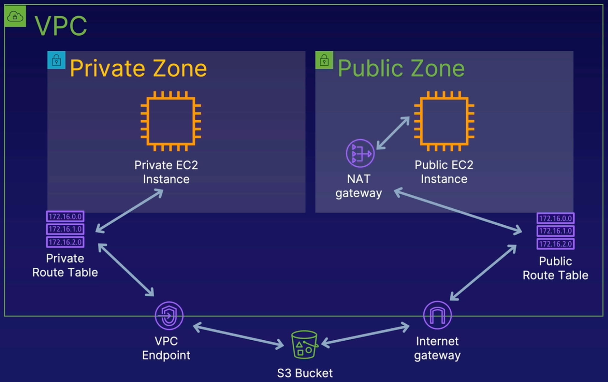

# Create VPC Endpoint and S3 Bucket in AWS

 

 

### ABOUT THIS LAB
In this hands-on lab, we will create a VPC endpoint and an S3 bucket to illustrate the benefits available for our cloud implementations. VPC endpoints can be used instead of NAT gateways to provide access to AWS resources. Many customers have legitimate privacy and security concerns about sending and receiving data across the public internet. VPC endpoints for S3 can alleviate these challenges by using the private IP address of an instance to access S3 with no exposure to the public internet.

 

### Objectives
- **Create an S3 Bucket**
- **Create a VPC Endpoint**
- **Verify VPC Endpoint Access to S3**

   

## Solution
## Create an S3 Bucket
1. From the AWS Management Console, navigate to `EC2`.
2. In the **Resources** section, select `Instances (running)`.
3. Rename the first instance:
    - Select the checkbox next to the first instance. If you selected the **private instance**, you should see in the instance's Details section that the **Public IPv4 address field is blank**. If you selected the **public instance**, you should see in the instance's Details section that the **Public IPv4 address field has an address value**.
    - In the instance's Name column, select the clipboard icon.
    - In the `Edit Name` field, enter public or private depending on which instance type is selected.
    - Click `Save`.
4. Rename the second instance:
    - Deselect the first instance's checkbox, and then select the checkbox next to the second instance.
    - In the instance's Name column, select the clipboard icon.
    - In the **Edit Name** field, enter `public` or `private` depending on which instance type is selected.
    - Click `Save`.
5. Navigate to `S3`.
6. On the right, click `Create bucket`.
7. Fill in the bucket details:
    - **Bucket name**: In the text field, enter `vpcendpointbucket`, followed by a random string of characters to ensure the bucket name is globally unique (e.g., `vpcendpointbucket917321647`).
    - **AWS Region**: Ensure that `US East (N. Virginia) us-east-1` is selected.
Leave all other settings as the defaults and click Create bucket.

 

## Create a VPC Endpoint
1. Navigate to `VPC`.
2. In the left sidebar menu, navigate to `Virtual private cloud` and select `Endpoints`.
3. On the right, click `Create endpoint`.
4. Fill in the endpoint details:
    - **Name tag**: You can leave this field blank.
    - **Service category**: Ensure that AWS services is selected.
    - **Services**: Use the services search bar to search for `s3`, and then select the `com.amazon.us-east-1.s3` service.
    - From the available options, select the `com.amazon.us-east-1.s3` gateway service (ensure the type is Gateway).
    - **VPC**: Use the dropdown to select the provided VPC.
5. Observe that two route tables are available. You'll need to select the correct route table to proceed. In a new browser tab, navigate to `VPC`.
6. In the sidebar menu, navigate to `Virtual private cloud` and select `Route tables` in the left navigation.
7. Rename the private route table:
    - Select the checkbox next to the route table without a name.
    - In the table's **Name** column, select the clipboard icon.
    - In the **Edit Name** field, enter `private`.
    - Click `Save`.
8. Select the `Subnet associations` tab of the private route table. In the **Subnets without explicit associations** section, you should see a subnet already associated with the route table.
9. If there is no subnet associated with the route table, associate a subnet:
    - In the **Subnets without explicit associations** section, click `Edit subnet associations`.
    - In the **Available subnets** section, check the checkbox next to the subnet with the private route table ID.
    - Click `Save associations`.
        > Note: If there is already an associated subnet, skip this step.
10. Navigate back to the **Create endpoint** tab.
11. In the **Route tables** section, check the checkbox next to the route table with no name.
12. Leave the remaining sections as the defaults and click `Create endpoint`.

 

## Verify VPC Endpoint Access to S3
1. In the sidebar menu, navigate to `Virtual private cloud` and select `Route tables`.
2. Select the checkbox next to the `private` route table.
3. Select the `Routes` tab and note that AWS has automatically updated the private route table with a route to the VPC endpoint.
    > Note: This may take a moment.
4. Log in to the terminal provided for the lab using the Cloud Server of Public Instance credentials provided in the lab resources:

    `ssh cloud_user@<PUBLIC_IP_ADDRESS>`

5. When prompted, enter yes and then enter the password provided in the lab resources.
6. From the public instance, log in using the Cloud Server of Private Instance credentials provided in the lab resources:

    `ssh cloud_user@<PRIVATE_IP_ADDRESS>`

7. When prompted, enter yes and then enter the password provided in the lab resources.
8. View the S3 bucket:

    `aws s3 ls`

    You should see two S3 buckets — the one provided for the lab and the one you created.
