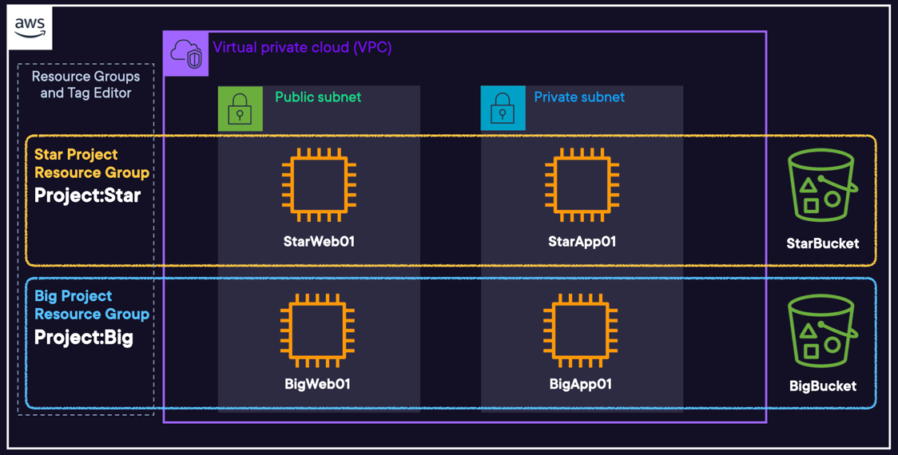

# Creating AWS Tags and Resource Groups

 

### ABOUT THIS LAB
To simplify the management of AWS resources such as EC2 instances, you can assign metadata using tags. Resource groups can then use these tags to automate tasks on large numbers of resources at one time. They serve as a unique identifier for custom automation, to break out cost reporting by department, and much more. In this hands-on lab, you will create a project-level tag and assign it to multiple resources at once, before creating a resource group based on the tag.

 

### Objectvies
- Create and Assign Project-Level Tags to Resources
- Create Resource Groups from the Assigned Tags
- Test Resource Groups through AWS CloudWatch

 

## Solution
## Create and Assign Project-Level Tags to Resources
### Review the Pre-configured Resources
1. In a new browser tab, navigate to `EC2` > `Instances (running)`.
2. Select any of the instances listed.
3. In the search bar, enter `S3`, and open it in a new tab. You will see two buckets with starbucket and bigbucket in the names.

 

### Module 1 Tagging
1. In a new browser tab, navigate to `Resource Groups & Tag Editor`.
2. Click `Tag Editor` in the left-hand menu.
3. In the `Find resources to tag` section, set the following values:
    - **Regions**: Select `us-east-1`. (It should already be selected.)
    - **Resource types**:
        - Enter and select `AWS::EC2::Instance`.
        - Enter and select `AWS::S3::Bucket`.
4. Click `Search resources`.
5. In the `Resource search results` section, set the following values:
    - In the `Filter resources` search window, enter star(`*`), and press Enter to execute the search.
    - Select all the resources, and click `Clear filters`.
6. Click `Manage tags of selected resources`.
7. In the Edit tags of all selected resources section, click `Add tag`, and set the following values:
    - **Tag key**: Enter `Project`.
    - **Tag value**: Enter `Star`.
8. Click `Review and apply tag changes` > `Apply changes to all selected`.
9. Navigate to the `S3` browser tab, click on the starbucket bucket > `Properties` tab.
10. Scroll down to `Tags`, and you should see Project under Key, with Star as the Value.

 

### Module 2 Tagging
1. Navigate back to the `Resource Groups Management` browser tab.
2. With the same Region and resource types selected from the previous step, click `Search resources` again.
3. In the Resource search results section, set the following values:
    - In the Filter resources search window, enter `big`, and press Enter.
    - Select all of the instances.
4. Click `Manage tags of selected resources`.
5. In the `Edit tags` of all selected resources section, click `Add tag`, and set the following values:
    - **Tag key**: Enter `Project`.
    - **Tag value**: Enter `Big`.
6. Click `Review and apply tag changes` > `Apply changes to all selected`.

 
