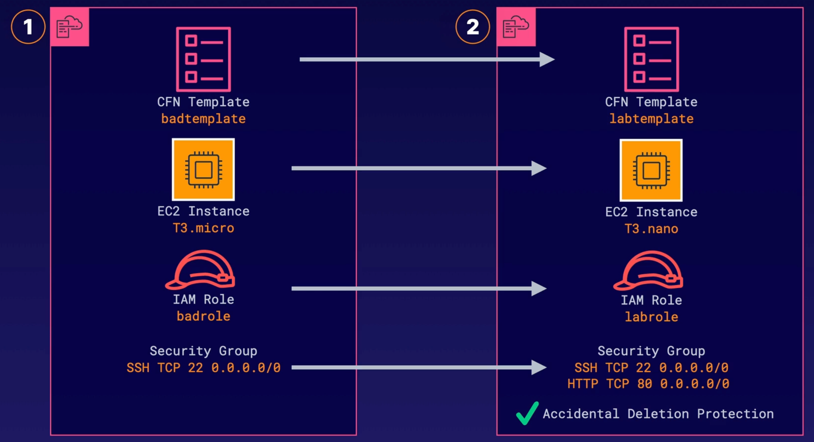

# Configure a CloudFormation Template

<br>



<br>

### ABOUT THIS LAB
In this lab, you will be provided with a CloudFormation template that requires a few configuration changes to various resources within the existing CloudFormation stack to include EC2 instances, security groups, and IAM instance profiles.

<br>

### Objectives
- Modify the Provided CloudFormation Template
- Deploy the CloudFormation Template
- Verify That Stack Resources Reflect the Updated Configuration

<br>

## Solution
## Modify the Provided CloudFormation Template
1. Navigate to `CloudFormation` using the Services menu or the unified search bar.
2. Select the provisioned stack name, and then click `Update` on the right.
3. In the `Prerequisite - Prepare template` section of the stack editor, select `Edit template` in designer.
4. On the right, click `View in Designer`.<br>The template opens in **CloudFormation Designer**.
5. In the template, scroll down to the `EC2Instance` block (line 106), and change the `InstanceType` on line 111 to `t3.nano`.
6. Copy the `LabInstanceProfile` variable on line 154 and paste it on line 112 to replace the `BadInstanceProfile`. Line 112 should now look like this:

    `IAMInstanceProfile !Ref 'LabInstanceProfile'`

7. Update the security group ingress rules:
    - Copy the `SecurityGroupIngress` block starting on line 125.
    - Paste your duplicate copy directly under the first block.
    - In the second block, change the `FromPort` and `ToPort` values to port `80`.
    
    The `SecurityGroupIngress` block should now look like this:

    ```yaml
    SecurityGroupIngress
      - CidrIp: "0.0.0.0/0"
        FromPort: 22
        IpProtocol: "tcp"
        ToPort: 22
      - CidrIp: "0.0.0.0/0"
        FromPort: 80
        IpProtocol: "tcp"
        ToPort: 80
    ```


<br>

## Deploy the CloudFormation Template
1. In the upper right corner of the CloudFormation Designer, click the refresh icon to view the template visual diagram.
2. In the upper left, click the checkmark icon to validate the template.
3. To the left of the checkmark icon, click the `Create stack` icon.
4. Click Next until you reach the Review page of the stack editor.
5. Review your stack edits, and then scroll to the bottom of the page and click `I acknowledge that AWS CloudFormation might create IAM resources with custom names`.
6. Click `Submit`.

    > Note: It may take several minutes for the stack to update. When finished, you will see a status update of `UPDATE_COMPLETE`.
7. Select the `Template` tab to review your final CloudFormation template.
8. To track the stack's progress as it updates, select the `Events` tab and then click the `Refresh` icon on the right.

<br>
