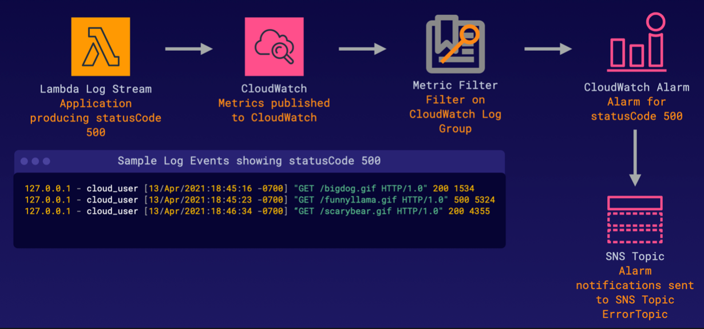

# Configure an Alert Based on Logging Content

### ABOUT THIS LAB
In this lab, we'll walk through the process to filter over existing logging data inside of CloudWatch Logs. We'll start by creating a SNS topic without a subscription, then filter our CloudWatch Logs data to create a metric filter. After creating a metric filter and defining our metric, we will configure an alarm to send notifications to our created SNS topic.

 

### Objectives
- Create an **SNS Topic** Named ErrorTopic without a Subscription
- Create a **Metric Filter** on the TrackMyErrors CloudWatch Logs Log Group Filtering for StatusCode 500
- Create an **Alarm** Based on the Metric You Created

 

## Solution
