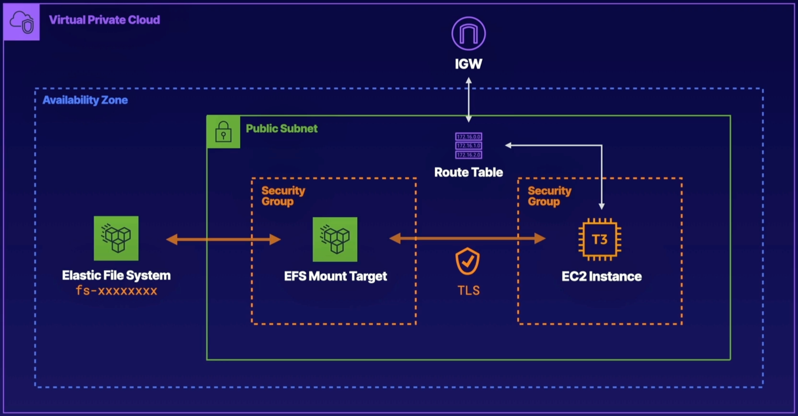

# Configure At Rest Encryption for EFS

 

### ABOUT THIS LAB
Amazon Elastic File System (EFS) provides incredible scalability for your storage requirements, making it easy to share data across hundreds or even thousands of EC2 instances. In this lab, you will create an Amazon Elastic File System in the us-east-1 Region with encryption enabled. You will also configure mount targets for this file system, enforce encryption in flight, and finally, mount the file system to a pre-created EC2 instance.

 

### Objectives
- Create an EFS File System Named devshare with Encryption Enabled
- Create a Mount Target for EFS Using EFSMountSecurityGroup
- Apply a File System Policy to the EFS Volume to Enforce In-Transit Encryption for All Clients
- Mount the EFS Volume to the EC2 Instance and Create a File on the Elastic File System

 

## Solution
## Create an EFS File System Named devshare with Encryption Enabled
1. From the AWS Management Console, search for and navigate to `EFS`.
2. On the right, click `Create file system`.
3. In the Name field, enter `devshare`.
4. Leave the other fields as the default settings and click `Create`. Your `devshare` file system is created with encryption enabled.

 

## Create Mount Targets for EFS Using the EFSMountSecurityGroup in Each Availability Zone
1. Select the `devshare` file system name to open the file system details.
2. Select the `Network` tab and *wait for the mount target state to become available*. This may take a few minutes, and you may need to click the **Refresh** icon on the right to update the status.
3. After the mount target state is available, click `Manage` on the right.
4. In the `Security` groups field, click `X` to clear the existing security group.
5. Use the `Security groups` dropdown to select the `EFSMountSecurityGroup` group.
6. Click `Save`. You should now see that the `EFSMountSecurityGroup` is applied to your mount target.
