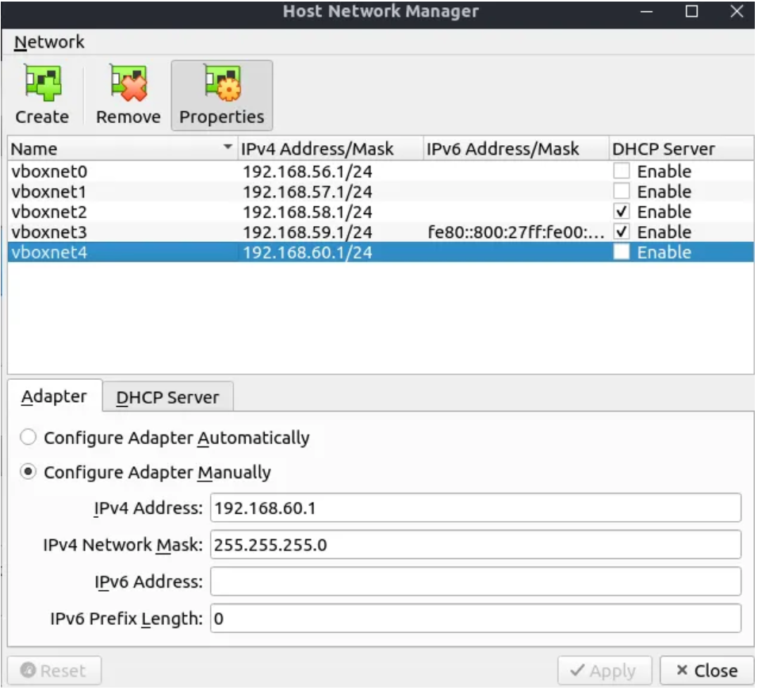

# Install and Configure Kubernetes

[Configuration Guide Source](https://medium.com/@mojabi.rafi/create-a-kubernetes-cluster-using-virtualbox-and-without-vagrant-90a14d791617)

### Setting up Kubernetes cluster in action
In the nutshell, we are going to implement the following architecture for setting up our Kubernetes cluster.

### There are some key-points apparent in the figure 1.
- We start off by 1 master node
- We have 3 worker nodes
- Each VM has 2 network interfaces.
- One network interface is attached to default NAT network in virtualbox. the purpose of this network is to provide the node internet access.
- Another network interface is attached to a Host-Only network in virtualbox. All inside cluster communications would be through this network.

 

## Prepare VirtualBox machines for deploying Kubernetes cluster
According to diagram below, We need a private network that nodes can communicate with each other though. To create one go to **File** -> **Host Network Manager**. Create new network there with **no DHCP Enable** option. Use 192.168.60.1/24 for IP range.

 

## VM’s OS and configuration:
Use following setup as of our VMs:
**Master**:
— Name: `master#` (number of master in the cluster)
— OS: `ubuntu-server-18.04`
— CPU: `2 core`
— Memory: `2GB`
**Workers**:
— OS: `ubuntu-server-18.04`
— CPU: `1 core`
— Memory: `1GB`
Please note each of the VMs should benefit from 2 networks. One default NAT network which provides internet access to our node, Another attached to Host Only Network created in previous step.