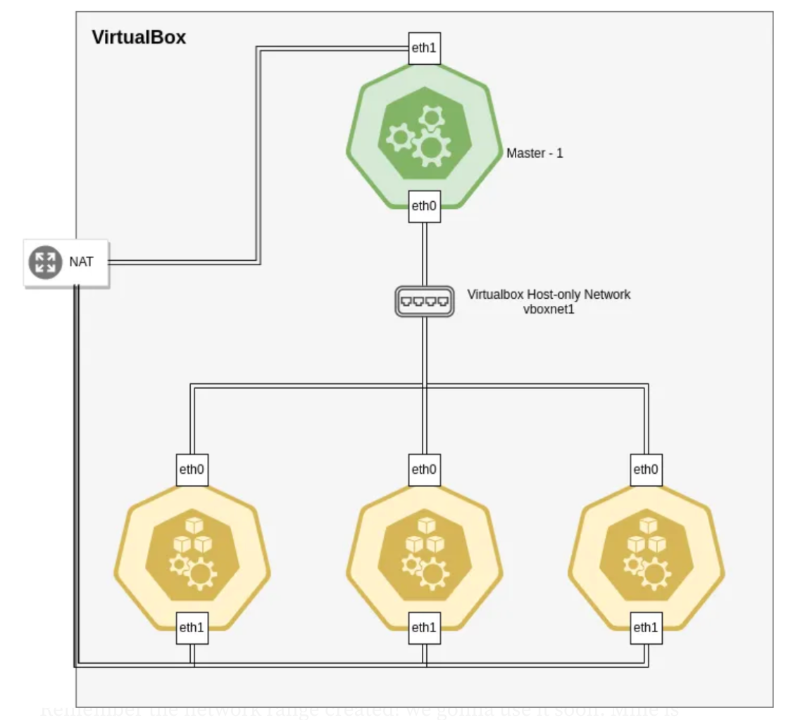

# Install and Configure Kubernetes

### Setting up Kubernetes cluster in action
In the nutshell, we are going to implement the following architecture for setting up our Kubernetes cluster.

### There are some key-points apparent in the figure 1.
- We start off by 1 master node
- We have 3 worker nodes
- Each VM has 2 network interfaces.
- One network interface is attached to default NAT network in virtualbox. the purpose of this network is to provide the node internet access.
- Another network interface is attached to a Host-Only network in virtualbox. All inside cluster communications would be through this network.

