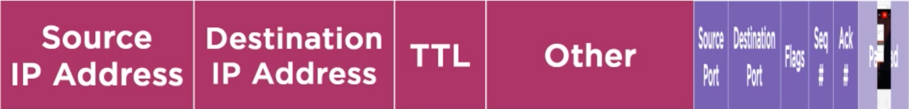
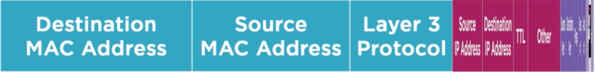

# Introduction to Networking for Cisco CCNA

### Description 
In this course, Introduction to Networking for Cisco CCNA, you will examine how basic human communication, like talking in person or on the phone, contains the same fundamental concepts used in moving data across a network. 

First, you will learn how to examine communication, and determine how to dissect it into components so it can be individually categorized and described. 

Next, you will learn how to break down communication into components, which will be of great benefit when understanding data networking, as there are many simple protocols which interact in complex ways. 

To accomplish this you will learn the TCP/IP and OSI models of networking, encapsulation, addressing, as well as what is called "chunks of information" at different points in the communication process. 

Finally you'll learn about the history and the birth of high speed data communications. By the end of this course, you'll know the OSI Model, TCP/IP Model, and you'll have an understanding of what encapsulation is as it relates to data networking.

<br>

## A Brief History of Moving Information
### Introduction to Networking
**Definition**
* Networking is the process of transferring information between two or more parties.
* Communication can be direct (spoken words) or via various transmission methods.

**Basic Communication Process**
1. **Message Creation** – Formulate the concept (e.g., “What time is it?”).
2. **Encoding** – Convert the concept into a form suitable for transmission (spoken language, written symbols, electrical signals).
3. **Transmission Medium** – Physical or non-physical path for data (air, paper, wires).
4. **Decoding** – Receiver interprets the encoded message back into its original meaning.

<br>

**Historical Communication Methods and Networking Principles**

| Method | Mechanism | Limitation | Key Networking Concept Introduced |
|---|---|---|---|
| **Speech** | Air vibrations from vocal cords | Short distance | Encoding/decoding using language |
| **Mail** | Written symbols on paper | Slow delivery | Physical delivery of information  |
| **Pony Express** | Horses carrying messages | Limited speed | Faster transport of physical data |
| **Telegraph** | Electrical pulses (Morse Code: dots/dashes) over wires | Manual encoding/decoding needed | Signal conversion over a medium |
| **Telephone** | Voice vibrations converted to electrical signals | Distance limited by wiring | Real-time signal transmission |

**Key Evolution Steps**
- **Telegraph** – Converted language into Morse Code (electrical pulses) and transmitted over wires.
- **Telephone** – Converted voice vibrations directly into electrical signals for transmission and then back to sound.
- **Email/Internet** – Uses digital encoding of messages, transmitted across complex interconnected networks.

**Core Networking Principle**

-  Data networking involves **translating a message from one form to another**, transmitting it over a medium, and **converting it back** for the receiver.


<br><br><br>


## Dissecting Communication
### Local And Global Addressing
- **Local Addressing**:
  - Names (e.g., “Homer” or “Marge”) act as local identifiers in the same environment.
  - Ensures correct communication within a local scope (e.g., at a party).
- **Global Addressing**:
  - Phone numbers act as unique global identifiers.
  - Enables communication across distances, not just within the same room.

**Communication Process Using Global Addressing (Phone Call Example)**
1. **Setup Phase (Protocol Overhead)**
   - Pick up phone, wait for dial tone, dial number, wait for ringing.
   - Receiver answers, initial greetings exchanged.
   - These steps establish communication but do not transfer actual data.
2. **Conversation (Data Exchange)**
   - The actual content: messages, questions, responses (e.g., “How was your day?”).
   - Represents the meaningful data transfer.
3. **Cues (Control Information)**
   - Maintain and regulate communication.
   - Examples:
     - *Acknowledgements*: “Uh huh”, “I see”.
     - *Errors*: “You’re breaking up”, “Please repeat”.
     - *Termination*: “Goodbye”, “See you later”.

**Media (Transmission Mediums)**
- **Air** – carries spoken language via sound waves.
- **Wires** – carry electrical signals converted from voice by the telephone.

**Five Categories of Networking Concepts (Party/Phone Analogy)**
1. **Local Address** – Name (used for communication in the same environment).
2. **Global Address** – Phone number (used for long-distance communication).
3. **Cues** – Setup, acknowledgements, error handling, termination.
4. **Data** – Actual content of the conversation.
5. **Media** – The physical medium that carries the signals (air, wires, etc.).

**Key Principle**
- Networking requires **addressing**, **protocols (cues)**, **data exchange**, and a **transmission medium**. These foundational elements map directly to how computer networks operate.

<br>

### Protocols and Communication Models
**Definition of a Protocol**
- A **protocol** is a set of rules used to move information between two parties (people or devices).
- In data communications, protocols ensure that information is transmitted, received, and understood correctly.
- Picking up the phone, waiting for a dial tone, dialing the number, and waiting for ringing are all part of the **phone communication protocol**. If these rules aren’t followed, the connection fails.

**Common Networking Protocols**
- **Ethernet** – Protocol for wired LAN communication.
- **SFTP (Secure File Transfer Protocol)** – Secure file transfers.
- **HTTP / HTTPS** – Web communication protocols.
- **IP (Internet Protocol)** – Provides addressing and routing.
- **TCP (Transmission Control Protocol)** – Reliable, connection-oriented communication.
- **UDP (User Datagram Protocol)** – Fast, connectionless communication.
- **BGP (Border Gateway Protocol)** – Routing protocol for exchanging information between networks.

<br>

> **Protocol Complexity**
> 
> Individual protocols are relatively simple.
> **Complexity arises from their interactions** (e.g., TCP/IP stack, web traffic using multiple layers).

**Role of Communication Models**
- A **communication model** organizes the process of data transfer into components.
- Helps break down complex networking interactions into structured layers.
- Makes it easier to analyze, understand, and troubleshoot networks.


<br><br><br>

## Network Communication Model
### Categorizing Data Transmissions
**Step 1:<br>Data (Application Content)**
- Example: A user requests a website (`www.pluralsight.com`).
- Data = the **actual content** (web page, email, file, etc.).
- Websites are essentially documents (HTML pages) transferred from server to client.
<br>

**Step 2:<br>Cues (Session Establishment – TCP)**
- To exchange data, communication must be **established, maintained, and closed**.
- Protocol used: **TCP (Transmission Control Protocol)**.
- **Three-Way Handshake (Session Setup):**
  1. **SYN** – Client → Server: “I want to connect.”
  2. **SYN-ACK** – Server → Client: “I acknowledge, I’m ready.”
  3. **ACK** – Client → Server: “Acknowledged, let’s transfer data.”
- Only after this setup can data (the web page) be transferred.
<br>

**Step 3:<br>Global Addressing (IP Layer)**
- Protocol: **IP (Internet Protocol)**.
- Provides **global addresses** so devices can find each other across networks.
- Example:
  - Client IP: `203.0.113.10`
  - Server IP: `198.51.100.80`
- **DNS (Domain Name System):**
  - Converts domain names (pluralsight.com) into IP addresses.
  - Acts as a "telephone book" of the internet.
- Data packets must have both **source IP** and **destination IP** (like addressing an envelope).
<br>

**Step 4:<br>Local Addressing (Ethernet & MAC Addresses)**
- Protocol: **Ethernet** (commonly used in LANs).
- Uses **MAC addresses** (unique identifiers burned into network interfaces).
- Process:
  - The IP packet (global addressing) is placed inside an Ethernet frame (local addressing).
  - Local addressing ensures the message reaches the next-hop device (usually the **default gateway / router**).
  - The router removes the local addressing and applies new local addressing for the next hop.
<br>

**Step 5:<br>Media (Physical Transmission)**
- The physical medium that carries the signals.
- Examples:
  - **Wires** (copper cabling)
  - **Radio waves** (Wi-Fi)
  - **Glass fibers** (fiber optics)
- All networking data must eventually travel through one of these mediums.

<br>

**Dependency Order of Communication**
To deliver a website request successfully, the following must exist (bottom to top):
1. **Media** – wires, radio, or glass.
2. **Local Addressing** – Ethernet with MAC addresses.
3. **Global Addressing** – IP addresses for end-to-end communication.
4. **Cues** – TCP (three-way handshake, acknowledgements, teardown).
5. **Data** – The actual content (web page, email, file, etc.).


<br>

## The OSI Model
**Definition:**
- **OSI (Open Systems Interconnect)** model — created in the 1970s.
- Purpose: Standard framework for understanding and describing **how data moves through a network**.
- Some parts are outdated, but it remains effective as a **teaching and reference model**.


### OSI Model Layers
#### 1. **Physical Layer**
- Represents the **physical components and media**.
- Examples: Wires, radio signals (Wi-Fi), fiber optics (glass).
- Concerned with transmitting raw **bits** over the medium.

#### 2. **Data Link Layer**
- Provides a **bridge between IP (Network Layer) and the physical media**.
- Responsible for **local communication**.
- Protocol example: **Ethernet**.
- Addressing method: **MAC addresses** (unique per device).
- Ensures delivery of data between devices **within the same local network (LAN)**.

#### 3. **Network Layer**
- Provides **global communication** using addressing.
- Protocol: **IP (Internet Protocol)**.
- Addressing method: **IP addresses**.
- Responsible for **routing** (moving data between networks).
- Devices: **Routers** operate at this layer.

#### 4. **Transport Layer**
- Responsible for **establishing and maintaining conversations** between devices.
- Protocols:
  - **TCP (Transmission Control Protocol):** Reliable, connection-oriented.
  - **UDP (User Datagram Protocol):** Faster, connectionless, less reliable.
- In our web example: **TCP sets up the session (three-way handshake), acknowledges, and ensures ordered delivery.**

#### 5. **Session Layer (OSI):**
- Manages **sessions** between devices.
- Example protocol: **SSL (Secure Sockets Layer)**, used in HTTPS.

#### 6. **Presentation Layer (OSI):**
- Ensures proper **data formatting and translation**.
- Example protocol: **Citrix ICA**.
- Historical need: converting between **ASCII (open standard)** and **EBCDIC (IBM proprietary)** text encodings.

#### 7. **Application Layer**
- The **top layer** where data is transferred and accessed by users.
- Protocols: HTTP/HTTPS (web), SMTP (email), FTP/SFTP (files).
- Responsible for delivering **actual content** such as websites, emails, and files.
  
> **Modern relevance:**
> - Today, most of these functions are handled at the application layer itself.
> - For CCNA, **session and presentation layers are not critical**.

<br>


## OSI Model vs. TCP/IP Model
### TCP/IP Model Overview
**Definition:**
- **TCP/IP model** focuses exclusively on the **TCP/IP protocol suite**.
- Developed in the early 1980s (official adoption).
- More practical for modern networking than the OSI model.
- Used as the **foundation of the Internet**.

**Why do we have both models?**
- **OSI model (1970s):** Came first; networking standards were not yet established (no TCP, IP, Ethernet, or websites).
- **TCP/IP model (1980s):** Designed around real-world protocols (TCP, IP, Ethernet) that became the Internet’s backbone.
- In CCNA, you must understand **both models and their mapping.**


### TCP/IP Model Layers and Mapping

| **TCP/IP Model**| **Equivalent OSI Layers**| **Function**|
|---|---|---|
| **Network Interface** | Physical + Data Link| Covers both the physical medium (wires, radio, fiber) and the protocol for using that medium (e.g., Ethernet, Wi-Fi, Fiber Ethernet). |
| **Internet**| Network| Provides global addressing and routing (IP protocol, routers).|
| **Transport**| Transport| Responsible for end-to-end communication, reliability, and sessions (TCP, UDP).|
| **Application**| Session + Presentation + Application | Everything above Transport: websites (HTTP/HTTPS), email (SMTP), file transfers (FTP), remote access, etc.|


### Practical Networking Focus
- As a **network engineer**, your main concern is with:
  - OSI layers **1–4** (Physical, Data Link, Network, Transport).
  - TCP/IP layers **1–3** (Network Interface, Internet, Transport).

- Layers above these are usually **application issues**, not network engineering.
  - Example: If TCP (Transport Layer) is working (segments moving correctly), but the website doesn’t load, the problem is **application-level**, not the network.


<br><br><br>

## Encapsulation

**OSI Model (7 layers)**
1. **Physical**
2. **Data Link**
3. **Network**
4. **Transport**
5. **Session**
6. **Presentation**
7. **Application**

### Understanding the OSI Model from Top to Bottom
- The **OSI model** has 7 layers, from **Physical (Layer 1)** up to **Application (Layer 7)**.
- **Physical layer**: The medium for transmission (wires, fiber optics, radio waves).
- **Application layer**: Where the user interacts with data (websites, applications, protocols).

<br>

### Relevance of Layers 5 and 6
- **Session Layer (5)** and **Presentation Layer (6)** are often **less relevant in networking operations**.
- While some protocols exist here (e.g., SSL, Citrix ICA), they are typically grouped into the **Application Layer** for networking purposes.
- In practice, network engineers are more focused on Layers 1–4 (Physical, Data Link, Network, Transport).

<br>

### Top-Down Approach to Learning OSI
- Start with the **Application Layer**: easiest to understand because it’s tangible (websites, apps).
- Work **downward** through Transport, Network, Data Link, and Physical layers.
- This approach makes it easier to connect the **user experience** (like browsing a website) with the underlying network processes.


<br>

## How Encapsulation Works

| OSI Layer| Data Unit | What Happens at This Layer| Key Fields/Headers| |
|---|---|---|---|---|
| **Application (L7)** | Data | User requests website (*[www.pluralsight.com](http://www.pluralsight.com)*). Website content prepared for transfer. | HTTP request/response (HTML, video, etc.)||
| **Transport (L4)** | Segment | Data broken into manageable chunks. Each chunk wrapped with **TCP header**.| - Source Port / Destination Port <br> - Sequence Number <br> - Acknowledgment Number <br> - Flags (SYN, ACK, FIN)||
| **Network (L3)** | Packet | Transport segment placed into **IP packet**. Packet given logical addressing for end-to-end delivery. | - Source IP / Destination IP <br> - TTL (Time to Live) <br> - Protocol field (e.g., TCP = 6, UDP = 17)||
| **Data Link (L2)** | Frame | IP packet placed into **Ethernet frame** for local delivery.| - Source MAC / Destination MAC <br> - Type field (identifies Layer 3 protocol, e.g., IPv4 = 0x0800) <br> - Error check (CRC/FCS) ||
| **Physical (L1)**| Bits | Frame converted to 1s and 0s → transmitted as electrical signals, light pulses, or radio waves. | Media: copper, fiber, wireless||


### Key Concepts
- **Encapsulation**: Each layer adds its own header to the data from the layer above.
- **Terminology**:
  - **Segment** = L4 data unit (TCP/UDP).
  - **Packet** = L3 data unit (IP).
  - **Frame** = L2 data unit (Ethernet).
  - **Bits** = L1 transmission.
- **TTL** ensures packets don’t loop forever.
- **MAC addresses** = local delivery, **IP addresses** = global delivery.
- **Analogy**: Like nesting envelopes → data gets wrapped repeatedly until it’s ready to travel.


<br><br><br>


## Data Networks and Addressing
## Addressing the Network
#### Key Points
- **Home networks**: Multiple devices (PCs, tablets, smart TVs, IoT, etc.) connect to a **router** (also called *gateway* or *default gateway*).
- The **router** bridges the **local network (LAN)** and the **internet (WAN)**.
- **Default gateway** = the router a device uses when no other route exists.
- **Local addressing** at the **Data Link layer (Layer 2)** uses **MAC addresses**.
  
### MAC Address
- **Definition**: A unique identifier (48-bit number) burned into every **Network Interface Card (NIC)**.
- **Format**: Written in hexadecimal (12 hex digits, usually shown as 6 pairs).
  - First 24 bits → **Manufacturer ID** (OUI).
  - Last 24 bits → **Device serial number**.
- **Uniqueness**: Designed to be globally unique, but duplicates may sometimes occur.
- **Function**:
  - Identifies devices on the **local network**.
  - Used in **frames** (Data Link Layer unit).
- **NIC role**: Converts signals (Layer 1) into frames (Layer 2) and vice versa.

### OSI / TCP-IP Mapping
- **Data Link layer (L2)** in OSI ↔ **Network Interface layer** in TCP/IP.
- Encapsulation here = **Frame** with **MAC addresses** (source & destination).


### Quick Reference Table

|**Layer**|**Data Unit**|**Address Used**|**Purpose**|**Example**|
|---|---|---|---|---|
| **Application (L7)** | Data      | URLs, Hostnames | User interaction          | [www.pluralsight.com](http://www.pluralsight.com)|
| **Transport (L4)**   | Segment   | Port numbers    | App-to-app communication  | TCP 80 (HTTP)|
| **Network (L3)**     | Packet    | **IP Address**  | End-to-end delivery       | 192.168.1.10 → 142.250.190.68|
| **Data Link (L2)**   | Frame     | **MAC Address** | Local delivery within LAN | 00:1A:2B:3C:4D:5E|
| **Physical (L1)**    | Bits      | N/A (signals)   | Transmission medium       | Electrical pulses, radio waves|


>  **Analogy**
> 
> - **IP addresses** = "postal addresses" (for global delivery).
> - **MAC addresses** = "names inside the house" (for local delivery).

<br><br><br>

## How Local Communication Works
### Key Concepts
- **Router’s role**: Separates **two distinct networks** (inside vs. outside).
- A router has **two (or more) MAC addresses**:
  - One for the **internal (LAN) interface**.
  - One for the **external (WAN/Internet) interface**.
- **Frames** are strictly **local**:
  - A frame built on the LAN side **cannot cross** into the WAN side.
  - A frame built on the WAN side **cannot cross** into the LAN side.
- Reason: **Data Link Layer = local only**. Frames are only valid within a single broadcast domain.
- To move between networks, the router must **de-encapsulate** the frame, process the packet, and then **re-encapsulate it** into a new frame for the next network.

### Visualization Table
| Layer | Inside Network (LAN) | Router Behavior | Outside Network (WAN) |
|---|---|---|---|
| **L2 (Frame)** | Frame with **Source = PC MAC**, **Destination = Router MAC (LAN)** | Router strips LAN frame → processes L3 packet | Router builds new frame with **Source = Router MAC (WAN)**, **Destination = ISP/next-hop MAC** |
| **L3 (Packet)**| Contains **Source IP = PC**, **Destination IP = Internet server**  | Router forwards packet unchanged (IP stays the same) | Packet continues toward destination |
| **Key Rule** | Frames are **local only**| Router = boundary between networks | New frame must be created |


<br><br><br>


## Global Addressing with Routers
### Key Concepts
- To communicate beyond the **local network**, devices need:
  1. **IP Address** (unique identifier within the subnet).
  2. **Subnet Mask** (defines which addresses are local vs. remote).
  3. **Default Gateway** (the router’s IP address used to reach remote networks).
- **Router Interfaces:**
  - **Inside interface (LAN)** → local IP (e.g., `192.168.104.1`) + local MAC.
  - **Outside interface (WAN)** → public/global IP (e.g., `203.0.113.8`) + separate MAC.
- **Frames vs. Packets:**
  - **Frame (L2)** → local only (uses MAC addresses).
  - **Packet (L3)** → end-to-end delivery (uses IP addresses).
  - Each time a packet crosses a router:
    - Old frame is discarded.
    - Router builds a **new frame** for the next network.
    - The **packet itself (IP header + payload)** stays the same.


### Visualization Table

| Stage                     | Device/Interface                                      | Frame (L2)                                      | Packet (L3)                                                        |
| ------------------------- | ----------------------------------------------------- | ----------------------------------------------- | ------------------------------------------------------------------ |
| **1. Tablet → Router**    | Tablet sends to **Default Gateway** (`192.168.104.1`) | Src MAC = Tablet, Dst MAC = Router (LAN)        | Src IP = `192.168.104.9`, Dst IP = `pluralsight.com`               |
| **2. Router (LAN side)**  | Router receives frame                                 | Frame discarded                                 | Packet extracted and processed                                     |
| **3. Router (WAN side)**  | Router builds **new frame** for ISP                   | Src MAC = Router (WAN), Dst MAC = ISP’s gateway | Same packet (Src IP = `192.168.104.9`, Dst IP = `pluralsight.com`) |
| **4. Across Internet**    | Each router hop repeats process                       | Each router rebuilds frame for next link        | Packet remains unchanged end-to-end                                |
| **5. Destination Server** | Server receives packet                                | Final frame stripped                            | Packet delivered to application                                    |

### Takeaway
- **Frames are local messengers**: they only get packets to the next hop within one network.
- **Packets are global messengers**: they keep the original source and destination IP, enabling end-to-end communication across many networks.
- At every router:
  - **Frames die and are reborn.**
  - **Packets live on until final destination.**


<br><br><br>


## IP Networks
### Key Concepts
- **Routers = Layer 3 devices**
  - Job: move traffic **between different unique IP networks**.
  - Each interface has its own **IP address** and belongs to a **unique subnet**.
- **Subnet Masks**
  - Separate IP address into:
    - **Network portion** (defines group of devices).
    - **Host portion** (identifies individual device).
  - Example:
    - IP: `192.168.104.9`
    - Mask: `255.255.255.0`
    - Network portion: `192.168.104`
    - Host portion: `.9`
- **Analogy:**
  - Network portion = Zip Code (group area).
  - Host portion = House Number (specific location).


### Example Scenarios
| Scenario                             | Device A (Left PC) | Device B (Right PC) | Result                                                                |
| ------------------------------------ | ------------------ | ------------------- | --------------------------------------------------------------------- |
| **Different Networks (No Router)**   | `192.168.104.1/24` | `203.0.113.8/24`    | Cannot communicate (different subnets, no router). Message discarded. |
| **Same Networks (Direct)**           | `192.168.104.1/24` | `192.168.104.2/24`  | Can communicate directly (same subnet).                               |
| **Different Networks (With Router)** | `192.168.104.1/24` | `203.0.113.8/24`    | Router forwards packets between networks → communication works.       |

### Behavior Rules
1. **Devices directly connected (same cable or switch):**
   - Must be in the **same subnet** to communicate without a router.
2. **Devices in different subnets:**
   - Must use a **router** (default gateway) to communicate.
3. **Subnet mask enforces the rule**:
   - It tells a device whether the destination IP is local (same subnet) or remote (needs router).

### Takeaway
- Routers separate unique IP networks.
- Subnet masks define the boundary between **local communication (direct)** and **remote communication (via router)**.
- Two devices on the same local network **must share the same network portion** of their IP address.


<br><br><br>

## Demo: Examining the IP Address of a Workstation
### Common IP Setup in Home Networks
- All devices on the LAN typically share the same **network prefix**:
  - Example: `192.168.104.x`
  - Workstation: `192.168.104.5`
  - Tablet: `192.168.104.9`
  - Router (Default Gateway): `192.168.104.1`
- Subnet Mask: `255.255.255.0` → Defines the **network portion** (`192.168.104`) vs. **host portion** (`x`).
- Default Gateway: Points to the router’s IP; used for traffic leaving the local subnet.

### Useful Windows Commands
- **Command Prompt (`cmd`)** → Access troubleshooting commands.
- **`ipconfig`** (`ifconfig -a` on Unix) Displays:
  - Interfaces & adapters (Ethernet, Wi-Fi, Bluetooth, Tunnel, etc.)
  - IP address
  - Subnet mask
  - Default gateway

- **`ping` \[IP/Hostname]** → Tests connectivity to devices.

### Important Concepts
- Focus only on the **active network adapter** (e.g., Ethernet0 or Wi-Fi). Ignore virtual adapters (e.g., Bluetooth, Teredo, ISATAP).
- Having an IP + gateway configured does not guarantee communication → must test with **ping**.
- Routers separate the **LAN (inside)** and the **WAN (outside)** networks.


<br><br><br>


## Using Ping and IPCONFIG for Basic Troubleshooting
### Ping (Packet Internet Groper)
- **Definition**: Utility to test network connectivity between devices.
- **How it works**:
  - Sends an **ICMP Echo Request** to a target device.
  - Target responds with an **ICMP Echo Reply** if reachable.

### Example Commands
- **Ping router (default gateway)**:
  ```bash
  ping 192.168.104.1
  ```
  - Confirms local connectivity to the router.
  - 
- **Ping another host (tablet) 5 times**:

  ```bash
  ping 192.168.104.9 -c 5
  ```
  - If successful, host is online (`64 bytes from 192.168.1.1: icmp_seq=4 ttl=64 time=2.302 ms`)
  - If "Request timed out", host may be powered off, asleep, or blocked by firewall (`Request timeout for icmp_seq 0`)


<br><br><br>


## IP Address Configuration and Testing
### Key Concepts
* Devices must share the **same network portion** of the IP address (per subnet mask) to communicate directly.
* If devices are on **different networks**, a **default gateway (router)** is required.
* Without a default gateway, packets destined for another network will **fail immediately** (no transmission).


### Changing IP Address
#### On **Windows**
1. Open **Network and Sharing Center** → **Change adapter settings**.
2. Right-click adapter (e.g., `Ethernet0`) → **Properties**.
3. Select **Internet Protocol Version 4 (TCP/IPv4)** → **Properties**.
4. Choose **Use the following IP address** → manually enter:
   - **IP address** (e.g., `203.0.113.8`)
   - **Subnet mask** (e.g., `255.255.255.0`)
   - **Default gateway** (optional, but required to reach other networks).
5. Verify change:

   ```powershell
   ipconfig
   ```

#### On **Linux / macOS (Unix-like systems)**
**Temporary (until reboot):**

```bash
# Check current config
ifconfig   # or: ip addr show

# Assign new IP + subnet mask
sudo ifconfig eth0 203.0.113.8 netmask 255.255.255.0 up
# or with ip tool (preferred modern way):
sudo ip addr add 203.0.113.8/24 dev eth0

# Remove old IP (if needed)
sudo ip addr del 192.168.104.5/24 dev eth0

# Set default gateway (optional)
sudo route add default gw 203.0.113.1
# or:
sudo ip route add default via 203.0.113.1
```

**Permanent (after reboot):**
- **Linux (Ubuntu/Debian):** edit `/etc/netplan/*.yaml` or `/etc/network/interfaces`.
- **macOS:** System Preferences → Network → select adapter → **Manually assign IPv4**.


### Example Case
- PC set to `203.0.113.8/24`
- Tablet set to `192.168.104.9/24`
- No default gateway → **Ping fails** because devices are on different networks.

### Takeaways
- **Same subnet = direct communication.**
- **Different subnets = need a router.**
- **Ping errors**:
  - *Request timed out* = no reply from destination.
  - *General failure* = no route to destination (often missing gateway).
