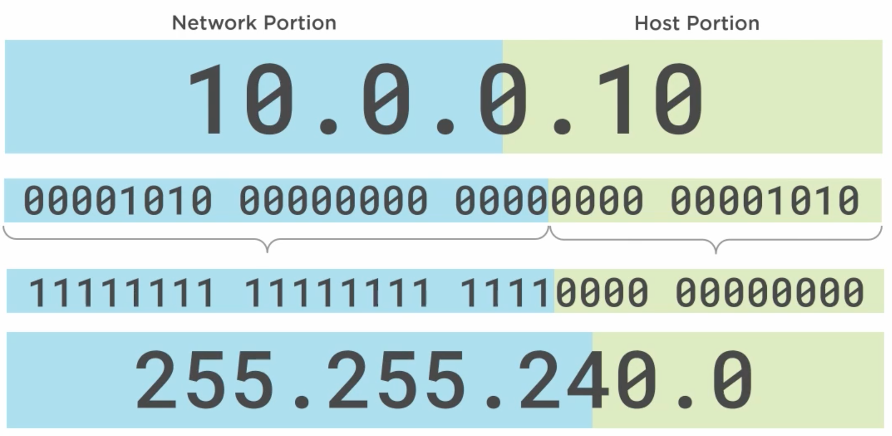

# Network Layer Addressing and Subnetting
by Ross Bagurdes

### Table of Contents
- **Introduction to Binary**
  - Binary 101
  - Converting Binary to Decimal
  - Converting Decimal to Binary
  - Hexadecimal
- **Introduction to IP Addressing**
    - What Is an IP Address?
    - Classless Addressing
    - Classful Addressing
    - Address Types
    - Private and Public Addresses
    - Demo: Modify and Test IP Configuration
- **Introduction to Subnetting**
  - Framework for Discussing Subnetting
  - Making a Subnet Calculator
  - Subnetting a Network into Smaller Networks
- **Subnetting Examples**
  - Subnetting 10.0.50.0/24 into 11 Networks
  - Subnetting 10.0.0.0/16 into 500 Networks
  - Subnetting 10.200.0.0/13 into 200 Networks
  - Subnetting 192.168.224.0/21 into 50 Networks
  - Subnetting 172.16.128.0/17 into 30 Networks
  - Subnetting 172.17.20.0/22 into 17 Networks
  - Subnetting 172.31.96.0/19 into 300 Networks
- **Introduction to IPv6**
  - IPv4 Addresses vs. IPv6 Addresses
  - The Structure of an IPv6 Address
  - IPv6 Addresses Operation
  - IPv6 Address Types
  - How Many IPv6 Addresses?
  - Demo: Examine IPv6 Information on a PC
  - IPv6 Address Acquisition - Static
  - Demo: Configure IPv6 Address Statically
  - IP Address Acquisition - SLAAC
  - Demo: IPv6 SLAAC
  - IPv6 Address Acquisition - DHCP
- **IPv6 Subnetting**
  - The IPv6 Subnet Mask
  - Subnetting IPv6
  - Subnetting IPv6 /48
  - Subnetting IPv6 /56
- **Router Operation**
  - Introduction
  - Basic Router Operation
  - Demo: Examining a Two Network Configuration
- **Variable Length Subnet Masking (VLSM)**
  - The Need for Variable Length Subnet Masking (VLSM)
  - Setting up the VLSM Problem
  - Calculating Your Networks
  - Another VLSM Practice Problem
- **Check Your Knowledge**
  - IPv4 Exercises
  - IPv6 Exercises


<br><br><br>


## Introduction to Binary
### Module Goals
- Understand **why binary numbering is necessary** in networking.
- Review **primary school math concepts** to build intuition for binary.
- Learn **how to count in binary (base 2)**.
- Practice **conversions**:
  - Binary > Decimal
  - Decimal > Binary
- Introduce **Hexadecimal** and its role in networking.

### Purpose
- Binary and hexadecimal provide the foundation for understanding **IPv4 and IPv6 addressing**.
- These concepts are essential before diving deeper into **IP addressing and subnetting** in data networking.


<br><br><br>

## Binary 101
### Base 10 (Decimal System)
- The **decimal system (base 10)** is the numbering system humans commonly use.
- Digits range from **0–9** (10 unique values).
- Placeholders increase by powers of 10:
  - Ones (10⁰), Tens (10¹), Hundreds (10²), Thousands (10³), etc.
- Example:
  - After `9`, we must add a new placeholder → `10`.
  - After `99`, we add the hundreds placeholder → `100`.
- This system likely evolved from humans having **10 fingers and toes**.

### Base 2 (Binary System)
- **Binary (base 2)** is the numbering system used by computers.
- Digits range from **0–1** (two unique values).
- Placeholders increase by powers of 2:
  - Ones (2⁰), Twos (2¹), Fours (2²), Eights (2³), Sixteens (2⁴), etc.
- Counting in binary works the same way as decimal but with only 0s and 1s:
    ```YAML
    0000 = 0
    0001 = 1   (1s place → turned on)
    0010 = 2   (2s place → turned on)
    0011 = 3   (2 + 1)
    0100 = 4   (4s place → turned on, 1s and 2s reset to 0)
    0101 = 5   (4 + 1)
    0110 = 6   (4 + 2)
    0111 = 7   (4 + 2 + 1)
    1000 = 8   (8s place → turned on, everything else reset to 0)
    ```

### Key Insight
- Each new placeholder in **binary doubles the value** of the previous one.
- This makes binary ideal for computers since they operate with **on/off (1/0) states**.


<br><br><br>

## Converting Binary to Decimal
Binary numbers can be easily converted into decimal values by using **placeholders**.

### Placeholders
- Start from the rightmost bit with value **1** (the 1s place).
- Each step to the left doubles the value: 1, 2, 4, 8, 16, 32, 64, 128, 256, etc.

### Conversion Method
1. Write the binary number.
2. Write placeholder values above each bit.
3. For every bit that is **1**, multiply it by its placeholder value.
4. Add up all the results.

### Examples
- <br><br>
- **11000000** → 128 + 64 = **192**
- **10110** → 16 + 4 + 2 = **22**
- **01000110** → 64 + 4 + 2 = **70**
- **11001000** → 128 + 64 + 8 = **200**
- **11100001** → 128 + 64 + 32 + 1 = **225**
  
### Key Point
You only add the placeholders where the binary digit is **1**.
With practice, binary-to-decimal conversion becomes quick and intuitive, which is essential for understanding IP addressing and subnetting.


<br><br><br>


## Decimal to Binary Conversion
### Method
1. Start with the largest power of 2 ≤ number.
2. If it fits → write **1** and subtract.
3. If not → write **0**.
4. Move to the next smaller power of 2 until you reach 1.

### Example: **210 → Binary**
- 210 - 128 = 82 → `1`
- 82 - 64 = 18 → `1`
- 32 too big → `0`
- 18 - 16 = 2 → `1`
- 8 too big → `0`
- 4 too big → `0`
- 2 - 2 = 0 → `1`
- 1 too big → `0`
- **Result:** `11010010`

### Example: **47 → Binary**
- `128` too big
- `64` too big
- `32` fits → `1` → remainder 15
- `16` too big → `0`
- `8` fits → `1` → remainder 7
- `4` fits → `1` → remainder 3
- `2` fits → `1` → remainder 1
- `1` fits → `1` → remainder 0
- **Result:** `00101111`


<br><br><br>


## Hexadecimal
### 1. What is Hexadecimal?
- You already know **Decimal** (base-10): digits go from **0–9**.
- You already know **Binary** (base-2): digits can only be **0 or 1**.
- **Hexadecimal (Hex)** is just another way of counting, but it uses **16 symbols** instead of 10.

Those symbols are:

```yaml
0, 1, 2, 3, 4, 5, 6, 7, 8, 9, A, B, C, D, E, F
```
- `A` = 10
- `B` = 11
- `C` = 12
- `D` = 13
- `E` = 14
- `F` = 15

After `F`, you carry over (just like after `9` in decimal).
- So in Hex: after `F` comes `10` → which means **16 in decimal**.

### 2. Why Do We Use Hex?
- Binary numbers get **too long**. Example:
  - Binary: `1111 1111`
  - Decimal: `255`
  - Hex: `FF` (much shorter and easy to read).
- Hex makes it easier for humans to read computer values like:
  - **IPv6 addresses** → written in Hex (`2001:db8::1`)
  - **MAC addresses** → written in Hex (`00:1A:2B:3C:4D:5E`)

### 3. Hex and Binary Relationship
Here’s the magic:
- **1 Hex digit = 4 Binary digits (bits)**

Example:
- `1010` (binary) = `A` (hex) = `10` (decimal)
- `1111` (binary) = `F` (hex) = `15` (decimal)

This means:
- Binary `1100 1010` → split into `1100` (`C`) and `1010` (`A`) → Hex = `CA`


### 4. Quick Reference Table
| Decimal | Binary | Hexidecimal  |
| :-----: | :----: | :----------: |
| 0       | 0000   | 0            |
| 1       | 0001   | 1            |
| 2       | 0010   | 2            |
| 3       | 0011   | 3            |
| 4       | 0100   | 4            |
| 5       | 0101   | 5            |
| 6       | 0110   | 6            |
| 7       | 0111   | 7            |
| 8       | 1000   | 8            |
| 9       | 1001   | 9            |
| 10      | 1010   | A            |
| 11      | 1011   | B            |
| 12      | 1100   | C            |
| 13      | 1101   | D            |
| 14      | 1110   | E            |
| 15      | 1111   | F            |


<br><br><br>


## Introduction to IP Addressing
### Goals of the Module
- Understand **what an IPv4 address is** and the components that make it up.
- Learn the difference between **classful addressing** and **classless addressing**.
- Build a basic **vocabulary of IP addresses** needed to understand how networks operate.
- Explore **special IPv4 addresses** and their roles.
- See a **demonstration** applying IP addressing rules in a small network (two PCs).


<br>

## What Is an IP Address?
- **Definition**: An IPv4 address is a **32-bit identifier** assigned to a device’s network interface card (NIC).
- **Format**: Written as **four decimal numbers** separated by dots (dotted-decimal notation).
  - Example: `203.0.113.10`
  - Each number = **octet** = 8 bits → total 4 × 8 = 32 bits.

### Structure of an IPv4 Address
- **Two parts**:
  - **Network Portion (Prefix)**<br>identifies the network the device belongs to.
  - **Host Portion**<br>uniquely identifies the device within that network.

### Why Decimal, Not Hexadecimal?
- IPv4 addresses were designed (1982) to be represented in **decimal**, not binary or hexadecimal.
- Example: `203.0.113.10` is much easier to read than `11001011.00000000.01110001.00001010`.
- **Downside**: Decimal makes subnetting calculations more complex (binary/hex would have been easier).

### Identifying Network vs. Host Portion
- **Classful Addressing (pre-1995)**
  - Network/host portions were fixed based on the address “class” (A, B, C).
- **Classless Addressing (post-1995)**
  - Introduced **CIDR (Classless Inter-Domain Routing)**.
  - Network/host division is now flexible, defined by a **subnet mask** (or prefix length, e.g., `/24`).

> Even though modern networking is **classless**, people still often use **classful terminology** in conversation (e.g., “Class C network”), so you must understand both.

<br>


## Classless Addressing
- Since the mid-1990s, IPv4 addressing has been **classless** (CIDR).
- Classless addressing is what you will exclusively use in your career.
- **Classful addressing** (A, B, C classes) is historical; subnet masks replaced it for flexibility.

### Subnet Mask Concept
- The **subnet mask** was introduced in the mid-1990s as a **hack** to separate network and host portions.
- The mask has:
  - **1s** for the **network portion**
  - **0s** for the **host portion**
- The mask is applied directly to the IPv4 address to determine which part belongs to the network and which part to hosts.

### Binary to Decimal Conversion
- A mask of `11111111` (binary) = `255` (decimal).
- Example:
  - IP: `203.0.113.10`
  - Subnet mask: `255.255.255.0`
  - Meaning: first 24 bits (3 octets) are **network**, last 8 bits are **host**.

### Flexible Subnet Masks
- Subnet masks are not restricted to full octets.
- 
- Example scenarios:
  - **/20** (20 bits for network, 12 for host):
    - Subnet mask = `255.255.240.0`
    - This is unusual because it cuts across an octet.
  - **/8** (8 bits for network, 24 for host):
    - Subnet mask = `255.0.0.0`

<br>

## Classful Addressing
- **Introduced in 1981**, before subnet masks existed.
- Network and host portions were determined **only by the class of the IP address**.
- The **IP itself** defined how many bits were used for the network prefix.

### IP Classes
| **Class** | **Range**                     | **Network Bits**  | **Host Bits** | **Notes**                                    |
| --------- | ----------------------------- | ----------------- | ------------- | -------------------------------------------- |
| **A**     | `0.0.0.0 – 127.255.255.255`   | 8                 | 24            | For very large networks (millions of hosts). |
| **B**     | `128.0.0.0 – 191.255.255.255` | 16                | 16            | Medium-sized networks.                       |
| **C**     | `192.0.0.0 – 223.255.255.255` | 24                | 8             | Small networks (up to 254 hosts).            |
| **D**     | `224.0.0.0 – 239.255.255.255` | N/A (all network) | N/A           | Reserved for **multicast**.                  |
| **E**     | `240.0.0.0 – 255.255.255.255` | N/A               | N/A           | Experimental, not used.                      |

### Key Points
- **No subnet mask** existed — the class determined the prefix.
- **Example**:
  - `10.20.30.40` → Falls into Class A → First 8 bits = network, remaining 24 bits = host.
  - `172.16.5.10` → Falls into Class B → First 16 bits = network, remaining 16 bits = host.
  - `192.168.1.50` → Falls into Class C → First 24 bits = network, last 8 bits = host.

### Problems with Classful Addressing
- Very **inefficient** use of IP space:
  - Class A = \~16 million host addresses (too big for most).
  - Class C = only 254 hosts (too small for many).
- Led to **waste of IP addresses**.
- Solution → **Subnet masks** and later **CIDR (Classless Inter-Domain Routing)**.


<br>


## Address Types
Every IPv4 address (with a subnet mask) can be one of three types:
1. **Network Address**
   - Identifies the network itself (like a ZIP code).
   - **Rule**: All host bits = `0`.
   - Cannot be assigned to a device.
2. **Broadcast Address**
   - Used to send to *all devices* in the network.
   - **Rule**: All host bits = `1`.
   - Cannot be assigned to a device.
3. **Host Address**
   - Assigned to an actual device (PC, router, printer).
   - **Rule**: Host bits are *not* all `0`s and *not* all `1`s.
   - The only valid type of address for devices.

<br>

### Example 1: Network Address
- IP: `203.0.113.0`
- Mask: `255.255.255.0` → `/24`
- Host portion = last 8 bits → `00000000`
- ✅ **This is a network address**.

### Example 2: Broadcast Address
- IP: `192.168.10.255`
- Mask: `255.255.255.0` → `/24`
- Host portion = last 8 bits → `11111111`
- ✅ **This is a broadcast address**.

### Example 3: Host Address
- IP: `203.0.113.55`
- Mask: `255.255.255.0` → `/24`
- Host portion = `00110111` (not all 0s, not all 1s)
- ✅ **This is a host address**.

### Example 4: Looks Tricky, but
- IP: `10.128.224.64`
- Mask: `255.255.255.224` → `/27`
- Host portion = last 5 bits → `00000`
- ✅ **This is a network address**, even though the decimal doesn’t end in `.0`.

### Example 5: Ends with 0, But Still Host
- IP: `10.128.225.0`
- Mask: `255.255.254.0` → `/23`
- Host portion = 9 bits → `100000000` (not all 0s or all 1s).
- ✅ **This is a host address**, even though it ends in `.0`.


### Key Takeaways
- Always check **binary host portion** to decide type.
- **Network = all 0s, Broadcast = all 1s, Host = everything else.**
- Decimal format can be misleading → always confirm in binary.
- Only host addresses can be assigned to devices.


## Private and Public Addresses
### Private IP Ranges
Private addresses are reserved for internal use (home, business, enterprise). They are **not routable on the public internet**.

- **10.0.0.0 – 10.255.255.255** (/8)
- **172.16.0.0 – 172.31.255.255** (/12)
- **192.168.0.0 – 192.168.255.255** (/16)

Devices in homes or small businesses almost always use one of these ranges.

> Note: Even though you can browse the internet from a private IP, communication is made possible through **NAT (Network Address Translation)**, which maps private addresses to public ones.


### Public IP Ranges
- All other IP addresses outside the private ranges.
- Assigned by ISPs and globally routable.

### Loopback Address
- **127.0.0.1** (with the full range being 127.0.0.0/8).
- Always refers to the **local machine** (“home”).
- Used for testing the TCP/IP stack (e.g., `ping 127.0.0.1`).
- Cannot be assigned manually to a device—it’s reserved by default.


<br><br><br>


## Introduction to Subnetting
In this module, we focus on **subnetting**. Subnetting is the process of dividing a large network into smaller, more manageable parts. It relies on **CIDR (Classless Inter-Domain Routing)**, which allows us to create subnets of any size instead of being limited to traditional classful networks.

Topics coved:
- How CIDR and routing work together.
- The basics of creating and using a **subnet calculator** to quickly determine network ranges.
- A review of IP address types from the previous module (network, host, broadcast, etc.).
- An introduction to solving a **basic subnetting problem** so we can understand what subnetting is trying to accomplish and how to apply it in practice.


<br>

## Framework for Discussing Subnetting
Subnetting can feel tricky, but if you use a consistent framework, it becomes straightforward. The key is **always converting to binary first**, because that reveals exactly how networks and hosts are separated.

Some shortcuts exist that avoid binary conversion, but relying on binary gives you a deeper understanding of networking concepts, which will help far beyond subnetting problems.

<br>

### Subnet Masks and CIDR Notation
Traditionally, subnet masks are written in **dotted decimal format**, for example:

```
255.255.255.0
```

This mask indicates that the **first 24 bits** of the IP address are reserved for the network portion (since each `255` equals 8 bits set to `1`).

- **Binary mask:**

  ```
  11111111.11111111.11111111.00000000
  ```
- **Network prefix length:** 24 bits

Instead of writing the whole mask, we use **CIDR (Classless Inter-Domain Routing) notation**:

```
203.0.113.10/24
```

- `/24` simply means **24 bits are network bits**.
- The number after the slash (`/n`) = number of **1s in the subnet mask**.
This is the standard way to describe networks in modern data networking.

**Key takeaway:**
CIDR notation is faster, clearer, and universally used. Always think in terms of the **slash number** (e.g., `/24`, `/22`, `/30`) instead of full dotted-decimal masks.

<br>


## Making a Subnet Calculator

When preparing for subnetting problems (especially in the CCNA exam), it helps to have a **subnet calculator table** ready. You can quickly write this down at the start of the exam and use it as a reference.

This calculator has **three columns**:

1. **Bits** – the number of bits borrowed (for networks) or left (for hosts).
2. **Networks** – how many networks are possible with those bits.
3. **Hosts** – how many usable hosts fit in each network.

### Step 1: Bits and Networks Column
- Formula for **networks**:

  ```
  2^n
  ```

  where `n` = number of bits.

- Example values:

| Bits | Networks |
| ---- | -------- |
| 0    | 1        |
| 1    | 2        |
| 2    | 4        |
| 3    | 8        |
| 4    | 16       |
| 5    | 32       |
| 6    | 64       |
| 7    | 128      |
| 8    | 256      |
| 9    | 512      |
| 10   | 1024     |

Notice the **doubling pattern**: every extra bit doubles the number of possible networks.

### Step 2: Hosts Column
- Formula for **hosts per network**:

  ```
  2^h – 2
  ```

  where `h` = number of host bits.

- We subtract 2 because:
  - One address = **network address** (all 0s in host portion).
  - One address = **broadcast address** (all 1s in host portion).

- Example values:

| Host Bits | Hosts |
| --------- | ----- |
| 2         | 2     |
| 3         | 6     |
| 4         | 14    |
| 5         | 30    |
| 6         | 62    |
| 7         | 126   |
| 8         | 254   |
| 9         | 510   |
| 10        | 1022  |

### Step 3: Using the Calculator
- If you need **32 networks**, check the Networks column → requires **5 bits**.
- If you need **at least 254 hosts**, check the Hosts column → requires **8 host bits**.

This way, you can quickly decide what subnet mask is appropriate without doing long binary conversions in your head during the exam.

<br>


## Subnetting a Network into Smaller Networks
### 1. Key IP Components
- **Network Address** = all `0`s in host portion.
- **Broadcast Address** = all `1`s in host portion.
- **Host Addresses** = anything in between (from +1 above network to -1 below broadcast).

Example:
- Given: `203.0.113.0/24`
- First host: `203.0.113.1`
- Last host: `203.0.113.254`
- Broadcast: `203.0.113.255`

### 2. Problem Setup
- ISP assigned: `203.0.113.0/24` (256 total addresses).
- Requirement: **8 networks** (for 8 offices).
- You cannot change the **first 24 bits** (the ISP’s portion).
- You can only manipulate the **last 8 bits**.
