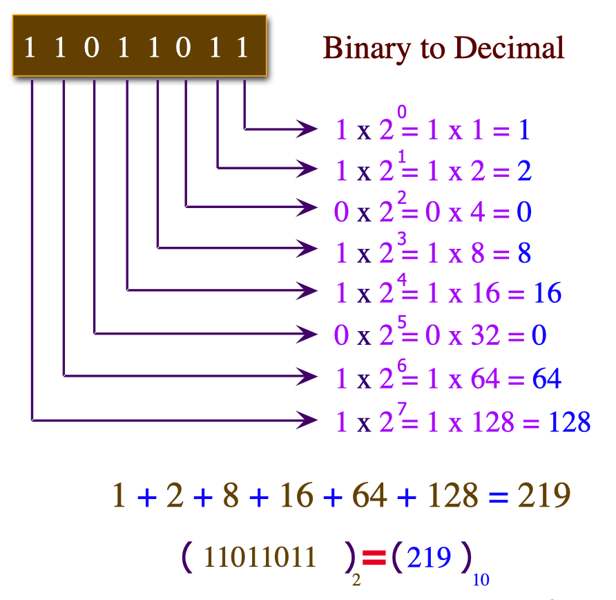

# Network Layer Addressing and Subnetting
by Ross Bagurdes

### Table of Contents
- **Introduction to Binary**
  - Binary 101
  - Converting Binary to Decimal
  - Converting Decimal to Binary
  - Hexadecimal
- **Introduction to IP Addressing**
    - What Is an IP Address?
    - Classless Addressing
    - Classful Addressing
    - Address Types
    - Private and Public Addresses
    - Demo: Modify and Test IP Configuration
- **Introduction to Subnetting**
  - Framework for Discussing Subnetting
  - Making a Subnet Calculator
  - Subnetting a Network into Smaller Networks
- **Subnetting Examples**
  - Subnetting 10.0.50.0/24 into 11 Networks
  - Subnetting 10.0.0.0/16 into 500 Networks
  - Subnetting 10.200.0.0/13 into 200 Networks
  - Subnetting 192.168.224.0/21 into 50 Networks
  - Subnetting 172.16.128.0/17 into 30 Networks
  - Subnetting 172.17.20.0/22 into 17 Networks
  - Subnetting 172.31.96.0/19 into 300 Networks
- **Introduction to IPv6**
  - IPv4 Addresses vs. IPv6 Addresses
  - The Structure of an IPv6 Address
  - IPv6 Addresses Operation
  - IPv6 Address Types
  - How Many IPv6 Addresses?
  - Demo: Examine IPv6 Information on a PC
  - IPv6 Address Acquisition - Static
  - Demo: Configure IPv6 Address Statically
  - IP Address Acquisition - SLAAC
  - Demo: IPv6 SLAAC
  - IPv6 Address Acquisition - DHCP
- **IPv6 Subnetting**
  - The IPv6 Subnet Mask
  - Subnetting IPv6
  - Subnetting IPv6 /48
  - Subnetting IPv6 /56
- **Router Operation**
  - Introduction
  - Basic Router Operation
  - Demo: Examining a Two Network Configuration
- **Variable Length Subnet Masking (VLSM)**
  - The Need for Variable Length Subnet Masking (VLSM)
  - Setting up the VLSM Problem
  - Calculating Your Networks
  - Another VLSM Practice Problem
- **Check Your Knowledge**
  - IPv4 Exercises
  - IPv6 Exercises


<br><br><br>


## Introduction to Binary
### Module Goals
- Understand **why binary numbering is necessary** in networking.
- Review **primary school math concepts** to build intuition for binary.
- Learn **how to count in binary (base 2)**.
- Practice **conversions**:
  - Binary > Decimal
  - Decimal > Binary
- Introduce **Hexadecimal** and its role in networking.

### Purpose
- Binary and hexadecimal provide the foundation for understanding **IPv4 and IPv6 addressing**.
- These concepts are essential before diving deeper into **IP addressing and subnetting** in data networking.


<br><br><br>

## Binary 101
### Base 10 (Decimal System)
- The **decimal system (base 10)** is the numbering system humans commonly use.
- Digits range from **0–9** (10 unique values).
- Placeholders increase by powers of 10:
  - Ones (10⁰), Tens (10¹), Hundreds (10²), Thousands (10³), etc.
- Example:
  - After `9`, we must add a new placeholder → `10`.
  - After `99`, we add the hundreds placeholder → `100`.
- This system likely evolved from humans having **10 fingers and toes**.

### Base 2 (Binary System)
- **Binary (base 2)** is the numbering system used by computers.
- Digits range from **0–1** (two unique values).
- Placeholders increase by powers of 2:
  - Ones (2⁰), Twos (2¹), Fours (2²), Eights (2³), Sixteens (2⁴), etc.
- Counting in binary works the same way as decimal but with only 0s and 1s:
    ```YAML
    0000 = 0
    0001 = 1   (1s place → turned on)
    0010 = 2   (2s place → turned on)
    0011 = 3   (2 + 1)
    0100 = 4   (4s place → turned on, 1s and 2s reset to 0)
    0101 = 5   (4 + 1)
    0110 = 6   (4 + 2)
    0111 = 7   (4 + 2 + 1)
    1000 = 8   (8s place → turned on, everything else reset to 0)
    ```

### Key Insight
- Each new placeholder in **binary doubles the value** of the previous one.
- This makes binary ideal for computers since they operate with **on/off (1/0) states**.


<br><br><br>

## Converting Binary to Decimal
Binary numbers can be easily converted into decimal values by using **placeholders**.

### Placeholders
- Start from the rightmost bit with value **1** (the 1s place).
- Each step to the left doubles the value: 1, 2, 4, 8, 16, 32, 64, 128, 256, etc.

### Conversion Method
1. Write the binary number.
2. Write placeholder values above each bit.
3. For every bit that is **1**, multiply it by its placeholder value.
4. Add up all the results.

### Examples
- <br><br>
- **11000000** → 128 + 64 = **192**
- **10110** → 16 + 4 + 2 = **22**
- **01000110** → 64 + 4 + 2 = **70**
- **11001000** → 128 + 64 + 8 = **200**
- **11100001** → 128 + 64 + 32 + 1 = **225**
  
### Key Point
You only add the placeholders where the binary digit is **1**.
With practice, binary-to-decimal conversion becomes quick and intuitive, which is essential for understanding IP addressing and subnetting.


<br><br><br>


## Decimal to Binary Conversion
### Method
1. Start with the largest power of 2 ≤ number.
2. If it fits → write **1** and subtract.
3. If not → write **0**.
4. Move to the next smaller power of 2 until you reach 1.

### Example: **210 → Binary**
- 210 - 128 = 82 → `1`
- 82 - 64 = 18 → `1`
- 32 too big → `0`
- 18 - 16 = 2 → `1`
- 8 too big → `0`
- 4 too big → `0`
- 2 - 2 = 0 → `1`
- 1 too big → `0`
- **Result:** `11010010`

### Example: **47 → Binary**
- `128` too big
- `64` too big
- `32` fits → `1` → remainder 15
- `16` too big → `0`
- `8` fits → `1` → remainder 7
- `4` fits → `1` → remainder 3
- `2` fits → `1` → remainder 1
- `1` fits → `1` → remainder 0
- **Result:** `00101111`


<br><br><br>


## Hexadecimal
### 1. What is Hexadecimal?
- You already know **Decimal** (base-10): digits go from **0–9**.
- You already know **Binary** (base-2): digits can only be **0 or 1**.
- **Hexadecimal (Hex)** is just another way of counting, but it uses **16 symbols** instead of 10.

Those symbols are:

```yaml
0, 1, 2, 3, 4, 5, 6, 7, 8, 9, A, B, C, D, E, F
```
- `A` = 10
- `B` = 11
- `C` = 12
- `D` = 13
- `E` = 14
- `F` = 15

After `F`, you carry over (just like after `9` in decimal).
- So in Hex: after `F` comes `10` → which means **16 in decimal**.

### 2. Why Do We Use Hex?
- Binary numbers get **too long**. Example:
  - Binary: `1111 1111`
  - Decimal: `255`
  - Hex: `FF` (much shorter and easy to read).
- Hex makes it easier for humans to read computer values like:
  - **IPv6 addresses** → written in Hex (`2001:db8::1`)
  - **MAC addresses** → written in Hex (`00:1A:2B:3C:4D:5E`)

### 3. Hex and Binary Relationship
Here’s the magic:
- **1 Hex digit = 4 Binary digits (bits)**

Example:
- `1010` (binary) = `A` (hex) = `10` (decimal)
- `1111` (binary) = `F` (hex) = `15` (decimal)

This means:
- Binary `1100 1010` → split into `1100` (`C`) and `1010` (`A`) → Hex = `CA`


### 4. Quick Reference Table
| Decimal | Binary | Hexidecimal |
| :-----: | :----: | :---------: |
|    0    |  0000  |      0      |
|    1    |  0001  |      1      |
|    2    |  0010  |      2      |
|    3    |  0011  |      3      |
|    4    |  0100  |      4      |
|    5    |  0101  |      5      |
|    6    |  0110  |      6      |
|    7    |  0111  |      7      |
|    8    |  1000  |      8      |
|    9    |  1001  |      9      |
|   10    |  1010  |      A      |
|   11    |  1011  |      B      |
|   12    |  1100  |      C      |
|   13    |  1101  |      D      |
|   14    |  1110  |      E      |
|   15    |  1111  |      F      |


<br><br><br>


## Introduction to IP Addressing
### Goals of the Module
- Understand **what an IPv4 address is** and the components that make it up.
- Learn the difference between **classful addressing** and **classless addressing**.
- Build a basic **vocabulary of IP addresses** needed to understand how networks operate.
- Explore **special IPv4 addresses** and their roles.
- See a **demonstration** applying IP addressing rules in a small network (two PCs).


<br>

## What Is an IP Address?
- **Definition**: An IPv4 address is a **32-bit identifier** assigned to a device’s network interface card (NIC).
- **Format**: Written as **four decimal numbers** separated by dots (dotted-decimal notation).
  - Example: `203.0.113.10`
  - Each number = **octet** = 8 bits → total 4 × 8 = 32 bits.

### Structure of an IPv4 Address
- **Two parts**:
  - **Network Portion (Prefix)**<br>identifies the network the device belongs to.
  - **Host Portion**<br>uniquely identifies the device within that network.

### Why Decimal, Not Hexadecimal?
- IPv4 addresses were designed (1982) to be represented in **decimal**, not binary or hexadecimal.
- Example: `203.0.113.10` is much easier to read than `11001011.00000000.01110001.00001010`.
- **Downside**: Decimal makes subnetting calculations more complex (binary/hex would have been easier).

### Identifying Network vs. Host Portion
- **Classful Addressing (pre-1995)**
  - Network/host portions were fixed based on the address “class” (A, B, C).
- **Classless Addressing (post-1995)**
  - Introduced **CIDR (Classless Inter-Domain Routing)**.
  - Network/host division is now flexible, defined by a **subnet mask** (or prefix length, e.g., `/24`).

> Even though modern networking is **classless**, people still often use **classful terminology** in conversation (e.g., “Class C network”), so you must understand both.

<br>


## Classless Addressing
- Since the mid-1990s, IPv4 addressing has been **classless** (CIDR).
- Classless addressing is what you will exclusively use in your career.
- **Classful addressing** (A, B, C classes) is historical; subnet masks replaced it for flexibility.

### Subnet Mask Concept
- The **subnet mask** was introduced in the mid-1990s as a **hack** to separate network and host portions.
- The mask has:
  - **1s** for the **network portion**
  - **0s** for the **host portion**
- The mask is applied directly to the IPv4 address to determine which part belongs to the network and which part to hosts.

### Binary to Decimal Conversion
- A mask of `11111111` (binary) = `255` (decimal).
- Example:
  - IP: `203.0.113.10`
  - Subnet mask: `255.255.255.0`
  - Meaning: first 24 bits (3 octets) are **network**, last 8 bits are **host**.

### Flexible Subnet Masks
- Subnet masks are not restricted to full octets.
- 
- Example scenarios:
  - **/20** (20 bits for network, 12 for host):
    - Subnet mask = `255.255.240.0`
    - This is unusual because it cuts across an octet.
  - **/8** (8 bits for network, 24 for host):
    - Subnet mask = `255.0.0.0`

<br>

## Classful Addressing
- **Introduced in 1981**, before subnet masks existed.
- Network and host portions were determined **only by the class of the IP address**.
- The **IP itself** defined how many bits were used for the network prefix.

### IP Classes
| **Class** | **Range**                     | **Network Bits**  | **Host Bits** | **Notes**                                    |
| --------- | ----------------------------- | ----------------- | ------------- | -------------------------------------------- |
| **A**     | `0.0.0.0 – 127.255.255.255`   | 8                 | 24            | For very large networks (millions of hosts). |
| **B**     | `128.0.0.0 – 191.255.255.255` | 16                | 16            | Medium-sized networks.                       |
| **C**     | `192.0.0.0 – 223.255.255.255` | 24                | 8             | Small networks (up to 254 hosts).            |
| **D**     | `224.0.0.0 – 239.255.255.255` | N/A (all network) | N/A           | Reserved for **multicast**.                  |
| **E**     | `240.0.0.0 – 255.255.255.255` | N/A               | N/A           | Experimental, not used.                      |

### Key Points
- **No subnet mask** existed — the class determined the prefix.
- **Example**:
  - `10.20.30.40` → Falls into Class A → First 8 bits = network, remaining 24 bits = host.
  - `172.16.5.10` → Falls into Class B → First 16 bits = network, remaining 16 bits = host.
  - `192.168.1.50` → Falls into Class C → First 24 bits = network, last 8 bits = host.

### Problems with Classful Addressing
- Very **inefficient** use of IP space:
  - Class A = \~16 million host addresses (too big for most).
  - Class C = only 254 hosts (too small for many).
- Led to **waste of IP addresses**.
- Solution → **Subnet masks** and later **CIDR (Classless Inter-Domain Routing)**.


<br>


## Address Types
Every IPv4 address (with a subnet mask) can be one of three types:
1. **Network Address**
   - Identifies the network itself (like a ZIP code).
   - **Rule**: All host bits = `0`.
   - Cannot be assigned to a device.
2. **Broadcast Address**
   - Used to send to *all devices* in the network.
   - **Rule**: All host bits = `1`.
   - Cannot be assigned to a device.
3. **Host Address**
   - Assigned to an actual device (PC, router, printer).
   - **Rule**: Host bits are *not* all `0`s and *not* all `1`s.
   - The only valid type of address for devices.

<br>

### Example 1: Network Address
- IP: `203.0.113.0`
- Mask: `255.255.255.0` → `/24`
- Host portion = last 8 bits → `00000000`
- ✅ **This is a network address**.

### Example 2: Broadcast Address
- IP: `192.168.10.255`
- Mask: `255.255.255.0` → `/24`
- Host portion = last 8 bits → `11111111`
- ✅ **This is a broadcast address**.

### Example 3: Host Address
- IP: `203.0.113.55`
- Mask: `255.255.255.0` → `/24`
- Host portion = `00110111` (not all 0s, not all 1s)
- ✅ **This is a host address**.

### Example 4: Looks Tricky, but
- IP: `10.128.224.64`
- Mask: `255.255.255.224` → `/27`
- Host portion = last 5 bits → `00000`
- ✅ **This is a network address**, even though the decimal doesn’t end in `.0`.

### Example 5: Ends with 0, But Still Host
- IP: `10.128.225.0`
- Mask: `255.255.254.0` → `/23`
- Host portion = 9 bits → `100000000` (not all 0s or all 1s).
- ✅ **This is a host address**, even though it ends in `.0`.


### Key Takeaways
- Always check **binary host portion** to decide type.
- **Network = all 0s, Broadcast = all 1s, Host = everything else.**
- Decimal format can be misleading → always confirm in binary.
- Only host addresses can be assigned to devices.


## Private and Public Addresses
### Private IP Ranges
Private addresses are reserved for internal use (home, business, enterprise). They are **not routable on the public internet**.

- **10.0.0.0 – 10.255.255.255** (/8)
- **172.16.0.0 – 172.31.255.255** (/12)
- **192.168.0.0 – 192.168.255.255** (/16)

Devices in homes or small businesses almost always use one of these ranges.

> Note: Even though you can browse the internet from a private IP, communication is made possible through **NAT (Network Address Translation)**, which maps private addresses to public ones.


### Public IP Ranges
- All other IP addresses outside the private ranges.
- Assigned by ISPs and globally routable.

### Loopback Address
- **127.0.0.1** (with the full range being 127.0.0.0/8).
- Always refers to the **local machine** (“home”).
- Used for testing the TCP/IP stack (e.g., `ping 127.0.0.1`).
- Cannot be assigned manually to a device—it’s reserved by default.


<br><br><br>


## Introduction to Subnetting
In this module, we focus on **subnetting**. Subnetting is the process of dividing a large network into smaller, more manageable parts. It relies on **CIDR (Classless Inter-Domain Routing)**, which allows us to create subnets of any size instead of being limited to traditional classful networks.

Topics coved:
- How CIDR and routing work together.
- The basics of creating and using a **subnet calculator** to quickly determine network ranges.
- A review of IP address types from the previous module (network, host, broadcast, etc.).
- An introduction to solving a **basic subnetting problem** so we can understand what subnetting is trying to accomplish and how to apply it in practice.


<br>

## Framework for Discussing Subnetting
Subnetting can feel tricky, but if you use a consistent framework, it becomes straightforward. The key is **always converting to binary first**, because that reveals exactly how networks and hosts are separated.

Some shortcuts exist that avoid binary conversion, but relying on binary gives you a deeper understanding of networking concepts, which will help far beyond subnetting problems.

<br>

### Subnet Masks and CIDR Notation
Traditionally, subnet masks are written in **dotted decimal format**, for example:

```
255.255.255.0
```

This mask indicates that the **first 24 bits** of the IP address are reserved for the network portion (since each `255` equals 8 bits set to `1`).

- **Binary mask:**

  ```
  11111111.11111111.11111111.00000000
  ```
- **Network prefix length:** 24 bits

Instead of writing the whole mask, we use **CIDR (Classless Inter-Domain Routing) notation**:

```
203.0.113.10/24
```

- `/24` simply means **24 bits are network bits**.
- The number after the slash (`/n`) = number of **1s in the subnet mask**.
This is the standard way to describe networks in modern data networking.

**Key takeaway:**
CIDR notation is faster, clearer, and universally used. Always think in terms of the **slash number** (e.g., `/24`, `/22`, `/30`) instead of full dotted-decimal masks.

<br>


## Making a Subnet Calculator

When preparing for subnetting problems (especially in the CCNA exam), it helps to have a **subnet calculator table** ready. You can quickly write this down at the start of the exam and use it as a reference.

This calculator has **three columns**:

1. **Bits** – the number of bits borrowed (for networks) or left (for hosts).
2. **Networks** – how many networks are possible with those bits.
3. **Hosts** – how many usable hosts fit in each network.

### Step 1: Bits and Networks Column
- Formula for **networks**:

  ```
  2^n
  ```

  where `n` = number of bits.

- Example values:

| Bits | Networks |
| ---- | -------- |
| 0    | 1        |
| 1    | 2        |
| 2    | 4        |
| 3    | 8        |
| 4    | 16       |
| 5    | 32       |
| 6    | 64       |
| 7    | 128      |
| 8    | 256      |
| 9    | 512      |
| 10   | 1024     |

Notice the **doubling pattern**: every extra bit doubles the number of possible networks.

### Step 2: Hosts Column
- Formula for **hosts per network**:

  ```
  2^h – 2
  ```

  where `h` = number of host bits.

- We subtract 2 because:
  - One address = **network address** (all 0s in host portion).
  - One address = **broadcast address** (all 1s in host portion).

- Example values:

| Host Bits | Hosts |
| --------- | ----- |
| 2         | 2     |
| 3         | 6     |
| 4         | 14    |
| 5         | 30    |
| 6         | 62    |
| 7         | 126   |
| 8         | 254   |
| 9         | 510   |
| 10        | 1022  |

### Step 3: Using the Calculator
- If you need **32 networks**, check the Networks column → requires **5 bits**.
- If you need **at least 254 hosts**, check the Hosts column → requires **8 host bits**.

This way, you can quickly decide what subnet mask is appropriate without doing long binary conversions in your head during the exam.

<br>


## Subnetting a Network into Smaller Networks
### 1. Key IP Components
- **Network Address** = all `0`s in host portion.
- **Broadcast Address** = all `1`s in host portion.
- **Host Addresses** = anything in between (from +1 above network to -1 below broadcast).

Example:
- Given: `203.0.113.0/24`
- First host: `203.0.113.1`
- Last host: `203.0.113.254`
- Broadcast: `203.0.113.255`

### 2. Problem Setup
- ISP assigned: `203.0.113.0/24` (256 total addresses).
- Requirement: **8 networks** (for 8 offices).
- You cannot change the **first 24 bits** (the ISP’s portion).
- You can only manipulate the **last 8 bits**.

### 3. Using the Subnet Calculator
- Find smallest number of bits that gives ≥8 networks.
- `2^3 = 8` → need **3 more network bits**.
- Borrow 3 bits from the host portion → `/24 + 3 = /27`.
- Each `/27` network = **32 addresses total**, **30 usable hosts**.

### 4. Subnet Ranges
| Network # | Network Address  | First Host    | Last Host     | Broadcast     |
| --------- | ---------------- | ------------- | ------------- | ------------- |
| 0         | 203.0.113.0/27   | 203.0.113.1   | 203.0.113.30  | 203.0.113.31  |
| 1         | 203.0.113.32/27  | 203.0.113.33  | 203.0.113.62  | 203.0.113.63  |
| 2         | 203.0.113.64/27  | 203.0.113.65  | 203.0.113.94  | 203.0.113.95  |
| 3         | 203.0.113.96/27  | 203.0.113.97  | 203.0.113.126 | 203.0.113.127 |
| 4         | 203.0.113.128/27 | 203.0.113.129 | 203.0.113.158 | 203.0.113.159 |
| 5         | 203.0.113.160/27 | 203.0.113.161 | 203.0.113.190 | 203.0.113.191 |
| 6         | 203.0.113.192/27 | 203.0.113.193 | 203.0.113.222 | 203.0.113.223 |
| 7         | 203.0.113.224/27 | 203.0.113.225 | 203.0.113.254 | 203.0.113.255 |

### 5. Summary
- Original `/24` was divided into **8 × /27 subnets**.
- Each subnet supports **30 usable hosts**.
- Now we can assign one subnet to each office.
- This is the **foundation of subnetting**:
  - Borrow bits → increase number of networks.
  - Lose host capacity in each subnet.


<br><br><br>


## Subnetting Examples
In this module, we continue learning subnetting through **practice examples**.
- A set of **seven subnetting problems** will be solved step by step.
- The goal is to reinforce the concepts of:
  - Network address
  - Broadcast address
  - Host range
  - How to calculate these values using subnet masks and CIDR notation.
- Exercise files (PDF) are available for additional practice problems.

This section is **hands-on** — designed to build speed and confidence with subnetting calculations.

<br><br><br>


## Introduction to IPv6

IPv6 has been in development since the late 1980s, when engineers realized that IPv4’s address space would eventually run out. In the mid-1990s, subnetting and CIDR were introduced as a temporary fix, but they only delayed the exhaustion of IPv4 addresses.

Over 20 years later, IPv6 adoption has accelerated, though a complete cutover is unlikely soon. Many industries, such as healthcare, still rely on applications that do not yet support IPv6. Because of this, both IPv4 and IPv6 will coexist for the foreseeable future, with mechanisms in place to bridge them.

The main goal here is to understand how IPv6 works rather than focus on implementation challenges. Once familiar with IPv6, it becomes less intimidating and easier to work with.

### Learning Goals
- Contrast IPv4 and IPv6 address sizes
- Understand IPv6 operation
- Learn IPv6 address types
- See how workstations acquire IPv6 addresses

### Key Terminology
- **Bit** - The smallest unit of data; either `1` or `0`.
- **Nibble** - 4 bits. Example:
  - Binary `1010` = Decimal `10` = Hexadecimal `A`
  - Represented as `Hex-A` or `0xA` (the prefix `0x` indicates a hexadecimal value).
- **Byte** - 8 bits (2 nibbles). Example:
  - Binary `11001001` = Hexadecimal `0xC9`
  - First nibble `1100` = Hex `C`, second nibble `1001` = Hex `9`.
- **Hextet** → 16 bits (2 bytes or 4 nibbles). IPv6 addresses are divided into hextets. Example:
  - Binary `10101010 01000110` = Hexadecimal `0xAA46`.


<br>


## IPv4 Addresses vs. IPv6 Addresses
- **IPv4**
  - Address length: **32 bits**
  - Represented as **4 octets** (8 bits each)
  - Written in **decimal**, separated by dots
  - Example: `192.168.1.1`
  - Subnetting complexity comes from **binary-to-decimal conversions**
- **IPv6**
  - Address length: **128 bits** (4 times larger than IPv4)
  - Equivalent to **32 nibbles** (32 hexadecimal values)
  - Divided into **8 hextets** (16 bits each)
  - Written in **hexadecimal**, separated by colons
  - Example: `2001:0db8:85a3:0000:0000:8a2e:0370:7334`

### Representation Details
- **Binary vs. Hexadecimal**
  - IPv4 often requires converting between binary and decimal for subnetting.
  - IPv6 avoids much of this because **1 hex digit = 4 bits**.
  - This makes binary ↔ hex conversion straightforward and less error-prone.

- **Readability Challenges**
  - IPv6 addresses are long, contain letters, and feel unusual compared to IPv4.
  - Example: instead of "tell me your 4 numbers," users must now handle a **128-bit string**.
  - At first, this feels complex and intimidating.

### Practical Takeaway
While IPv6 looks complex at first, with some hands-on practice (labs, subnetting, configuration), it often becomes easier and more intuitive than IPv4. The hexadecimal format aligns cleanly with binary, making address manipulation simpler once you are comfortable with the format.

<br>

## The Structure of an IPv6 Address
### Network and Host Portions
- **IPv6 Address Length**: 128 bits total.
- **Split**:
  - **64 bits** → Network portion (prefix).
  - **64 bits** → Interface Identifier (host portion).
- Keeping the **/64 prefix** for networks is the recommended and most common practice, even though technically other sizes are possible.

### Shortening IPv6 Addresses
IPv6 addresses look long, but they can be shortened using two main rules:

1. **Remove leading zeros** in each hextet.
   - Example:
     - Full: `2001:0DB8:0002:008D:0000:0000:00A5:52F5`
     - Shortened: `2001:DB8:2:8D:0:0:A5:52F5`
2. **Use double colon (`::`)** to replace **one consecutive sequence of all-zero hextets**.
   - Example:
     - `2001:DB8:2:8D:0:0:A5:52F5`
     - Becomes: `2001:DB8:2:8D::A5:52F5`

### Important Rules for `::` Usage
- You may **only use one `::` per IPv6 address**.
  - Otherwise, it’s impossible to know how many groups of 0s are being replaced.
- If there’s no `::`, the address must explicitly contain all 8 hextets.
  - Otherwise, it’s invalid because it does not expand to 128 bits.

### Correct vs. Incorrect Examples
- Correct:
  - `2001:DB8:2:8D::A5:52F5`
  - (expands to 8 hextets properly)
- Incorrect:
  - `2001:DB8:2:8D::A5::52F5`
  - (two double colons → ambiguous)
- Incorrect:
  - `2001:DB8:2:8D:A5:52F5`
  - (only 6 hextets, no `::` → missing values)

<br>

## IPv6 Addresses Operation
### Similarity to IPv4
- IPv6 follows the **same fundamental addressing rule** as IPv4:
  - Devices can communicate **directly** only if they share the same **network portion** of the address.
  - If the network portions differ, communication requires a **router**.
- **IPv6 Network Portion**:
  - Standard = **first 64 bits**.
  - Two devices with the same 64-bit prefix can exchange traffic locally.
  - If prefixes differ, a router is needed.

### Example
- Device A: `2001:DB8:1234:A::1/64`
- Device B: `2001:DB8:1234:A::2/64`
  -  Same /64 network → direct communication possible.
- Device C: `2001:DB8:1234:B::1/64`
  -  Different /64 network → requires a router.


### IPv6 Address Types for Communication
1. **Global Unicast Address (GUA)**
   - Publicly routable address, similar to a **public IPv4 address**.
   - Used for communication **across the internet**.
   - Every IPv6-enabled device that needs internet access must have a GUA.
2. **Link-Local Address**
   - Used for **local communication only**.
   - Always required for IPv6 operation (every IPv6 interface automatically generates one).
   - Never routed beyond the local network segment.
   - Similar in behavior to a **MAC address**, but at Layer 3.
   - Typically starts with `FE80::/10`.

### Key Point
- An IPv6 device will usually have **at least two unicast addresses**:
  1. A **Global Unicast Address** for internet communication.
  2. A **Link-Local Address** for communication within the local network segment.

<br>

## IPv6 Address Types
### 1. Unicast Addresses
A unicast address identifies a **single interface**. Traffic sent to a unicast address goes to exactly one device.

- **Global Unicast Address (GUA)**
  - Equivalent to a **public IPv4 address**.
  - Required for communication on the **public IPv6 internet**.
  - Range: `2000::/3`.
- **Link-Local Address**
  - Required for **local communication**.
  - Every IPv6-enabled interface **must have one**.
  - Always starts with `FE80::/10`.
  - Auto-configured by the device itself.
  - Never routed beyond the local link.
- **Loopback Address**
  - Written as `::1/128`.
  - Used to test IPv6 on the local host (similar to IPv4 `127.0.0.1`).
- **Unspecified Address**
  - Written as `::/128`.
  - Represents “no address.”
  - Used when a device does not yet have an IPv6 address.
- **Unique Local Address (ULA)**
  - Equivalent to **private IPv4 addresses** (e.g., `10.0.0.0/8`).
  - Range: `FC00::/7`.
  - Used within organizations but **not routable on the public internet**.
  - Unlike IPv4, **no NAT** exists for ULAs → cannot be translated into GUAs.
  - Suitable for labs or internal-only networks.

### 2. Multicast Addresses
- Allow **one-to-many communication**.
- Used for services like neighbor discovery or routing protocols.
- Range: `FF00::/8`.
- Not implemented globally on the internet, but commonly used **inside organizations**.

### 3. Anycast Addresses
- Same IPv6 address assigned to **multiple devices**.
- Used for **load balancing** and **redundancy**.
- Traffic is routed to the **nearest device** (based on routing protocol metrics).
- Requires **special configuration**—not just assigning the same address to multiple machines.

### Key Focus
While there are many IPv6 address types, the two **essential for real-world operation** are:
1. **Global Unicast Address (GUA)** needed for internet connectivity.
2. **Link-Local Address** required for local communication and always present.


<br>

## How Many IPv6 Addresses?
### Total Addresses in IPv6
- IPv6 uses **128-bit addresses**.
- That gives **2¹²⁸ possible addresses**.
- Written out, that’s:

  ```
  340,282,366,920,938,463,463,374,607,431,768,211,456
  ```
  ≈ **340 undecillion addresses**.

This number is unimaginably large, so instead of thinking about all of IPv6, let’s focus on a **single IPv6 /64 network**.

### Addresses in a Single /64 Network
- A /64 network leaves **64 bits** for the host (interface identifier).
- That means **2⁶⁴ possible host addresses per /64**.
- 2⁶⁴ = **18,446,744,073,709,551,616**
  ≈ **18 quintillion addresses**.

### Key Takeaway
- Each /64 network (the standard allocation for IPv6 subnets) has **far more addresses than we can ever use**.
- The global IPv6 address pool contains an **astronomically larger supply**, making address exhaustion practically impossible.
- IPv6 will likely be replaced by a new protocol **long before we could ever run out**.
