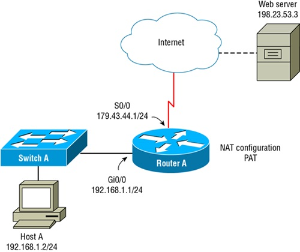

# CompTIA Network+ exam questions

## Chapter 1: Introduction to networks

1. Which network type is locally owned and managed by an organization and used to connect the organization’s LAN together?
    - **CAN** 
        > A campus area network (CAN) is a connectivity method that is locally owned and managed by an organization to connect multiple LANs together. A metropolitan area network (MAN) is a connectivity method used in a metropolitan area, but it is owned and managed by someone other than the organization. A wide area network (WAN) is a connectivity method that is used for connectivity in a wide area, and it is owned and managed by someone other than the organization. A personal area network (PAN) is a network that connects personal devices within an extremely close vicinity.
2. Which network topology design has a centralized switch connecting all of the devices?
    - **Star topology** 
        > A star topology, also known as hub‐and‐spoke topology, has a centralized switch connecting all of the devices outward like a star. A full mesh topology allows for a decentralized switching design, where any link failure will not affect switching. A partial mesh topology is normally performed between the layers of core, distribution, and access to allow for a single link failure while maintaining switching services. A hybrid topology is where several different topologies are employed, such as star and mesh.
3. Which protocol can be typically found inside a PAN?
    - **Bluetooth** 
        > Bluetooth is a common networking protocol found inside a personal area network (PAN) connecting personal devices. Multiprotocol label switching (MPLS) is a technology that uses labels to switch packets. A software‐defined wide area network (SDWAN) is a virtual WAN architecture that uses software to manage connectivity, devices, and services. A virtual NIC (vNIC) is used to connect a virtual machine (VM) to a virtual switch (vSwitch).
4. When computers are logically grouped on a LAN based upon a functional department in the organization, what is the group called?
    - **Workgroup** 
        > A workgroup is a logical grouping of computers on a local area network (LAN) based upon a department’s function. A backbone is the connectivity method that connects multiple network segments together. A campus area network (CAN) is a network that connects multiple buildings together in close proximity. A personal area network (PAN) is a network that connects personal devices together in close proximity often using Bluetooth technology.
5. Which is the primary benefit to using a star topology?
    - **Easy to troubleshoot** 
        > A benefit to the star topology is that it is easy to troubleshoot since each host has its own connection. Equal access is typically a benefit of ring topologies. Bus topologies are typically the simplest network in terms of design, whereas star networks can have redundancy, loops, and many other complex design considerations. Redundancy is not found in star topologies; it is typically in mesh networks.
6. What type of logical connection does MPLS create to connect networks together?
    - **Circuit** 
        > A circuit is the logical connection that MPLS creates to connect networks together. A peer‐to‐peer connection is a bidirectional logical connection for sharing files and accessing files. A client‐server connection is another logical connection created for accessing information in one direction from client to server. East‐west is a term used to describe traffic within the same network or data center.
7. Which type of network is used exclusively for storage traffic?
    - **SAN** 
        > A storage area network (SAN) is a network that is used exclusively for storage traffic. A campus area network (CAN) is a network that connects buildings together in close proximity. A metropolitan area network (MAN) is a network that connects clients within a metropolitan area, such as a city, together. A local area network (LAN) is a network within a building or residence that connects hosts together.
8. Which type of traffic flow is routed from your internal network to the Internet?
    - **North-South** 
        > North‐south traffic flow describes the flow of information from an internal network to the Internet or other routed destination. East‐west traffic is kept within the internal network or data center and not routed. Wide area network (WAN) and metropolitan area (MAN) network describe a general network type, not traffic flow or a specific connection.
9. Which topology incorporates some redundancy of equipment and connections to provide fault tolerance but is not completely fault‐tolerant?
    - **Hybrid** 
        > A mesh topology incorporates redundancy in the form of switches and redundant connections to provide complete fault tolerance to the network design. When a mesh topology is combined with the star (hub‐and‐spoke) topology, it creates a hybrid topology that allows for fault‐tolerant design at a lower cost than a full mesh topology. Ring and bus topology are susceptible to total network failure if there is a failure anywhere in the network.
10. Which topology should be selected if you have a central office that needs to communicate with several branch offices for WAN connectivity?
    - **Point‐to‐multipoint** 
        > A point‐to‐multipoint topology should be selected if a central office needs to connect with several branch offices. Popular point‐to‐multipoint connection technologies are frame relay and MPLS, to name a few. A point‐to‐point connection is typically used to connect two offices together. Mesh and bus topologies are not used for WAN connectivity.
11. Which network architecture allows for access or sharing of resources in a network by the same host?
    - **Peer‐to‐peer** 
        > Peer‐to‐peer is a network architecture that allows the same host to both access and share resources in a network. Client‐server network architecture strictly defines the client that will access the information and the server that shares the information. Local area network (LAN) is a network type and not related to sharing information. Hybrid topology describes a topology that incorporates two or more topologies.
12. Which is the major advantage of client‐server network architecture?
    - **Centralized management** 
        > The major advantage to a client‐server network architecture is the ability to have centralized management. Distributed security is not applicable to client‐server network architecture and is found in a peer‐to‐peer network architecture. The client‐server relationship is rigid and not very flexible. Equal access is an attribute of peer‐to‐peer network architecture.
13. You are setting up a network connection that requires redundancy in the event a switch or single link fails. Which topology should you select?
    - **Mesh** 
        > A mesh topology is used for redundancy and protects a network in the event of a switch or link failure. Bus and ring topologies are very susceptible to failure and require a fully functioning network. A star topology by itself does not offer redundancy in the event of failure.
14. Where is the full mesh topology commonly seen in the three‐tier design model?
    - **Distribution layer** 
        > Distribution layer switches are fully meshed for redundancy. The core layer is normally implemented with a star topology. The access layer is normally implemented with a partial mesh topology or hybrid topology. Routing layer is not a valid term in the three‐tier design model.
15. Which connectivity method is used within a small geographic area to connect an organization together?
    - **MAN** 
        > A metropolitan area network (MAN) is a network type used in a metropolitan area to connect an organization together. A local area network (LAN) is a connectivity method that connects the immediate network together. A storage area network (SAN) is used exclusively for storage connectivity. A personal area network (PAN) is a network that connects personal devices within an extremely close vicinity.
16. Which virtual network element connects multiple VMs together?
    - **vSwitch** 
        > A virtual switch (vSwitch) is used to connect multiple VMs together. A hypervisor is software that allows the sharing of the compute, network, and storage of a physical host or group of hosts that have direct access to these resources. A load balancer is used to distribute the load for a network service. A network function virtualization (NFV) is a function that is virtualized, such as a router or firewall, to name a few.
17. When you tether a cell phone to your laptops using wireless, what is this an example of?
    - **PAN** 
        > A personal area network (PAN) is a network that connects personal devices within an extremely close vicinity, such as a cell phone to a laptop. A storage area network (SAN) is used exclusively for storage connectivity. A metropolitan area network (MAN) is a network type used in a metropolitan area to connect an organization together. A campus area network (CAN) is a connectivity method that connects several LANs together in a small geographic area.
18. What is the term used to describe the common network used to connect multiple network segments at high speed?
    - **BAckbone** 
        > A backbone is the connectivity method that connects multiple network segments at high speed. A wide area network (WAN) is typically used for Internet connectivity. A personal area network (PAN) is a network that connects personal devices in close proximity. A workgroup is a logical grouping of computers on a local area network (LAN) based upon a department’s function.
19. What is a smart jack as it relates to WAN connectivity?
    - **Demarc** 
        > The demarc, also known as the demarcation point, is a term used to describe a smart jack for a service provider. A network function virtualization (NFV) is a function that is virtualized, such as a router or firewall, to name a few. A load balancer is used to distribute the load for a network service. A router will typically connect to the smart jack for WAN connectivity.
20. Which protocol is used with dynamic multipoint VPN deployments?
    - **mGRE** 
        > Multipoint Generic Routing Encapsulation (mGRE) is used in conjunction with dynamic multipoint VPN to facilitate connections. Multiprotocol Label Switching (MPLS) is a technology that uses labels to switch packets and is an alternative to dynamic multipoint VPN. Software‐defined wide area network (SDWAN) is a virtual WAN architecture that uses software to manage connectivity, devices, and services. A virtual NIC (vNIC) is used to connect a virtual machine to a virtual switch (vSwitch).


<br><br><br>

## Chapter 2: The Open Systems Interconnection (OSI) Reference Model
1. Flow control can be found at which layer of the OSI?
    - **Transport layer** 
        > The Transport layer is responsible for flow control via the TCP/IP protocols of TCP and UDP. The Network layer is responsible for the logical addressing of network nodes. The Data Link layer is responsible for the framing of data and the physical addressing of local nodes. The Session layer is responsible for setting up the dialogue between two hosts.

2. What is required before TCP can begin sending segments?
    - **Three‐way handshake** 
        > A three‐way handshake is required between the sender and receiver before TCP can begin sending segments. During this three‐way handshake, the sender’s window buffer size is synchronized with the receiver’s window buffer size. Ports are not agreed upon; they are used to address traffic at the Transport layer. The sequencing and acknowledgment of segments are functions of the TCP protocol.
   
3. Which layer of the OSI is responsible for dialogue control of applications?
    - **Session layer** 
        > The Session layer is responsible for offsetting up the dialogue between two hosts. The Application layer is responsible for API access and beginning the network communication process. The Physical layer is responsible for transmitting data over light, electricity, and air waves. The Network layer is responsible for the logical addressing of IP addresses.
   
4. Which layer is responsible for compression and decompression?
    - **Presentation layer** 
        > The Presentation layer is responsible for compression and decompression, as well as encryption and decryption. The Application layer is responsible for API access and beginning the network communication process. The Physical layer is responsible for transmitting data over light, electricity, and air waves. The Session layer is responsible for setting up the dialogue between two hosts.
   
5. Which OSI layer is responsible for logical addressing?
    - **Network layer** 
        > The Network layer is responsible for logical addressing. Routers use logical addressing to determine the path to remote networks. The Transport layer is responsible for flow control and creating virtual circuits. The Application layer is responsible for API access and beginning the network communication process. The Data Link layer is responsible for the framing of data and the physical addressing of local nodes.
   
6. As information travels down the network stack from the Application layer to the Physical layer, what happens?
    - **Encapsulation** 
        > As information travels down the network stack from the Application later to the Physical layer, the information is encapsulated by each layer. The information at the upper layers is referred to as datagrams. The terminology of each type of data as it pertains to the OSI layers is protocol data units (PDUs). Decapsulation is the action of removing the encapsulated information as it goes up the network stack from the Physical layer to the Application layer.
   
7. Which sublayer of the Data Link OSI layer is responsible for identifying Network layer protocols and encapsulating them?
    - **LLC** 
        > The logical link control (LLC) sublayer is responsible for managing access to Network layer protocols. The media access control (MAC) sublayer is responsible for physical addressing and framing data for the transmission media. The Data Link layer is responsible for framing data and contains the LLC and MAC sublayers. The Session layer is responsible for dialogue control.
   
8. Which is not a benefit to the OSI model?
    - **Allows software to run at network speeds** 
        > The OSI reference model will not aid in allowing software to run at network speeds; this will be up to the developer. The OSI reference standardized model will allow for multivendor development. The OSI reference model will prevent a change in one layer from affecting other layers. The OSI reference model will also allow various network hardware and software to communicate.
   
9.  Which three upper layers operate together?
    - **Application, Presentation, and Session** 
        > The Application, Presentation, and Session layers operate together to process datagrams. All other answers are incorrect.
   
10. Which 802 working group defines the LLC sublayer of the Data Link layer?
    - **802.2** 
        > The IEEE 802.2 working group defines the Logic Link Control (LLC) sublayer of the Data Link layer. The IEEE 802.3 and 802.11 working groups define the Media Access Control (MAC) sublayer of the Data Link layer. The IEEE 802.15 working group defines wireless personal area networks (WPANs).
   
11. Which concept describes transmitting multiple segments before the receiving host acknowledges the data?
    - **Windowing** 
        > The concept of transmitting multiple segments before the receiving host acknowledges the data is windowing. Sequencing is done with each segment so they can be combined back together at the Transport layer. Compression and encryption are found at the Presentation layer, and neither is the correct answer.
   
12. Which device will stop broadcasts from propagating the network?
    - **Router** 
        > By default, a router will stop broadcasts from propagating the network. A switch, hub, and wireless access point (WAP) will not stop broadcasts from propagating the network.
   
13. Which is used to determine the best path to a destination network?
    - **Metric** 
        > The route table is checked for a destination packet, but the metric associated with the destination network is how the best path is determined. Acknowledgments are used by the receiving computer to acknowledge the receipt of segments. The network address is the logical addressing of hosts. The interface is the physical connection to the network.
   
14. Which protocol data unit (PDU) is used to describe data at the Physical layer?
   - **Bits** 
        > The PDU that describes data at the Physical layer is bits. The PDU of datagrams is used to describe data at the upper layers. The PDU of frames is used to describe data at the Data Link layer. The PDU of segments is used to describe data at the Transport layer.
   
15. Which OSI layers are responsible for framing data and transmitting the data?
    - **Data Link and Physical layers** 
        > The Data Link and Physical layers are responsible for framing data and transmitting it on the media. The LLC is a sublayer that is responsible for encapsulating Network layer protocols. All other answer are incorrect.
   
16. Which layer is responsible for creating a virtual circuit?
    - **Transport** 
        > The Transport layer is responsible for flow control and creating virtual circuits. The Presentation layer is responsible for compression/decompression and encryption/decryption. The Session layer is responsible for dialogue control. The Network layer is responsible for logical addressing.
   
17. TCP and UDP reside at which layer of the OSI model?
    - **Transport** 
        > Both TCP and UDP reside at the Transport layer. All other answers are incorrect.
   
18. What is the proper order of data encapsulation?
    - **Datagram, segment, packet, frame, bits**
   
19. Which layer is responsible for routing data packets?
    - **Network** 
        > The Network layer is responsible for routing network packets. The Physical layer is responsible for physical connectivity and transmitting bits. The Data Link layer is responsible for framing bits. The Transport layer is responsible for creating virtual circuits and flow control.
   
20. Which IEEE standard specifies the protocol for CSMA/CD?
    - **802.3** 
        > The IEEE standard of 802.3 specifies the carrier sense multiple access/collision detection (CSMA/CD) contention method. The IEEE standard of 802.2 specifies how the network layer should be encapsulated for multiprotocol operation. The IEEE standard for 802.5 details the disbanded Token Ring specification. The 802.11 details the wireless specifications.


<br><br><br>
   

## Chapter 3: Networking Connectors and Wiring Standards
1. You are planning to run fiber‐optic cable between two buildings that are 6,000 feet apart. Which is the best solution to complete this project?
    - **SMF** 
        > A single‐mode fiber (SMF) cable can carry signals up to 80 km before the signal needs to be repeated. Multimode fiber (MMF) has a maximum distance of 3,000 feet. A main distribution frame (MDF) is a wiring point that’s generally used as a main reference point for telephone lines. An intermediate distribution frame (IDF) is a remote point of reference typically located in an equipment or telecommunications room.
2. You need to connect a switch to another switch. Which type of cable should you use to properly create the connection between the two switches?
    - **Crossover cable** 
        > A crossover cable is the proper cable to connect a switch to a switch. A straight‐through cable is not the proper cable to connect a switch to a switch and is typically used to connect hosts to a switch. A rolled cable is used for serial connectivity to the switch. A T1 crossover cable is used to connect a router to a router via T1 serial lines.
3. You are designing a network in a building that has arc welders. Which cable should be used to eliminate EMI?
    - **Fiber optic** 
        > Fiber‐optic cable should be used to eliminate electromagnetic interference (EMI) and radio frequency interference (RFI). Category 5e is a type of unshielded twisted‐pair (UTP); it will not prevent EMI. Twinaxial cable is a type of coaxial cable used to connect network equipment at high speeds for short distances.
4. Which connector type is typically found on a Category 6 cable?
    - **RJ‐45** 
        > An RJ‐45, also known as a registered jack 45, is used for terminating networking cabling, such as Category 5/6/7/8 cable. An RJ‐11 registered jack is used to terminate phone cabling. A Bayonet Neill–Concelman (BNC) connector is used to terminate coaxial cable. An angled physical contact (APC) is used to terminate fiber‐optic cable.
5. You need to make a Category 5e crossover cable. Which wiring standard will you use on both ends?
    - **568B‐to‐568A** 
        > When making a crossover cable for any network cable, the 568B wiring standard should be used on one end, and the 568A wiring standard should be used on the other end. A straight‐through cable is created when you crimp the 568A‐to‐568A or 568B‐to‐568B wiring standard on both ends of a network cable. The terms angled physical contact (APC) and ultra physical contact (UPC) are used to describe the finish on a fiber‐optic cable end.
6. You need to install cabling in an office space and want to be assured that toxic vapors will not be created in the event of a fire. Which cable type should you choose?
    - **Plenum** 
        > You should always use plenum‐rated cable in office spaces to avoid toxic vapors released in the event of a fire. Polyvinyl chloride (PVC) and fluoroethylene propylene (FEP) are plastics that can create poisonous vapers in the event of a fire. Non‐plenum rated cables are typically made from plastics.
7. Which serial connection method is typically used for connecting peripherals to a PC?
    - **USB** 
        > A Universal Serial Bus (USB) connection method is typically used for connecting peripherals to a PC. A DB‐9 connector is typically used to connect serial connections for router or switch configuration. A Category 3 cable is a network cable specification. A rolled cable is used to connect a router or switch to a PC for configuration.
8. You need to run a UTP cable for 10 Gbps speeds with a distance of 100 meters. Which minimum cable category rating should you use?
    - **6A** 
        > Category 6A (augmented) will handle speeds of 10 Gbps at a distance of 100 meters. Category 5 is capable of speeds of 100 Mbps at a distance of 100 meters. Category 5e is capable of 1 Gbps at a distance of 100 meters. Category 6 is capable of 10 Gbps up to a maximum distance of 55 meters.
9. Which is an incorrect statement about smart jacks?
    - **A smart jack can report trouble in a circuit** 
        > A smart jack cannot report trouble in a circuit. The smart jack is typically the demarcation point for a provider. A smart jack can remotely be put into a loopback mode to verify operations. A smart jack is also known as a network interface device (NID) or network interface unit (NIU).
10. Which term describes what happens to the signal in a network cable as you make the cable’s distance greater?
    - **Attenuation** 
       > The signal on a cable will attenuate as the distance of the cable lengthens. Duplex refers to the path of signaling on a network cable. Demarcation or demarc refers to the point of responsibility for a network provider. Electromagnetic interference (EMI) is interference that is induced into a network cable from an external source.
11. Which cable has no metallic shielding?
    - **UTP** 
       > Unshielded twisted‐pair (UTP), as its name implies, is unshielded cabling. Shielded twisted‐pair (STP), coaxial, and twinaxial have metallic shielding around the outside of the cabling.
12. Which connector is typically used on the end of a coaxial cable?
    - **F‐type** 
       > An F‐type or BNC connector is typically found on the end of a coaxial cable. RJ‐45 connectors are typically found on the ends of network cable. RJ‐11 connectors are typically used for phone connection. A subscriber (or square) connector (SC) is used with fiber‐optic cables.
13. Which fiber‐optic connector uses a BNC style mechanism to lock the cable in place?
    - **ST** 
        > The straight tip (ST) connector uses a BNC style mechanism to lock the fiber‐optic cable in place. The subscriber (or square) connector (SC) is a square plastic connector. The local connector (LC) is a square style connector that is made for high‐density applications. The mechanical transfer registered jack (MT‐RJ or MTRJ) is another small form factor connector.
14. Which technique is used to prevent crosstalk on network cables?
    - **T‐568A/B wiring standard** 
        > The Telecommunications Industry Association/Electronic Industries Alliance (TIA/EIA) T‐568A/B wiring standard is used to prevent crosstalk. The use of shield twisted‐pair (STP) cabling will prevent electromagnetic interference (EMI). A rolled cable is a type of wiring used with console ports on switches and routers for configuration; it does not prevent crosstalk. Short distance installations will not prevent crosstalk on cables.
15. Which transceiver will support up to 40 Gbps links?
    - **QSFP+** 
        > The quad small form‐factor pluggable+ (QSFP+) transceiver will support 4x10 Gbps for a total of 40 Gbps. The enhanced small form‐factor pluggable (SFP+) transceiver will support up to 16 Gbps. The QSFP transceiver will support up 4x1 Gbps for a total of 4 Gbps. The QSFP28 will support 4x28 Gbps for a total of 100 Gbps.
16. Which connector will you find on a rolled cable?
    - **RJ‐45** 
        > An RJ‐45 connector also known as a registered jack 45 is used for terminating a rolled cable that is used to connect to a switch or router for configuration. An RJ‐11 connector is used to terminate phone cabling. A Bayonet Neill–Concelman (BNC) connector is used to terminate coaxial cable. The subscriber (or square) connector (SC) is a square plastic fiber‐optic connector.
17. What is the main difference between single‐mode fiber (SMF) and multimode fiber (MMF)?
    - **Number of light rays.** 
        > The main difference between single‐mode fibers and multimode fibers is in the number of light rays (and thus the number of signals) they can carry. Fiber‐optic cables carry light waves and not electrical signals. Category ratings are used for copper Ethernet Twisted‐pair cables. Single‐mode fiber can run very far distances up to 80 kilometers.
18. Which fiber‐optic connector has a very small footprint for high‐density installations?
    - **LC** 
        > The local connector (LC) is a small form factor (SFF) connector used for high‐density installations. The subscriber (or square) connector (SC) is a square plastic connector. The straight tip (ST) connector uses a BNC‐style mechanism to lock the fiber‐optic cable in place. Fibre Channel (FC) is a SAN technology that can use any of fiber‐optic connector, but typically the connector is an LC connector for high‐density installation.
19. You need to connect a switch that only supports multimode fiber to an existing single‐mode fiber‐optic line. What should you use to create a connection?
    - **Media converter** 
        > A media converter that converts single‐mode fiber (SMF) to multimode fiber (MMF) is required to create a solid connection. The angled physical contact (APC) cable end is slightly angled to reduce decibel loss. The ultra physical contact (UPC) cable end is domed to reduce decibel loss. The enhanced small form‐factor pluggable (SFP+) transceiver supports data rates up to 16 Gbps.
20. Which cable type is considered a patch cable?
    - **Straight‐through cable** 
        > A straight‐through cable is used to patch hosts to a network switch; therefore, it is known as a patch cable. A rolled cable is used for serial connectivity to the switch. A crossover cable is typically used to connect a switch to a switch. Shielded twisted‐pair (STP) cable is a type of cable that has metallic shielding to resist electromagnetic interference (EMI) and radio frequency interference (RFI).


<br><br><br>
   

## Chapter 4: The Current Ethernet Specifications
1. Which contention method does 802.3 Ethernet use for collisions?
    - **CSMA/CD** 
        > Ethernet uses carrier sense multiple access with collision detection (CSMA/CD) as the main contention method for collisions with half‐duplex communications. Carrier sense multiple access with collision avoidance (CSMA/CA) is used with 802.11 wireless communications as the main contention method for collisions. Half‐duplex mode requires a contention method since the same pair is used for transmitting and receiving bits. Full‐duplex mode does not require a contention method for collisions since there is a dedicated pair of wires for transmitting and a dedicated pair of wire for receiving bits.
2. Which field in an Ethernet frame is used to check the integrity of the frame?
    - **FCS** 
        > The frame checking sequence (FCS) is a cyclical redundancy check (CRC) calculation used to check the integrity of the frame. The start of frame (SOF) delimiter is a one‐byte field of alternating 1s and 0s that signifies the start of the frame. The preamble allows the other physical connection to synchronize its clocks for the data that follows. The destination address (DA) is the destination MAC address the frame is destined for.
3. What is the significance of the preamble?
    - **The preamble allows the switch to sync timing for the receipt of information to follow.** 
        > The preamble allows for the source computer to sync its timing of the physical media–independent interface with the destination computer. It achieves this via an alternating 1 and 0 pattern at a specific frequency depending on data transfer speed. The SFD has an extra bit to let the destination computer know anything that follows is data.
4. In a layer 2 frame, where is the destination MAC address?
    - **The destination MAC address is the first 6 bytes after the preamble** 
        > The 6‐byte destination MAC address is after the preamble/SFD so that it can be read by the switch for forwarding. All other answers are incorrect.
5. How many bits is the OUI assigned by the IEEE?
    - **24 bits** 
        > The organizationally unique identifier (OUI) is 24 bits or the first 3 bytes of the MAC address.
6. If the I/G or Individual/Group bit is set to 1 in the OUI portion of the MAC address, which statement is true?
    - **The MAC address is a broadcast or multicast** 
        > When the I/G bit is set, it means that the MAC address is intended to be a broadcast or multicast for a group of recipients. All other answers are incorrect.
7. If the L/G or Local/Group bit is set to 1 in the OUI portion of the MAC address, which statement is true?
    - **The MAC address is locally governed** 
        > When the L/G bit (sometimes referred to as the U/L bit) is set, it means the MAC address is locally governed. This means the user has manually set the MAC address. All other answers are incorrect.
8. Which is a reason that the Ethernet protocol uses physical addresses?
    - **It uniquely identifies devices at layer 2** 
        > MAC addresses are physical addresses that are burnt into every NIC card and network device. It is unique at the data link layer from direct communication purposes. All other answers are incorrect.
9. What is the 2‐byte type field used for in an Ethernet frame?
    - **It identifies the upper‐layer protocol for the data contained within the frame.** 
        > The Ethernet type field is 2 bytes, and it identifies at layer 2 which upper‐layer protocol to send the data to. When IPv4 is used, the type field is 0x0800. When IPv6 is used, the type field is 0x86dd. All other answers are incorrect.
10. What is the purpose of the State of Frame delimiter byte in a frame?
    - **It provides a means for the receiving node to know when data begins.** 
        > The preamble is 7 bytes of alternating 1s and 0s at a frequency that matches the bandwidth of the link. It is important to note that the 1s and 0s pattern starts with a 1 and ends with a 0 for 7 bytes (10101010). The SFD has an extra lower bit signaling the end of timing and the start of data (10101011). All other answers are incorrect.
11. How many bits are in a nibble?
    - **4** 
        > There are 4 bits in a nibble. A single bit is the lowest value in the binary system, with a potential value of 0 or 1. There are 8 bits in a byte or octet, depending on the base value. 16 bits is a double byte, also called a word.
12. How many bits are in a MAC address?
    - **48** 
        > There are 48 bits that compose a MAC address. 24 bits are assigned by the Electrical and Electronics Engineers (IEEE) to the organization. The other 24 bits are assigned by the organization for uniqueness. All other answers are incorrect.
13. You need to connect a fiber‐optic line between two floors of a building that are 200 meters apart. Which Ethernet technology is the most cost effective that will accomplish the task?
    - **10GBaseSR** 
        > 10GBaseSR will support 10 Gb/s for a maximum distance of 300 meters. 10GBaseLR will support 10 Gb/s up to 10 kilometers and will provide ample connectivity between buildings. 10GBaseER will operate at 10 Gb/s for a total of 40 kilometers. 10GBaseT will support 10 Gb/s over copper UTP cables for a maximum distance of 100 meters. Although 10GBaseER and 10GBaseLR can accomplish the task, these technologies are much more expensive than 10GBaseSR.
14. Which technology provides Internet connectivity over power lines?
    - **BPL** 
        > Broadband over Power Line (BPL) called IEEE 1901 is a technology that provides Internet connectivity over power lines. Multimedia over Coax (MoCA) is a technology that provides network connectivity over coaxial lines. HDMI Ethernet Channel technology consolidates video, audio, and data streams into a single HDMI cable. HomePlug is a technology that allows you to run local area network (LAN) traffic in your home, over your home’s power line.
15. Which statement is true when a collision is detected on the network?
    - **A jam signal is sent to all hosts on the segment.** 
        > When a collision occurs, a jam signal is sent to all hosts on the segment to notify them of the collision. A random backoff algorithm will take effect, after which all hosts will have equal priority to transmit again. All other answers are incorrect.
16. How many bits are used to represent the hexadecimal value of 0x0020?
    - **16** 
        > The hexadecimal value of 0x0020 contains 16 bits. Each digit is a hexadecimal value, and there are 4 digits that trail the 0x hex identifier. Each digit has 4 bits and 4 digits × 4 bits = 16 bits. All other answers are incorrect.
17. Which 3 bytes of the Media Access Control (MAC) address F3‐B2‐CD‐E4‐F4‐42 designate the unique station identifier?
    - **E4‐F4‐42** 
        > The last 3 bytes, E4‐F4‐42, of the Media Access Control (MAC) address designate the unique station identifier. The first 3 bytes, F3‐B2‐CD, are the organizationally unique identifier (OUI). All other answers are incorrect.
18. Which protocol does a host use to find the hardware address of a neighbor host by using the destination IP address?
    - **ARP** 
        > Address Resolution Protocol (ARP) is used to find the MAC address of another host on the same LAN. On an Ethernet network, the MAC address (hardware address) is used for one host to communicate with another. The Transmission Control Protocol (TCP) and User Datagram Protocol (UDP) are both Transport layer protocols used to transmit segments. The Domain Name System (DNS) protocol is used for name resolution.
19. What are the speed, maximum distance, and media of 10GBaseT?
    - **10 Gb/s, 100 meters, and copper** 
        > The Ethernet specification of 10GBaseT is 10 Gb/s with a maximum distance of 100 meters over copper. All other answers are incorrect.
20. How many wire pairs are used with 1000BaseTX?
    - **Four** 
        > 1000BaseTX uses two pairs of wires, one pair for transmitting and one pair for receiving. All other answers are incorrect.


<br><br><br>


## Chapter 5: Networking Devices
1. You have been asked to change the IP address in external DNS for a mail server in your organization. Which record can be changed with the least amount of effort?
   - **A record** 
        > The alias, or A, record that matches the MX record configured for the mail server should be changed. If you were to change the MX record, a new alias record would need to be created as well, since every MX record contains the FQDN that maps to an alias record. A PTR record is used for reverse DNS and will not solve the problem. A TXT record is used to resolve plaintext and does not solve the problem.
2. Which is a valid reason to implement a wireless LAN controller?
    - **Centralized provisioning** 
        > Centralized provisioning of lightweight wireless access points (LWAPs) is a valid reason to implement a WLAN controller. Although a wireless LAN controller makes it easier to implement multiple SSIDs and VLANs, this task can be performed with autonomous WAPs, each performing its own authentication. The use of autonomous WAPs negates the reasons you would use a WLAN controller because each WAP would be independently managed and no coordination would exist between the autonomous WAPs. The use of multiple SSIDs can be achieved with an autonomous WAP without a WLAN controller. Multiple VLANs can also be used with an autonomous WAP without a WLAN controller.
3. What is the benefit of network segmentation?
    - **Increased broadcast domains** 
        > Network segmentation increases the number of broadcast domains. This effectively decreases the number of broadcasts seen on a network segment and effectively increases bandwidth. All other answers are incorrect.
4. Which protocol and port do you need to configure on the inbound host‐based firewall for a DHCP server?
    - **UDP/67** 
        > The DHCP server waits for connection from clients on UDP/67; the clients will send the requests from UDP/68. Therefore, the inbound host‐based firewall should be configured to accept traffic from UDP/67.
5. Which type of device will detect but not prevent unauthorized access?
    - **IDS**
        > An IDS, or intrusion detection system, will detect unauthorized access. However, it will not prevent unauthorized access. It is a form of audit control in a network. A firewall will protect your network from attack by placing rules defining how people can connect as well as which traffic can pass. An intrusion protection system (IPS) will detect the presence of an intrusion and alert an administrator. A honeypot will attract a malicious user so that their tactics can be observed. It performs this function by diverting the malicious user from production systems to the honeypot, which is a sacrificial system.
6. Your organization expects a considerable amount of traffic to your web server, so you plan to install several web servers. How can you maintain one FQDN and allow customers to be directed to the next free web servers?
    - **Load balancer** 
        > A load balancer will direct a user’s request to the next free web server. A router will only route traffic to a destination network. A firewall would not accomplish the requirement of distribution of the load. A proxy is something that might fetch the web page on the web server, but it will not provide load balancing.
7. Your organization has deployed several autonomous WAPs. Users complain that they consistently drop the wireless connection when roaming. What should you recommend to resolve this issue?
    - **Wireless LAN controller** 
        > Autonomous WAPs do not have any coordination between them for roaming clients. When a client roams from one WAP to another, they must reauthenticate, and this causes a drop. Implementing a wireless LAN controller will coordinate roaming clients and not require reauthentication.
8. You need to make sure that a printer is configured with the same IP address every time it is turned on. However, the printer is too troublesome to configure a static IP address. What can be done to achieve the goal?
    - **Configure a DHCP reservation for the printer.** 
        > A DHCP reservation will allow for the printer to obtain the same IP address every time it is turned on. The DHCP server will serve the same IP address to the printer based on the printer’s MAC address in the reservation. Configuring an A record will not achieve the goal. Configuring a DHCP exclusion for the printer would work only if you had already set it to a static IP address and didn’t want that IP address assigned to another host. Configuring an PTR record will not achieve the goal.
9.  Which record type is used for an IPv4 address mapping to FQDN for DNS queries?
    - **The PTR record** 
        > The PTR, or pointer record, is used to look up IP addresses and return FQDNs that are mapped to them. This is helpful to identify an IP address, and in the case of SSH, it is used to positively identify the host you are connecting to. The A record is used to look up an IP address for a given hostname. The CName record is used to look up the alias for a given hostname. The AAAA record is used to look up an IPv6 address for a given hostname.
10. Which device will act as a multiport repeater in the network?
    - **Hub** 
        > A hub will act as a multiport repeater by repeating the physical bits on an incoming port to all the other connected ports. A switch or bridge will forward the frame only to the port it is destined for. Even when broadcasts are received, the frame is still processed and not blindly repeated. A WAP acts similarly to a switch and will forward frames only to the connected wireless or wired network.
11. Which is a correct statement when hubs are replaced with switches?
    - **The replacement increases collision domains.** 
        > The replacement of hubs with switches increases collision domains and effectively increases bandwidth. The replacement of switches with hubs can decrease the number of collision domains, creating a much larger collision domain. The replacement of hubs with switches has no effect on broadcast domains. Broadcast domains would be affected only if a router was introduced.
12. When firewalls are placed in a network, which zone contains Internet‐facing services?
    - **Demilitarized zone** 
        > The demilitarized zone (DMZ) or screen subnet is where Internet‐facing servers/services are placed. The outside zone is where the public Internet connection is connected, and it is the least trusted. The enterprise network zone is considered the inside zone. The inside zone is considered to be the highest trusted network because it is the internal network that you control.
13. Which is a false statement about firewalls?
    - **Firewalls are commonly deployed to protect a network from internal attacks.** 
        > Firewalls are not commonly deployed to provide protection from internal attacks on internal resources. They are designed to protect networks from external attacks or attacks emanating from the outside or directed toward the Internet. Firewalls normally provide stateful packet inspection. Firewalls can also control application traffic by port number and higher‐layer attributes.
14. Which statement is correct about reverse lookups?
    - **A reverse lookup is the resolution of an IP address to FQDN.** 
        > A reverse lookup is when the fully qualified domain name (FQDN) is resolved from an IP address. This is useful when you want to identify an IP address. From the IP address, you can derive the FQDN. A reverse lookup is not when the request needs to be reversed to another DNS server. A reverse lookup is not when the DNS queried can answer the request without asking another DNS server. A reverse lookup is not the resolution of an FQDN to an IP address; it is the resolution of an IP address to an FQDN.
15. What gets appended to hostname queries for DNS resolution?
    - **The DNS suffix** 
        > The configured DNS suffix is appended to the hostname query. As an example, if you query a hostname of hosta and the configured domain name is network.local, the DNS server will see a query for hosta.network.local. The DNS zone is the database of records contained in DNS. Host header is a term used with web servers and therefore not relevant to DNS resolution. The hostname PTR record is the reverse DNS record for a given IP address.
16. Which type of DNS record holds the IPv4 IP address for a hostname?
    - **The A record** 
        > The A record is the DNS record that is queried when you want to resolve a hostname to an IP address. The CName record is used to look up the alias for a given hostname. The PTR, or pointer record, is used to look up IP addresses and return FQDNs that are mapped to them. The AAAA record is used to look up an IPv6 address for a given hostname.
17. Which of the following devices can work at both layers 2 and 3 of the OSI model?
    - **Multilayer switch** 
        > A multilayer switch can provide both routing and switching capabilities since it operates on layers 2 and 3. A hub is a device that operates only on layer 1. A switch or bridge is a layer 2 device that segments the network.
18. What is an advantage of using DHCP in a network environment?
    - **Automatically assigns IP addresses to hosts** 
        > An advantage to DHCP in a network environment is that it automatically assigns IP addresses to hosts. There is minimal difficulty to administrate DHCP, and this is not considered a benefit. Static IP addressing is used in lieu of a DHCP. DHCP does not send an operating system to a PC, but it can direct it to do so with DHCP options.
19. What is a benefit to installing a proxy server?
    - **Web caching** 
        > Web caching is a tremendous benefit to employing a proxy server. Commonly accessed web pages will be cached, and subsequent requests will be returned locally from the proxy server. The throughput for the network will not increase. DHCP services will not be provided with a proxy server, only the proxying of web pages. Support for user authentication is not a benefit of employing a proxy server.
20. Which protocol and port number does DNS use for direct queries?
    - **UDP/53** 
        > Domain Name System (DNS) direct queries are performed over the UDP protocol to port 53. The queries do not require the TCP setup and teardown because the queries are simple request and reply messages, so UDP is used for direct queries. TCP port 53 is used for DNS zone transfers between DNS servers. UDP port 55 is not used for any popular protocols. UDP port 68 is used with the Dynamic Host Configuration Protocol (DHCP).


<br><br><br>


## Chapter 6: Introduction to the Internet Protocol
1. Which is a correct statement about the Transmission Control Protocol (TCP)?
    - **TCP allows for retransmission of lost segments.** 
        > TCP is a connection‐based protocol via the three‐way handshake. It is not faster than UDP. However, it allows for the retransmission of lost segments because of sequences and acknowledgments. TCP does not allow or account for error correction, only the detection of errors and lost or missing segments.
2. How does TCP guarantee delivery of segments to the receiver?
    - **Sequence and acknowledgment numbers** 
        > TCP guarantees delivery of segments with sequence and acknowledgment numbers. At the Transport layer, each segment is given a sequence number that is acknowledged by the receiver. The source and destination ports are used for the delivery of segments, but they do not guarantee delivery. TCP checksums are used to detect errors in segments but do not guarantee delivery. Window size is used to adjust buffer size on the sending and receiving hosts.
3. When a programmer decides to use UDP as a transport protocol, what is a decision factor?
    - **Redundancy of acknowledgment is not needed.** 
        > When a programmer decides to use UDP, it is normally because the programmer is sequencing and acknowledging datagrams already. The redundancy of acknowledgments at the Transport layer is not needed. Guaranteed delivery of segments is not a function of UDP. UDP does not provide windowing flow control because acknowledgment is not a function of UDP. A virtual circuit can be created only with a setup and teardown of communications, such as TCP offers.
4. Which mechanism allows for the Transport layer to communicate with the Session layer?
    - **Port numbers** 
        > Port numbers allow the Transport layer to communicate with the Session layer. An example is a web server binding to the port number of TCP/80. A port is communicated in the header of TCP and UDP segments, but the header does not listen for requests or bind. MAC addresses are physical locations on a local area network (LAN) that are used to transmit framed data. Checksums are used to verify that data are not erroneously modified in transit.
5. Why does DNS use UDP for queries?
    - **DNS requests are usually small and do not require connections setup** 
        > DNS requests are usually small and do not require the overhead of sequence and acknowledgment of TCP. If a segment is dropped, the DNS protocol will ask again. Acknowledgment of data is not a function of UDP. Flow control is not a function of UDP since UDP does not offer flow control of data other than a stop/go action. UDP does not build temporary virtual circuits; this is a function of TCP.
6. Which protocol requires the programmer to deal with lost segments?
    - **UDP** 
        > User Datagram Protocol (UDP) does not guarantee segments are delivered. Therefore, the programmer must account for segments that are never received or out of order. Secure Sockets Layer (SSL) is a protocol used to encrypt a network transmission. SSL is the predecessor to the modern TLS encryption used today. Transmission allows for the network to automatically deal with lost segments because TCP guarantees segments are delivered. Network management station (NMS) is a term used with Simple Network Management Protocol (SNMP) to describe the collecting host for SNMP messages.
7. Which protocol can encapsulate many different protocols inside an IP tunnel?
    - **GRE** 
        > Generic Routing Encapsulation (GRE) is a tunneling protocol that can encapsulate many protocols inside an IP tunnel. Reverse Address Resolution Protocol (RARP) is used to obtain an IP address from a MAC address. Address Resolution Protocol (ARP) is used by the Network layer to obtain a MAC address from an IP address. Internet Control Message Protocol (ICMP) is used by the Network layer to communicate network information such as Ping, Traceroute, and many other information services.
8. Which protocol provides confidentiality?
    - **ESP** 
        > Encapsulating Security Payload (ESP) is used by IP Security Protocol (IPSec) for the confidentiality of the payload. The AH protocol provides authentication for the data and the IP header of a packet using a one‐way hash for packet authentication. Generic Routing Encapsulation (GRE) is a tunneling protocol that can encapsulate many protocols inside an IP tunnel. The protocol data unit (PDU) is a way to describe the data at each layer of the OSI model.
9.  Which protocol is used for configuration access to network appliances but is not encrypted?
    - **Telnet** 
        > Telnet is used for configuration access to network appliances, but it is not encrypted. Secure Shell (SSH) has become the successor of Telnet, since it is encrypted and provides configuration access. Hypertext Transfer Protocol Secure (HTTPS) is a secure method to transfer web pages. The Remote Desktop Protocol (RDP) is a Microsoft protocol that provides a secure method to access a server desktop.
10. Which protocol is used by applications that need low overhead at the Transport layer?
    - **UDP** 
        > The User Datagram Protocol (UDP) is a Transport layer protocol that provides applications with low overhead. The Transmission Control Protocol (TCP) is a connection‐oriented protocol and has higher overhead. The Internet Protocol (IP) is a Network layer protocol. The Address Resolution Protocol (ARP) is Network layer helper protocol that resolves MAC addresses from a known IP address.
11. Which layer in the DoD model is directly related to the Transport layer of the OSI model?
    - **Host‐to‐Host layer**
        > The Host‐to‐Host DoD layer is directly related to the Transport layer of the OSI model. The Process/Application DoD layer is related to the Application, Presentation, and Session layers of the OSI model. The Internet DoD layer is related to the Network layer of the OSI model. The Network Access DoD layer is related to the Data Link and Physical layers of the OSI model.
12. Which element is used with TCP to provide a virtual circuit?
    - **Port numbers**
        > Port numbers are used to create a virtual circuit with TCP. The port numbers are open and in use during the entire TCP conversation. Sequence and acknowledgment numbers are used to assure data is delivered. Protocol numbers are used to direct communications to the next respective upper layer.
13. Which protocol uses UDP/123?
    - **NTP**
        > The Network Time Protocol (NTP) operates on the UDP protocol, port 123. The Trivial File Transfer Protocol operates on the UDP protocol, port 69. The Hypertext Transfer Protocol Secure (HTTPS) operates on the TCP protocol, port 443. The Domain Name Service protocol operates on UDP or TCP, port 53.
14. What is the process called when data moves up the OSI model?
    - **Internet layer**
        > The Internet DoD layer is directly related to the Network layer in the OSI model, which is responsible for the logical addressing of hosts. The Process/Application layer is where most networked applications will operate on the Application, Presentation, and Session layers in the OSI model. The Host‐to‐Host DoD layer is directly related to the Transport layer in the OSI model, which is responsible for segmenting data and transporting it. The Network Access DoD layer is directly related to the Data Link and Physical OSI layers. 
15. What is the process called when data moves up the OSI model?
    - **Decapsulation**
        > Data decapsulation is the process of moving data up the OSI model back up to the receiving application. Data encapsulation is the process of moving data down the OSI model to be transmitted on the network. The Frame Checking Sequence (FCS) is a cyclical redundancy check (CRC0) that is processed on the data at the Data Link layer to validate a frame of data. The protocol data unit (PDU) is the reference to the type of data as it passes up and down the OSI layers.
16. Which protocol provides an IP address from a physical address?
    - **RARP**
        > The Reverse Address Resolution Protocol (RARP) provides an IP address from a physical MAC address. Internet Control Message Protocol (ICMP) works at the Network layer and is used by IP for many different services. The Transmission Control Protocol (TCP) is a Transport layer protocol for segmenting and transporting data. The Address Resolution Protocol (ARP) provides a MAC address from an IP address.
17. What protocol from the Internet Protocol (IP) stack is used for diagnostics and error messages?
    - **ICMP**
        > Internet Control Message Protocol (ICMP) is used for diagnostics (ping and traceroute) and for sending error messages through the network. The Transmission Control Protocol (TCP) is a Transport layer protocol for segmenting and transporting data. The Address Resolution Protocol (ARP) provides a MAC address from an IP address. The User Datagram Protocol (UDP) is a Transport layer protocol used to send segments of data.
18. Which IP service uses the UDP protocol?
    - **DHCP**
        > The Dynamic Host Configuration Protocol (DHCP) operates on UDP port 67 and UDP port 68. The Simple Mail Transport Protocol (SMTP) operates on TCP port 25. The File Transport Protocol (FTP) operates on TCP ports 20 and 21. The Hypertext Transfer Protocol (HTTP) operates on TCP port 80.
19. You need to make sure that the time is consistent across all your network devices. What protocol do you need to run on your network?
    - **NTP**
        > The Network Time Protocol (NTP) helps synchronize your computer clock over the Internet with the help of an NTP server. The File Transfer Protocol (FTP) allows you to transfer files across the network. The Secure File Transfer Protocol (SFTP) is used when transferring files over an encrypted connection. The Secure Shell (SSH) protocol sets up a secure console session over a standard TCP/IP connection.
20. Which of the following allows a server to distinguish among different simultaneous requests from the same host?
    - **They use different port numbers.**
        > Through the use of port numbers, TCP and UDP can establish multiple sessions between the same two hosts without creating any confusion. The sessions can be between the same or different applications, such as multiple web‐browsing sessions or a web‐browsing session and an FTP session. The IP address that the request originates from does not distinguish among different simultaneous requests. Servers are able to accept multiple simultaneous sessions from the same host. The sequence and acknowledgment numbers do not distinguish among different simultaneous requests from the same host.


<br><br><br>


## Chapter 7: IP Addressing
1. Which of the following addresses is not allowed on the Internet?
    - 191.192.168.1
    - 191.168.169.254
    - 172.32.255.0
    - **172.31.12.251**
        > The addresses in the range 172.16.0.0 through 172.31.255.255 are all considered private, based on RFC 1918. Use of these addresses on the Internet is prohibited so that they can be used simultaneously in different administrative domains without concern for conflict. These addresses are not and should not be routable on the public Internet.

2. A host automatically configured with an address from which of the following ranges indicates an inability to contact a DHCP server?
    - 169.254.0 × with a mask of 255.255.255.0
    - **169.254xx with a mask of 255.255.0.0**
        > The Automatic Private IP Addressing (APIPA) uses the link‐local private address range of 169.254.0.0 through 169.254.255.255 and a subnet mask of 255.255.0.0. APIPA addresses are used by DHCP clients that cannot contact a DHCP server and have no static alternate configuration. These addresses are not Internet routable and cannot, by default, be used across routers on an internetwork.
    - 169.254.× × with a mask of 255.255.255.0
    - 169.255 xx with a mask of 255.255.0.0
3. Which statement regarding private IP addresses is most accurate?
    - Private addresses cannot be used in intranets that require routing.
    - Private addresses must be assigned by a registrar a or ISP.
    - **A remote host across the Internet cannot ping your host if it has a private address.**
        > Private IP addresses are not routable over the Internet, as either source or destination addresses. Therefore, any entity that wants to use such addresses internally can do so without causing conflicts with other entities and without asking permission of any registrar or service provider. Despite not being allowed on the Internet, private IP addresses are fully routable on private intranets.
    - Private addresses can be used only by a single administrative domain.
4. Which of the following is a valid Class A address?
    - 191.10.0.1
    - 127.10.0.1
    - 128.10.0.1
    - **126.10.0.1**
        > The Class A range is 1 through 126 for the first octet/byte. The Class B range is 127 through 191 for the first octet/byte. Class C range is 192 through 223 for the first octet/byte.
5. Which of the following is a valid Class B address?
    - 10.1.1.1
    - 126.1.1.1
    - **129.1.1.1**
        > The Class B range is 128 through 191 in the first octet/byte. The Class A range is 1 through 126 for the first octet/byte. Class C range is 192 through 223 for the first octet/byte.
    - 192.168.1.1
6. Which of the following describes a broadcast address?
    - All network bits are on (1s).
    - **All host bits are on (1s).**
        > If you turned on all host bits (all of the host bits are 1s), this would be a broadcast address for that network. Turning all the network bits to 1s would define a different network address. Turning all the network bits to 0s would make the network address invalid. Turning all the host bits to 0s would make the address invalid, as well, since this is how the network is defined.
    - All network bits are off (Os).
    - All host bits are off (0s).
7. Which of the following is a layer 2 broadcast?
    - FF.FF.FF.EE.EE.EE
    - **FF.FF.FF.FF.FF.FF**
        > A layer 2 broadcast is also referred to as a MAC address broadcast, which is in hexadecimal and is FF.FF.FF.FF.FF.FF. A layer 3 broadcast would have a destination address of 255.255.255.255.
    - 255.255.255.255
    - 255.0.0.0
8. In a Class C IP address, how long is the network address?
    - 8 bits
    - 16 bits
    - **24 bits**
        > A default Class C subnet mask is 255.255.255.0, which means that the first three octets, or first 24 bits, are the network number.
    - 32 bits
9.  Which of the following is true when describing a unicast address?
    - **Packets addressed to a unicast address are delivered to a single interface.**
        > Packets addressed to a unicast address are delivered to a single interface. For load balancing, multiple interfaces can use the same address.
    - These are your typical publicly routable addresses, just like regular publicly routable addresses in IPv4.
    - These are like private addresses in IPv4 in that they are not meant to be routed.
    - These addresses are meant for nonrouting purposes, but they are almost globally unique, so it is unlikely they will have an address overlap.
10.  A host is rebooted, and you view the IP address that it was assigned. The address is 169.123.13.34. Which of the following happened?
    - The host received an APIPA address.
    - The host received a multicast address.
    - **The host received a public address.**
        >  I wonder how many of you picked APIPA address as your answer? An APIPA address is 169.254.x.x. The host address in this question is a public address. This was somewhat of a tricky question if you did not read carefully.
    - The host received a private address.
11.  An IPv4 address uses 32 bits. How many bits is an IPv6 address?
    - **128**
12.  Which of the following is true when describing a multicast address?
    - **Packets are delivered to all interfaces identified by the address. This is also called a one‐to‐many address.** 
        > Packets addressed to a multicast address are delivered to all interfaces identified by the multicast address, the same as in IPv4. A multicast address is also called a one‐to‐many address. You can tell multicast addresses in IPv6 because they always start with FF.
13.  Which of the following is true when describing an anycast address?
    - **This address identifies multiple interfaces, and the anycast packet is delivered to only one address: the closest one. This address can also be called one‐to‐nearest.** 
        > Anycast addresses identify multiple interfaces, which is the same as multicast; however, the big difference is that the anycast packet is delivered to only one address: the first one it finds defined in terms of routing distance. This address can also be called one‐to‐one‐of‐many or one‐to‐nearest.
14.  You want to ping the loopback address of your local host. Which two options could you type? (Choose two.)
    - **The loopback address with IPv4 is 127.0.0.1. With IPv6, that address is ::1.**
15.  What two statements about IPv6 addresses are true? (Choose two.)
    - Leading zeros are required.
    - **Two colons (::) are used to represent successive hexadecimal fields of zeros.**
    - Two colons (::) are used to separate fields.
    - **A single interface will have multiple IPv6 addresses of different types.**
        > To shorten the written length of an IPv6 address, successive fields of zeros may be replaced by double colons. In trying to shorten the address further, leading zeros may also be removed. Just as with IPv4, a single device’s interface can have more than one address; with IPv6, there are more types of addresses, and the same rule applies. There can be link‐local, global unicast, and multicast addresses all assigned to the same interface.
16.  What two statements about IPv4 and IPv6 addresses are true?
   - **IPv4 addresses are 32 bits long and are represented in decimal format. IPv6 addresses are 128 bits long and represented in hexadecimal format.**
17.  Which of the following is a Class C network address?
    - 10.10.10.0
    - 127.0.0.1
    - 128.0.0.0
    - **192.255.254.0**
        >  Only option D is in the Class C range of 192 through 224. It might look wrong because there is a 255 in the address, but this is not wrong—you can have a 255 in a network address, just not in the first octet.
18.  Which of the following are private IP addresses? (Choose two.)
    - 12.0.0.1
    - 168.172.19.39
    - **172.20.14.36**
    - 172.33.194.30
    - **192.168.24.43** 
        > The Class A private address range is 10.0.0.0 through 10.255.255.255. The Class B private address range is 172.16.0.0 through 172.31.255.255, and the Class C private address range is 192.168.0.0 through 192.168.255.255.
19.  IPv6 unicast routing is running on the Corp router. Which of the following addresses would be used as the EUI‐64 address?
        ```sh
        Corp#sh int f0/0
        FastEthernet0/0 is up, line protocol is up
        Hardware is AmdFE, address is 000d.bd3b.0d80 (bia 000d.bd3b.0d80)
        [output cut]
        ```

- FF02::3c3d:0d:bdff:fe3b:0d80
- **FE80::3c3d:2d:bdff:fe3b:0d80**
   > This can be a hard question if you don’t remember to invert the 7th bit! Always look for the 7th bit when studying for the exam. The EUI‐64 autoconfiguration inserts an FF:FE in the middle of the 48‐bit MAC address to create a unique IPv6 address.
- FE80::3c3d:0d:bdff:fe3b:0d80
- FE80::3c3d:2d:ffbd:3bfe:0d80

20.  Which of the following is an invalid IP address for a host?
    - 10.0.0.1
    - 128.0.0.1
    - **224.0.0.1**
    - 172.0.0.1
        > The IP address of 224.0.0.1 is a multicast address and cannot be used to address hosts. The IP address of 10.0.0.1 is a valid IP address for a private host. The IP address of 128.0.0.1 is a valid IP address for a public host. The IP address of 172.0.01 is a valid IP address for a public host.


<br><br><br>


## Chapter 8: IP Subnetting, Troubleshooting IP, and Introduction to NAT
1. Which is true of the IP address 135.20.255.255?
    - **It is a broadcast address.** 
        > The IP address 135.20.255.255 is a Class B broadcast address. It is not a Class A address, nor is it the default gateway address. The default mask of a Class B address is 255.255.0.0.
2. You have been given an IP address network of 203.23.23.0. You are asked to subnet it for two hosts per network. What is the subnet mask you will need to use to maximize networks?
    - **255.255.255.252** 
        > The mask you will need to use is 255.255.255.252. This will allow for two hosts per network for a total of 64 networks. The formula for solving for hosts is 2^X – 2 is equal to or greater than 2(hosts), which in this case is (22 – 2) = (4 – 2) = 2. So 2 bits are used for the host side, leaving 6 bits for the subnet side. 6 bits + 24 bits (original subnet mask) = /30, or 255.255.255.252. All of the other answer options are incorrect.
3. You require the subnetting of the network address 192.168.1.0 to allow for 10 hosts per subnet while maintaining the maximum number of subnets. What should the subnet mask be?
    - **255.255.255.240** 
        > The subnet mask of 255.255.255.240 will allow for 14 hosts per subnet and a maximum of 16 subnets. No other answer options are correct.
4. You have been assigned a network ID of 131.44.0.0/16 by your ISP. Your organization needs to use this network ID over four campuses. What mask should be used to subnet it to achieve the goal while maximizing host IP addresses?
    - **255.255.192.0** 
        > The network ID granted to your organization is a Class B address, in which the last 16 bits can be subnetted. Using the formula of 2 to the power of 2 gives you a perfect result of 4. Using 2 bits for the subnet mask would make the subnet mask 255.255.192.0 (128 + 64 = 192). This would leave you with 14 bits for further subnetting or host IDs.
5. What is the CIDR notation for a subnet mask of 255.255.240.0?
    - **/20** 
        > The CIDR notation for 255.255.240.0 is /20. The first two subnets are 8 bits (8 × 2 = 16), and the 240 is 4 more bits (16 + 4 = 20). All of the other options are incorrect.
6. You have been given an IP address network of 213.43.53.0. You are asked to subnet it for 22 hosts per network. What is the subnet mask you will need to use to maximize networks?
    - **255.255.255.224** 
        > The mask you will need to use is 255.255.255.224. This will allow for 30 hosts per network for a total of 8 networks. The formula for solving for hosts is 2X – 2 is equal to or greater than 2 hosts, which in this case is (25 – 2) = (32 – 2) = 30. So 5 bits are used for the host side, leaving 3 bits for the subnet side. 3 bits + 24 bits (original subnet mask) = /27, or 255.255.255.224. All of the other answer options are incorrect.
7. Which valid IP is in the same network as 192.168.32.61/26?
    - **192.168.32.59** 
        > The valid IP address range for the 192.168.32.0/26 network is 192.168.32.1 to 192.168.32.62, 192.168.32.65 to 192.168.32.126, etc. Therefore, 192.168.32.59 is within the valid IP range of 192.168.32.61/26. 192.168.32.63 is the broadcast address for the 192.168.32.0/26 network. 192.168.32.64 is the network ID for the 192.168.32.64/26 network. 192.168.32.72 is a valid IP address in the 192.168.32.64/26 network.
8. You are setting up a network in which you need 15 subnetworks. You have been given a network address of 153.20.0.0, and you need to maximize the number of hosts in each network. Which subnet mask will you use?
    - **255.255.240.0** 
        > The subnet mask will be 255.255.240.0. Since you need to solve for the number of networks, the equation is as follows: 2^X is equal to or greater than 15 networks. 2^4 = 16 completed the equation; the 4 bits represent the subnet side; you add the 4 bits to the 16 bits of the class B subne

        | Subnet # | Network (CIDR) | First usable | Last usable   | Broadcast     |
        |:--------:|----------------|--------------|---------------|---------------|
        | 1        | 153.20.0.0/20	| 153.20.0.1   | 153.20.15.254 | 153.20.15.255 |
        | 2	       | 153.20.16.0/20	| 153.20.16.1  | 153.20.31.254 | 153.20.31.255 |
        | 3        | 153.20.32.0/20	| 153.20.32.1  | 153.20.47.254 | 153.20.47.255 |
        | 4        | 153.20.48.0/20	| 153.20.48.1  | 153.20.63.254 | 153.20.63.255 |
        | 5        | 153.20.64.0/20	| 153.20.64.1  | 153.20.79.254 | 153.20.79.255 |

9.  An ISP gives you an IP address of 209.183.160.45/30 to configure your end of the serial connection. Which IP address will be on the ISP side?
    - **209.183.160.46/30** 
        > The valid IP address range for 209.183.160.45/30 is 209.183.160.45–209.183.160.46. Both IP addresses are part of the 209.183.160.44/30 network. The IP address 209.183.160.47/30 is the broadcast address for the 209.182.160.44/30 network. The IP address 209.183.160.43/30 is the broadcast IP address for the 209.183.160.40/30 network.
10. In the following exhibit, what needs to be changed for Computer A to successfully communicate with Computer B (assume the least amount of effort to fix the problem)?<br>
    
    - **The default gateway IP address for Computer A needs to be changed.** 
        > The default gateway address for Computer A is 192.168.1.63. The IP address on the router (default gateway) is the broadcast address for the 192.168.1.0/26 network and cannot be used as that network’s gateway. If you were to change Computer A’s IP address, it would still not be able to communicate with Computer B because of the incorrect gateway address. Computer B’s IP address and default gateway are fine, and both will function properly.
        ```txt
        Network 1: 192.168.1.0     – 192.168.1.63
        Network 2: 192.168.1.64    – 192.168.1.127
        Network 3: 192.168.1.128   – 192.168.1.191
        Network 4: 192.168.1.192   – 192.168.1.255
        ```
11.  In the following exhibit, what needs to be changed for Computer A to successfully communicate with Computer B (assume the least amount of effort to fix the problem)?
    
    - **Computer A needs to have its IP address changed.** 
        > Computer A needs to have its IP address changed to align with the network that its gateway is in. Computer A is in the 192.168.1.32/27 network, while its gateway address is in the 192.168.1.0/27 network. Although changing the gateway address would work, the solution needs to be the one with the least amount of effort. Changing the gateway address, which is a valid IP address, would create more work for other clients. Computer B’s IP address and default gateway are fine, and both will function properly.
12.  Which subnet does host 131.50.39.23/21 belong to?
    - **131.50.32.0/21** 
        > The /21 subnet mask has subnets in multiples of 8. So the networks would be 131.50.8.0/21, 131.50.16.0/21, 131.50.24.0/21, 131.50.32.0/21, and 131.50.40.0/21. The IP address of 131.50.39.23/21 would belong to the 131.50.32.0/21 network with a valid range of 131.50.32.1 to 131.50.39.254. Therefore, the network 131.50.39.0/21 cannot be a network ID because it belongs to the 131.50.32.0/21 network. Both the 131.50.16.0/21 and 131.50.8.0/21 network IDs are outside of the range for the host used in this question.
13.  A computer has an IP address of 145.50.23.1/22. What is the broadcast address for that computer?
    - **145.50.23.255** 
        > The network for the computer with an IP address of 145.50.23.1/22 is 145.50.20.0/22. Its valid range is 145.50.20.1 to 145.50.23.254; the broadcast address for the range is 145.50.23.255. All of the other answer options are incorrect.
14.  Which method will allow you to use RFC 1918 addresses for Internet requests?
    - **NAT** 
        > Network address translation (NAT) was created to slow the depletion of Internet addresses. It does this by translating RFC 1918 privatized addresses to one or many public IP addresses. It allows the packets to masquerade as the public IP address on the Internet until it is translated back to the private IP address. Classless Inter‐Domain Routing (CIDR) is a notation used to express the network for a host. Classful addressing is the original addressing scheme for the Internet. Virtual private networks (VPNs) are used for remote access.
15.  In the following exhibit, what is the inside local IP address?
    
    - **192.168.1.2 Host A** 
        > The inside local address is the address local to the enterprise (private), and the address is inside the enterprise. The inside local address will almost always be an RCF 1918 address, unless NAT is being used for purposes other than enterprise Internet access. If NAT is used for Internet access, then the inside local address is any host address destined for the Internet through NAT. 192.168.1.1 is the router’s interface address used to communicate with inside local hosts during the NAT process. 179.43.44.1 is the inside global address for the NAT process. 198.23.53.3 is the outside global address for the NAT process.
16.  In the following exhibit, what is the inside global IP address?
    
    - **179.43.44.1 Router A S0/0**
        >  The inside global address is the address public to the enterprise. The address is inside of or controlled by the enterprise. The inside global address in this case is the public side of the NAT, which is Router A’s S0/0 IP address. 192.168.1.2 is the inside local address of the host computer. 192.168.1.1 is the router’s interface address used to communicate with inside local hosts during the NAT process. 198.23.53.3 is the outside global address for the NAT process.
17.  In the following exhibit, what is the outside global IP address?
    
    - **198.23.53.3 web server** 
        > The outside global address is the address public to the enterprise. The address is outside of the enterprise or outside of its control. When using NAT for Internet access, the outside global address is the destination host on the Internet. The outside global address in this exhibit is the web server. 192.168.1.2 is the inside local address of the host computer. 192.168.1.1 is the router’s interface address used to communicate with inside local hosts during the NAT process. 179.43.44.1 is the inside global address for the NAT process.
18.  What is the maximum number of IP addresses that can be assigned to hosts on a local subnet that uses the 255.255.255.248 subnet mask?
    - **6** 
        > A /29 (255.255.255.248) is 5 bits for the network mask and 3 bits for the hosts. This provides 32 subnets, each with 6 hosts. Does it matter if this mask is used with a Class A, B, or C network address? Not at all. The number of host bits would never change.
19.  If a host on a network has the address 172.16.45.14/30, what is the subnetwork this host belongs to?
    - **172.16.45.12** 
        > A /30, regardless of the class of address, has a 252 in the fourth octet. This means we have a block size of 4, and our subnets are 0, 4, 8, 12, 16, and so on. Address 14 is obviously in the 12 subnet.
20. On which of the following devices are you typically able to implement NAT?
    - **Router** 
        > Devices with layer 3 awareness, such as routers and firewalls, are the only ones that can manipulate the IP header in support of NAT. A hub operates at the physical layer and cannot perform NAT. Ethernet switches and bridges operate at the Data Link layer and cannot perform NAT.


<br><br><br>

## Chapter 9: Introduction to IP Routing
1. Which is required for the successful routing of a packet through a router?
    - **Destination host of a packet** 
        > Routing decisions are based upon the route table contained in the router’s memory and knowledge of the destination network of a packet. The originating network of a packet is not needed throughout the entire routing process. The return path of the network packet is not needed on its journey but will be needed when a packet is sent back from the destination host. The destination of the specific host is not required as long as the destination network is known; routing is typically done by network.
2. Which Cisco IOS command will display the route table?
    - **`show ip route`** 
        > The command `show ip route` will display the route table contained in the router’s memory. All other commands are incorrect.
3. Which is true about static routes?
    - **All routes must be manually configured.** 
        > All routes must be manually configured when you use static routes. Routes are not automatically updated because they are statically assigned. The learning of new routes and updating of existing routes is a function of dynamic routing protocols. Static routes are not the best for network traffic since a packet will always take the same route regardless of network status.
4. Using the following example, what does the C in the route statement mean?

        Gateway of last resort is not set
        C      192.168.1.0/24 is directly connected, FastEthernet0/0
        C      192.168.2.0/24 is directly connected, FastEthernet0/1
    - **The network is configured on the interface.** 
        > The C in the route statement means that the network is directly connected on the interface because it is configured on the interface. The gateway of last resort is the default gateway and has no influence on the individual route statement. If the route was statically configured, the letter would be an S. A network that is a continuation of another network is called a summary route and not depicted as another route entry.
5. What happens when the destination IP address of a packet is not in the same network as the host?
    - **The destination MAC address is set to the default gateway.** 
        > When the destination IP address of a packet is not in the same network as the host, the host will set the destination MAC address to the default gateway. The destination IP address will never change throughout the IP routing process. The source IP address and MAC address have no influence over the routing process.
6. Which command can be used on a Cisco router to view the ARP cache?
    - **`show ip arp`** 
        > The command show ip arp can be used on a Cisco router to view the ARP cache. The commands show arp and show arp-cache are invalid commands. The command arp -g can be used on a Windows computer to view the ARP cache.
7. What is the term used to describe the map of the internetwork inside a router?
    - **Route table** 
        > The route table is the term used to describe the map of the internetwork inside a router. The route table is used to make routing decisions based upon the destination network address of the packet. A route map is not a valid answer for this question. A dynamic route is a route derived from a dynamic routing protocol. A static route is a route that has been explicitly configured.
8. Which protocol is used to derive the MAC address of the default gateway?
    - **ARP** 
        > Address Resolution Protocol (ARP) is used to derive the MAC address of the default gateway, in the event that a packet must be routed. The Internet Control Message Protocol (ICMP) is used to convey messages about layer 3 connectivity. Reverse Address Resolution Protocol (RARP) is used to derive an IP address from a known MAC address, similar to DHCP.
9.  What is the Ether‐Type field set to for the IPv4 protocol?
    - **0x0800** 
        > The Ether‐Type field will always be set to 0x800 for the IPv4 protocol. When data is destined for the ARP protocol, the Ether‐Type field will contain 0x806. These are the two common Ether‐Types you will commonly see. All other answers are incorrect.
10. You are the network administrator for a small network that has multiple locations. You expect to add more in the future and want to ensure that routing is not troublesome and will be automated. Which should you employ?
    - **Dynamic routing** 
        > Dynamic routing will ensure that routing in the network is automated as new locations are added to the network. Static routing will require manual intervention by the administrator updating all routing tables. Dynamic Host Configuration Protocol (DHCP) will automate the serving of IP addresses to hosts, but it will not update route tables. Reverse Address Resolution Protocol (RARP) is like DHCP in its utility, but it will not update routing tables.
11. What will happen if the router does not have a route to the destination network for a ping packet? (Choose two.)
    - **The packet will be dropped.**
    - **An ICMP packet is sent to the sender.** 
        > If a route is not present for the destination network, the packet will be dropped. An Internet Control Message Protocol (ICMP) destination unreachable packet will be sent back to the sender to notify them the route is unreachable. The original packet is never sent back to the sender; it is just dropped. Packet logging happens only when it is appropriately configured. Routers will not request dynamic routing updates upon an unknown destination network.
12. What is at the end of a frame that allows the destination to verify that the frame was transmitted intact?
    - **FCS** 
        > The frame checking sequence (FCS) is a cyclical redundancy check (CRC) at the end of the frame that is 4 bytes long. The FCS allows the destination to verify that the frame has been received intact. The source MAC address, destination MAC address, and Ether‐Type have no significance to the validity of the frame other than they are included in the CRC when it is calculated.
13. What is the message if an ICMP ping packet is lost along the way en route to the destination?
    - **Request timed out** 
        > When an ICMP ping packet or any packet is lost along its route, the result will be “Request timed out.” A ping or tracert to the destination will return the message, where normal application will just result in a timeout. The request timeout is an unknown error, but the message “Unknown error” will not be returned for the ping command. “Destination unreachable” will be returned as an error if a router does not have the route in its route table. “Problem occurred” is not an error message returned.
14. Which interface will the router switch the packet to for a destination of 172.16.20.94?

        Gateway of last resort is not set

        C       172.16.20.0/27  is directly connected, FastEthernet 0/0
        C       172.16.20.32/27 is directly connected, FastEthernet 0/1
        C       172.16.20.64/27 is directly connected, FastEthernet 0/2
        C       172.16.20.128/27 is directly connected, FastEthernet 0/3
    - **FastEthernet 0/2** 
        > The destination IP address of 172.16.20.94 is within the 172.16.20.64/27 network; the exit interface will be FastEthernet 0/2. All other answers are incorrect.
15. Which of these statements best describes dynamic routing?
    - **Routing tables are updated automatically when changes occur in the network.** 
        > In dynamic routing, routers update each other about all the networks they know about and place this information into the routing table. This is possible because a protocol on one router communicates with the same protocol running on neighbor routers. If changes occur in the network, a dynamic routing protocol automatically informs all routers about the event. The network and host IDs do not need to be manually entered unless you are static routing. Dynamic routing is not the default for all routers static routing is the default.
16. Which of these statement regarding MAC addresses is true correct?
    - **MAC addresses are always local on the LAN and never routed.** 
        > MAC addresses are always local to the LAN, since they are used for physical addressing. IP addresses are routed through the router and not MAC addresses. During the routing process the MAC address is changed to the next physical address of the next device accepting the frame. The default gateway MAC address will always be unique on all the interfaces. Route decisions are made based only upon the destination IP address.
17. What is the term used to describe the result of all routes being updated in the routing table via a dynamic routing protocol?
    - **Convergence** 
        > Convergence is the term used to describe the result of all routes updated in a routing table via a dynamic routing protocol. The fastest convergence is always desirable to keep packets routing properly. Convergence is achieved by dynamic route updates from other routers. DNS resolution is not a component of routing.
18. What command would be used to view the ARP cache on your host?
    - **`arp -a`** 
        > The command `arp -a` will show the ARP cache on your host. The command show ip route will display the route table on a router. The command show ip arp will display the ARP cache on a router or switch. The command show protocols will display all the configured layer 3 protocols on the router.
19. Where along the IP routing process does a packet get changed?
    - **Destination host** 
        > A frame changes at each hop, but the packet is never changed in any way until it reaches the destination host. Once it reaches the destination host, the packet is moved up the network stack and to the respective application. This is where the packet is modified and sent back to the originating host.
20. What is the term used to describe a collection of networks or subnets that are in the same administrative domain?
    - **Autonomous system** 
        > An autonomous system is the term used to describe a collection of networks or subnets that are in the same administrative domain. An interior gateway protocol (IGP) is a dynamic routing protocol that is used inside of a network. The administrative distance (AD) is used to decide the most trusted route when two or more routes to the same network exist. An exterior gateway protocol (EGP) is a dynamic routing protocol used outside of the network.


<br><br><br>


## Chapter 10: Routing Protocols
1. Which high‐availability protocol is an open standard?
    - **VRRP** 
        > Virtual Router Redundancy Protocol (VRRP) is an open standard protocol that is used for high availability of default gateways. Network Load Balancing (NLB) is a Windows service that allows for load balancing of network services. Hot Standby Router Protocol (HSRP) is a Cisco proprietary high availability protocol. Open Shortest Path First (OSPF) is a dynamic routing protocol.
2. How are routers managed with interior gateway protocols?
    - **Routers are grouped into autonomous systems.** 
        > Routers are grouped into the same autonomous system (AS). When they are within the same AS, they can exchange information such as routes to destination networks and converge their routing tables. Routing protocols are not normally redistributed between ASs because the network is usually managed as one AS. All routers do not necessarily use the same routing protocols; many different portions of the network can use different protocols. All network IDs are not advertised with the same autonomous system number. Routers are normally grouped into one AS logically, such as an organization. Inside that organization (AS), many different autonomous system numbers can be used.
3. What is the maximum hop count for RIP?
    - **15 hops** 
        > The maximum hop count for RIP is 15. A hop count over 15 hops is considered non‐routable or unreachable, so the other options are incorrect.
4. Which statement is true about RIPv2 advertisements?
    - **RIPv2 multicasts the full routing table every 30 seconds.** 
        > By default, RIPv2 multicasts the full routing table on all active interfaces every 30 seconds. RIPv2 does not allow for neighborship through hello packets, such as link‐state and hybrid dynamic routing protocols. RIPv2 uses multicasts, not broadcasts. RIPv2 multicasts the full routing table every 30 seconds, not every 60 seconds.
5. Which multicast address does RIPv2 use for advertising routes?
    - **224.0.0.9** 
        > RIPv2 uses the multicast address 224.0.0.9 to advertise routes. The multicast address 224.0.0.5 is used by OSPF for hello messages. The multicast address 224.0.0.6 is also used by OSPF for hello messages for designated routers (DRs) and backup designated routers (BDRs). The multicast address 224.0.0.2 is a special multicast group for all routers, and it is not used by any particular routing protocol.
6. Which routing protocol will not contain a topology of the network?
    - **RIP** 
        > Routing Information Protocol (RIP) does not contain a topology table. RIP compiles its table from multiple broadcasts or multicasts in the network from which it learns routes. However, it never has a full topological diagram of the network like OSPF, EIGRP, and BGP.
7. When a static route is made, what is the default AD?
    - **AD of 1** 
        > Static routes are highly trusted routes, since an administrator created them. Therefore, they have the lowest administrative distance (AD) with a number of 1. The administrative of 0 is used for connected interfaces. The administrative distance of 2 is a wrong answer and does not map to a route source. The administrative distance of 255 is reserved for unknown sources and is entered into the route process.
8. Why are ADs used with routing tables?
    - **ADs define reliability of routing protocols.** 
        > Administrative distance (AD) is an order of reliability between dynamic routing protocols and static routes. Administrative distances do not define protocol standards; they only reference them. Administrative distances do not allow for the shortest distance between routers; they allow the router to choose the best path to the destination network. Although administrative distances are programmed into route statements by administrators, they do not calculate path selection.
9. What is the metric for OSPF?
    - **Bandwidth** 
        > Cisco uses a metric for OSPF that is calculated as 10 to the power of 8/bandwidth. This cost value is of 100 Mbps (reference bandwidth) divided by the interface bandwidth. Delay, bandwidth, reliability, and load are used as a composite metric with EIGRP. K metrics are used to weight the calculation of the composite metric used with EIGRP. Link is not used as a metric; if the link is not present, the route will not populate.
10. You are examining a router and discover that there is a static default route configured for a next hop of 192.168.1.2. You also notice that there is a default route being populated from RIP for a next hop of 192.168.2.2. Which default route will be selected?
    - **The route with the lowest AD** 
        > Since both routes are default routes, the route with the lowest administrative distance (AD) will be selected. The route with the highest administrative distance will never be selected first. The route with the lowest metric will be used only if two routes exist to the same destination network and have equal administrative distances. The RIP routing protocol has an administrative distance of 120; therefore, it has a higher administrative distance over a statically defined default route and will not be selected.
11. Which routing protocol is a distance‐vector routing protocol?
    - **RIP** 
        > The Routing Information Protocol (RIP) is a distance‐vector protocol. Open Shortest Path First (OSPF) is a link‐state protocol. Enhanced Interior Gateway Routing Protocol is a hybrid protocol that more closely resembles a link‐state protocol. Border Gate‐way Protocol (BGP) is a path‐vector protocol used for Internet routing.
12. Which statement accurately describes a routing loop?
    - **Packets are transmitted within a series of routers and never reach the destination.** 
        > A routing loop occurs when packets are routed between two or more routers and never make it to their destination. Routing loops can occur with more than two routers; it is in effect making the packet travel in a loop till its TTL expires. When packets are routed out one interface and come back in on a different interface, this is considered asynchronous routing and not typical of a routing loop. Packets reaching the expiry TTL could mean that there are too many hops to the destination network, but not that a routing loop is occurring. Packets being routed via an inefficient path is not a symptom of a routing loop.
13. What is the AD of RIP?
    - **AD of 120** 
        > The administrative distance of the Routing Information Protocol (RIP) is 120. The administrative distance of 90 is used for internal Enhanced Interior Gateway Routing Protocol (EIGRP). The administrative distance of 100 is used for Interior Gateway Routing Protocol (IGR). The administrative distance of 110 is used for Open Shortest.
14. Which routing protocol is a link‐state routing protocol?
    - **OSPF** 
        > Open Shortest Path First (OSPF) is a link‐state protocol. A link‐state protocol tracks the state of a link between two routers and chooses the most efficient routes based upon the shortest path. Routing Information Protocol (RIP) is a distance‐vector protocol. Enhanced Interior Gateway Routing Protocol (EIGRP) is considered a hybrid protocol. Interior Gateway Routing Protocol (IGRP) is a distance‐vector protocol.
15. Which routing technique requires no administrator intervention when a route goes down?
    - **Dynamic routing** 
        > Dynamic routing does not require any administrator intervention when routes go down. This is because dynamic routes send route notifications and recalculate the routing tables of all participating routers. Directly connected routes will require administrator intervention if the admin is relying upon the connected route as the route source and an interface goes down. Default routing requires administrator intervention if the default route goes down; the admin will need to pick a new default route and configure it. Static routing always requires an amount of administrator intervention for setup and maintenance of the routes since they are all done manually.
16. Which is an advantage of dynamic routing protocols?
    - **Resiliency when routes become unavailable** 
        > The benefit of a dynamic routing protocol is that it creates resiliency when routes become unavailable. It does this by recalculating the best route in the network around the outage. When using dynamic routing protocols, there is a higher RAM usage because of the route tables collected. CPU usage is also higher with dynamic routing protocols because of calculations. Bandwidth usage is also higher with dynamic routing protocols because of the traffic involved learning the various routes.
17. Which routing protocol broadcasts updates for routes?
    - **RIPv1** 
        > The Routing Information Protocol version 1 (RIPv1) broadcasts updates for routing tables. Open Shortest Path First (OSPF) exclusively uses multicast to send updates. EIGRP uses multicast to send updates as well and has a backup of direct unicast. BGP uses unicast to retrieve updates on network paths.
18. What is an advantage of dynamic routing protocols?
    - **Optimized route selection** 
        > Optimized route selection is a direct advantage of using dynamic routing protocols. A protocol such as OSPF uses the shortest path first algorithm for route selection. Routing tables will not be centralized since all routers participating in dynamic routing will contain their own routing tables. Dynamic routing is not easier to configure due to the up‐front planning and configuration. A portion of the available bandwidth will also be consumed for the dynamic routing protocol.
19. Which protocol is considered a hybrid protocol?
    - **EIGRP** 
        > The Enhanced Interior Gateway Routing Protocol (EIGRP) is a hybrid protocol. It has features of a vector‐based protocol and a link‐state protocol; hence, it is considered a hybrid protocol. RIP is a distance‐vector routing protocol that is used for small networks. OSPF is an extremely scalable link‐state protocol. Border Gateway Protocol (BGP) is the routing protocol that is used to route packets on the Internet, and it is considered a path‐vector protocol.
20. What is a characteristic of distance‐vector protocols?
    - **They re‐advertise routes learned.** 
        > Protocols such as Routing Information Protocol (RIP) re‐advertise routes learned. This can be problematic since it is the equivalent of gossiping about what they have heard. Routes learned through this method are never tracked for status or double‐checked for validity. Distance‐vector protocols do not keep a topology database; they just feed routes to the route table. Distance‐vector protocols never check the routes they learn because of the method of routing through rumor.


<br><br><br>


## Chapter 11: Switching and Virtual LANs
1. Which devices provide the lowest latency and highest bandwidth for connectivity?
    - **Switches** 
        > Switches provide the lowest latency with the use of application‐specific integrated circuits (ASICs). Hubs are multiport repeaters and diminish usable bandwidth. Bridges are software‐based switches and provide higher latency than switches. Routers introduce latency because of decapsulation, routing, and encapsulation of the packets.
2. Which is a function of a layer 2 switch?
    - **Determining the forwarding interfaces based upon the destination MAC address and tables** 
        > Switches learn MAC addresses based upon incoming ports and examination of the source MAC address. It will build a MAC address table for future lookups. It then determines forwarding interfaces based upon the destination MAC address contained in the frame. Forwarding of data is based upon physical addresses “burned” into the network interface card (NIC) called MAC addresses. Repeating electrical signals to all ports describes how a dumb hub would operate. MAC addresses are learned by the source MAC address on incoming frames to the switch, not the destination frames.
3. Which quality of service (QoS) method is used at layer 2 of the OSI?
    - **CoS** 
        > The Class of Service (CoS) marking is a 3‐bit field in the 802.1Q trunk frame. This 3‐bit field contains eight possible queues for QoS at layer 2. Although the 802.1Q protocol supports quality of service (QoS) via the CoS field, 802.1Q is a trunking protocol. Type of Services (ToS) and Diffserv are layer 3 methods for QoS.
4. You need to trunk two switches from two different vendors together. Which trunking protocol should you use?
    - **802.1Q** 
        > The 802.1Q protocol is an open standard trunking protocol. Inter‐Switch Link (ISL) is another trunking protocol, but it can be used only on Cisco devices. Because your switches are from two different vendors, they are not both Cisco devices; therefore, 802.1Q must be used. The 802.1D protocol is Spanning Tree Protocol (STP), used to prevent loops in networks. The 802.1w protocol is Rapid Spanning Tree Protocol (RSTP), which is also used to prevent loops in networks.
5. When calculating Spanning Tree Protocol (STP), which switch will always become the root bridge?
    - **The switch with the lowest priority** 
        > When calculating Spanning Tree Protocol (STP), the switch with the lowest MAC address will become the root bridge if all of the priorities are set to the default. However, if the priority on a particular switch is lower than the others, it will always become the root bridge. All other answers are incorrect.
6. You need to restrict a switch port to a maximum of two devices. What should you implement to guarantee only two devices can communicate on the switch port?
    - **Port security** 
        > Port security can restrict a switch port to a specific number of ports configured by the administrator. The specific MAC addresses can be preconfigured or learned dynamically. The use of jumbo frames will allow 9000 bytes to be framed, in lieu of 1500 bytes normally in a frame. The use of 802.1X will restrict users from communicating on a switch, but it does not limit the number of devices communicating on a switchport. Access control lists are used to restrict traffic based upon IP address and destination port, among other attributes.
7. Which is a benefit to converting a network from a flat layer 2 network to a routed layer 3 VLAN‐enabled network?
    - **Flexibility of user management and design** 
        > The flexibility of design for workgroups of clients, servers, services, etc., and the ongoing management of moving and adding people is a benefit of a routed VLAN‐enabled network. Migrating from a flat layer 2 network to a routed layer 3 network will not increase collision domains for increased bandwidth. When you add a layer 3 routed infrastructure to your flat layer 2 network, the network complexity of design and operation will increase. You will increase the number of broadcast domains for increased bandwidth when you add multiple routed VLANs.
8. Which is a correct statement about frames and VLANs?
    - **Frames with a destination MAC that are not in the MAC address table are flooded to only ports in the respective VLAN.** 
        > Frames with MAC addresses that are not in the MAC address table are flooded only to the ports in the respective VLAN. Broadcast frames will not be sent outside of the VLAN they originate from because they cannot traverse a router. Unicast frames are not flooded to all ports in all VLANs; they are only flooded to all ports in the VLAN the frame has originated from. The ports that link switches together are usually trunk links so that multiple VLANs can traverse the connection.
9. Static VLANs are being used on a switch’s interface. Which of the following statements is correct?
    - **Nodes are unaware of the VLAN in which they are configured.** 
        > Static VLANs are VLANs that have been manually configured versus dynamic VLANs, which are configured via a VLAN Membership Policy Server (VMPS). A node will not know which VLAN it is assigned to when it is statically set via the command switchport access vlan 3. Nodes use a VLAN Membership Policy Server (VMPS) if the VLAN is dynamically configured. Nodes are not assigned VLANs based on their MAC addresses when they are statically configured. All nodes are not necessarily in the same VLAN when static VLANs are being used.
10. What is a direct benefit of adding VLANs?
    - **An increase of broadcast domains while increasing collision domains** 
        > When adding VLANs, you immediately increase the number of broadcast domains. At the same time, you increase collision domains. If a switch had 12 ports and they all negotiated at 100 Mb/s half‐duplex (one collision domain), when a VLAN is added, you will automatically create two collision domains while adding an additional broadcast domain.
11. Which statement describes dynamic VLANs?
    - **The access port is switched into the respective VLAN based upon the computer’s MAC address.** 
        > Dynamic VLANs are deprecated, but you may still see them in operations. A switch configured with dynamic VLANs checks a VLAN Management Policy Server (VMPS) when clients plug in. The VMPS has a list of MAC addresses to their respective VLANs. It is now recommended that dynamic VLAN installations are converted to 802.1X. The access port cannot be controlled with a VMPS based upon user credentials. The access port is also not switched into the respective VLAN based upon the computer’s IP address, because the IP address is normally associated based upon the VLAN. The access port cannot be switched into a respective VLAN based upon ACLs since ACLs are used to restrict layer 3 traffic and not layer 2 traffic.
12. Which type of port removes the VLAN ID from the frame before it egresses the interface?
    - **Access port**
        > All VLAN tagging is removed from the frame before it egresses an access port to the end device. Trunk ports carry the VLAN tagging from end to end. Voice ports tag packets only when the CoS value is modified from the default. Native ports are used when frames arrive on a trunk and do not contain any tagging information.
13. When you are protecting an interface with port security, to which mode should you set the switch port?
    - **Access mode**
        > When you are configuring port security on an interface, the switch port should have a mode of access configured. This will also protect the switch from transitioning into a trunk if another switch is connected. There is no such mode as dynamic mode. If the interface is configured in trunk mode, port security will not be effective since many different MAC addresses can traverse the link. Voice mode is not a mode; it is a function of an access port that tags traffic when a CoS value is detected.
14. Which VLAN is the default VLAN used to configure all switches from the factory?
    - **VLAN 1** 
        > All switches are configured by default with all interfaces in VLAN 1. This simplifies configuration if the switch is to be used as a direct replacement for a hub since nothing needs to be configured. All of the other options are incorrect.
15. You have been asked to segment the network for an R&D workgroup. The requirement is to allow the R&D group access to the existing servers, but no other VLANs should be able to access R&D. How can this be achieved with maximum flexibility?
    - **Create a new VLAN, configure a routed SVI interface, and apply ACLs to the VLAN.** 
        > Creating the new VLAN will logically segment this work group. Creating a Switched Virtual Interface (SVI) will allow routing on the layer 3 switch. The ACLs should be applied only to VLAN interfaces. Although the other solutions achieve a similar goal, they do not provide flexibility. Extended ACLs cannot be applied to the R&D switch ports since they are layer 2 ports and extended ACLs are layer 3 entries. Creating a new VLAN for R&D and placing the R&D server in the VLAN will not accomplish the goal of restricting the server. Creating a new VLAN and using a trunk to connect the production and R&D network will not accomplish the task.
16. How does IEEE 802.1Q tag frames?
    - **802.1Q inserts a 32‐bit field between the source MAC address and the type field.** 
        > 802.1Q inserts a field containing the 16‐bit Tag Protocol ID of 0x8100, a 3‐bit COS field, a 1‐bit drop‐eligible indicator (used with COS), and the 12‐bit VLAN ID, which equals 32 bits, or 4 bytes. All of the other options are incorrect.
17. Which of the following is a true statement about static access ports?
    - **A client computer cannot see any VLAN tagging information.** 
        > The client computer connected to an access port cannot see any VLAN tagging information. It is removed before the frame egresses the interface. An access port cannot carry VLAN tagging information because it is stripped. The client computer cannot request the VLAN that it wants to operate in. The administrator must manually configure the VLAN. A client computer cannot see the VLAN tagging information because it is stripped out as it egresses an access port.
18. You want to delete VLAN 1 for security reasons. However, the switch will not let you. What is the reason you cannot delete VLAN 1?
    - **The VLAN is protected from deletion.** 
        > VLANs 1 and 1002 through 1005 are protected by the IOS and cannot be changed, renamed, or deleted. VLAN 1 cannot be deleted, regardless of whether it is still configured on a port. The VLAN that serves as the switch’s main management IP can be changed to any other VLAN; it only defaults to VLAN 1 from the factory. VLAN 1 cannot be deleted regardless of whether it is configured as a native VLAN on a trunk.
19. Which statement is correct about native VLANs?
    - **Any traffic not tagged will be placed on the native VLAN.** 
        > Native VLANs are used only for traffic that is not tagged, in which untagged frames are placed on a trunk link. A common use for native VLANs is management traffic between switches, before both sides are configured as a trunk. Traffic that is tagged will traverse the trunk link and not use the native VLAN. Native VLANs are not used for disallowed VLANs on a trunk link. Any traffic that is tagged with ISL on an 802.1Q trunk will not be distinguishable on either side since the frame will be mismatched.
20. What is the function of the VTP?
    - **VTP allows for propagation of the VLAN database.** 
        > VLAN Trunking Protocol, or VTP, propagates the VLAN database from an initial master copy on the “server” to all of the “clients.” VTP does not help facilitate the dynamic trunking between links. VTP does not detect trunk encapsulation and negotiate trunks. VTP allows for the propagation of the VLAN database, not the trunking database.


<br><br><br>


## Chapter 12: Wireless Networking
1. Which wireless standard first introduced channel bonding?
    - **802.11n** 
        > The 802.11n wireless standard introduced channel bonding. The 802.11n standard allows for the bonding of up to two channels to provide a 40 MHz channel. All other answers are incorrect.
2. Which three wireless channels on 2.4 GHz wireless are nonoverlapping?
    - **1, 6, and 11** 
        > The 2.4 GHz wireless band has three nonoverlapping channels: 1, 6, and 11. Although they overlap with other channels, these three channels do not overlap between themselves. All other answers are incorrect.
3. You are setting up a wireless network for a client. Their requirements are to minimize the infrastructure and support the highest security. Which wireless encryption standard should be configured to satisfy the requirements?
    - **WPA2‐Personal** 
        > To satisfy the requirements of the client, WPA2‐Personal should be configured for the wireless network. WPA2‐Personal will allow for 128‐bit AES‐CCMP encryption and work with a pre‐shared key (PSK) to minimize infrastructure. WPA‐Enterprise and WPA3‐Enterprise require certificate services and an AAA server. WPA‐Personal is weaker encryption than WPA2‐Personal.
4. You are configuring a WPA2 WLAN. Which security configuration should you use for the highest level of security?
    - **WPA2‐AES** 
        > The Wi‐Fi Protected Access 2 (WPA2) protocol can be configured with Advanced Encryption Standard (AES) encryption to provide the highest level of security. Wi‐Fi Protected Access (WPA) cannot be configured with AES encryption; therefore, this is a wrong answer. WPA2 cannot be configured with Temporal Key Integrity Protocol (TKIP); only WPA uses the RC4 encryption algorithm and TKIP.
5. How many pre‐shared keys can be configured for a specific WPA2 WLAN?
    - **One PSK (one hex or one ASCII)** 
        > A single pre‐shared key (PSK) is configured for a WPA2 WLAN. The PSK can be either one hex or one ASCII key, but it cannot be both. If you need multiple keys, then WPA2‐Enterprise should be used. Keep in mind that a PSK is symmetrical encryption, whereas WPA2‐Enterprise uses certificates and asymmetrical encryption. All of the other options are incorrect.
6. After configuring a WLAN, your users complain that they do not see the SSID. What could be wrong?
    - **SSID beaconing is disabled.** 
        > SSID beaconing is enabled by default; if it were disabled, the clients would not see the SSID. Multicast support is used for multimedia applications and would not prevent the SSID from being seen by clients. The Radio Policy could possibly restrict clients from seeing the SSID depending on what it is set to. However, when it is set to all, there are no restrictions.
7. What is the mechanism that allows for authentication using a symmetrical key with WPA2?
    - **PSK** 
        > A pre‐shared key (PSK) is the mechanism used for configuring authentication with WPA2 using a symmetrical key. Advanced Encryption Standard (AES) is an encryption protocol that is used in conjunction with WPA2. AES is not used for authentication of hosts. Certificates are used with WPA2‐Enterprise; they are asymmetrical keys used for authentication. The Temporal Key Integrity Protocol (TKIP) is used alongside the RC4 protocol to provide encryption for WPA; it is not used for authentication.
8. When configuring WPA2, you want to ensure that it does not fall back to the older WPA specification. What parameter should you disable?
    - **TKIP** 
        > You should disable the Temporal Key Integrity Protocol (TKIP) when configuring WPA. Since WPA relies on TKIP and WPA2 requires AES‐Counter Mode CBC‐MAC Protocol (AES‐CCMP). This will ensure that the WAP and client do not fall back to the older WPA protocol. 802.1X will operate independently from the WPA2 and WPA fallback mechanism. Advanced Encryption Standard (AES) is an encryption protocol that is used in conjunction with WPA2; therefore, it should not be disabled. MAC filtering is not related to WPA or WPA2 and works independently as a security mechanism.
9. Which mode of encryption does 802.11i (WPA2) introduce?
    - **AES‐CCMP** 
        > The 802.11i (WPA2) specification introduced a specific mode of Advanced Encryption Standard (AES) encryption called Counter Mode with Cipher Block Chaining Message Authentication Code Protocol (CCMP). The Rivest Cipher 4 (RC4) algorithm is used by Wired Equivalent Privacy (WEP) and Wi‐Fi Protected Access (WPA) as an encryption protocol. Message‐Digest algorithm 5 (MD5) and Secure Hash Algorithm 1 (SHA1) are popular hashing algorithms but not related to wireless communications.
10. Which statement is correct about WPA?
    - **WPA was released as a fix for poor encryption.** 
        > After the weaknesses in WEP encryption were discovered, the Wi‐Fi Alliance rushed the release of the WPA security protocol. The WPA security protocol incorporated the 802.11i standard of TKIP, which allowed for better integrity of 802.11 transmissions. The WPA security protocol was released after the WEP security protocol. The WPA security protocol did not address any problems related to coverage. It was not a rebranding of the WEP security protocol; it was intended to be a replacement.
11. Matilda is interested in securing her SOHO wireless network. What should she do to be assured that only her devices can join her wireless network?
    - **Enable MAC filtering** 
        > Enabling MAC filtering on the access point will allow the devices that she specifies. Enabling WPA2 encryption will not prevent unauthorized access to the SOHO network. Port security is enabled on wired network switches to prevent unauthorized access. Disabling the SSID from broadcasting will not prevent unauthorized access.
12. Which device is the supplicant during the 802.1X authentication process?
    - **The device requesting access** 
        > The device requesting access is the supplicant. The supplicant is built into the operating system in which it is authenticating. The server that is providing authentication is the authentication server, which is commonly the AAA RADIUS server. The device that is controlling the access via the 802.1X protocol is the authenticator. The device connecting the layer 3 network is normally a router or layer 3 switch.
13. What is the access point called in an 802.1X configuration?
    - **Authenticator** 
        > The access point is responsible for communicating with the supplicant and sending information to the authenticating server. This device is called the authenticator. The end device that sends credentials is called the supplicant. The supplicant is a piece of software in the operating system that supplies the credentials for AAA authentication. The AAA server is normally a RADIUS server or TACACS+ server that is configured for 802.1X.
14. You need to install wireless Internet access in an open warehouse environment. After installing the equipment, the technician notices varying signal strengths throughout the warehouse. How do you make sure there is full coverage?
    - **Change the antenna placement.** 
        > It is imperative that a good site survey is completed before you install your wireless network. Trying various types of antennas and their placements is the key to covering the whole wireless area. Turning on broadcast key rotation is a security‐related setting and will not affect signal strength. Changing the encryption method used at all the APs will change only the level of encryption and not signal strength. The use of channel bonding and traffic shaping will help increase throughput, but not signal strength.
15. What is the frequency range of the IEEE 802.11g standard?
    - **2.4 GHz**
        > The IEEE 802.11b and IEEE 802.11g both run in the 2.4 GHz RF range. 2.4 Gbps and 5 Gbps describe a bandwidth speed and not a frequency range. 5 GHz is a wrong answer.
16. Which devices can interfere with the operation of a wireless network because they operate on similar frequencies? (Choose two.)
    - **Microwave oven**
    - **Cordless phone** 
        > If you are running 802.11b/g frequency, then you can receive interference from microwave ovens and cordless phones. Copiers, toasters, and IP phones will not interfere with wireless because they are typically wired. An AM radio receives radio waves and will not interfere with wireless.
17. Which wireless standard allows you to channel‐bond to increase bandwidth and uses both the 2.4 GHz and 5 GHz frequencies?
    - **802.11n**
        > 802.11n uses channel bonding of both the 2.4 GHz range and the 5 GHz range to get increased bandwidth of over 100 Mbps. All other answers are incorrect.
18. You have installed a point‐to‐point connection using wireless bridges and Omni directional antennas between two buildings. The throughput is low. What can you do to improve the link?
    - **Replace the Omni directional antennas with Yagis.** 
        > You need to use directional antennas, like a Yagi, to get the best signal between antennas. Replacing bridges with APs will have no difference on a point‐to‐point connection. Configuring 802.11a on the links will require more power than 2.4GHz. Installing amps to boost the signal could violate wireless regulations.
19. Which wireless LAN design ensures that a mobile wireless client will not lose connectivity when moving from one access point to another (roaming)?
    - **Overlapping the wireless cell coverage by at least 10 percent** 
        > If you are running an extended service set (meaning more than one AP with the same SSID), you need to overlap the cell coverage by 10% or more so clients will not drop out while roaming. Using adapters and access points manufactured by the same vendor is not required, since the adapters and APs are manufactured with standards. Configuring all access points to use the same channel is not recommended when using multiple access points. Utilizing MAC address filtering is a security method and is not attributed to coverage.
20. Which spread‐spectrum technology does the 802.11b standard define for operation?
    - **DSSS**
        > The IEEE 802.11b standard uses direct‐sequence spread spectrum (DSSS). If you are running 802.11g, it uses orthogonal frequency‐division multiplexing (OFDM). All other answers are incorrect.


<br><br><br>


## Chapter 13: Remote Network Access
1. A serial console cable is an example of which of the following technologies?
    - **Out‐of‐band management** 
        > Out‐of‐band management refers to any method of managing the server that does use the network. An example of out‐of‐band management is the use of a console port to configure a switch or router. A captive portal is used to verify credentials or assert a policy, before access is given to the network for a client. A clientless VPN is a VPN connection that does not require a client, only a web browser, for a secure connection. An AAA server is used to authenticate, authorize, and account for connections.
2. You need to implement a secure connection for your users to access sensitive sites internally for your organization. Which technology should you select?
    - **Clientless VPN** 
        > A clientless VPN allows users to access internal sensitive sites via a secure tunnel. A captive portal is used to verify credentials or assert a policy, before access is given to the network for a client. The Lightweight Directory Access Protocol (LDAP) is used by Active Directory to look up objects. The Remote Directory Protocol (RDP) is used by Microsoft for remote access.
3. Which of the following is an operating system image delivered over the network at each startup?
    - **Virtual desktop** 
        > A virtual desktop requires less computing power, especially if the applications are also delivered virtually and those applications are running in a VM in the cloud rather than in the local desktop eating up local resources. Virtual Network Computing (VNC) is a protocol used for remote access. Remote desktop is a method of remote access, and it is provided by the Remote Desktop Protocol (RDP).
4. Which of the following is not a component of Virtual Network Computing (VNC)?
    - **VNC desktop** 
        > VNC includes the following components: VNC server, VNC client (or viewer), and VNC protocol. The VNC server allows the VNC client to connect and provide the VNC desktop over the VNC protocol.
5. Which of the following is a network protocol that is designed as an alternative to command‐based utilities such as Telnet?
    - **SSH** 
        > Secure Shell (SSH) creates a secure channel between the devices and provides confidentiality and integrity of the data transmission. It uses public‐key cryptography to authenticate the remote computer and allow the remote computer to authenticate the user, if necessary. Secure Sockets Layer (SSL) is a suite of encryption protocols that includes Transport Layer Security (TLS). Spanning Tree Protocol (STP) is a protocol used to prevent loops in networks with redundant links. Secure File Transfer Protocol (SFTP) is a file transfer protocol that uses encryption.
6. Which of the following allows you to tunnel directly to the remote server with no VPN?
    - **RDP Gateway** 
        > Using a TLS channel, the RDP Gateway can tunnel directly to the remote server to increase the security of Remote Desktop Services (RDS). Split tunnel is a type of VPN connection that allows Internet traffic to flow around the VPN connection. A full tunnel is a type of VPN connection, in which all traffic is sent through the VPN connection. Virtual Network Computing (VNC) is an open‐source protocol that supports a remote desktop connection.
7. Which of the following was formerly called Terminal Services Client?
    - **Remote Desktop Connection** 
        > Microsoft began calling all terminal services products Remote Desktop Connection with Windows Server 2008 R2. Virtual desktop is a type of remote access. Virtual Network Computing (VNC) is an open‐source protocol that supports a remote desktop connection. The RDP Gateway provides secure access for an RDP client to allow access to RDP applications and desktops.
8. Which of the following operates somewhat like Telnet, except instead of getting a command‐line prompt as you do with Telnet, you get the actual graphical user interface (GUI) of the remote computer?
    - **RDP** 
        > The Remote Desktop Protocol (RDP) is a proprietary protocol developed by Microsoft. It allows you to connect to another computer and run programs. RDP operates somewhat like Telnet, except instead of getting a command‐line prompt as you do with Telnet, you get the actual graphical user interface (GUI) of the remote computer. Role‐based access control (RBAC) is a method of assigning permissions to users based upon their role. Secure Shell Protocol (SSH) is an encrypted alternative to the insecure Telnet protocol. Secure Sockets Layer (SSL) is a suite of encryption protocols that includes Transport Layer Security (TLS).
9. Which of the following is not an example of a remote desktop connection?
    - **SSH** 
        > Secure Shell (SSH) is a terminal‐based remote access method. Remote Desktop Protocol (RDP) is a Microsoft protocol used for remote desktop connections. LogMeIn and GoToMyPC are proprietary third‐party remote desktop assistance tools.
10. Split tunnel and full tunnel are examples of which type of VPN?
    - **Client‐to‐site** 
        > When a client‐to‐site VPN is created, it is possible to do so in two ways, split tunnel and full tunnel. The difference is whether the user uses the VPN for connecting to the Internet as well as for connecting to the office. A site‐to‐site VPN is used to connect branch offices together over an encrypted tunnel via the Internet. There is no such thing as a Remote Desktop Protocol (RDP) VPN. A clientless VPN allows access to specific services behind the VPN server.
11. You have several remote offices that you need to connect securely over the Internet. Which technology would best suit the connectivity for this requirement?
    - **Site‐to‐site VPN** 
        > Site‐to‐site VPN connections are intended for connecting sites or remote offices to each other via an encrypted tunnel over the Internet. A GRE tunnel is unencrypted and will not provide any security. A wireless WAN can be used to connect VPN clients to the Internet. A client‐to‐site VPN allows remote workers to telecommute securely over the Internet.
12. Why should Telnet be replaced with SSH?
    - **SSH is encrypted.** 
        > SSH is encrypted, and Telnet is in clear text. To keep passwords and configuration safe, SSH should always be used. Telnet contains no encryption whatsoever, and all usernames, passwords, and commands are sent in clear text. SSH allows for file copy if it is turned on in the IOS, but it is not a main reason to replace Telnet. Telnet and SSH make it equally easy to create ACLs for access.
13. What type of encryption does a clientless VPN use?
    - **SSL/TLS** 
        > Secure Sockets Layer/Transport Layer Security (SSL/TLS) encryption is used for encryption of clientless VPNs. Secure Shell (SSH) is a type of remote access that provides encrypted terminal‐based access. Remote Desktop Protocol (RDP) is a Microsoft GUI‐based remote access technology. Access control lists (ACLs) are permissions rules that protect network and file access.
14. What are the terminal parameters that are the most common for serial configuration of a Cisco router or switch?
    - **9600 baud, 8 data bits, parity none, 1 stop bit** 
        > Most network equipment that uses serial connection, such as Cisco routers and switches, will connect with 9600 baud, 8 data bits, no parity, and 1 stop bit. All other answers are incorrect.
15. You are connecting to a network switch with the SSH protocol. Which type of connection is this considered?
    - **In‐band management** 
        > Connecting to a network switch with the Secure Shell (SSH) protocol is an example of in‐band management. An example of out‐of‐band management is connecting to a router or switch with a serial connection. An example of GUI‐based management is Remote Desktop Protocol (RDP). An example of API‐based management is configuration through the REST protocol.
16. Which of the following is an operating system image delivered over the network?
    - **Virtual desktop** 
        >  A virtual desktop requires less computing power, especially if the applications are also delivered virtually and those applications are running in a VM in the cloud rather than in the local desktop eating up local resources. Virtual Network Computing (VNC) is a protocol that is used for remote desktop access. A VPN is used to create an encrypted tunnel over the insecure public Internet. Remote Desktop Protocol (RDP) is a Microsoft protocol used for remote desktop access.
17. Which port and protocol does the VNC protocol operate on?
    - **5900/TCP** 
        > The VNC protocol operates on 5900/TCP. Port 443 protocol TCP is used for HTTPS communications. Port 5900 protocol UDP is a wrong answer. Port 3389 protocol TCP is used for Remote Desktop Protocol (RDP).
18. What is the most common way to access resource‐based APIs?
    - **REST** 
        > Representational State Transfer (REST) is the most common way to access resource‐based APIs. Remote Desktop Protocol (RDP) is a Microsoft protocol used to deliver remote access to desktops and applications. Terminal‐based access is used by terminal emulation programs to access routers and switches. GUI‐based remote access allows remote control of servers and workstation.
19. Which out‐of‐band management connectivity method provides for up to 115,200 Kbps?
    - **USB** 
        > A USB connection is an out‐of‐band management connectivity method that provides for up to 115,200 Kbps speeds. EIA‐TIA 232 connections are typically low‐speed connections. COM is short for the communications port that the EIA‐TIA 232 connection would connect to. Secure Shell (SSH) is an in‐band management protocol used to connect to routers and switches over the network.
20. Which port and protocol are used for the Remote Desktop Gateway connection?
    - **443/TCP** 
        > The Remote Desktop Gateway provides security via TLS and operates on port 443 with protocol TCP. Port 3389 and TCP are used for the Remote Desktop Protocol (RDP). Port 5900 and TCP are used for the Virtual Network Computing (VNC) protocol. Port 80 and TCP are used for HTTP communications.


<br><br><br>


## Chapter 14: Using Statistics and Sensors to Ensure Network Availability
1. Which measurement describes the delay a packet incurs from source to destination?
    - **Latency**
        > Latency is the delay typically incurred in the processing of network data from source to destination. Bandwidth is the measured maximum of throughput for a connection. Jitter is the difference between the delay of packets. Loss is the measurement of packets lost in the transfer of data.
2. You are using a network management station (NMS) to collect data for network devices. What must be loaded before you can capture data from the network devices via the Simple Network Management Protocol (SNMP)?
    - **MIB**
        > Before an NMS can collect SNMP statistics, the management information base (MIB) from the manufacturer must be loaded. The object ID (OID) is the hierarchal notation of the counter. An SNMP trap command is a message from the SNMP agent to the NMS when a threshold for a counter is exceeded. A SNMP get command is a request message from the NMS to the SNMP agent for the value of a counter.
3. Which service can identify major users of the network, meaning top talkers?
    - **NetFlow**
        > NetFlow statistics can analyze the traffic on your network by showing the major users of the network, meaning top talkers, top listeners, top protocols, and so on. Syslog can identify problems or be used for post‐mortem analysis. Security information and event management (SIEM) is used to capture security events for further analysis. The Simple Network Management Protocol (SNMP) is a protocol used to capture performance statistics of servers, applications, and network devices.
4. Which of the following refers to the standard level of performance of a certain device or to the normal operating capacity for your whole network?
    - **Baseline**
        > In networking, a baseline can refer to the standard level of performance of a certain device or to the normal operating capacity for your whole network. All other answers are incorrect.
5. Which version of SNMP supports authentication and encryption?
    - **SNMP version 3** 
        > SNMP version 3 introduced message integrity, authentication, and encryption to the SNMP suite. SNMP version 1 was the first release of SNMP, and it is considered deprecated. SNMP version 2e is not a valid version of SNMP. SNMP version 2c is an amendment of SNMP version 2 that added the set command and other improvements.
6. Which component receives information from an SNMP agent?
    - **Network management station** 
        > The network management station (NMS) is a server to which SNMP is polled back or in which SNMP information is trapped (sent to). The NMS can escalate problems via email, text message, or even visual indicators. Examples of NMS systems are SolarWinds Orion and OpenNMS. The Syslog is a logging file where system messages are sent. The object identifier (OID) is used to describe the SNMP counter being requested. The management information base (MIB) is a sort of database of counters that SNMP can use for a specific device.
7. Which metric is the variation from the delay between the source and destination?
    - **Jitter** 
        > Jitter is the variation of latency (delay) between the source and destination, and it is measured in milliseconds. Latency is the time it takes for a packet or frame to travel from source to destination. Bandwidth is the speed of a connection, and throughput is the utilization of the connection.
8. Which SNMP component is used to address a performance counter?
    - **Object identifier** 
        > The object identifier (OID) is used to describe the SNMP counter being requested. The Syslog is a logging file where system messages are sent. The network management station (NMS) is a server to which SNMP is polled back or in which SNMP information is trapped. The NMS can escalate problems via email, text message, or even visual indicators. The management information base (MIB) is a sort of database of counters that SNMP can use for a specific device.
9. What type of SNMP message is sent to a network management station when an interface goes down?
    - **Trap message** 
        > Trap messages are sent from the network device to the SNMP network management station when an event has triggered over a set threshold on the device. An example of an event to be trapped is an interface going down or a restriction by port security. The get‐request message is used by an NMS to request information from an SNMP agent. The get‐response message is the message sent back from the client to the NMS after a get‐request message is received. The set‐request message is sent by the NMS to the SNMP client requesting a specific writable counter be set to the specified value.
10. Which security method does SNMP version 2c employ?
    - **Community strings** 
        > SNMP version 2c is identical to SNMP version 1 with respect to security. Both transmit information in clear text and use the security of community strings to authenticate users for access to information. SNMP version 2c does not employ encryption. SNMP version 2c does not employ user authentication. SNMP version 2c does not employ message integrity.
11. What is the database of variables that SNMP uses to allow for collection of data?
    - **Management information base** 
        > The management information base (MIB) is a database of variables in which SNMP allows retrieval of information. The attributes in the MIB are the description, variable type, and read‐write status. Object identifiers (OIDs) are the addressable counters that are arranged in a hierarchical fashion. The SNMP agent is the software on the client that allows SNMP to collect or pass information. The SNMP community string is used to restrict communications to only the clients or servers that have a matching SNMP community string.
12. Which of the following can be used in conjunction with an SNMP agent configuration for added security?
    - **Access control lists** 
        > Standard access control lists (ACLs) can be used in conjunction with the SNMP agent configuration. There is no such thing as encrypted communities. There is no such thing as SNMP callback security; callback security is related to PPP. SNMP does not employ SHA‐256 as its encryption protocol.
13. Which protocol and port number does SNMP use for trap and inform messages to the NMS?
    - **UDP/162** 
        > SNMP uses UDP port 162 for communication from an SNMP agent to the network management station (NMS) for trap and inform messages. SNMP agents listen on UDP/161. SNMP does not use TCP for messaging. UDP/514 is used for Syslog messaging.
14. Which syslog severity level is used to convey a failure of a component?
    - **Level 0** 
        > The severity levels are from 0 to 7, where 0 is an emergency and 7 is debugging. A component failure would be categorized as a level 0 (emergency). All other answers are incorrect.
15. Which SNMP component is installed on a network device that will respond to NMS queries?
    - **SNMP agent** 
        > The SNMP agent is the software on the client (network device) that allows SNMP to collect, respond, or pass information to the network management station (NMS). Object identifiers (OIDs) are the addressable counters that are arranged in a hierarchical fashion. The management information base (MIB) is a database of variables in which SNMP allows retrieval of information. The SNMP community string is used to restrict communications to only the clients or servers that have a matching SNMP community string.
16. What type of SNMP message is sent from a network management station to an agent for retrieving information?
    - **Get‐request message** 
        > The get‐request message is used by a network management station (NMS) to request information from an SNMP agent. The get‐response message is the message sent back from the client to the NMS, after a get‐request message is received. The set‐request message is sent by the NMS to the SNMP client requesting a specific writable counter be set to the specified value. Trap messages are sent from the network device to the SNMP network management station when an event has triggered over a set threshold on the device.
17. Which of the following is not a commonly used NetFlow identifier?
    - **Layer 2 protocol field** 
        > Commonly used NetFlow flows include the following identifiers: source IP address, destination IP address, source port number, destination port number, layer 3 protocol field, Type of Service (ToS) marking, and input logical interface.
18. Which provides the ability to mirror port traffic on a switch?
    - **SPAN**
        > Switched Port Analyzer (SPAN) is a Cisco proprietary method used to mirror port traffic on a switch. Simple Network Management Protocol (SNMP) is a protocol used to capture performance statistics of servers, applications, and network devices. The NetFlow protocol provides session information including the source and destination addresses, applications, and traffic volume. Syslog is a method of collecting system messages to identify problems, or it can be used for post‐mortem analysis.
19. Which device components should never be allowed to reach full capacity? (Choose two.)
    - **Memmory** 
    - **CPU**
        > When a system uses all available memory or CPU resources, it may become very unstable and fail. Devices must have available memory and CPU capacity available to be able to function. Voltage is not typically measured as a metric and should always remain at a certain voltage level. Delay is related to network functionality and not part of a component.
20. Which network metric will describe the utilization for a connection?
    - **** 
        > Throughput is the utilization for a given connection. Latency is the measurement of the time it takes for a packet or frame to traverse the network. Jitter is the variance of latency for packets and frames. Bandwidth is the total speed of a connection.


<br><br><br>


## Chapter 15: Organizational Documents and Policies
1. The way to properly install or remove software on the servers is an example of which of the following?
    - **Procedure** 
        > For every policy on your network, there should be a credible related procedure that clearly dictates the steps to take in order to fulfill it. All other answers are incorrect.
2. Which of the following is a plan for reversing changes and recovering from any adverse effects from the changes?
    - **Rollback** 
        > Those making the changes should be completely briefed in these rollback procedures, and they should exhibit a clear understanding of them prior to implementing the changes. All other answers are incorrect.
3. Which of the following is the amount of time a system will be down or unavailable during the implementation of changes?
    - **Maintenance window** 
        > A maintenance window is an amount of time a system will be down or unavailable during the implementation of changes.
4. Which of the following is not a device hardening technique?
    - **Deploy an access control vestibule.** 
        > An access control vestibule is a physical access control solution, not a device hardening technique. Removing unnecessary applications, blocking unrequired ports, and disabling unnecessary services are all device hardening techniques.
5. Which policy automatically logs a user out after a specified period without activity?
    - **Authentication period** 
        > Authentication period controls how long a user can remain logged in. If a user remains logged in for the specified period without activity, the user will be automatically logged out. The password complexity policy specifies how complex a password is required to be. A password history policy specifies how many passwords should be kept in cache, so the user does not reuse the password. The password length policy specifies how long a password is required to be in length.
6. BYOD policies apply to what type of device?
    - **Mobile** 
        > Bring your own device (BYOD) initiatives can be successful if implemented correctly. The key is to implement control over these personal mobile devices that leave the safety of your network and return later after potentially being exposed to environments that are out of your control. BYOD initiatives do not apply to routers, servers, and firewalls.
7. Which tool can prevent the emailing of a document to anyone other than Sales group members?
    - **DLP** 
        > Data loss prevention (DLP) software attempts to prevent data leakage. It does this by maintaining awareness of actions that can and cannot be taken with respect to a document. A bring your own device (BYOD) policy defines how personal devices can be used in the organization. A password policy defines the life, history, and complexity of passwords in the organization. An acceptable use policy (AUP) defines the acceptable use of organizational resources.
8. Which of the following connects equipment (inside plant) to cables and subscriber carrier equipment (outside plant)?
    - **MDF** 
        > The main distribution frame (MDF) connects equipment (inside plant) to cables and subscriber carrier equipment (outside plant). It also terminates cables that run to intermediate distribution frames (IDFs) distributed throughout the facility. The hardware rack houses equipment such as servers and equipment. An access control vestibule is used for physical security.
9. Which of the following is not part of the information gathering step of a site survey?
    - **Verify optimal distances between prospective AP locations.** 
        > Verifying optimal distances between prospective AP locations is part of the Predeployment Site Survey step.
10. Device baselines include information about all but which of the following components?
    - **Display** 
        > For networks and networked devices, baselines include information about four key components: processor, memory, hard‐disk (or other storage) subsystem, and wired/wireless utilization.
11. You just finished repairing a network connection, and in the process, you traced several network connections. Which type of documentation should you create so that another technician does not need to repeat the task of tracing connections?
    - **Physical diagram** 
        > A physical network diagram details all connections so that the next technician does not need to trace connections. A logical network diagram shows the flow of information. A knowledge base article documents a symptom and solution for a problem but not the connections. A change management document is used to evaluate a potential change to a network.
12. You just had an outage of Internet connectivity due to a denial‐of‐service attack. Which document should you follow during the outage?
    - **Incident response plan** 
        > The incident response plan should be followed during the event since the event is a security incident. A change management plan is used for proposed changes to the network. Knowledge base articles are used to document symptoms and solutions. An acceptable use policy (AUP) is used to protect an organization’s resources from user abuse.
13. You are currently troubleshooting a network issue. Which type of diagram allows you to view the flow of information from a high‐level overview?
    - **Logical diagram** 
        > A logical diagram is a high‐level overview of a system so that you can see the flow of information. A physical diagram shows specifics, and although it can be used to trace the flow of information, it is not used as a high‐level overview. A symbol diagram is not a type of diagram. A knowledge base article details a solution for symptoms and is not used to view the flow of information.
14. End users are abusing the email system by selling personal items. Which policy would detail the proper use of the email system for business purposes?
    - **AUP** 
        > The acceptable use policy (AUP) details the acceptable use of the email system for business purposes. The bring your own device (BYOD) policy defines the use of personal devices for organization business. A password policy details the appropriate handling and management of passwords. An incident response plan is how a network or security incident is handled.
15. Why should performance baselines be captured over a long period of time?
    - **A. To define normal operations and activity**
    - **To define a historical representation of activity**
    - **To help validate when a problem is solved**
    - **All of the above** 
        > Performance baselines gathered over time help create a historical representation of activity and normal operations. When a server is performing poorly, the baseline can validate both the problem and implemented solution.
16.  Which policy would you create to define the minimum specification if an employee wanted to use their own device for email?
    - **BYOD** 
        > A bring your own device (BYOD) policy defines the minimum specifications for an employee’s device used for work‐related access. The mobile device management (MDM) software would usually dictate these specifications. The acceptable use policy (AUP) defines acceptable usage on the network. The network disclosure agreement (NDA) is an agreement that includes specifics that are not disclosed outside of an organization.
17.  You are contracting with a new service provider and are reviewing their service level agreement (SLA). The SLA states that their commitment to uptime is 99.99%. What is the expected downtime per year?
    - **52.56 minutes** 
        > An SLA of 4 nines is 52.56 minutes per year of expected downtime. This equates to 4.38 minutes per month that the service can be down. All other answers are incorrect.
18.  You have been informed that all material must be removed from your desk before you leave for the day. What type of policy is this?
    - **Clean‐desk policy** 
        > A clean‐desk policy requires all materials to be removed from your desk before you leave for the day. A nondisclosure agreement (NDA) defines the confidentiality of the organization and what can’t be disclosed. The password policy defines the length, complexity, history, and validity time of a user’s password. A bring your own device (BYOD) policy defines the use of personal devices for organizational use.
19.  Which type of document will contain heat maps of wireless equipment after installation?
    - **Site survey report** 
        > The site survey report is the document that is prepared before equipment is purchased and deployed. The site survey is then used post‐deployment to verify coverage and any adjustments for coverage, and will contain heat maps. Logical network diagrams define the flow of network traffic. Physical network diagrams define how everything is connected for the flow of information. A baseline is captured to establish normal operations, so it can be contrasted upon times of trouble to define the issue.
20.  You have been tasked with planning the IP addressing in your organization. Which tool should you employ to help you with this task?
    - **IPAM** 
        > The tool you should employ is IP address management (IPAM). This tool will help you plan the allocation of IP addressing for your organization. A service level agreement (SLA) is used to establish a level of service expected from a provider. A memorandum of understanding (MOU) is a mutual agreement between two or more parties. A nondisclosure agreement (NDA) is an agreement in which you agree not to disclose organizational information.


<br><br><br>


## Chapter 16: High Availability and Disaster Recovery
1. You have a high demand of normal requests on the company’s web server. Which strategy should be implemented to avoid issues if demand becomes too high? (Choose the best answer.)
    - ****
        > 
2. Which of the following is a measure back in time to when your data was preserved in a usable format, usually to the most recent backup?
    - ****
        > 
3. Which of the following is an IEEE standard (RFC 2338) for router redundancy?
    - ****
        > 
4. Which of the following is the defined interval during which each of the routers send out Hello messages in HSRP?
    - ****
        > 
5. What is the HSRP group number of the group with the following HSRP MAC address?

0000.0c07.ac0a
    - ****
        > 
6. Which of the following provides only fault tolerance?
    - ****
        > 
7. Which site type mimics your on‐premises network yet is totally virtual?
    - ****
        > 
8. Which of the following fire suppression systems is not a good choice where computing equipment will be located?
    - ****
        > 
9. Which of the following protocols gives you a way to configure more than one physical router to appear as if they were only a single logical one?
    - ****
        > 
10. Which of the following provides a method to join multiple physical switches into a single logical switching unit?
    - ****
        > 
11. Which type of recovery is the least expensive to maintain over time?
    - ****
        > 
12. A recovery from tape will take 4 hours; what is this an example of?
    - ****
        > 
13. You need to purchase a power backup system for a mission critical data center. Which backup systems will ensure long‐term power that has a flawless AC signal?
    - ****
        > 
14. Which allows for the feedback and revision of plans, procedures, and policies?
    - ****
        > 
15. Which fire suppression system is normally found in data centers?
    - ****
        > 
16. Which environmental factor can cause the potential for electrostatic discharge?
    - ****
        > 
17. Which type of uninterruptable power supplies (UPS), often found in data centers, provides constant power from the battery‐powered inverter circuit?
    - ****
        > 
18. You need to choose a vendor based on their speed in fixing issues. Which metric should you evaluate?
    - ****
        > 
19. You need to supply power for a rack of servers. Which device should you use?
    - ****
        > 
20. You have a server in a data center that has two interfaces. What should you employ to make sure that a switch failure will not impede network function of the server?
    - ****
        > 


<br><br><br>


## 
1. 
    - ****
        > 
2. 
    - ****
        > 
3. 
    - ****
        > 
4. 
    - ****
        > 
5. 
    - ****
        > 
6. 
    - ****
        > 
7. 
    - ****
        > 
8. 
    - ****
        > 
9. 
    - ****
        > 
10. 
    - ****
        > 
11. 
    - ****
        > 
12. 
    - ****
        > 
13. 
    - ****
        > 
14. 
    - ****
        > 
15. 
    - ****
        > 
16. 
    - ****
        > 
17. 
    - ****
        > 
18. 
    - ****
        > 
19. 
    - ****
        > 
20. 
    - ****
        > 


<br><br><br>
