# CompTIA exam questions

## Easy (134)

1. Which mechanism is used by TCP to set up and synchronize a new TCP/IP connection?
    > **Three-way handshake**
 

2. A network engineer must ensure communications between an organization's branch offices and main HQ cannot be eavesdropped on. What should the engineer do?
    > **Configure site-to-site VPN between locations.**
 

3. A company is installing a large rack-mounted infrastructure to support a web server farm. High-availability is a critical concern for the company. You need to recommend a solution that will ensure continued availability without interruption if AC line power is lost. What type of technology does the company need to ensure this?
    > **UPS**
 

4. PC1 is unable to access the Internet in the network shown in the exhibit. What is the MOST likely cause?   
    > **A rogue DHCP server**
 

5. A policy includes the following statement: "Employees are not allowed to use company equipment to copy or distribute copyrighted material without the written permission of the holder of the copyright." Which policy would this statement be part of?
    > **AUP**
    >
    > - The statement would be part of the company's acceptable use policy (AUP). The AUP defines how company equipment and data may and may not be used. It typically includes detailed security guidelines and references to other policies, such as password policy requirements.
    > - This would not be part of a non-disclosure agreement (NDA). An NDA is a confidentiality agreement. It is a legally binding contract between two or more entities, such as between a company and an employee, designed to protect proprietary information and trade secrets. It does not address data or activity outside of the scope of the contract principals.
    > - This would not be part of a service level agreement (SLA). An SLA defines levels of service provided by a customer to its customers. For example, an SLA could define items such as performance metrics and guaranteed availability.
    > - This would not be part of a bring your own device (BYOD) policy. If personal devices are authorized through a BYOD policy, their acceptable use would be outlined in the AUP. The specific content of a BYOD varies by organization depending on its needs, security concerns, and network support for devices. Where possible, policies are typically enforced through network configurations and settings.
 

6. Match the network requirements to the network devices. Drag the appropriate device to each requirement. A device may be used once, more than once, or not at all:
    - A company needs a device to help centralize authentication, mitigate radio interference, provide load balancing, and improve bandwidth usage.
    - A company needs to evenly distribute traffic between web servers deployed in its perimeter network.
    - A company needs to add a layer of protection between internal network hosts and external websites.

    > - A **wireless controller** (or wireless LAN controller) can centralize authentication by forwarding requests to an authentication server, mitigate radio interference, provide load balancing, and improve bandwidth usage. It also provides for failover. Many versions can display a visualized map of the wireless network. Most include enhanced security features, such as detecting rogue access points and preventing some types of attacks.
    > - A **load balancer** can evenly distribute traffic between web servers deployed in the perimeter network. A load balancer is a device that is designed to distribute network or application traffic between multiple servers, decreasing the burden on any individual server. Distribution can be simply sent to each server in turn, based on the current number of connections to a server, or based on the current processing load on a server.
    > - A **proxy server** adds a layer of protection between internal network hosts and external websites. The proxy server uses its own address instead of the internal host's when connecting to an external site and returns the result to the originally requesting host. Most web proxy servers will also cache the result and serve subsequent requests from the cache instead of issuing a new request to the external server.
    > - A **Remote Authentication Dial-In User Service (RADIUS)** server does not match any of the scenarios. A RADIUS server provides a central point for managing authentication, authorization, and accounting (AAA).
    > - A **content filter** does not match any of the scenarios. A content filter can be software installed on a computer or a combination of software and a filtering device. A content filter is most commonly used to block objectionable content from websites or email. It may be used to block outgoing access to inappropriate or potentially hazardous websites. The use of content filters has expanded on wireless networks as more companies have introduced bring-your-own-device (BYOD) policies.
    > - A **VPN concentrator** does not match any of the scenarios. A VPN concentrator is a device that can access and manage multiple secure VPN tunnel connections.
 

7. A company wants to connect a remote office using a satellite internet service. What should be the main concern for this deployment?
    > **Latency**
 

8. A restaurant offers public Wi-Fi access to the Internet for its customers. A customer is prompted with a web page that requires the customer to agree to abide by use policies while connected. What is this an example of?
    > **Captive portal**
    >
    > - This is an example of using a **captive portal** as an access control. A captive portal displays a web page when a connection is made and can prompt for agreement to policies, as in this example. The portal can also request additional authentication credentials, require registration, request payment, or take other actions. The page can also be informational only, providing use guidelines but not requiring agreement.
    > - This is not an example of **network access control (NAC)** NAC uses policies and protocols to ensure t a device meets minimum qualifications before allowing it access to a network. This can include items such as up-to-date patches, current virus definitions, operating system versions, and so forth.
    > - This is not an example of **multifactor authentication**. For an authentication scheme to be multifactor authentication, it must include at least two DIFFERENT factors from the following:
    >   - Something you know
    >   - Something you have
    >   - Something you are
    >   - Somewhere you are
    >   - Something you do
    > - This is not an example of **media access control (MAC) address filtering**, though MAC address filtering can be integrated with captive portal. MAC address filtering would not be practical in this scenario because there is no way to know in advance the MAC address of customer devices.
 

9. A company has its own comms rooms and an on-premises data center containing all its servers and network devices. A network engineer wants to add some cloud on-demand solutions to the existing infrastructure. Which cloud model should the company use?
    > **Hybrid**
 

10. A company wants to configure a site-to-site VPN link between two offices. Users in each office should have access to resources in the other office, including shared folders and network services. What type of VPN should the company use?
    > **IPSec VPN** The company should use an IPSec VPN. An IPSec VPN can be used for remote client connections and to create site-to-site VPN connections. An IPSec VPN creates a full WAN link between the sites, with the ability to access resources from either end of the connection. Resource access is limited based on permissions, not on technology support.
    > - The company should not use an SSL VPN or TLS VPN. In common usage, the term SSL VPN is used to describe both types of VPN connections. This type of VPN supports a connection over port 443, making easy to implement for most network firewalls. This is the same port used for HTTPS connections. A significant limit is that access is limited to websites, web applications, and web-aware applications rather than providing support for full site-to-site connections.
    > - PPTP is an older remote access protocol and is no longer in common use. It can be used to create a VPN link, but this is not recommended, especially because of potential security issues.
 

11. Compare characteristics of NAS and SAN storage technologies. To answer, choose the appropriate storage type from the drop-down menus.
    > **SAN**:
    >   - Emulates directly attached storage for servers accessing storage.
    >   - Structured as a dedicated network consisting of multiple storage devices.
    >   - Preferred solution when extreme high-speed data transfer is required.
    > **NAS**:
    >   - Maintains its own file system, and data access is through remote file system I/O.

    > Network attached storage (NAS) refers to a single storage device connected directly to the network. It is recognized and accessed through its IP address. The device maintains its own file system, and data access is through remote file system 1/O, like any other shared network file server. NAS is necessary to support applications that require file-level access.
    > A storage area network (SAN) is a dedicated network of storage devices. A SAN can support an assortment of storage devices, including disk arrays and tape libraries. Because storage is structured as block storage, it emulates directly attached storage for servers accessing storage. The accessing server is responsible for the file system. This is the preferred storage solution when extreme high-speed data transfer is required.
 

12. A NIDS reports several attempts to download files from an external IP address. The Technical Services department determines that the source is a website that is made to look like a site from which network users download reference materials and blank PDF forms. Users enter the correct URL for the website but are being sent to a different IP address. Which type of attack is this?
    > **DNS poisoning** The redirection is through a DNS poisoning attack. In a DNS poisoning attack, a fake IP address replaces the valid IP address for a server or other device. When users attempt to navigate to the server, they are sent to a different server. This result of the redirection, users being sent to a fake website that looks like a valid website, is often referred to as a pharming attack. This is one of the forms that a pharming attack can take. Another is to use a close variation of a valid sites name and URL as a destination in a link.
    > - This is not an example of ARP poisoning. ARP poisoning is used to inject or replace Media Access Control (MAC) addresses in a host's ARP cache. The MAC address is used for final delivery of packets on a network, so ARP poisoning can be used to redirect traffic from its target to an attacker's computer. ARP poisoning is one of the ways that a man-in-the-middle attack is executed, where transmissions between two computers are monitored by a third computer.
    > - This is not an example of VLAN hopping. VLAN hopping is used to gain access to VLANs to which the attack would not have access. The attack is used as a way to intercept and collect data.
    > - This is not an example of an evil twin. An evil twin is a rogue access point that is set up to look like a valid access point. The rogue can be a wireless access point or a computer configured to act as a wireless access point.
 

13. Which of the following is an example of valid multifactor authentication factors?
    > **Facial recognition and PIN**
 

14. What type of attack is designed to flood a server with traffic, either crashing the server or making it unavailable?
    > **DoS**
 

15. A recent security audit reveals that users from all locations have full remote access to network devices. Which solution should be implemented to address that problem?
    > **ACL**
 

16. Part of a company's network is shown in the exhibit. Client computers are configured to receive IP addresses automatically from the DHCP server. All client computers currently have valid IP addresses. Computers on the 192.168.1.0 subnet are unable to resolve host names in other subnets but can access resources by IP address. Computers on other subnets are not experiencing this problem. What is the most likely cause? 
    > **Port 53 is blocked on the 192.168.1.1 interface.**
    > The most likely cause is that port 53 is blocked on the 192.168.1.1 interface. DNS name resolution uses port 53. Because name resolution is failing on the 192.168.1.0 subnet only, the most likely problem is that the port is blocked on the interface facing that subnet.
    > 
    > Port 53 is not blocked on the 192.168.1.129 interface. If it were, then other subnets would also be experiencing name resolution problems.
    >
    > The 192.168.1.1 interface is not failing. If the interface were failing, then computers on the 192.168.1.0 would be unable to access resources in other subnets.
    > 
    > You know that the DNS server is not failing because name resolution works for other subnets.
 

17. A junior network engineer receives a new router to configure. Which two configuration tasks should the engineer perform BEFORE he copies a standard configuration template onto the router?
    > - **Update the firmware**
    > - **Change the default username and password**
 

18. A company opens new warehouse space on its company campus. Network wiring for the warehouse is routed through a 110 punch block and patch panel. Wiring out to devices uses Cat 5e UP cable. Several devices in warehouse experience communication problems. After extensive testing, the problem is determined to be crosstalk. The company needs to correct the problem. Infrastructure changes should be kept to a minimum. What should the company do?
    > **Replace the failing cables with Cat 6 cables.**
    > The company should replace the failing cables with Cat 6 cables. Crosstalk occurs when a signal on one cable pair creates transmission errors with another pair through inductive or capacitive coupling. Crosstalk is minimized in copper wires through the twists placed in the pairs. Cat 6 cable is produced with much more stringent specifications for preventing crosstalk than Cat 5 or Cat 5e cable.
    >
    > The company should not replace the failing cables with Cat 5e STP cables. Shielded Twister Pair (STP) cable adds a shielding not present in Unshielded Twister Pair (UTP) cable to prevent electromagnetic interference (EMI). STP cable is no less susceptible to crosstalk than UTP cable.
    > 
    > The company should not replace the 110 punchdown block with a 66 punchdown block. A 66 punchdown block is not rated for network cabling above Cat 3. A 110 block can be used with Cat 5 and Cat 6 cable types.
    >
    > The company should not replace all cabling with fiber optic cable. This would solve the problem but would require significant infrastructure changes to add support for fiber optic. In addition, a media converter would likely be needed to transfer signals from copper cable to fiber optic.
 

19. A company wants to support multiple client computers running an application installed on a computer that runs Windows Server 2016. The clients should be able to take advantage of the memory and processor resources on the server. Each client will have a unique data set. Which technology should the company use?
    > **RDP** The company should use Remote Desktop Protocol (RDP). RDP is a Microsoft-proprietary desktop sharing protocol. Different operating systems are supported as clients, but the server must be a Microsoft Windows server. A new session is started as each client's user logs on, and each client can launch a new instance of the application. Key presses and mouse clicks are passed to the server, and changes to the display screen are returned to the client. Data is stored on the client computer.
 

20. A network engineer has installed three gigabit switches. The switches will provide access to NAS devices for end users. What should the engineer configure to avoid a bottleneck in the network with big file transfers?
    > **Trunks with port aggregation**
    > The engineer should configure trunks with port aggregation to avoid a bottleneck. A trunk is a special type of link that can carry traffic from multiple VLANs across switches. Port aggregation allows the network engineer to combine two or more ports on a switch to improve the aggregated file transfer speeds. Even though the company has ordered gigabit switches, a link between them would provide 1 Gbps only for all users, which could cause a bottleneck in the network.
    >
    > Port security will not improve the file transfer speeds. The network engineer could use port security to filter Media Access Control (MAC) addresses and limit the number of hosts in the network.
    >
    > The engineer should not use file transfer protocol (FTP) with secure shell (SSH) in this scenario. This would not help avoid a bottleneck. FTP with SSH is called FTPS and is used for secure file transfers.
    > 
    > The engineer should not implement a quality of service (QoS) policy here. It would not increase the bandwidth that is needed between all switches. QoS could improve overall user experience, but it will not help to prevent a bottleneck. The engineer should use port aggregation to improve the file transfer speeds between switches.
    > 
    > The engineer should not use Hot Standby Router Protocol (HSRP) or Virtual Router Redundancy Protocol (VRRP). HSRP and VRRP are designed to provide a virtual gateway for end devices and do not offer any aggregation services.
 

21. A network technician wants to deploy a new virtual firewall. The firewall has to support three interfaces: G0/0, G0/1, and G0/2. What should the technician configure at the VM level for these interfaces?
    > **vNIC** The technician should configure a virtual Network Interface Card (vNIC). Each interface requires a separate virtual NIC to operate. The technician should add three vNICs during the creation of a virtual machine (VM).
    >
    > Internet **SCSI** (iSCSI) cannot be used here. SCSI is a storage networking standard and does not offer virtual interfaces.
    >
    > The technician should not configure a **trunk**. A trunk is used to pass VLAN information between two switches.
    >
    > Finally, **VLAN** is not enough here. The technician should create a vNIC first, which could be associated with a VLAN, if necessary.
 

22. Which type of vulnerability would NOT be reported by a vulnerability scan?
    > **Zero day** One type of vulnerability that would not be reported by a vulnerability scan is a zero day vulnerability. By definition, a zero day vulnerability is unknown and previously undetected. Because there is no current reference by which to identify the vulnerability, it would go undetected.
    > 
    > A vulnerability scan is designed to look for a wide range of vulnerabilities, such as: 
    >   - Missing patches 
    >   - Missing passwords 
    >   - Configuration errors
    >   - Out-of-date virus definitions
    >   - Unnecessary open ports
    >   - Unnecessary running services
    >
    > Vulnerability scans are typically run on a periodic basis by in-house personnel. Many commercial security software suites include vulnerability scanners. There are also stand- alone versions. You should exercise caution before using web-based vulnerability scanners if you are not familiar with the source. These are often scams to sell you software you might not need or malicious software that will try to install malware on the computer being scanned.
 

23. Identify which statements describe exploits and vulnerabilities. To answer, select the appropriate threat category from the drop- down lists next to each statement.
    - **Vulnerabilities**:
      - An application has an open maintenance hook that provides access to configuration settings.
      - A database server's operating system is missing several security patches.
      - User login accounts have administrative rights to client computers.
    - **Exploits**:
      - Deceptive calls are used to gather critical information about network servers.
      - A data breach exposes personal information about customers.

    > A **vulnerability** is a flaw or a weakness in security that could lead to a security breach. Vulnerabilities can include things such software bugs, improper configuration settings, default administrators and passwords, or poorly trained users. An open maintenance hook, which may be left by programmers to get "back door" access to an application, missing patches, or assigning more rights than necessary are all vulnerabilities.
    >
    > An **exploit** is an attack that takes advantage of a vulnerability. This can be a program designed to breach security or a social engineering attack that employs deceptive practices to gain information. Deceptive calls to employees and data breaches that release information are both examples of exploits.
    >
    > Penetration testing is one way to find known vulnerabilities and test defenses against common exploits.
 

24. A company has deployed a new Microsoft Windows server behind a firewall. A systems administrator has been experiencing problems querying and modifying items in Active Directory from a remote location using an LDAP-based application. Which protocol should be allowed through the firewall?
    > **TCP port 636**
    > TCP port 636 should be allowed through the firewall. Lightweight Directory Access Protocol (LDAP) over SSL is a secure protocol used to query and modify items in directory services such as Active Directory.
    >
    > Remote Desktop Protocol (RDP) uses TCP port 3389. RDP can be used to connect to a server remotely. However, RDP does not support querying and modifying items in Active Directory. By default, RDP does not use SSL and is vulnerable to a man-in-the-middle attack.
    >
    > Secure Shell (SSH) uses TCP port 22 to provide secure remote access to a system, for example a router, a switch, or Linux server. SSH was created to replace telnet, which does not support public-key cryptography features. SSH does not offer a direct way to connect to directory services.
    >
    > Trivial File Transfer Protocol (TFTP) uses UDP port 69. TFTP is used to send and receive files on network devices. TFTP is not used to connect to Active Directory.
    >
    > Domain Name System (DNS) uses UDP port 53 for DNS queries. DNS uses TCP for larger packets and zone database transfers. DNS is required for Active Directory to run but is not used to query or modify directory items.
 

25. A company wants to deploy a new WLAN topology without running new electrical wiring. The solution has to support the 5Ghz band, MU-MIMO, and offer speeds of at least 2100 Mbps. The company wants to use a PoE solution providing at least 25W of power for a connected device. Which two components should be used? (Choose two.)
    > The company should use a switch supporting the 802.3at standard and an 802.11ac Wave 2 access point. There are multiple Power over Ethernet (Po) standards. The most common one is PoE+ described as 802.3at, which offers the maximum power of 25.5W and 600mA to a connected device.
    > 
    > The 802.11ac Wave 2 standard uses the 5Ghz frequency and offers downstream communications to many wireless devices using the multiuser multiple input, multiple output (MU-MIMO) technology. The 802.11ac standard supports a throughput of 2 Gbps and more (The physical layer (PHY) rate is up to 3.47 Gbps.).
    >
    > The 802.11ac Wave 1 standard does not meet the company's requirements. It offers single-user multiple input, multiple output (SU-MIMO) technology only and a throughput of around 850 Mbps (PHY of 1.3 Gbps).
    >
    > The 802.11n standard cannot be used for this scenario. The 802.11n offers single-user multiple input, multiple output (SU-MIMO) technology and a throughput of around 390 Mbps (PHY of 600 Mbps) only.
    >
    > The 802.3af standard (Po) does not meet the company's requirements because it offers no more than 12.95W of power to a connected device.
    >
    > The 802.1x is an authentication protocol for wired and wireless connections. There is nothing in the requirements that requires this standard to be implemented.
 

26. Users report that they cannot access any resources on the Internet using an FTP client. It is determined that the connections have been denied by the firewall. All hosts from the local subnet of 192.168.1.0/25 should have access. Which ACL rule should the company implement?
    > **An outbound rule: permit hosts from 192.168.1.0 255.255.255.128 to access any hosts on TCP ports 20 and 21**
 

27. The nslookup command fails and shows the error in the exhibit. What should the support team create to fix the problem?
    > The support team should create a **reverse lookup zone**. The error indicates a missing Pointer (PTR) record. PTR records resolve IP addresses to fully-qualified domain names (FQDN). The team should create a reverse lookup zone on a domain name system (DNS) server and verify the PTR records.
    >
    > The support team should not create a **Canonical Name (CNAME) record**. A CAME record creates an alias by mapping a name to another name. The error suggests a problem with a PT record.
    >
    > The team should not use a **TXT record**. TXT records contain information for sources outside of the main domain and are not related to reverse lookups.
    >
    > **Automatic Private IP Addressing (APIPA)** is a feature of Microsoft Windows operating systems. APIPA allows a computer to automatically assign an IP address when there is no DHCP server in the network. APIPA is not related to DNS records and zones.
    >
    > Creating a **static route entry** will not solve the problem. The problem is not related to the routing of packets. The team has to create a reverse DNS zone.
 

28. A technician configures an access point as shown in the exhibit. He creates a list of MAC addresses to allow on the network using MAC filtering. The technician realizes that despite this configuration, any device can still connect. What should the technician do? 
    > The MAC address filtering option has not been enabled. The technician can create a list of allowed MAC addresses, but he has to enable it globally for it to be used by the access point. 
    > 
    > MAC address filtering allows the technician to create a list of devices that are allowed to connect to the wireless network. Many reports suggest that it does not increase the security in the network, and it is rarely used in a production network. 
    > 
    > The technician should not change the method to Blacklisting. The technician wants to create a list of devices th to connect to the network. He should use a whitelist for that. 
    >
    > Changing the order of IDs will not fix the issue. The access point processes all IDs in the list, and the order is irrelevant. 
    >
    > The technician should not reboot the access point since this could cause a disruption to other authenticated users. The technician should enable the MAC filtering option.
 

29. A company is replacing a portion of its wired LAN with a wireless LAN configured for Wi-Fi Protected Access I1 (WPA2). The company needs to use the most secure encryption protocol for WPA2. Which protocol should the company implement?
    > **CCMP-AES**
    > The Counter Mode with Cipher Block Chaining Message Authentication Code Protocol (CCMP) with Advanced Encryption Standard (AES) is the default encryption protocol for Wi-Fi Protected Access II (WPA2). The standard requires mandatory use o CCMP-AES. Devices must support CCMP-AES to be certified as WPA2 devices. In addition to a high level of encryption, CCMP-AES supports data integrity and authentication.
    >
    > Temporal Key Integrity Protocol (KIP) with Rivest Cipher 4 (RC4) is supported by WPA2 devices and can be implemented in addition to CCMP-AES to provide backward compatibility for legacy devices. If it is not needed for legacy device support, you are not required to configure TKIP-RC4. TKIP-RC4 was the default encryption protocol for the earlier WPA standard.
    >
    > Extensible Authentication Protocol-Transport Layer Security (EAP-TLS) and EAP-Flexible Authentication via Secure Tunneling (EAP-FAST) are authentication protocols for initial client authentication, for when the client first connects to an access point, not encryption protocols for wireless broadcasts. Both are supported by WPA2 and provide for secure authentication.
 

30. A company must implement additional monitoring and analysis to meet compliance requirements related to work done for new customers. The company needs a solution that can collect log, event, and other security information from a variety of sources and correlate and analyze the data to identify threats. It should provide for long-term storage of the data collected and be able to identify trending threats. What type of device solution should the company use?
    > **SIEM**
    > The company should implement a security information and event management (SIEM) device or service. SIEM solutions vary in the functionality that they provide but most, at minimum, meet the scenario requirements. SIEM devices can collect data from network devices directly or through the use of client agents. Data is accepted in different formats. They provide for both real- time monitoring and reporting as well as analysis over time. One of the most common reasons for implementing SIEM technologies is to assist with meeting compliance requirements.
    >
    > An **intrusion detection system (IDS)** does not meet the scenario requirements. There are two common versions of IDS system. A signature-based system is designed to identify potential threats based on software signatures. An anomaly-based system relies on unexpected or "odd" network activity as opposed to a baseline. An IDS does not collect log or event data and does not provide the type of analysis needed.
    > 
    > A **server log** does not meet the scenario requirements. A server log is a network collection device, but it is limited to log information only and supports limited data formats. Usually, it is also restricted to a limited set of devices. A server log is primarily for collection and storage and is not designed to perform detailed analysis.
    > 
    > **Simple Network Management Protocol (SNMP)** is a standard protocol for collecting information from network devices and sending configuration requests to devices. Data collection is limited to information such as device type, configuration parameters, device properties, and so forth. It does not perform the type of data collection, correlation, and analysis needed.
 

31. A company is wiring a new office space to support 1000BaseT Ethernet. The network design calls for UTP cable. The majority of the cable will be routed through a suspended ceiling. Which cable should the company use?
    > **Cat 5e plenum** The company should use cat 5e plenum cable. Cat 5e unshielded twisted pair (UTP) cable is rated for use with 1000BaseT. Plenum cable should be used instead of PVC cable. Because the cable is being routed through the ceiling, fire-related risks must be considered. PVC cable insulation burns faster than plenum. PVC also releases hazardous fumes when it burns.
    >
    > Cat 7 cable should not be used. It is available as shielded twist pair (STP) only and is significantly more expensive and harder to work with than Cat 5e cable.
 

32. A company collects network traffic data from multiple subnets. Detailed analysis indicates that packets are being dropped by one of the routers. Technicians suspect this is due to misconfigured firewall ACLs. Where should technicians look for more detailed information?
    > **Firewall logs** Technicians should review the firewall logs. Firewall logs will have information about packets dropped and the reason they are dropped. Firewall rules define access control lists (ACLs) to determine when packets are passed or blocked and dropped by a firewall. When a packet is dropped because of ACL restrictions, it is recorded in the firewall log.
    >
    > Technicians should not review the **event logs**. Event logs contain entries generated by system, application, or auditing events. Dropped packets do not generate events that are logged in the event logs.
    >
    > Technicians should not review **vulnerability scans**. These might indicate weaknesses in firewall rules and ACLs, but they would not contain detailed information about dropped packets.
    >
    > Technicians should not review **port scans**. Ports scans identify open ports, not information about traffic and the status of packets.
 

33. What type of physical security device lets a company locate devices that have been moved to a new location?
    > **Asset tracking tags** Asset tracking tags provide a way to locate equipment. They can be used to help prevent equipment from being removed from secure areas or to prevent expensive equipment from being removed from the building. Asset tracking tags usually work on a radio-frequency identification (RFID)-based technology that can be tracked by various types of devices, including most smart phones.
    > 
    > Video surveillance, if in the right location, could provide information about when the equipment was removed, and possibly by whom, but it would not tell you where the equipment was taken. Video equipment is commonly used as a deterrent with the idea that if an area is under surveillance, it is less likely that someone would try to steal anything.
    > 
    > Motion detection can be used to log and possibly generate an alert or alarm when someone enters an area but, like video surveillance, it does not let you know where the equipment was taken.
    > 
    > A key fob is typically not used to protect or track assets. A key fob is usually a near field or RFID device. One common use is to activate locks to allow entry to a secure area when the fob holder approaches the area.
 

34. Network devices in one area of the office building experience communication problems. A cable tester shows that the signal on the RX pair is lower than expected. What is this an indication of?
    > **Attenuation** This is an indication of attenuation. The RX pair is the receive signal from the device context, the signal coming into the device. Attenuation is the loss of signal strength over distance, and it occurs with both digital and analog signals. Attenuation can occur over copper and fiber optic cable.
    > 
    > This is not an example of crosstalk. Crosstalk occurs when a signal on one cable pair creates transmission errors with another pair through inductive or capacitive coupling. Crosstalk is minimized in copper wires through the twists place in the pairs. Crosstalk does not reduce the signal strength but does corrupt the signal.
    > 
    > This is not an example of electromagnetic interference (EMI). This is interference generated external to the cable, such as from heavy equipment, compressors, copiers, and the like, and introduced on the data cable through induction. EMI does not reduce the signal strength but does corrupt the signal.
    > 
    > This is not an example of latency. Latency is a delay in the delivery of a signal.
 

35. A company wants to create a site-to-site VPN. Maximum security is required. Which set of protocols should the company use?
    > **AES for encryption and SHA512 for hashing** The company should use Advanced Encryption Standard (AES) for encryption and Secure Hash Algorithm (SHA) with 512 bits for hashing. AES is a symmetric algorithm that uses the same key for both encryption and decryption of a message. AES supports the key lengths of 128, 192, and 256 bits. AES is a recommended protocol for creating a secure infrastructure.
    > 
    > SHA is a cryptographic hash function divided into standards: SHA0, SHA1, SHA2, and SHA3. SHA0 and SHA1 produce a 160-bit hash and are considered insecure. The company should use SHA2 or SHA3, which offer hashes of up to 512 bits.
    > 
    > Data Encryption Algorithm (DES) and Triple DES are legacy encryption algorithms and should be avoided. A Next Generation cipher is recommended, for example AES.
    > 
    > Message-Digest algorithm 5 (MD5) is a hash function that has been severely compromised. The company should choose SHA2 or SHA3.
    > 
    > SSL is a very secure protocol, but the company should not combine it with a weak hash function like MD5.
 

36. A technician needs to execute command-line management commands on a Linux server located in a remote office. The technician should be required to log on at the server. All communication should be encrypted. What should the technician use?
    > **SSH** The technician should use secure shell (SSH). SSH lets you open and use a remote command session to run command-line commands. SSH requires authentication, and all session communication is encrypted. This provides for secure communication over an unsecure path, such as the Internet.
    > 
    > The technician should not use Telnet. Telnet supports remote command sessions and requires authentication, but it does not support encryption.
    > 
    > The technician should not use Virtual Network Computing (VNC). VNC is a graphic remote desktop sharing system that can be used to control another computer. Keystrokes and mouse actions are passed to the remote computer, and desktop screens are returned. VNC does not have native support for encryption, so it would not meet the requirement.
    > 
    > The technician should not use Remote Desktop Protocol (RDP). This provides for a connection through a remote desktop interface but is a Microsoft proprietary protocol and is supported with Microsoft Windows computers only as the managed computers.
 

37. Which type of backup takes the least time and uses the least amount of disk space?
    > **Incremental** An incremental backup takes the least time and uses the least amount of disk space. The typical backup sequence starts with a full backup. This also resets the bit that identifies a file as changed and needing backup. When an incremental backup is run, it backs up only those files changed (or added) since the full backup. When the next incremental backup is run, it backs up only those files changed since the previous incremental backup, and so on. Disk recovery requires recovery from the full backup and then each incremental backup in the order in which they were made.
    > 
    > A **full backup** backs up all files when it runs, so it is the most time consuming and, as a single backup, requires the most disk space.
    > 
    > A **differential backup** backs up all data changed since the last full backup. That means that each subsequent differential backup takes longer and uses more space that the one before. Disk recovery requires recovery from the full backup and the most recent differential backup.
    > 
    > A **copy backup** is similar to a full backup in that it backs up all files, changed or not, but it does not reset the flag identifying a file as changed, so it does not interrupt a backup sequence.
 

38. A company has deployed a new access point. A network administrator wants to proactively monitor the number of connected clients and available resources using a secure protocol. What Layer 7 network protocol should be used?
    > **SNMP** The network administrator should enable Simple Network Management Protocol (SNMP). SNMP is an application layer protocol that can be deployed to proactively monitor and manage network devices. The different versions of SNMP are SNMP version 1, SNMP version 2c, and SNMP version 3. SNMPv1 and SNMPv2c use a community string for authentication only. SNMPv3 improves security by offering confidentiality, integrity, and authentication. SNMP uses UDP port 161.
 

39. A company needs to have a reliable record of everyone who enters or leaves a locked secure area of the building. What should the company use?
    > **Video surveillance** The company should use video surveillance. This is an automatic method of recording the image of anyone entering or leaving the area. Even if one person unlocks the door to the area and lets someone else through, both will be recorded.
    > 
    > The company should not use a **motion detector**. This could be used to record if and when someone entered the secure area, but it does not record who.
    > 
    > The company should not use a **sign-in log**. The problem with this is that it relies on people signing in. There is nothing to prevent someone from entering the area without signing the log.
    > 
    > The company should not use a **biometric lock**. This would record who unlocked the area, but not if anyone else entered with them.
 

40. A network administrator would change the ID on a switch's native VLAN to mitigate what type of attack?
    > **VLAN hopping** A network administrator would change the ID on a switch's native Virtual Local Area Network (VLAN) to mitigate a VLAN hopping attack. VLAN hopping is an attack in which the attacker's computer gains access to a port that would normally not be accessible to that computer. One way the attack is executed is through a double-tagging attack, in which frames are given two tags, one for the attacking switch and one for the target switch, making it look like the frame was intended for the target switch.
    > 
    > An administrator would not change the ID on a switch's native VLAN to mitigate a **rogue trunk**. A rogue trunk occurs when a rogue switch establishes a trunk connection with a network switch. The attack then has access to all VLANs through the trunk, making this another version of a VLAN hopping attack. This attack is avoided by disabling trunking on any port that should not be used as a trunk.
    > 
    > An administrator would not change the ID on a switch's native VLAN to mitigate a **distributed denial-of-service (DDoS)** attack. In a DDoS attack packets are streamed at a target device or network at a high rate. This is designed to crash the device or make it unavailable. There are several ways to mitigate DDoS attacks by using devices that can block traffic type or recognize the a and act to block the attacking computers. Devices used include intrusion protection systems (IPSs), firewalls, and routers. Security settings available on switches, including bandwidth limiting and configuring access control lists (ACLs), can also help to prevent DoS attacks.
    > 
    > An administrator would not change the ID on a switch's native VLAN to mitigate an **address resolution protocol (ARP)** attack. An ARP attack floods a switch with ARP broadcasts, causing the switch to redirect traffic to the attacker's computer. This is one of the ways of executing a man-in-the-middle attack.
 

41. A company is setting up the wireless LAN (WLAN) shown in the answer area. The company must determine which antennas to use. The risk of intercepting the signal between the buildings must be minimized. Full coverage must be provided inside of each building. Which antennas should the company use? To answer, drag the appropriate antenna type to each access point. An antenna type may be used once, more than once, or not at all.
    >
    > 
    > 
    > An antenna's gain is measured in relative decibels (dB) in relation to a standard antenna used for reference. Gain refers to the relative measure of an antenna's ability to direct a signal in a specific direction. The dBi value is commonly used, which is decibels measured relative to an isotopic reference antenna. An isotropic antenna is one that radiates equally in all directions. This helps determine the antenna's coverage area.
    > 
    > For example, you would expect a 2 dBi antenna to have a 360 degree field of coverage, making it appropriate for use as an internal antenna for host connections. A higher dBi antenna has a narrower field and more directional signal. This makes it well suited for applications such as connecting buildings on a corporate campus. The narrow field pattern makes it less likely that someone would be able to intercept the signal.
    > 
    > This means that a 14 dBi directional antenna is the best choice for connecting the buildings with a narrow broadcast that is less likely to be intercepted. A 5 dBi omnidirectional antenna provides wide coverage throughout the client areas inside of the buildings.
 

42. Which network security device protects LAN devices from malicious attackers on the Internet?
    > **Firewall** A firewall is a network security device designed to protect Local Area Network (LAN) devices from malicious attackers on the Internet. Firewalls can be simple routers configured with strict access control lists (ACLs) that limit inbound and outbound traffic based on source and destination IP addresses. However, most next generation firewalls (NGFWs) track session states and offer complex rulesets. Beyond simple firewalling, they may also scan traffic for malware and offer intrusion prevention functionality.
 

43. Most of a company's network administrators are Windows operating system specialists. The company is cross training administrators to help perform periodic management and administrative tasks on Linux servers. This includes a mix of command-line and graphic utilities. Some of the administrators being trained are in remote offices. All trainers are in the company's main office. The administrators being trained log on and work locally from a Linux server. The trainer will connect to the Linux server from a client computer. Both computers need to display the same screen and allow commands and utilities to be used from either computer. Which remote connection technology should the trainers use?
    > **VNC** The trainers should use Virtual Network Computing (VNC). VNC is a platform-independent desktop sharing system. The client to and is authenticated by the server. Any clients connecting to the server share the same session, which means they share the same screen, and keyboard and mouse actions are accepted from the server and from any connected client. This would give the trainer a way to walk the trainee through procedures and observe as the trainee practices.
    > 
    > The trainers should not use Remote Desktop Protocol (RDP). RDP is a Microsoft-proprietary desktop sharing protocol. Different operating systems are supported as clients, but the server must be a Microsoft Windows server, so RDP would not work in this scenario. Each connection to the server opens a new session, so users cannot join a shared session for training.
    > 
    > The trainers should not use secure shell (SSH) or Telnet. Both allow you to open and use a remote command session to run command-line commands. Neither provides a graphic interface. The primary difference between the two is that SSH uses secure encrypted communications and Telnet does not. VNC can be run in the context of an SSH session, but SSH by itself does not meet the solution requirements.
 

44. Against which type of attack is end user training most effective?
    > **Phishing** End user training is one of the most effective ways to defend against phishing and other social engineering attacks. Phishing attacks use deceptive emails to try to collect sensitive or personal information. Users can be trained to recognize phishing attempts and the actions to take when they occur. This can be enhanced through technical controls, such as email filtering.
    > 
    > User training cannot defend against a man-in-the-middle attack. In this type of attack, the attacker enters the communication path between two computers, usually a client and a server, and collects the data passed between the computers. Ways to prevent man-in-the middle attacks include the use of secure encrypted protocols, strong encryption as wireless access points, and use of virtual private networks (VPNs).
    > 
    > User training does not effectively defend against war driving. War driving is the process of physically going to different locations with a mobile device to find unsecured access points. The best defense is encrypting data communication and requiring secure authentication.
    > 
    > User training does not defend against an attack by an evil twin. An evil twin is a rogue access point configured to look like a valid access point. The attack is able to gather information after a user connects to a rogue access point. Rogue access points are one of the methods used to launch a man-in-the-middle attack.
 

45. A branch office has been allocated the subnet of 192.168.1.64/26. Which three IP addresses can be used for user devices at this location?
    > Network address: 192.168.1.64/26
    > Subnet mask: 255.255.255.192
    > IP range: 192.168.1.65 - 192.168.1.126
    > Broadcast address: 192.168.1.127
 

46. A company is developing its business continuity and disaster recovery plans. The company needs to determine the reliability of a critical network device. Continuity plans will depend on how frequent the device is likely to fail. Which value should be used to determine this?
    > **MTBF** The mean time between failure (MTBF) is the value to use to project how often you can expect a device to fail. This defines how long the device should be operational before it fails. This value is usually available from the manufacturer's specification sheets.
    > 
    > The team should not use the mean time to repair (MTTR) value. This is the typical time it takes to repair a device after a failure occurs, but it does not imply how often failure occurs.
    > 
    > The team should not use the recovery time objective (RTO). This is the maximum time to return a critical device to operation before serious consequences occur.
    > 
    > The team should not use the recovery point objective (RPO). This determines the maximum time of data loss allowable, or the point to which data must be recovered to restore operations.
 

47. PC1 and PC2 are connected to a managed switch. PC1 uses port F0/5, which is in VLAN 7, and PC2 uses port FO/11, which is in VLAN 12. What is the minimum required configuration by a technician on PC1 and PC2 to exchange data?
    > **IP address, subnet mask, and default gateway** PC1 and PC2 should be configured with a valid IP address, subnet mask, and default gateway. An IP address and subnet mask are required for communication in the same LAN. PC1 and PC2 are in two different VLANs, which means they need a dedicated default gateway. A VLAN is considered a subnet and requires a Layer 3 device (such as a router) to support routing.

 

48. A company wants to open a new office. A wireless site survey reveals that there are 12 access points in the area immediately around the office and that they use channels 1, 6, and 11. What should the company do to address the interference problem?
    > **Use the 5GHz band** The company should consider using the 5 GHz band. The wireless on-site survey shows that there are many access points in the area and they are using all the available frequency space of the 2.4 GHz band. There are three non-overlapping channels in the 2.4 GHz band: 1, 6, and 11, which means the company would face some interference. The 5 GHz band offers more channels and can transmit data at faster speeds.
    > 
    > Channel bonding will not solve the interference problem. The company could use channel bonding to combine two adjacent channels to increase throughput, however. If there are many devices in the area, channel bonding can introduce more interference, because more channels are in use. There are no available 2.4 GHz channels for the company to use in this environment, so aggregating them will not fix the problem. The company should move to the 5 GHz band.
    > 
    > Installing an omnidirectional antenna will not solve the interference problem. An omnidirectional antenna might offer better coverage but will not increase the number of non-overlapping channels. coverage
    > 
    > The 802.1x protocol cannot be used to address the problem of interference. The company could consider the 802.1x infrastructure to enhance security and implement a centralized server for authentication.
 

49. A malware attack encrypts the data on a critical network server. A dialog box displays on the server display screen with instructions about how to pay for a recovery code to decrypt the server data. Which type of attack does this scenario describe?
    > **Randsomware**
    > This is an example of a ransomware attack. Ransomware attacks take various forms, including:
    >   - Encrypting user data to make it inaccessible
    >   - Threatening to overwrite or delete all data
    >   - Threatening to publish all data
    >
    > This attack demands that a fee (ransom) be paid by a specified time to receive a recovery code, in this case, to decrypt the data. There is always the risk that even paying the ransom, the victim never receives a recovery or unlock code.
    
 

50. A company deploys a new wireless network. The company secures access using WPA2-Personal. What is required for a client to connect to an access point?
    > **Pre-shared key** WPA2-Personal, also known as WPA2-PSK, uses a pre-shared key (PSK) of 64 hexadecimal digits or passphrase of 8 to 63 printable ASCII characters. Users are prompted to enter the PSK or passphrase the first time a client connects to the network. WPA2-Personal is designed for use in home office or small business office network environments.
    
 

51. A company is changing its network design as shown in the exhibit. The company plans to deploy a web server and a honeypot in the DMZ. Which two documents does the company need to update?
    > The company should update the logical and physical network diagrams. A logical network diagram shows network hierarchies, server roles, naming conventions, and so forth. A physical network diagram shows the servers and network devices on a network and their relative locations. The proposed changes impact both diagrams.
    >
    > The company should not update a rack diagram. A rack diagram does not apply in this scenario. A rack diagram is a two-dimensional representation of organization of equipment in a rack enclosure.
    >
    > Standard operating procedure (SOP) does not apply in this scenario. An SOP is step-by-step instructions to help workers complete a complex task.
    >
    > A change management document does not apply in this scenario. A change management document gives the guidelines for proposing, implementing, and tracking changes to the network. 
    
 

52. A company deploys a server on its perimeter network. The server will be used for transferring files. Specific requirements include: - Users authenticate with a user ID and password. - - All communication between the server and client is encrypted. - Open ports on the perimeter firewall are kept to a minimum. - No certificate is required at the server or client. What should the company select as a solution?

    > **SFTP** The company should select FTP over SSH (SFTP) as its file transfer method. SFTP uses the secure shell (SSH) protocol for authentication and data security. SFTP supports simple authentication based on user ID and password but can optionally be implemented using certificate-based authentication if greater security is required. All communication between the server and client is encrypted, including the user ID and password used for authentication. SFTP uses a single port, port 22, on both the client and server.
    >
    > FTP over SSL (FTPS) is another secure transfer option, but there are some significant differences between FTPS and SFTP. FTPS can be configured for authentication through user ID and password, but connecting with a server through FTPS requires a server certificate for SSL authentication. Also, FTPS requires multiple ports. By default, you must open either port 21 or 990 as the command and control port and identify a range of data ports, typically 2000 through 2500.
    >
    > FTP and Trivial FTP (TFTP) are not secure transfer options. FTP can be configured to require user ID and password, but this information is passed in clear text. TFTP is used when less command and control is required and is often referred to as a lightweight protocol, meaning it has minimal overhead. FTP requires ports 20 and 21. TFTP uses port 69.
    
 

53. Users report that they have lost access to a network shared drive. They open a new help ticket and expect a quick resolution to the problem. What should a technician do next?
    > **Gather more information from users** The technician should gather more information from users. Even if a ticket has a higher priority, the technician should follow the network troubleshooting methodology. The first step recommends questioning users and collecting information about the problem. The issue has not been described in detail and requires more information. At this stage, the technician could try and recreate the problem. Then, the technician should establish and test a theory of probable cause and establish a plan of action. They could then escalate the issue to another department at this stage. Finally, the technician can implement the solution, verify all systems, and document their findings.
    
 

54. A company runs call center services with 25 agents. Agents report that their softphones have random quality issues. Which performance parameter should be verified in the network?
    > **Maximum of 150 ms of delay**
    > The company should verify the delay parameter. The recommended design recommendations for Voice over IP (VoIP) are:
    >   - No more than 150 ms one-way end-to-end delay
    >   - No more than 1% of packet loss
    >   - No more than 30 ms of jitter
    > Users will notice quality issues if any of these parameters is not met. A network administrator could also verify the Quality of Service (QoS) settings to make sure that the VoiP traffic is isolated and receives the highest priority.
    >
    > The maximum packet loss value should be kept below 1%, not 10% for a quality VoIP call.
    >
    > The available bandwidth is not a key factor for most VoiP networks and depends on the number of concurrent calls, codecs in use, and QoS settings. On average, the company should provide at least 10 Mbps for 100 phone lines. It is It more important to verify the delay, packet loss, and jitter values, which may affect the quality of calls.
    >
    > The frame size of 9k is not required to provide the highest quality of VoiP network. A standard frame supports up to 1500 bytes, but a network administrator can enable jumbo frames to support up to 9000 bytes of data. Jumbo frames can improve network performance but can increase the packet loss. It is not a recommended setting to improve the quality of a VoiP network.
    
 

55. Which two attack types are examples of social engineering attacks?
    > Phishing and tailgating are examples of social engineering attacks. Phishing attacks use deceptive emails to try to collect sensitive or personal information. Users can be trained to recognize phishing attempts and the actions to take when they occur. This can be enhanced through technical controls, such as email filtering. Tailgating is a physical attack in which someone enters a secure area simply by following someone who is authorized to enter into the area
    > 
    > A man-in-the-middle attack is not a type of social engineering attack. In this type of attack, the attacker enters the communication path between two computers, usually a client and a server, and collects the data passed between the computers.
    > 
    > A spoofing attack is not considered a type of social engineering attack. In a spoofing attack, the attacker's computer masquerades as a valid network client by using its IP address and, in some cases, its Media Access Control (MAC) address. For example, an attacker can connect to a port protected by MAC filtering by spoofing a valid MAC address. It should be noted that social engineering might be one of the methods used to gather information that is used to launch a spoofing attack.
    > 
    > A logic bomb is not a type of social engineering attack. A logic bomb is malicious code left in an application that executes when specific conditions are met. The form that the attack takes and the impact of the attack when it executes vary depending on the programmer's goals. Because custom code is used, logic bombs usually go undetected by antimalware software. In some cases, a logic bomb is the result of an insider threat, left behind by a disgruntled employee.
 

56. Users complain about intermittent connection issues with a file server. A junior technician has gathered all information and determined that no changes have been made in the network. What should the technician do next?
    > **Use the OSI model to establish a theory of probable cause**
    > The technician should use the Open Systems Interconnection (SI) model to establish a theory of probable cause. There are steps in the Structured Troubleshooting Methodology. The technician has completed Step 1 by questioning all users and checking whether anything has been changed in the network. Step 2 requires brainstorming ideas to establish a theory of probable cause.
    > 
    > Here is the seven-step methodology:
    >   - Identify the problem
    >   - Establish a theory of probable cause
    >   - Test the theory to determine the cause
    >   - Establish a plan of action to resolve the problem and identify potential effects
    >   - Implement the solution or escalate as necessary
    >   - Verify full system functionality and, if applicable, implement preventative measures
    >   - Document findings, actions, and outcomes
     
 

57. A large organization has offices in several locations around the world. Each geographic location has primary responsibility for its network administration and management. The company wants to ensure consistent instructions and management throughout the company. What should the company use to help ensure this?
    > **Standard Operating Procedure (SOP)** The company should implement standard operating procedures (SOP) to help ensure consistent management throughout all locations. An SOP identifies step-by-step instructions to help workers complete a complex periodic or repeated task. This will ensure that administrators are taking the same actions in the same way throughout the company.
    > 
    > The company should not use **change management** in this scenario. Change management deals with the guidelines for proposing, implementing, and tracking changes to the network. Documented change management is useful in tracking some activities but does not provide guidelines for how to perform the activities.
    > 
    > Network configuration baselines do not apply in this situation. These refer to initial network configuration rather than ongoing management activities.
    > 
    > The company should not use an acceptable use policy (AUP) to ensure consistent management. An AUP provides guidelines for the appropriate use of company resources. For example, an AUP might specify that company computers cannot be used to download games or entertainment content from the Internet.
    >
    > The company should not use a service level agreement (SLA) to ensure consistent management. An SLA is an agreement between an organization and its customers that defines minimum expectations for services provided. This includes issues such as maximum downtime and service availability.
 

58. A technician has established a plan of action to resolve a problem on a network switch. The solution has been tested in a lab environment, and the technician has a list of commands to execute. After logging into the device, the technician realizes that the TACACS server blocks the commands they have to implement. What should the technician do?
    > **Assign the task to another person or department.** If the technician has insufficient admin rights, the Structured Troubleshooting Methodology model recommends escalating the issue. After establishing a plan of action, the solution should be implemented. If the technician does not have access to a system r has insufficient admin rights, the issue should be escalated to the appropriate person or department for implementation.
    
 

59. What is the role of an MIB when implementing SNMP for network management?
    > **It is a collection of manageable device definitions that identifies device property information.** A management information base (MIB) is a database of device definitions. The MIB contains information about device properties necessary for device management. Simple Network Management Protocol (SNMP) uses the MIB for device-specific management information. MB files are available for various sources, including device manufacturers, to facilitate network management.
    > 
    > The device configured to collect device information and issue command requests is known as the Network management station (NMS). The NMS uses GetRequest messages to retrieve information from managed devices and SetRequest messages to issue changes to properties and variables to manage devices.
    > 
    > The software installed on managed devices is known as the SNMP agent. For many devices, the SNMP agent is installed by default.
    > 
    > Transport Security Model (TSM) provides the method for authentication and encryption of messages used for device management. The TSM specification supports SSH and TLS for encrypted communication.
 

60. Users report that messages about duplicate IP addresses keep displaying on their computers. What should technicians suspect as a cause?
    > **Rogue DHCP server** The likely problem is a rogue DHCP server with a duplicate scope or duplicate addresses within its defined scopes. When a device requests to lease an IP address, any DHCP server with a valid available IP address will respond to the request. If a rogue DHCP server has duplicate addresses available, it can result in duplicate IP address assignments.
    > 
    > The problem is not an exhausted IP address scope. A device will configure itself with an Automatic Private IP Addressing (APIPA) address if it is unable to lease an address due to an exhausted scope.
    > 
    > IP address assignment is not related to name resolution. A name resolution error would not result in duplicate IP address assignment.
    > 
    > Host firewall settings can control the data into or out of a host computer. Host firewall settings could prevent a device from being a able to lease an address from a DHCP server but would not cause duplicate IP addresses.
 

61. A company has offices on several floors of a building. All connections to external public lines come in through a central area and are routed to distribution points on each floor. The distribution points on each floor connect to the internal network. Where is the cabling and equipment for the central area documented in detail?
    > **MDF documentation** The area described is referred to as the main distribution frame (MDF). This is a cable rack with the external telecommunication wiring. This is documented in the MDF documentation.
    > 
    > The distribution points on each floor are intermediate distribution frames (IDFs). This is where the connection is made between the MDF and the internal network and is documented in the IDF documentation.
    > 
    > This does not describe a logical or physical network diagram. A logical network diagram shows network hierarchies, server roles, naming conventions, and so forth. A physical network diagram shows the servers and network devices on a network and their relative locations. Neither provides the detailed documentation described.
    
 

62. A medium-sized company is moving into a new office space. The office is being prewired with Cat 6 cabling. Employees will be moving their own equipment and will need to connect into the network. Technical Services wants to help ensure that the move goes as smoothly as possible. What should Technical Services use to ensure this?
    > **Labeling** Technical Services should use labeling to help ensure that the move goes smoothly. Each cable should be clearly labeled as to the device that should be connected at that point. This will enable employees with little or no technical experience to connect their own devices.
    > 
    > Technical Services should not prepare logical or physical network diagram for this purpose, although both are recommended as ways to document the network. A logical network diagram shows network hierarchies, server roles, naming conventions, and so forth. A physical network diagram shows the servers and network devices on a network and their relative locations. Neither has the information that employees would need to correctly connect their devices.
    > 
    > Technical Services should not provide work instructions. Work instructions provide the information needed to perform a task. It would not include information about cable and device locations.
    
 

63. One of a company's office areas is shown in the exhibit. The shaded area shows where devices can get a reliable connection with the access point (AP). Devices in the unshaded area are either unable to connect to the AP or have a weak connection. The company plans to deploy a wireless range extender. The possible locations (A, B, C and D) are shown in the answer area. Where should the company deploy the wireless range extender? Click to indicate the BEST location for the device. 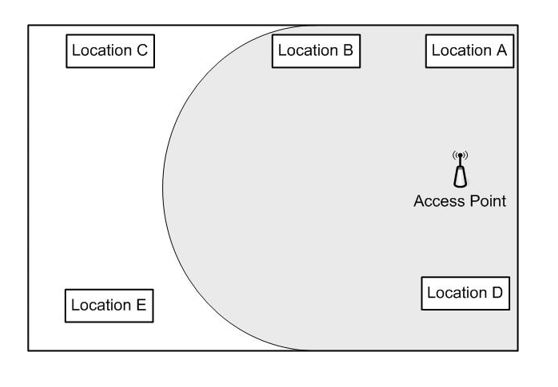
    > **Location B** The wireless range extender should be deployed at location B. The device acts as a wireless repeater, rebroadcasting the signals it receives. The device must be in the broadcast range of the AP and as close as possible to the devices it needs to connect to. this scenario, B is the location that better fulfills these requirements.
    > 
    > The wireless range extender should not be deployed at location A or D. Because these locations are so near the AP, it would provide little, if any, improvement.
    >
    > The wireless range extender should not be deployed at location C or E. These locations are outside of the broadcast range of the AP and would do nothing to improve support for the devices.
    
 

64. Which network device uses ASICs to handle the packet switching for inter-VLAN communication?
    > **L3 switch** An L3 switch uses an application-specific integrated circuit (ASIC) to perform packet-switching operations. Routers and firewalls perform routing in software. The Network layer (Layer 3) is responsible for addressing, packet-forwarding, and routing services. The Data Link layer (Layer 2) encapsulates packets into network frames and works with physical addresses (MAC addresses) in a local area network (LAN). Switches can work at layer 2 and layer 3 at the same time to provide efficient inter- VLAN routing.
    > 
    > Virtual Local Area Networks (VLANs) are logical subnetworks that can be created on a switch. A Layer 3 device (for example a router, L3 switch, or firewall) is required for inter-vlan communication. By default, all traffic between VLANs will be allowed. A network administrator can create an access control list (ACL) to deny data flows.
    > 
    > An L2 switch works at the Data Link Layer of the OS model (Layer 2) and does not offer routing capabilities.
    > 
    > L4 routers and firewalls offer inter-VLAN routing, but they do not use ASICs to handle the packet switching.
 

65. A consultant is helping set up an office in a remote rural area. The office needs a high bandwidth WAN link with the main office, which is located several hundred miles away. Which type of transmission medium should the consultant recommend?
    > **Satellite** The consultant should recommend using a satellite link to create a satellite-based WAN connection. This s likely the only high bandwidth option available in a rural area. This solution would require the installation of a dish for sending and receiving data at the remote office. One potential concern with satellite internet is latency, due to signal delays because of the distances traveled.
    > 
    > Copper and fiber optic are not realistic options in this scenario, even though they are higher bandwidth solutions than satellite WAN. The options that a remote office is likely to use, either cable modem or telephone company DSL, would not be available in a remote rural area.
    > 
    > Cellular-based wireless WAN is not a good option in this scenario. Cellular coverage has expanded but is still not available in all areas. Even if it is available, this option provides limited bandwidth.
 

66. A company is configuring an internal network with routed subnets based on the following class B address range:  172.30.8.0/21  The company wants to set up the following subnets: - Network A - 600 hosts - Network B - 100 hosts - Network C - 56 hosts - Network D - 40 hosts  The company wants to keep the unused addresses in each subnet to a minimum. Which network address ranges should the company use?
    > The base address, 172.30.8.0/21, supports up to 2046 host addresses with an address range of 172.30.8.1 through 172.30.15.254. You should use the following subnets:
    >   - Network A: 172.30.8.0/22
    >   - Network B: 172.30.12.0/25
    >   - Network C: 172.30.12.128/26
    >   - Network D: 172.30.12.192/26
    >
    > This is an example of Classless Inter-Domain Routing (CIDR), or supernetting, using variable length subnet masks (VLSMs) to configure subnets of various sizes. Network A supports up to 1022 hosts. Network B supports up to 126 hosts. Networks C and D support up to 62 hosts each. The host address ranges are:
    >   - Network A: 172.30.8.1 through 172.30.11.254
    >   - Network B: 172.30.12.1 through 172.30.12.126
    >   - Network C: 172.30.12.129 through 172.30.12.190
    >   - Network D: 172.30.12.193 through 172.30.12.254
    > 
    > The company should not use the following:
    >   - Network A: 172.30.8.0/22
    >   - Network B: 172.30.10.0/25
    >   - Network C: 172.30.10.128/26
    >   - Network D: 172.30.10.192/26
    >
    > This would not work because the address ranges for Network B, Network C, and Network D all overlap with Network A.
    
 

67. A server on the internal network is determined to be at risk for potential attack. The Technical Services team is directed to harden the server to minimize this risk. The network supports wired and wireless access. The server is connected through a wired connection. The computer is backed up to a network location once a week, over the weekend. The computer is rebooted after the backup. Which two actions should hardening include?
    > Actions the company can take to harden the server include bringing patches and other updates up-to-date and disabling unused ports. Patching the server helps to close any known vulnerabilities. Disabling ports reduces the access footprint of the server so that there are fewer potential attack paths. Other actions that could be taken include:
    >   - Update firmware, if it is out-of-date
    >   - Strengthen passwords
    >   - Change credentials on any default accounts
    >   - Use secure protocols for communication
    >   - Disable unnecessary services
    >
    > The company should not limit itself to stopping unnecessary services rather than disabling them. Stopping a service does not change how startup is configured. If the service is configured to start automatically, it will start again the next time the server is restarted.
    >
    > The company should not treat backups as device hardening. Backups are important and can be key to data recovery after an attack or data loss but do not do anything to prevent attacks directed at the server.
    >
    > The company should not add wireless access. This makes the server more susceptible to attacks because it opens an additional communication path. Also, wireless communication is sometimes less secure than wired connections, depending on how it is configured.
    
 

68. An office is configured with APs as shown in the exhibit. The office was originally configured with AP1 only, but the users farthest from the AP had problems connecting. There were also intermittent problems with bandwidth saturation. After installing AP2, users near the center of the office have trouble connecting and communicating and are experiencing latency problems. What should technicians do to correct the problem?  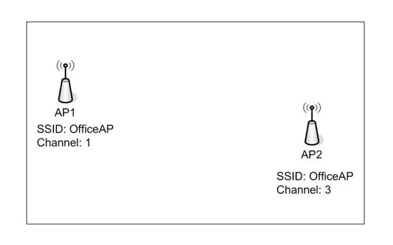
    > **Change AP2 to channel 6** Technicians should change AP2 to channel 6. The problem is that the channels used by AP1 and AP2 overlap and are interfering with each other. Reconfiguring AP2 for channel 6 or higher would prevent the overlap and correct the problem.
    >
    > Technicians should not change AP1 to channel 3. This would increase the interference between the APs and make the problem
    >
    > Technicians should not change the SSID for AP2 to OfficeAP2. This would do nothing to correct the problem. There is no problem with both APs having the same SSID as long as they are part of the same network.
    >
    > Technicians should not move both APs to the center of the room. The would increase the amount of overlap because of the close proximity and would probably make the problem worse.
    >
    > Technicians should not uninstall AP2 and move AP1 to the center of the room. This would resolve the problem with interference but users would still experience problems with bandwidth saturation (overcapacity).
    
 

69. Which protocol provides time synchronization service over the global Internet?
    > **NTP** Network Time Protocol (NTP) is a clock synchronization protocol that provides synchronization services over the internet. Time synchronization is based on Coordinated Universal Time (UTC) and is designed to allow no more than a few milliseconds variance between computers subscribing to the service.
    > 
    > IPAM IP address management (IPAM) is not related to time synchronization. IPAM supports tracking and information associated with a network's IP address space. It can provide detailed information such as subnets in use, free IP address space, and host names associated with IP addresses.
    > 
    > SNMP Simple Network Management Protocol (SNMP) is used to monitor and manage network devices. It is not a time synchronization service. SNMP lets you collect information about network devices in a multivendor environment and issue configuration commands.
    > 
    > ICMP Internet Control Message Protocol (ICMP) is not a time synchronization protocol. It is a messaging protocol used for error reporting, troubleshooting, and diagnostics. ICMP is used by various commands, such as ping and tracert (traceroute), and it can also be used by the map command when attempting to map a network.
 

70. A company is developing several web applications. The company does not have the hardware resources to support the development and does not want to incur the expense of additional hardware. The company wants to use its own development application and data, but it wants hardware, operating system and storage management to be the responsibility of a third-party provider. Which type of service does this describe?
    > **PaaS**
    
 

71. In-house technicians plan to emulate a penetration attempt. They want to see if they can learn what services are running on network. What should they use?
    > **Port scanning** The technicians should use port scanning. A port scanner attempts to connect to ports on a computer and determine which ports are open. Most services have well-known ports associated with them. By identifying the ports that are open on a computer, you can get some idea of the services configured on that computer. This information can be used to identify the services running on a server. This is a relatively passive activity and can often go undetected. A port scanner can be used for both valid network management and malicious purposes. You could use a port scanner to look for services installed and configured on a computer, but it can also be used to identify vulnerabilities in preparation for hacking into a network.
    > 
    > Technicians should not use vulnerability scanning. This looks for known vulnerabilities, but it does not necessarily report all services running on a server.
    > 
    > Technicians should not use packet or traffic analysis. These terms are often used interchangeably because the same utilities are frequently used for both purposes. This is the process of capturing and storing network traffic for analysis. You can analyze traffic patterns for potential anomalies and look at packet content in detail.
     
 

72. A company contracts with a cloud provider. The cloud provider is responsible for virtualized hardware, storage, and network support. The company is responsible for installing, licensing, and maintaining the operating system and server applications. Which type of service does this describe?
    > **IaaS**
    
 

73. A network administrator has been tasked with deploying a new wireless LAN controller. Which protocol is recommended for integrity checking and encryption?
    > **AES-based CCMP** The network administrator should use the Counter Mode with Cipher Block Chaining Message Authentication Code Protocol (CCMP) with Advanced Encryption Standard (AES). Wi-Fi Protected Access II (WPA2) is a recommended protocol for wireless communications, sometimes referred to as WPA2-CCMP/AES. WPA2 is backwards compatible and supports Temporal Key Integrity Protocol (TIP). Wireless Lan Controllers (WLC) manage and configure wireless access points.
    > 
    > TKIP should not be used to secure a wireless network. TKIP is a legacy protocol that is vulnerable to a number of attacks. The network administrator should use CCMP/AES instead.
    > 
    > Internet Protocol Security (IPsec) is used to protect VPN traffic, not wireless networks. IPsec is an umbrella of protocols that can be deployed to secure remote and site-to-site tunnels.
    > 
    > Transport Layer Security (TLS) is not a recommended protocol here. TLS allows a client and a server to establish an encrypted connection over a public network using certificates.
    >
    > The Secure Hash Algorithm (SHA) is not used to protect wireless networks. SHA could be implemented to verify the integrity of a file or VPN traffic.
 

74. A company deploys a host as shown in the exhibit. The host needs to be configured with a static address. What values should be used to configure the host? To answer, drag the appropriate value to each configuration parameter. A value may be used once, more than once, or not at all.
    > 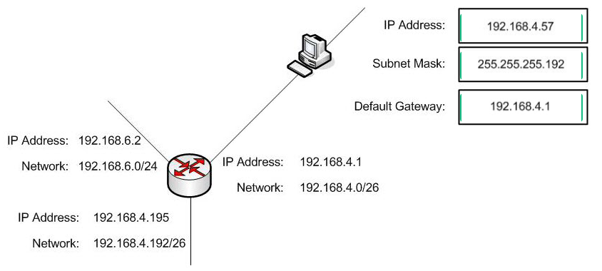
    > 
    > The address 192.168.4.57 is a valid host address on the 192.168.4.0/26 subnet. Valid addresses range from 192.168.4.1 through 192.168.4.62. A subnet mask of 255.255.255.192 is equivalent to a Classless Inter-Domain Routing (CIDR) value of /26. The default gateway is the router interface facing the subnet, which is 192.168.4.1 in this scenario.
    
 

75. A company's wireless LAN is configured with three access points configured as follows:   AP1: - SSID: CompAP - Channel: 1 - Security: WPA2-PSK  AP2: - SSID: CompAP - Channel: 6 - Security: WPA2-PSK  AP3: - SSID: CompAP - Channel: 11 - Security: WPA2-PSK  A user is moved to a cubicle in a different part of the office building. The user is prompted for a passphrase when attempting to connect to any wireless device to the network.  Why is this happening?
    > **The user is connecting to an AP with a different passphrase.** The most likely problem is that the user is connecting to an AP with a different passphrase. WPA2-PSK uses a passcode or passphrase for authentication when a device connects. The user's devices are attempting to connect to an AP. After a user successfully connects, it persists the passphrase used. If the passphrase is changed or if the user attempts to connect to an AP with a different passphrase, the user is prompted for the passphrase.
    > 
    > The problem is not that the AP is operating on a different channel. The client will reconfigure itself automatically to match the AP's channel.
    > 
    > The problem is not that the client device is outside of the range of any AP. If the devices were out of range, the user would not be prompted for connection information.
    > 
    > The problem is not related to MAC filtering. If the client were being blocked by MAC filtering, it would not prompt for authentication information.
 

76. Which policy sets guidelines for allowing employees to use their own personal devices for work-related tasks?
    > **BYOD** A bring your own device (BYOD) policy sets guidelines for allowing employees to use their own personal devices for work-related tasks. The specific content of a BYOD varies by organization depending on its needs, security concerns, and network support for devices. Where possible, policies are typically enforced through network configurations and settings, such as Active Directory Domain Services (AD DS) Group Policy.
    > 
    > An acceptable use policy (AUP) defines allowed and appropriate use of company data, software, and computers. For example, an AUP might state that users are not authorized to install games on company computers.
    > 
    > A non-disclosure agreement (NDA) is confidentiality agreement. It is a legally binding contract between two or more entities, such as between a company and an employee, designed to protect proprietary information and trade secrets.
    > 
    > A service-level agreement (SLA) defines levels of service provided by a customer to its customers. For example, an SLA could define items such as performance metrics and guaranteed availability.
 

77. A small company subscribes to a popular productivity application suite. All employees access the applications through a web browser interface. Employees store their data locally on their own computers. Which cloud delivery model does this describe?
    > **Public** This is an example of a public cloud. Multiple users and organizations have access to applications or other services through a subscription agreement. This is essentially a shared software model. Subscribers have minimal control over the application, such as personal preference settings and data storage locations. Many public cloud applications also provide storage support ir addition to other application infrastructure.
    > 
    > This is not an example of a hybrid cloud. A hybrid cloud combines cloud-based and on-premises service and resources. This could be, for example, a cloud-based application that uses secure on-premises data with a secure communication channel between the two.
    
 

78. Which mechanism monitors and manages virtual machine instances?
    > **Hypervisor** A hypervisor manages virtual machine instances and is called a Virtual Machine Monitor (VMM). A hypervisor allows an administrator to deploy multiple virtual machines and control all virtualized hardware resources. There are two types of hypervisors: type 1 (bare-metal) and type 2 (hosted).
    
 

79. A company is preparing to deploy a wireless LAN (WLAN) in a newly constructed office space. The network design specifies the minimum channel bandwidth requirement as 80 MHz.  Which standard should the access points support?
    > **802.11ac** Access points used in the deployment should support the 802.11ac standard. 802.11ac supports an 80 MHz channel configuration. 802.11ac and 802.11ax support bandwidth configurations for 20 MHz, 40 MHz, 80 MHz, and 160 MHz.
    
 

80. Which two items would be specified as part of an SLA? (Choose two.)
    > A service level agreement (SLA) is an agreement between a service provider and its customers that defines performance standards that the provider is required to meet. Typical items in an SLA include:
    >   - Availability and uptime
    >   - Help desk response time
    >   - Performance benchmarks
    >   - Application response time
    >
    > It will also identify what usage statistics will be provided to the customer.

 

81. The support team has been tasked with creating an alias name for a newly deployed server. What should the team do? To answer, complete the statement by choosing the correct answers from the drop-down menus.
    > The team should connect to a Domain Name System (DNS) server and configure a Canonical Name (CNAME) record. DNS is a service that translates domain names into IP addresses. There are multiple records in use. One of them is NAME, which allows the team to create an alias for an existing entry.

 

82. A company routes Cat 5e UTP cabling through a part of its manufacturing floor that generates a great deal of Electromagnetic interference (EMI). The cables are routed loosely through the ceiling, about 3 meters above the equipment. Computers connected to the cabling experience communication errors any time the equipment is running. The company needs a reliable, cost-effective solution. Management will not authorize converting to fiber optic cabling. What should the company do?
    > **Replace the Cat 5e UTP cable with Cat 5e STP cable.** The company should replace the Cat 5e unshielded twisted pair (UTP) cable with Cat 5e shielded twisted pair (STP) cable. Electromagnetic interference (EMI) can come from several sources, such as compressors, cutting equipment, and other manufacturing equipment. EMI can induce stray signals in UTP cabling, degrading communication. The preferred solution is usually to avoid EMI sources. Otherwise, STP cable should be used to block the EMI
    > 
    > The company should not use Cat 6 UTP. Cat 6 cable is an improvement over Cat 5e cable, supporting higher data rates and making crosstalk less likely, but it is still susceptible to EMI.
    >
    > You should not route the cable through the existing power conduit. This can cause excessive voltages to be induced on the data cable, which can result in equipment damage.
    > 
    > You should not route the cable along the floor. This will not fix the problem and, since the cable would be closer to the equipment, could make the problem worse. It would also make the cable susceptible to physical damage.
    
 

83. Which layer of the OSI model are web browsers and email clients implemented at?
    > **Layer 7** Web browsers and email clients are implemented at Layer 7, the Application layer, of the OS model. This includes the protocols supporting these functions, including HTTP, HTTPS, POP3, and SMTP. High-level functions are implemented at this layer, such as remote file and printer access, resource sharing, and virtual terminals. 
    >
    > Layer 6 is the Presentation layer. The Presentation layer handles character code translation, such as EBCDIC to ASCII, data compression, and data encryption.
    
 

84. A user complains about the transfer rates from a server VLAN 4. A network administrator connects to a switch and receives the output shown in the exhebit. Which parameter is MOST likely misconfigured on the switch?  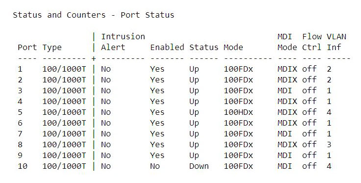
    > **Duplex** The duplex settings should be verified. The exhibit shows an output from a switch representing port status. There is only one active port in VLAN 4 - Port 5. The exhibit shows that the negotiated mode is 100HDx, which means 100 Mbps and half-duplex. Half-duplex indicates that frames can be transmitted in both directions, but not at the same time, which will heavily impact the performance of the network. The network administrator might also encounter a situation called a duplex mismatch error, where he side uses half-duplex and the other side uses full-duplex.
    > 
    > The speed setting is not a problem here. The exhibit shows that all ports use 100 Mbps.
    > 
    > The flow control will not fix the issue. Flow control could be enabled for high-performance servers that require loss-sensitive protocols.
    >
    > The medium dependent interface (MDI) setting is not the issue here. The Auto MD mode is used to identify and correct cabling issues such as using a straight through cable instead of a crossover cable.
    
 

85. Which device should a company use to configure a new area within OSPF?
    > **Router** The company should use a router to configure a new area in Open Shortest Path First (OSPF). OSPF is a link-state routing protocol and uses areas to group routers. The company could configure OSPF on a router to enable a dynamic exchange of routing tables and achieve fast convergence times.
    > 
    > The company should not use a Layer 2 (L2) switch. L2 switches work at the Data Link layer and do not support routing.
    > 
    > An Intrusion Prevention Systems (IPS) and an Intrusion Detection Systems (IDS) do not support OSPF. The company could use an IPS or IDS to protect the network against malicious activity. An IDS is a passive device that can identify a network attack, while an IPS can identify and stop a threat.

 

86. A company has configured some services and applications using a PaaS platform. The network team wants to create a secure connection from an onsite router to the new platform. Which of the following would be the BEST protocol to implement?
    > **IPSec** The network team should use Internet Protocol Security (IPsec). IPsec is an umbrella of protocols that the team can use to create a site-to-site virtual private network (VPN) between an on-site router and the Platform as a Service (PaaS) platform.
    > 
    > Point-to-Point Tunneling Protocol (PPTP) should not be used because it has proven vulnerabilities. PPTP used to be deployed as a remote-access VPN solution. The team should use IPsec instead.
    >
    > Transport Layer Security (TLS) is not an optimal choice here. The team has to create a site-to-site VPN tunnel. There are no industry standards for site-to-site tunnels based on TLS/SSL. The team could use TLS to provide remote access VPN with certificates. IPsec is a better choice here. The company could use TLS to create a web portal for remote users and provide access to internal resources.
    >
    > Layer 2 Tunneling Protocol (L2TP) should not be used in this scenario, as it does not offer any encryption. L2TP can be combined with IPsec to provide a secure connection. L2TP/IPsec is a popular solution for remote access VPN.
    
 

87. What are two main differences between a hub and a switch?
    > Hubs are obsolete devices that work at the physical layer of the OSI model (Layer 1). When a frame arrives at a hub, it performs frame flooding. All the ports of a hub form a single collision domain.
    >
    > A switch works at the Data Link layer of the OSI model (Layer 2) and works with MAC addresses to identify a network device in the network. MAC addresses are stored in a Content Addressable Memory (CAM) table. When a new frame arrives at a switch, it is identified and kept in the CAM table for a short period of time. Hubs do not work with MAC addresses. They flood all frames to all ports. 
    >
    > Hubs are not limited to four ports. There are hubs with 8, 16, and more ports.
    >
    > Hubs do not unicast packets. Hubs broadcast all messages and have no control over traffic. Switches work with MAC addresses and can unicast packets.
    >
    > Hubs are Layer 1 devices and cannot be managed using a web browser. Switches, on the other hand, can be accessed using the command-line interface, SNMP, and HTTP/HTTPS. Switches offer a lot of security features, such as DHCP snooping, ARP inspection, and port security.
    > 
    > 
    > 
    > 
    > 
    > 
 

88. What is the last step in a systematic troubleshooting methodology?
    > A systematic troubleshooting methodology typically includes the following steps:
    >   - Identify the problem (gather information, duplicate the problem if possible, question users, identify symptoms, determine if anything has changed, approach multiple problems individually)
    >   - Establish a theory of probable cause (question the obvious, consider multiple approaches)
    >   - Test the theory to determine cause (Once theory is confirmed determine next steps to resolve problem; if theory is not confirmed, establish new theory or escalate.)
    >   - Establish a plan of action to resolve the problem and identify potential effects
    >   - Implement the solution or escalate as necessary
    >   - Verify full system functionality and if applicable implement preventative measures
    >   - Document findings, actions, and outcomes
    
 

89. A company needs to use physical security devices to secure a server room. The following requirements must be met: - Entrance to the storage area should be limited to select employees only. - It should be possible to track any equipment removed from the room. - It should be possible to configure an alarm to sound if anyone is in the room after normal business hours.  What should the company do? To answer, drag the appropriate physical security device to each location. A physical security device may be used once, more than once, or not at all.
    > 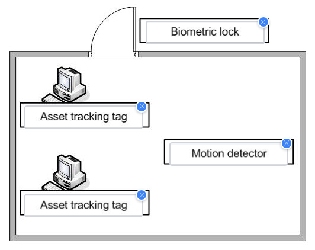
    > 
    > The company should place a biometric lock on the door, asset tracking tags on equipment, and install a motion detector inside the room.
    > 
    > A biometric lock requires a personally identifying feature, such as finger or thumb print, retinal scan, or facial recognition. Thislimits access to only those employees identified as having authorization.
    > 
    > Asset tracking tags enable tracking of assets after they are removed. The signal sent by the tag can be tracked by various types of devices, including smart phones.
    > 
    > A motion detector is activated by motion in the room. This can be connected to an alarm that is turned on after hours only.
    > 
    > There is no requirement for video surveillance. Video surveillance could be used for additional monitoring of the area.
    
 

90. Which statement BEST describes a warm backup recovery site?
    > A warm site is a site that has computer equipment, network hardware, and data communication installed and configured, but which does not have recent backups of corporate data. A warm site is designed to be able to continue operations once current backups are delivered and applied.
    >
    > A site that has the necessary facilities infrastructure to support business operations, but which does not have any equipment set up and configured, is a cold site. This applies whether or not the necessary equipment is stored onsite. It takes significant effort and can take several days to resume operations using a cold site.
    >
    > A hot site has computer equipment, network hardware, and data communication installed and configured with a current duplicate of critical data. This enables operations to continue most quickly, usually in no more than a few hours.
    
 

91. Which protocol is an open, vendor-neutral standard protocol for accessing and maintaining directory services?
    > **LDAP** Lightweight Directory Access Protocol (LDAP) is an open, vendor-neutral standard protocol for accessing and maintaining directory services. LDAP can be used to locate organizations and resources in a directory services network and supports several operations used for maintaining the directory database. A common use of LDAP is user object management. Because LDAP is vendor-neutral, it is not limited to any directory services implementation, such as Microsoft's Active Directory Domain Services (AD DS).
    > 
    > Simple Network Management Protocol (SNMP) is an industry-standard protocol used to collect information about and manage network devices. Its use is specific to devices, not directory services.
    > 
    > Simple Mail Transfer Protocol (SMTP) and Internet Message Access Protocol (IMAP) are both industry-standard protocols that support email. SMTP is used for clients to send email messages to mail servers and to transfer messages between servers. IMAP is used by clients to retrieve email messages from mail servers.
    
 

92. A company wants to connect devices so that there are many redundant interconnections. Which topology should the company use?
    > **Mesh**
    
 

93. Threat of flooding causes a company to move large vertical filing cabinets from the basement to the main office area. Users start complaining of problems connecting to the WLAN and delayed response from the network. Network analysis shows a high level of corrupted packets. What is the most likely cause?
    > **Reflection** The most likely problem is reflection, also referred to as signal bounce. Introduction of the vertical filing cabinets means that signals can bounce off of the filing cabinets, and multiple paths of propagation are created. This causes bits and partial packets to be received at delayed intervals. This can cause corruption of the transmitted data and result in latency issues.
    > 
    > The problem is not absorption, which is when signals are absorbed by materials through which they pass near or through and lost. Highly absorbent materials include water, concrete, ceramic, and brick.
    > 
    > The problem is not interference. There is nothing in the scenario to indicate that a new signal source was introduced. Interference occurs when the Wi-Fi signal must compete with another signal source operating in the same bandwidth.
    > 
    > The problem is not attenuation, which is loss of signal strength over distance. Wireless LAN (WLAN) components have not moved. so attenuation has not changed.
 

94. A company recently implemented a bring your own device (BYOD) policy and is adding security controls over personal devices. The company wants to ensure that some managed apps and most company data will be unavailable when a device leaves the corporate campus. What should the company use to implement this?
    > **Geofencing** The company should use geofencing. Geofencing is a way of establishing an electronic perimeter. This can be done through GPS, radio frequency identification (RFID), cellular triangulation, or a combination of methods to establish a boundary. Features can be enabled or disabled when entering or leaving an area.
    > 
    > The company should not use **geotagging**. Geotagging refers to associating a geographic location with a photo, video, text, or other post or data. This is typically discouraged from a security standpoint because it enables someone to track your location.
    > 
    > The company should not use **Wi-Fi Protected Access II (WPA2)**. WPA2 is a means of securing a wireless network through secure authentication and encrypted communication. WPA2 is built on the IEEE 802.11i wireless security standard. WPA2 does not provide for interactive BOD feature control based on location.
    > 
    > The company should not use **Extensible Authentication Protocol-Flexible Authentication via Secure Tunneling (EAP-FAST)**. EAP- FAST is a secure authentication protocol that establishes a secure communication tunnel for passing client certification credentials. It is not related to location-based awareness.
 

95. A company needs to support a secure link for remote users to a web-aware application that is deployed on a server in the perimeter network. The Technical Services department recommends using an SSL VPN to minimize the configuration changes needed in network firewalls. The solution will use certificate-based authentication. What is the minimum certificate requirement for this configuration?
    > **A server-side certificate only** The minimum requirement for certificate-based authentication is a server-side certificate only. Many authentication methods do not require a certificate, but when one is required for server authentication, a server certificate is required. The server will present the public certificate to the client during the initial handshake. A client certificate is not required.
    > 
    > If you want to require mutual authentication, in which the client authenticates the server and the server authenticates the client, both client and server certificates are required. The client and server will have different certificates.
    > 
    > It is important to note that even though the term SSL is commonly used to refer to this type of security, SSL is an older standard and TLS is in more common use in its place. The basic functionality, authentication procedures, and supported authenticated types are effectively the same between the two.
    
 

96. A company wants to deploy a web server in a new DZ. Which device should the company use to configure a new network zone and Layer 7 filtering policies?
    > **Firewall** The company should use a firewall to configure a new network zone and apply Layer 7 filtering policies. A firewall guards the network and monitors all traffic. Firewalls can work at Layer 7 to offer application-awareness services. Next-generation firewalls (NGFWs) offer more features and can block network attacks. A demilitarized zone (DMZ) is a special network area kept separate from the internal network. The company could use a DM to deploy internet-facing servers and applications.
    > 
    > The company should not use a switch for this deployment. A switch supports VLANs and access control lists (ACLs), but is very limited when it comes to security features and does not allow the company to monitor data at the Application Layer (Layer 7) the OSI model. An ACL is a list of statements specifying an allowed or denied action. An ACL might allow traffic from one security zone (area) to another.
    > 
    > A hub is a legacy Layer 1 device. Hubs do not support zones or any security options. The company should use a firewall to configure a new network zone.
    > 
    > A proxy server acts as a gateway between a local computer and a resource on the Internet. Web proxy servers focus on web traffic and allow users to hide their real IP address or bypass security restrictions. The company could use a proxy server to monitor and filter outgoing traffic. A web proxy is not designed to configure a DMZ with Layer 7 filtering.
 

97. PC1 fails to receive an IP address in the network shown in the exhibit. What should be configured to fix the problem? 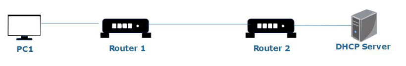
    > **IP helper address on Router 1** The company should configure an IP helper address on Router 1. An IP helper is also called DHCP relay. It forwards DHCP packets between a client and an external DHCP server. This configuration is required because PC1 and the DHCP server are not connected to the same network segment.
    > 
    > Port forwarding will not fix the issue. DHCP messages are dropped by Router 1 and cannot be forwarded without a DHCP relay agent. Port forwarding is used to open ports on a router or firewall, for example for an internal email server.
    > 
    > DHCP option 66 is used for specifying a Trivial File Transfer Protocol (TFTP) server. The company could use this feature for a Voice over IP (VoIP) network.
    > 
    > A conditional forwarder cannot be used in this scenario. Conditional forwarders are configured on domain name system (DNS) servers to redirect traffic to other DNS servers.

 

98. A systems administrator cannot ping a file server running Windows Server. Users can access files on the server without any problems. What should the administrator check?
    > **Local firewall rules** The administrator should check local firewall rules. Many servers and network devices block Internet Control Message Protocol (ICMP) packets for security reasons. The administrator should open a local firewall on the server and verify all settings. He should create a new inbound rule and allow ICMP packets. The ping command uses ICMP to verify host reachability. ICMP is a control protocol that can report a number of errors, for example destination unreachable, time exceeded, and more.
    > 
    > It is unlikely that the problem is with TCP/IP settings, because users can access files on the server.
    > 
    > New Technology File System (NTFS) permissions are granted to a group or a particular user. NTFS permissions apply to file and folder access rights. NTFS does not block ICMP packets.
    > 
    > It is unlikely the problem is with the Address Resolution Protocol (ARP) cache. Users can access files on the server, which suggests that there is no connectivity problem. ARP maps an IP address to a physical media access control (MAC) address in a local area network.
 

99. Match each statement with the appropriate switch port protection. To answer, select the appropriate switch port protection from the drop-down menus.
    > **Root guard** enforces the placement of root bridges in the network to provide a consistent network environment. Root guard can be enabled on all switch ports that should not be able to negotiate a root bridge. The root bridge is the switch that is at the root of your spanning tree, defining communication between multiple switches. Spanning Tree Protocol (STP) is used to build a logical, loop-free topology that branches out from the root bridges.
    >
    > **BPDU guard** helps ensure a predictable active network topology by denying ports that should not participate in STP from receiving topology change notifications (TCNs) by way of Bridge Protocol Data Unit (BPDU) frames. BPDU frames are used Co initiate STP network reconfiguration in response to network changes. This is one of the methods used to prevent introducing rogue switches into a network.
    >
    > **Flood guard** refers to a device that monitors traffic to identify high levels of traffic, traffic floods, as a way to mitigate and hopefully stop denial-of-service (DoS) and distributed DoS (DoS) attacks. This is typically implemented through an external device, such as a firewall.
    >
    > **DHCP snooping** is the process of monitoring DHCP activity and tracking IP address assignments. It is primarily used as a way to detect rogue DHCP servers.
    >
    > **Switch port mode** refers to a port's Dynamic Trunking Protocol (DTP) setting as a way to configure trunking between switches and preventing rogue trunks. If an attacker is able to establish a rogue trunk, the trunk can then be used to gain access to all VLANs configured on a network.
    
 

100. Headquarters requests a new IP subnet. The solution must meet the following requirements:  - IPv4 class A address type  - Private IP address - At least 15 usable IP addresses within the range  Which subnet would meet the requirements?
    > The subnet 10.10.10.128/27 matches the requirements. The first requirement is to use a class A address type, which means the first octet will range from 0-126.
    >
    > The following private IP address spaces are assigned by IETF:
    > - Class A: 10.0.0.0 - 10.255.255.255
    > - Class B: 172.16.0.0 - 172.31.255.255
    > - Class C: 192.168.0.0 - 192.168.255.255
    >
    > Finally, the new subnet should offer at least 15 usable IP addresses. The subnet mask of /27 means 255.255.255.224 and provides space for 30 hosts.
    >
    > The subnet 10.10.10.0/30 offers two hosts only and is mainly used for a point-to-point connection.
    >
    > The subnet 110.10.0/27 is a class A address and provides enough IP addresses, but it is not a private IP address.
    >
    > The subnet 10.1.1.32/28 gives 14 usable IP addresses (hosts) only and does not meet the requirements.
    >
    > Finally, 172.16.1.0/27 is a class B address.
    
 

101. Match network protocols and services to the OS model layer in which they are implemented. To answer, drag the appropriate OSI layer to each protocol or service. An OSI layer may be used once, more than once, or not at all.
    > **Application**:
    > - DHCP Dynamic Host Configuration Protocol (DHCP) is the service that provides automatic IP address assignment and automatic network property configuration. The protocol and service are implemented at the Application layer.
    > - SMTP Simple Mail Transfer Protocol (SMTP) is an Internet-standard protocol for sending and receiving email. SMTP is implemented at the Application layer. Two other email protocols, Post Office Protocol 3 (POP3) and Internet Message Access Protocol (IMAP), are also implemented at this layer, along with email clients.
    > - DNS The Domain Name Service (DNS) provides resolution between host names and IP addresses and is implemented at the Application layer.
    > - FTP The File Transfer Protocol (FTP) supports remote delivery of files and is implemented at the Application layer. FTP clients are also implemented at the Application layer.
    > 
    > **Network**:
    > - ICMP Internet Control Message Protocol (ICMP) is used for error reporting, diagnostics, and troubleshooting. ICMP is implemented at the Network layer.
    > 
    > **Transport**:
    > - TCP Transmission Control Protocol (TCP) is one of the core protocols of the TCP/IP protocol suite. TCP is a connection-oriented communication protocol that provides rules for establishing connections and sending data between applications. TCP is implemented at the Transport layer, along with the connectionless User Datagram Protocol (UDP).
    > 
    > > No protocol or service listed is implemented at the Physical, Data link, Session, or Presentation layers. Physical network characteristics, such as transmission media, are defined at the Physical layer. The Data link layer is where physical addressing is managed through MAC addresses. It is also responsible for establishing and en g links between hosts and managing data frames. The Session layer establishes, manages, and terminates communication sessions. It manages the dialog between two hosts. The Presentation layer handles character code translation, such as EBCDIC to ASCII, data compression, and data encryption.
 

102. The host shown in the exhibit is unable to communicate with other network hosts. This is a recent problem.  Each subnet has a subnet mask of 255.255.255.0.  The technical team needs to determine whether the TCP/IP protocol stack loaded and whether the computer's NIC is working.  Which command should they run?
    > **ping 127.0.0.1** This is the IPv4 loopback address, which is used to test the TCP/IP stack and NIC without sending traffic out to the network.
    > 
    > The team should not run the following:
    > - ping 192.168.5.2 This would attempt to contact the router interface facing the subnet, but it has already been determined that the host cannot contact other devices.
    > - ping 233.0.0.1 This is a multicast address (Class D address). This is used when you want to send data out to multiple multicast hosts at the same time.
    > - ping 192.168.5.255 This is not a valid host address. This is the broadcast address for the subnet. This address is used when traffic needs to be received and processed by all hosts on the subnet.
 

103. An on-site inspection finds that one fiber optic cable exceeds the bend radius that is recommended by the manufacturer. What should be the main concern for the company?
    > **Attenuation** Exceeding the bend radius (macrobends) can cause attenuation in a fiber optic network. A macrobend is easily recognizable as a visible bend in a cable, which might cause significant radiation loss (light attenuation) and unseen damage to the fiber. A fiber cable manufacturer specifies the bending radius values that have to be followed by a technician during the installation process. Fiber attenuation is called signal loss or fiber loss.
    > 
    > Electromagnetic interference (EMI) is not caused by exceeding the bend radius in a fiber cable. EMI is an electromagnetic disturbance that might affect copper cables.
    > 
    > Optical fiber is immune to EMI and near end crosstalk (NEXT). NEXT means that one pair of cables can interfere with another pair at the end.
    > 
    > Duplex identifies a bidirectional communication system, in which data can be transmitted in both directions at the same time. Macrobends are not related to duplex.
 

104. A company wants to implement an authentication and authorization solution for network devices that also directly supports device management. What should the company use?
    > **TACACS+** The company should use Terminal Access Controller Access-Control System Plus (TACACS+). TACACS+ is a proprietary set of protocols that supports authentication, authorization, and accounting (AAA). It also provides support for network device management by authorizing router commands on a per-user or per-group basis. All TACAC+ traffic is encrypted, helping make it a secure solution.
    > 
    > **Remote Authentication Dial-In User Service (RADIUS)** is a network protocol that provides for centralized authentication, authorization, and accounting support for internal networks and the Internet. Authentication information is maintained in a RADIUS server. However, RADIUS does not provide support for device management.
    > 
    > **Simple Network Management Protocol (SNMP)** is a network protocol that supports network device monitoring and management. It supports a wide variety of network devices and is well-suited for use in a multivendor environment. SNMP does not provide any support for authentication and authorization.
    > 
    > **Kerberos** is an authentication protocol that is commonly used on the Internet and on directory service networks. It provides secure authentication and supports Windows, Linux, UNIX, and other operating systems. Kerberos provides authentication only and does not perform authorization or provide for device management.
 

105. A consultant is helping a company design a wireless LAN implementation. Network requirements include internal access points for network host connections and external wireless connections between buildings. The consultant needs to help the company choose appropriate antennas. What does the dBi rating of an antenna represent?
    > A higher dBi antenna has more gain and a narrower field pattern than a lower dBi antenna.
    >
    > An antenna's gain is measured in relative decibels (dB) in reference to a standard antenna used for reference. Gain refers to the relative measure of an antenna's ability to direct a signal in a specific direction. dBi value is commonly used, which is decibels measured relative tr In isotropic reference antenna. An isotopic antenna is one that radiates equally in all directions.
    >
    > The field pattern refers to the coverage area. For example, you would expect a 2 dBi antenna to have a 360 degree field of coverage, making it appropriate for use as an internal antenna for host connections. A higher dBi antenna has a narrower field and a more directional signal. This makes it well suited for applications such as connecting buildings on a corporate campus. The narrow field pattern makes it less likely that someone would be able to intercept the signal.

 

106. Users connect to a network using wireless laptops and report intermittent access issues with a NAS server. The access point and the NAS server are connected to a switch using a 100 Mbps link. The status of the access point is shown in the exhibit. What should the support team do to fix the connectivity issue? 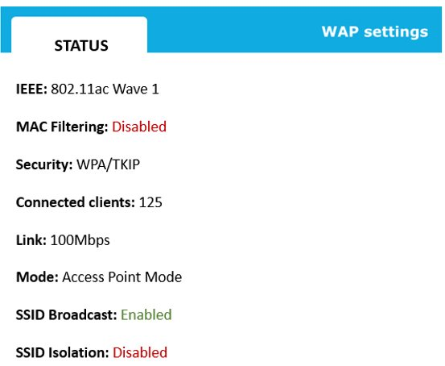
    > **Install more access points** The support team should install more access points. The exhibit shows 125 connected clients. Access points support hundreds of concurrent associated devices, but it is not a recommended approach to have that many. In this case, 125 users will probably exceed the bandwidth that the access point can provide. This phenomenon is called overcapacity. There is no clear indication how many clients can be connected to a single access point, but most network engineers limit this number to 30-50 clients.
    > 
    > Changing the security settings is not going to fix the issue. Although the access point uses an insecure legacy protocol V Protected Access (WPA) with Temporal Key Integrity Protocol (TIP), changing it to WPA2-AES will not increase the available bandwidth. WPA2-AES will improve the security of the wireless network.
    > 
    > The access point uses the IEEE 802.11ac Wave 1 standard, which supports gigabit speeds. The 802.11n standard is slower and offers the maximum data rate of 450 Mbps. Changing to 802.11n will decrease wireless performance.
    >
    > SSID isolation cannot fix the problem. The team could use the SSID isolation feature to prevent wireless clients from accessing resources on the local area network or other wireless clients.
    
 

107. For redundancy purposes, a network engineer installs a new router and enables a load balancing protocol. What type of address should he assign as a default gateway to end devices?
    > **Virtual IP** The network engineer should configure a virtual IP address (VIP). End users will use the VIP as their default gateway. A VIP is a virtual IP address that is shared between compatible network devices that are running a dedicated protocol. The network engineer has deployed a new router and has enabled load balancing for efficiency and redundancy purposes. The main advantage of using a VIP is that it is a transparent solution for end users. Both routers in the load balancing set can be reached with the same VIP. If one router fails, the second can take over.
    > 
    > The network engineer should not use a loopback address. A loopback address uses the special-purpose IP address of 127.0.0.1 and is called localhost. The engineer could use the loopback address to test the local TCP/IP stack.
    > 
    > An Automatic Private IP Addressing (APIPA) address cannot be used in this scenario. APIPA allows a Windows-based device to automatically self-configure an IP address if there is no DHCP server available. APIPA uses a range of IP addresses: 169.254.0.1- 169.254.255.254 with a subnet mask of 255.255.0.0.
    > 
    > IPv6 does not offer any built-in redundancy or load balancing options. Routers can use an IPv6 address, but the network engineer has to assign a VIP address as a virtual IP address on both devices. IPv6 is the successor protocol to IPv4.
 

108. A network consultant determines that a company can improve its performance by implementing jumbo frames. The networkis configured with 10/100/1000 switches, and all hosts are configured with Gigabit Ethernet network adapters. The network is wired with Cat 5e UTP cable. What must the company do to support jumbo frames?
    > **Increase the MTU to 9000** The company should increase the maximum transmission unit (MTU) to 9000 on all network devices. The default MTU, and therefore the default maximum frame size, on an Ethernet network is 1500 bytes. Jumbo frames can have a maximum size of up to 9000 bytes. The MTU needs to be increased on all network devices. Mixed MT values can degrade network performance.
    > 
    > The company should not replace the cable with Cat 6 UTP cable. Jumbo frame support requires, at a minimum, gigabit network adapters (1000BaseT), which is supported by the existing Cat 5e cable. If the cable did not support the traffic, you would expect to already have communication errors and performance problems.
    > 
    > There is no reason to enable spanning tree protocol (STP) to support jumbo frames. STP is not related to frame size. STP is designed to prevent transmission loops from being created when a network has multiple switches.
    > 
    > The company should not configure each switchport in dynamic auto mode. Dynamic auto mode means that a port can be used to create a trunk connection with another port. Trunk connections are used to make connections between switches. Enabling dynamic auto mode on each switchport puts the network at greater risk of attack. A rogue switch could be used to create a trunk connection, giving the attacker access to all VLANs.

 

109. Which command line interface command should a systems administrator use to verify the hardware address of a device connected to a local area network?
    > **arp** The systems administrator should use the arp command. The arp command shows a table with the Address Resolution Protocol (ARP) cache. ARP is a mapping of IP addresses to hardware addresses (MAC addresses). If a device is in the same LAN and is actively used, it will be visible in the ARP cache table. Here is the full Windows command that displays the current ARP entries: `arp -a`
    > 
    > The systems administrator should not use the `ipconfig` command. The ipconfig command shows TCP/IP settings, including the local hardware address only. The systems administrator wants to verify a MAC address of a remote device, which cannot be achieved using the ipconfig command.
    > 
    > The `nslookup` command cannot be used in this scenario. The systems administrator could use the nslookup command to troubleshoot Domain Name System (DNS) issues.
    > 
    > The `pathing` command does not provide information about MAC addresses. The pathping command combines the functionality of the ping and tracert commands to provide a table with routing hops.
 

110. A company is deploying a new computer as shown in the exhibit. The company will have a static IPv4 address. What should technicians use as the computer's default gateway? 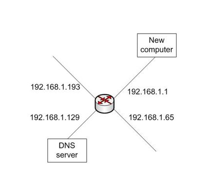
    > **192.168.1.1** The default gateway should be set to 192.168.1.1. The default gateway is the path traffic takes when being routed from one subnet into another subnet. The default gateway should be the address of the router interface facing the subnet, so this is the only appropriate value. The other IP addresses are for interfaces that face other subnets.
    
 

111. A network administrator implements a change on a switch to fix a network issue. According to the troubleshooting methodology, what should the network administrator do next?
    > **Implement preventative measures.** The network administrator should implement preventative measures, as defined in step 6 of the Structured Troubleshooting Methodology. The solution has been implemented successfully (step 5), and the issue should now be fixed. Step 6 specifies verifying the network functionality and recommends implementing preventative measures.
    
 

112. What should a company use as an authentication and authorization server for WPA2-Enterprise?
    > **RADIUS** Wi-Fi Protected Access II (WPA2)-Enterprise requires a RADIUS server for authentication and authorization. This is the only authentication option supported for WPA2-Enterprise. This is also referred to as WPA2-802.1x mode.
    >
    > WPA2 can also be implemented as WPA2-PSK (WPA2-Personal). This uses a string of 64 hexadecimal digits or a passcode (password) of up to 63 printable ASCII characters for authentication.
    > 
    > Kerberos is an authentication protocol that is commonly used on the Internet and on directory service networks. It provides authentication and supports Windows, Linux, UNIX, and other operating systems. Kerberos cannot be used for WPA2-Enterprise authentication.
     
 

113. A company's network is shown in the exhibit. PC1 is unable to access any resources in network B. What should the company do to fix the issue? 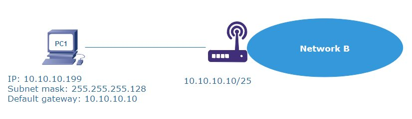
    > The company should change the IP address on PC1. PC1 and the router are not in the same subnet and cannot communicate. The subnet mask has been configured as 255.255.255.128, which means /25 using CIDR notation. The router has the IP address of 10.10.10.10/25. The useable IP range in this subnet is 10.10.10.1 - 10.10.10.126. PC1 uses the IP address of 192.168.1.199, which is not in the same subnet.
    > 
    > Changing any settings on the router is unnecessary and could affect multiple devices in the network. PC1 has been configured using the correct default gateway of 10.10.10.10.
    > 
    > The company should not change the subnet mask on PC1. PC1 and the router are in the same local area network and should use the same subnet mask to communicate.
    
 

114. A company's WLAN is configured with one access point (AP) named AP1. AP1 has an SSID of AP1, is configured to use channel 1, and is configured for WPA2-PSK. The company deploys a second AP named AP2 and with an SSID of AP2. The AP is configured to use channel 6 and is configured for WPA2-PSK. It is also configured with a unique IP address range. The remaining configuration settings are left at the defaults. Technical Services discovers that someone has been hacking into AP2 and changing configuration settings. After the settings are corrected, they are changed again in a few days. How should Technical Services implement device hardening to prevent this from occurring?
    > **Change the default administrator's password on AP2.** They should change the administrative password on AP2 from the default. There is nothing in the scenario to indicate that Technical Services changed the default administrative password. Default administrative passwords for most devices are listed in various locations on the Internet. Not changing the password from the default leaves the access point (AP) open to hacking.
    > 
    > They should not disable SSID broadcasting. This would not correct the problem. The SSID is used to identify the AP so a client can select an AP for a connection. The hacker probably already knows the SSIDs. Also, the hacker is likely connecting to the web interface screen using the IP address of the AP. Disabling SSID broadcasting does not prevent a serious hacker from finding and attacking an AP.
    > 
    > The should not reconfigure APs to use Wi-Fi Protected Access II-Enterprise (WPA2-Enterprise). WPA2 is a security protocol used to authenticate clients when they connect and encrypt wireless communication. Changing from WPA2-PSK, which uses a passcode for access, to WPA2-Enterprise would not correct the problem because WPA2 is not used to secure administrative access. This solution would also require deploying a RADIUS server to provide centralized authentication and authorization.
    > 
    > They should not change AP2 to channel 1. This would do nothing to correct the problem. The channel sets the specific frequency used for communication. Having both APs configured for channel 1 could cause interference between the APs and could result ir communication problems.
 

115. A network administrator has captured the following messages on the firewall: 10.10.10.10:64391 > 188.12.11:80 188.12.1.1:80 > 10.10.10.10:64391 10.10.10.10:64392 > 83.122.1.1:80 Which application has generated that traffic?
    > **Web browser** The output has been generated by a web browser. The destination port number is port 80, which identifies HT TP. The source port number is dynamically created by a local device (from the range of ports 49152- 65535). Instead of a firewall capture, a network administrator could use the netstat command on a local computer to display protocol statistics and current TCP/IP connections.
    > 
    > DNS would use port 53, not 80. DNS converts website names into numerical IP addresses.
    > 
    > FTP uses TCP ports 20 and 21 for file transfers. FTP is considered insecure because it does not encrypt the network traffic. FTP can be protected by implementing SSH or SSL (SFTP and FTPS).
    > 
    > Voice over IP (VoIP) systems do not use TCP port 80. Depending on the protocol, the capture would have a set of UDP protocols, for example ports 16376-32767 for RT traffic.
 

116. A company expands its corporate campus. All new buildings are configured to support wireless LANs. The company wants to use WPA2-Enterprise to ensure wireless security and provide for centralized control of authentication and authorization. What type of network device is needed to provide centralized authentication and authorization?
    > **RADIUS server** The company needs to use a Remote Authentication Dial-In User Service (RADIUS) server to support WPA2-Enterprise. In this configuration, the RADIUS server is responsible for authentication and authorization, as well as related accounting activities (also known as AAA). The wireless access point (WAP) or wireless LAN controller is configured as a RADIUS client. The WAP passes the authentication request to the RADIUS server.
    > 
    > A wireless LAN controller is a network device that provides for central control and management of multiple WAPs. A wireless controller does not provide centralized authentication and authorization. It can forward authentication requests from clients to the RADIUS server for authentication, but it cannot perform the authentications. A wireless LAN controller can also mitigate radio interference, provide load balancing, provide for failover, and improve bandwidth usage.
    > 
    > The company should not use a proxy server. A proxy server adds a layer of protection between internal network hosts and external websites. The proxy server uses its own address instead of the internal host's when connecting to an external site a returns the result to the originally requesting host. Most web proxy servers will also cache the result and serve subsequent requests from the cache instead of issuing a new request to the external server.
    > 
    > The company should not use a Next-Generation Firewall (NGFW). An NGFW provides traditional firewall functionality but adds advanced functionality, including acting as an application-level firewall with deep packet inspection. An NGFW does not provide support for centralized authentication and authorization.

 

117. At what point in a troubleshooting methodology is it appropriate to escalate a problem?
    > It is appropriate to escalate a problem if the technician is unable to confirm a theory and unable to establish a new theory or if no appropriate solution is available. Either of these situations indicates that the person troubleshooting the problem is unable to make any further progress. A problem should be escalated when either of these situation occurs.
    
 

118. The marketing team uses a SaaS service to store raw video files. The team reports slow access to some resources on the SaaS platform. What should the network team do?
    > **Check the bandwidth** The network team should use a bandwidth speed tester to verify the available bandwidth. The marketing team uses a software- as-a-service (SaaS) solution to upload raw video files, which is a bandwidth-consuming process. SaaS provides access to software on a subscription basis.
    
 

119. A company's network is shown in the exhibit. The DHCP server is configured with a scope for each network. Clients in the 192.168.4.0 and 192.168.4.128 subnets are unable to lease addresses from the DHCP server. Clients in the 192.168.2.0 subnet are able to lease addresses. What should the company do?
    > **Deploy DHCP relay agents in the 192.168.4.0 and 192.168.4.128 subnets.** The company should deploy DHCP relay agents in the 192.168.4.0 and 192.168.4.128 subnets. The most likely problem is that the routers are not passing the DHCP client requests to the DHCP server. DHCP uses the same UDP ports as the BOOTP protocol, 67 and 68. If BOOTP relay is not enabled on or supported by the router, it will not pass the requests. A DHCP relay agent accepts requests from the clients and then sends them to the DHCP server i a packet structure passed by the router.
    >
    > The other option (not listed) is to enable BOOTP forwarding on each router.
    > 
    > The company should not deploy a DHCP relay agent in the 192.168.2.0 subnet. This would not accomplish anything towards fixing the problem. The DHCP relay agent must be deployed on the same subnet(s) as the clients attempting to lease IP addresses.
    > 
    > The company should not open UP port 53 on each of the routers as a fix for DHCP address assignment. Port 53 is used for DNS services.
    > 
    > The company should not configure IP exclusions for the 192.168.4.0 and 192.168.4.128 subnets. IP exclusions are used to identify IP addresses that should not be assigned by the DHCP server.
 

120. A company expands its corporate campus and builds new facilities for its warehouse and additional offices. The company needs to run a high-bandwidth link between the buildings. The buildings are approximately 4 km (about 2.5 miles) apart. What kind of cable should the company use?
    > **Single-mode fiber** The company should use single-mode fiber. The primary factor that determines this is the distance between the buildings. Single-mode fiber supports distances of 15 km (10 miles) or more. This cable carries a single mode, or a single broadcast signal.
    > 
    > Multimode fiber would not be appropriate for this application. Depending on the specific construction and the cable's use, maximum cable length is typically a value between 500 m (546 yards) and 2 km (1.2 miles). Multimode cable carries multiple signals through the same fiber core. Because of its design to carry multiple modes, the cable has a higher attenuation (signal loss over distance) than single-mode cable.
    > 
    > Cat 5e and Cat 7 are both high-bandwidth copper cables but support maximum lengths of no more than 100 m (328 feet). Cat 5e is readily available in unshielded twisted pair (UTP) and shielded twisted pair (STP) versions. Cat 7 is STP only.
    
 

121. While discussing a configuration issue with a switch manufacturer's technical support team, the in-house support team learns of a switch vulnerability. The vulnerability was fixed with a recent update. The support team needs to mitigate the vulnerability and avoid a potential attack with minimum risk to the network, downtime, and cost. What should in-house support do?
    > **Download and install the most recent firmware update.** The in-house support team should download and install the most recent firmware update. The team should download the update from the manufacturer or, based on manufacturer instructions, check the file hash to ensure that it has not changed and then apply the update. This is the correct way to update a network device. This will apply any vulnerability fixes included in the update.
    > 
    > The team should not deploy an intrusion detection system (IDS) to closely monitor activity with the switch. This would not prevent an attack. If an attack is detected, the IDS could send an alert so that the appropriate personnel could response to the attack.
    
 

122. The network support team needs to determine whether data is being encrypted when it is sent over the network. Which process should the team use?
    > **Packet analysis** The team should use packet analysis or traffic analysis. This is the process of capturing network traffic and analyzing the traffic content. This would enable the team to determine if the data portion of the packet is encrypted.
    
 

123. Match network devices with their role in 802.1x port-based authentication. To answer, drag the appropriate 802.1x role to each network device. A role may be used once, more than once, or not at all. 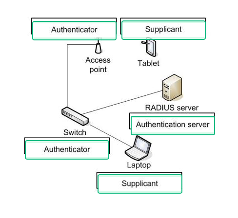
    > 802.1x port-based authentication is one way to prevent unauthorized connections to a wired Ethernet switch or 802.11 wireless access point. 802.1x authentication is designed around three roles:
    >   - Supplicant: the client device requesting authentication
    >   - Authenticator: the device receiving the request from the supplicant and passing it on for authentication
    >   - Authentication server: the device responsible for authentication
    >
    > In this scenario, the tablet and the laptop are supplicants, the access point and switch are authenticators, and the Remote Access Dial in User Service (RADIUS) server is an authentication server.
    >
    > There is no surrogate role in 802.1x authentication.
    
 

124. A company has two access points, as shown in the exhibit. Users report intermittent access issues. What could the company do to fix the problem? 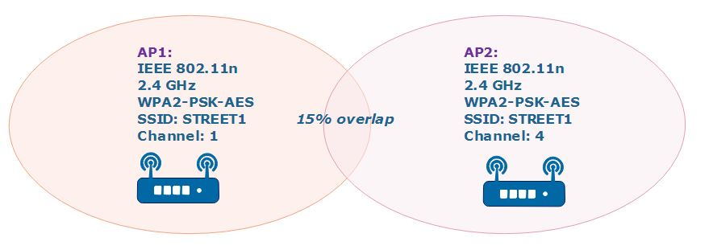
    > - **Assign AP1 to channel 11**
    > - **Change to 5 Ghz**
    > 
    > The company could change the channel on the access points (APs) or move to the 5Ghz band. The exhibit shows two access points using the 2.4Ghz band. This frequency offers only three non-overlapping channels: 1, 6, and 11. The company should either change the channels, so that they do not overlap, or move both access points to the 5Ghz band, which offers more channels to
    > 
    > The company should not assign a different service set identifier (SSID) to AP1. Both access points should use the same SSID to allow users to roam between two access points in the same network. An SSID is the name for a Wi-Fi network. SSIDs are created on a wireless router or an access point.
    > 
    > Both access points have been configured using a very secure protocol, Wi-Fi Protected Access II (WPA2) with Advanced Encryption Standard (AES). This is an optimal choice and should not be changed to a legacy solution, for example WPA or WEP.
    >
    > The overlapping area is within an accepted range of between 10% to 15%. Reducing the overlapping area to 5% might cause connectivity issues. To decrease the signal strength, the engineer could change the AP's transmit power settings.
 

125. A company deploys six new computers that are configured for automatic address assignment to the 192.168.4.0/26 subnet. The DHCP server that hosts the scope for the subnet is deployed on the same subnet. Four of the new computers are able to lease valid IP addresses. The remaining two computers have the following addresses: 169.254.12.7 169.254.14.2  What is most likely wrong?
    > **The DHCP scope is exhausted.** The most likely problem is that the DHCP scope is exhausted. The computers are configured with Automatic Private IP Addressing (APIPA) addresses. APIPA addresses are used when a computer is configured for automatic IP addressing and is unable to lease an address from a DHCP server. If the scope is exhausted, then there are no addresses available for lease, so the computers would configure themselves with APIPA addresses.
    > 
    > The other new computers were able to lease valid IP addresses, which indicates that the DHCP server is working.
    > 
    > You know that the TCP/IP stack loaded on the computers because they have IP addresses. If the TCP/IP stack did not load, the computers would not have IP addresses.
    
 

126. A company has a Dynamic Host Configuration Protocol (DHCP) server with all of the subnet addresses specified as an IP address scope. The company deploys a new physical server as a database server in the 192.168.4.0/24 subnet. Applications that use the database server require the server to always have the same IP address. Company policy forbids the use of static addressing. What should the company do to set the addressing for the database server?
    > **Configure an IP address reservation.** An IP address reservation should be configured on the DHCP server for the database server. This sets aside an address out of a configured address scope and ensures that the server always leases the same address. The computer to receive the reserved IF address is identified by its MAC address.
    > 
    > An IP address exclusion should not be specified. An IP address exclusion is used when an address that is part of an address scope is configured as static on a device. This prevents the address from being leased to another device by the DHCP server. The excluded address is still part of the address scope.
    > 
    > A VIP should not be used. A VIP is used when it is necessary to assign a shared IP address to multiple domain names, multiple servers, or multiple application instances (such as web servers) running on the same server. VIPs are also used with Network Address Translation (NAT) servers.
    > 
    > An Automatic Private IP Addressing (APIPA) address should not be used. An APIPA address is generated automatically when a host configured for automatic address assignment is unable to lease an address from a DHCP server.
 

127. A company deploys a new computer. When the cable to the computer is plugged in at the switch, the network link LED does not light. When the cable is plugged in to a different open port, the LED lights up. When plugged back in to the original port, the LED does not light. What is the most likely problem?
    > **Bad port** The most likely problem is a bad port. Because the LED lit when the cable was plugged in to a different port, you have eliminated the cable type and computer network adapter as possible problems. The LED lights indicate that a signal is detected on the cable. Because you have eliminated the cable and client network adapter by testing with a different port, the option left is a problem with the switch, specifically with the one switch port. It was necessary to eliminate other possibilities because an unlit link LED could also indicate a damaged cable or connector, a plug not fully plugged in, or that the port is disabled.
    > 
    > Virtual Local Area Network (VLAN) mismatch or duplicate IP address are both configuration errors that could prevent computer from communicating with the network, but they would not prevent the network link LED from lighting. VLAN mismatch can occur when a device is connected to a port configured for a different VLAN than the one intended. IP address problems can come from several causes, including Dynamic Host Configuration Protocol (DHCP) scope configuration errors and mixing automatic and static IP address assignments.
    
 

128. What is the first step when troubleshooting a network problem?
    > **Identify the problem** The first thing you should do is identify the problem. This starts by gathering as much information as you can about the problem, such as problem symptoms and recent changes. You would also talk to users to get their input about the problem. You need as much information about what is wrong before you can start trying to determine how to fix it.
    > 
    > A systematic troubleshooting methodology typically includes the following steps:
    > - Identify the problem (gather information, duplicate the problem if possible, question users, identify symptoms, determine if anything has changed, approach multiple problems individually).
    > - Establish a theory of probable cause (question the obvious, consider multiple approaches).
    > - Test the theory to determine cause (Once theory is confirmed determine next steps to resolve problem; if theory is not confirmed, establish new theory or escalate).
    > - Establish a plan of action to resolve the problem and identify potential effects.
    > - Implement the solution or escalate as necessary.
    > - Verify full system functionality and if applicable implement preventative measures.
    > - Document findings, actions, and outcomes.
    
 

129. Match network types with their descriptions. To answer, drag the appropriate network type to each description. A network type may be used once, more than once, or not at all.
    > A wide area network (WAN) is a collection of connected LANs over a large geographic area, enabling devices in different locations to communicate. A WAN can include connections over a very large area, including across different states or different countries. Connections are usually over public carriers, such as telephone lines or the internet.
    >
    > A personal area network (PAN) is an interconnection of devices near each other, such as in an office, organized around an individual, and often using Bluetooth connections. A home office is often a PAN connecting a computer, smartphone, printer, and other personal devices. A PAN can include wired and wireless connections.
    >
    > A campus area network (CAN) is a group of connected LANs over a relatively small geographic area, such as those of a company's buildings in the same location. It is often referred to as a corporate campus. College and university networks are usually considered CANs.
    >
    > A storage area network (SAN) is a high-speed data network giving several LAN servers access to consolidated block-level storage, using either FC or SCSI based-networks. This gives you a way to implement a high-performance storage infrastructure that is available to network devices.
    >
    > None of the descriptions accurately defines a metropolitan area network (MAN), which is a set of LANs connected over a metropolitan area. A MAN falls between a WAN and a CAN in size.
    >
    > None of the descriptions accurately defines a wireless local area network (WLAN). This is simply a LAN built on wireless instead of wired connections.
    
 

130. Which layer of the OSI model do routers operate at?
    > **Routers** operate at the Network layer (Layer 3) of the OSI model. The network layer manages host IP addresses and maps IP addresses to physical Media Access Control (MAC) addresses. Routers are responsible for directing traffic between subnets and provide the boundary between subnets.
    > 
    > The Data Link layer (Layer 2) is where physical addressing is managed through MAC addresses. It is also responsible for establishing and ending links between hosts and managing data frames.
    > 
    > 
    > 
    > 
 

131. A recent network audit has highlighted the security issues on the access point shown in the exhibit. What should the company do? 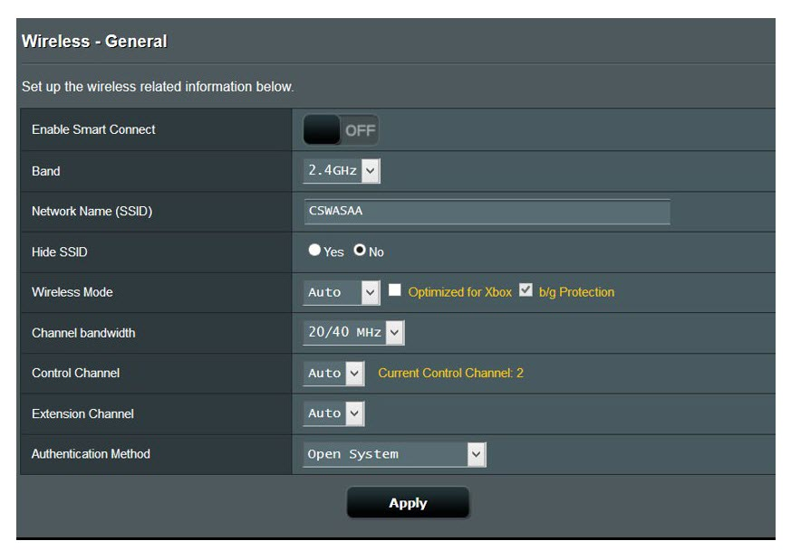
    > **Change the authentication method to WPA2-AES.** The company should change the authentication method to Wi-Fi Protected Access II (WPA2). There are two algorithms used for message integrity and confidentiality: TKIP, which is less secure, and AES. Sometimes this is referred to as WPA2-CCMP/AES. Open System means that there is no security in place and leaves the network open to everybody.
    > 
    > The WPA protocol uses TKIP and is considered insecure. The company should use WPA2-AES instead.
    > 
    > Hiding the SSID is not necessary to improve the wireless security. Some reports indicate that hiding SSID can expose your network to new attacks and makes it very difficult for end users to connect to the access point.
    > 
    > Changing the channel width will not improve security in this case. This setting might impact the performance and available bandwidth for wireless devices.
 

132. A service technician tests and confirms a theory for the probable cause of a problem. What should the technician do next?
    > **Create a plan of action.** After confirming a theory and the probable cause of a problem, the next step is to create a plan of action that identifies the actions that need to be taken to resolve the problem. The number and type of actions required depend on the problem specifics.
    
 

133. What is the topology of a network that uses a multilayer switch?
    > **Star** The topology of a network that uses a multilayer switch is star. This is because each device on the network is connected directly to a central switch, resembling the points of a star radiating from the center. The switch facilitates direct connections among devices without the need for passing data through multiple devices, characteristic of the star topology.
    > 
    > A multilayer switch is a network device that operates at both the data link layer (Layer 2) and the network layer (Layer 3). It performs switching like a standard switch but can also handle routing functions.
    > 
    > The topology of a network that uses a multilayer switch is not bus. A bus topology involves all devices sharing a single communication line where data travels along this single channel. Multilayer switches, on the other hand, use individual ports to connect devices directly, thereby avoiding the shared medium that defines a bus network.
    > 
    > The topology is not ad ho because ad hoc networks are typically characterized by direct device-to-device connections without any intervening networking hardware.
    >
    > The topology is not mesh. In a mesh topology each node might connect directly to any other node. In a network with a multilayer switch, although it can manage paths dynamically much like a mesh, devices are still centrally connected to the switch rather than directly to each other, distinguishing it from a full mesh topology.
 

134. A technician has configured a new SSID on an AP using the 5Ghz frequency. He has connected to it with a mobile phone. A test laptop is unable to show the new SSID in the list of available networks. What would be the MOST likely reason for that?
    > **The laptop has a single-band wireless card.** The test laptop has a single-band wireless card. The technician should install a dual-band card. A dual band card uses the 2.4Ghz and the 5Ghz bands to receive wireless signals. The 5Ghz frequency offers better speeds and more channels. The latest wireless standard 802.11ac utilizes the 5Ghz band for gigabit wireless connections and is backwards compatible with legacy devices and standards.
    > 
    > It is unlikely that there is a problem with the driver. The technician can see a list of available networks, which indicates the card is working without any problems.
    > 
    > The technician has tested the new SSID using a mobile phone, which indicates that there is no misconfiguration on the access point (AP) itself.
    > 
    > The issue is not with a pre-shared key. The technician cannot see the SSID in the list of available networks. A pre-shared key has to be entered after selecting a network.

   

## Moderate (84)
1. Which of the following is the primary benefit of moving a datacenter to the cloud?
    > **Increased elasticity in response to seasonal workload** Moving a datacenter to the cloud will increase elasticity in response to seasonal workload. As it relates to IT infrastructure resources, elasticity is the ability to expand or reduce allocated resources based on compute and storage requirements. For example, an e-commerce site could scale out its web server farm during busy shopping times or seasons.
    
 

2. Which is used with multimode fiber?
    > **SFP** Small form-factor pluggable (SFP) transceivers are used with multimode fiber. SFPs are often referred to as optics because they contain the laser circuitry used to transmit pulses of light over fiber optic cables. Most modern enterprise switches include a block of SFP ports and many vendors offer core and other high-capacity switches that only include SFP ports.
    > 
    > Register jack 45 (RJ45) connectors are not used with multimode fiber. RJ45 connectors support eight conductors and are used to terminate Ethernet cables.
    > 
    > F-type connectors are not used with multimode fiber. F-type connectors are used to terminate coax cables.
    > 
    > 110 blocks are not used with multimode fiber. 110 blocks, also known as punch down blocks, are used to connect telephone or data lines.
    
 

3. Which is the most cost-effective standard that supports 10 Gbps transfers up to distances of 300 meters?
    > **10 GBASE-SR** 10 Gigabit baseband - short-range (10GBASE-SR) is the most cost-effective standard that supports 10Gbps transfers up to distances of 300 meters. 10GBASE-SR uses multi-mode fiber with a 62.5 micron core. While the 10GBASE-SR specification calls for 10Gbps, the maximum distance depends on the type and quality of the fiber optic cable used. For example, optical multimode 4 (OM4) cable supports lengths up to 400 meters. In this scenario, OM3 or higher fiber is required.
    > 
    > 10 Gigabit baseband - twisted-pair (10GBASE-T) uses twisted pair, copper cable to transmit at 10Gbps over distances up to 100 meters.
    > 
    > 10 Gigabit baseband - long-range (10GBASE-LR) uses single-mode fiber optic cable to transmit at 10Gbps over to distances of 10 kilometers.
    > 
    > 10 Megabit baseband - twisted-pair (10BASE-T) used twisted pair, copper cable to transmit at 10Mbps over distances up to 100 meters.
    
 

4. Which type of cable uses an 8-10 micron core?
    > **Single-mode** Single-mode cable uses an 8-10 micron core. Single-mode, fiber optic cable uses a glass core to transmit pulses of light. By comparison, the diameter of a human hair is around 75 microns. I b tests, single-mode fiber can transmit data in the terabits r second range. Due to low attenuation, single-mode fiber c n transmit data up to and beyond 10 kilometers.
    > 
    > Multimode cable uses a 50 micron or 62.5 micron core, depending on the type. The larger core makes multimode cable less expensive than single-mode but results in lower throughput and shorter maximum cable lengths.
    > 
    > RG-6 is common coaxial cable which uses an 18 American wire gauge (AWG) core, which is 1 millimeter in diameter.
    > 
    > Category 8 (Cat 8) cable is shielded twisted pair cable. Internally, Cat 8 cable consists of eight individually shielded copper strands.
    
 

5. Which of the following is a limitation of Switch technology?
    > **Network traffic cannot flow between Switches on the same host.** One limitation of the Switch technology is that network traffic cannot flow between Switches on the same host. A Switch, or virtual switch, is the software equivalent of a physical Layer 2 switch. Switch technology is used by most virtualization platforms to provide connectivity between virtual machines (VMs) and the physical network. Each VM has one or more virtual network adapters (vNICs) which connect to a virtual switch, and each virtual switch is linked to the physical network by one or more physical network adapters. Traffic cannot flow between Switches on the same host because popular Switch platforms, such as VMware Sphere Switch, do not allow Switches on the same host to be connected. As a result, switch loops cannot be created, which negates the need for loop detection and prevention protocols such as Spanning Tree Protocol (STP).
    > 
    > VM hosts are not limited to one Switch with a maximum of 256 virtual ports. The number of supported Switches and ports varies between platforms, but even type 2 hypervisors like VMware Workstation support multiple Switches per host.
    > 
    > Each Switch on a host does not require a minimum of two physical NICs. Only one physical NIC per Switch is required. It is important to note that Switches cannot share the same physical NIC.
    > 
    > Each Switch on a host must not be configured to use the same pIC. In order to maintain Switch autonomy and prevent switching loops, each Switch requires at least one dedicated pNIC.
    
 

6. An organization deploys loT sensors at a remote location that is not reachable using traditional cabled internet services. Which technology should the organization deploy to provide the highest bandwidth available for this location?
    > **5G** The organization should deploy fifth-generation wireless (5G). 5G is a wireless networking technology that is used to provide broadband mobile communications and offers the highest throughput in this scenario. 5G is meant to replace 4G and offers significant performance increases. Peak download speeds on 5G can reach 20 Gbps under ideal conditions. Some mobile companies are now offering 5G routers with Wi-Fi for home internet use.
    > 
    > Like 5G, fourth-generation wireless (4G) is a wireless networking technology that is used to provide broadband mobile communications. Peak download speeds on 4G approach 50 Mbps with enhanced versions of 4G providing up to 300 Mbps throughput.
    > 
    > A satellite Internet connection requires a receiver, usually a disk, to be installed at the remote site. Traffic is then sent and received using communications satellites. Download speeds may approach 20 Mbps, depending on the provider.
    > 
    > Digital subscriber line (DSL) requires physical cabling. DSL is designed to run over existing telephone lines.
    
 

7. An organization wants to maximize performance for its wireless network. Which technology should the organization deploy?
    > **802.11ax** The organization should deploy 802.11ax. 802.11ax is a wireless networking standard. Also known as Wi-Fi 6, 802.11ax offers over 3Gbps per stream and works well in dense environments.
    > 
    > 802.1q allows tags to be added to an Ethernet frame for Virtual Local Area Network (VLAN) identification. 802.1q is also known as VLAN or port tagging. It is not used to maximize wireless performance.
    > 
    > 802.1x facilitates centralized authentication for wireless networks. It is not used to maximize wireless performance.
    > 
    > 802.3an uses twisted pair cabling to support speeds up to 10Gbps. 802.3an is also known as 10GBASE-T.
    
 

8. A technician plans to install Cat 7 cable to support a 10Gbps application. What is the maximum supported cable length for this application?
    > **100m** The maximum supported cable length using Cat 7 cable to support a 10 Gigabit per second (Gbps) application is 100 meters. While Cat 6a can also support 10Gbps in some applications, Cat 7 cable is the first cable specification that stipulates 10Gbps at 100 meters. Unlike previous specifications, Cat 7 and later only support shielded twisted pair (STP) cabling. In theory, Cat 7 can support speeds up to 40Gbps over shorter distances (50m or less).
    > 
    > Depending on the cable used, Cat 6a can support 10Gbps at 50 meters. However, the actual distance varies and is not guaranteed.
    > 
    > The Cat8 specification stipulates support for 25Gbps and 40Gbps up at distances up to 30m.
    > 
    > Optical fiber mode 1 (OM1) supports 10Gbps over short range, up to 33m.
    
 

9. What is the PRIMARY benefit of using power distribution units (PDUs) in a datacenter?
    > **Remote switching for equipment reboots.** A primary benefit of using power distribution units (PDUs) in a datacenter is remote switching for equipment reboots. As their name indicates, PUs facilitate power distribution and are comparable to power strips. However, most PUs are designed to be rack-mountable and are therefore preferred for usage in datacenters and network distribution closets. PUs are often connected to an uninterruptible power supply (UPS), generator, or some other backup power source. Among other features, some PUs support remote connectivity and management, including the ability to turn individual outlets on or off.
    > 
    > A primary benefit of using PDUs is not continuous power the event of an outage. This describes a UPS. PDUs do not store power in batteries, though they are often connected to backup power systems and aggregate power connectivity for devices like servers or network switches.
    > 
    > A primary benefit of using PDUs is not protection against over voltages. This functionality is usually performed by a UPS.
    > 
    > A primary benefit of using PUs is not power conditioning during brownouts. Power conditioning is usually performed by a power conditioner or a UPS.
    
 

10. What is the PRIMARY use of an intermediate distribution frame (IF) in a network infrastructure?
    > **To facilitate connectivity for end-users and devices** An intermediate distribution frame (IDF) is used to facilitate connectivity for end-users and devices. An IDF, or network closet as they are often called, consists of basic networking equipment used to service a small building, or floor within a building. In a two-tier network design, end-user devices such as computers and printers would connect to an access switch located in an IDF. IDF is then connected to the main distribution frame (MDF). The MDF is typically located in a data center and houses the core switching and routing equipment. Public connections to resources like the internet are often terminated in an MDF.
    > 
    > An IDF is not used to route traffic between different VLAN segments. Routing is done by Layer 3 switches or routers. While these types of devices may be located in an IDF, this is not a requirement.
    > 
    > An IDF is not used to protect the network from external threats. Technologies like an Intrusion Prevention System (IPS) can provide this functionality. Most modern firewalls include IPS features and functionality.
    > 
    > An ID is not used to perform Network Address Translation (NAT) for devices. NAT is frequently used to allow Local Area Network (LAN) users to share a common internet connection. The device running NAT, which is typically a firewall, translates all internal requests to use a public IP address. External users cannot connect directly to LAN devices, they must rely on the NAT device to facilitate this connectivity.
    
 

11. A network administrator is concerned about ED in a data center. Which monitor will the administrator MOST likely deploy to validate this concern?
    > **Humidity** The network administrator should deploy humidity monitors. As humidity drops in a data center, the air becomes dry. This increases the risk of electrostatic discharge (ESD). ESD can damage sensitive electronic components.
    > 
    > The administrator should not deploy power monitors. Power monitoring may be used to ensure continuous operations or efficient electricity usage.
    > 
    > The administrator should not deploy flooding monitors. Flooding monitors detect water pooling.
    > 
    > The administrator should not deploy temperature monitors. Temperature monitors may be used to ensure equipment does not get too hot. Though temperature and humidity are related environmental factors, a humidity sensor is the best option for validating ESD concerns.
    
 

12. A network technician is concerned about electrostatic discharge (ESD) in a large IDF. What should the technician do to address this concern?
    > **Ensure that the humidity is 40%-60%** The network technician should ensure that the humidity is 40%-60%. This is the ideal humidity range for datacenters, intermediate distribution frames (IDFs), and other locations that house compute, network, and other equipment. If humidity is too high, there is a risk of condensation, which can damage electronics. If humidity is too low, there is a risk of electrostatic discharge (ESD), which can also destroy or damage electronics. For these reasons, humidity in these locations should be actively monitored and controlled using heating, ventilation, and air conditioning (HVAC) or other similar solutions.
    > 
    > The network technician should not ensure that the humidity is 60%-80%. Condensation can occur when humidity is over 60%.
    > 
    > The network technician should not ensure that the humidity is 30%-50%. ESD can occur when humidity is below 40%.
    > 
    > The network technician should not ensure that the humidity is 50%-70%. Condensation can occur when humidity is over 60%.
    
 

13. A network administrator is configuring NAT to facilitate connectivity between a LAN and the Internet. The administrator has decided to use **RFC1918** compatible addressing. Which range should the administrator configure?
    > **172.30.16.0/20** The administrator should configure the 172.30.16.0/20 range. Request for Comments (RFC) 1918 specifies three address ranges for internal use. All three ranges have been reserved for use exclusively on intranets and are not routable on the public Internet. Any packets with private source or destination IP addresses should be dropped by Internet routers. The ranges are: 10.0.0.0 to 10.255.255.255, 192.168.0.0 to 192.168.255.255, and 172.16.0.0 to 172.31.255.255. The proposed range 172.30.16.0/20 fits in this last range.
    > 
    > 239.12.0.0/16 is not reserved for private use per RFC1918. This address is part of the dedicated multicast range.
    > 
    > 192.186.1.0/27 is not reserved for private use per RFC1918. This is a valid address for use on the Internet.
    > 
    > 11.10.10.0/24 is not reserved for private use per RFC1918. This is a valid address for use on the Internet.
    
 

14. A client is configured with an IP address, 192.168.1.2/16. Which address will the client use for subnet broadcasts?
    > **192.168.255.255** The client will use 192.168.255.255 for subnet broadcasts. This client is configured with a 16 bit subnet mask, as indicated by the /16 classless inter-domain routing (CIDR) notation. The subnet broadcast address is the last viable address on a subnet. Subnet broadcasts are processed by all nodes on a subnet.
    
 

15. In a multi-tier networking architecture, where is VLAN routing MOST likely to occur?
    > **Distribution** In a multi-tier networking architecture, routing is most likely to occur at the distribution layer. The distribution layer is plemented using routers or layer 3 switches. Virtual Local Area Networks (VLANs) are defined on access switches and traffic between VLANs can be routed at the distribution layer. While some routing also likely occurs at the core, most modern network architectures dedicate the core to high-speed switching.
    > 
    > Top-of-rack switches are common in medium to large datacenters and facilitate connectivity for devices mounted in datacenter racks. The top-of-rack switches are designed to provide high throughput between servers, and between clients and servers. Due to the overhead and latency it introduces, routing is not typically done on top-of-rack switches.
    > 
    > The access layer provides connectivity for endpoints. Though LANs are often defined on access switches, routing between these VLANs happens at the distribution layer. This reduces overhead, complexity, and costs as layer 3 switches, switches that can perform routing, are more expensive to purchase and maintain.
    > 
    > In some designs, access switches are referred to as edge switches. The term might also be used for switches at an organization's Internet border, or edge.
    
 

1.  Which two are benefits of mesh-connected distribution routers?
    > **Multipathing and load balancing** Multipathing, or multipath routing, and load balancing are benefits of mesh-connected distribution routers. In a three-tier network architecture, distribution routers sit between edge or access routers and the network core. To increase availability and performance, distribution routers are often connected to the core and to each other to form a mesh. In the event a connection is unavailable or congested, routers can utilize alternative paths for communications.
    > 
    > Network interface card (NIC) teaming is not a benefit of mesh-connected distribution routers. N C teaming allows multiple NICs to be combined to increase throughput and availability.
    > 
    > Bridging is not a benefit of mesh-connected distribution routers. Bridging is commonly used to connect different types of networks.
    > 
    > Simplified routing is not a benefit of mesh-connected distribution routers. Due to the increase in path diversity, routing configuration becomes more complex. In many cases, dynamic routing protocols are deployed to automate the mesh network configuration.
    
 

17. Where in a network architecture is STP MOST likely to be disabled?
    > **Access layer** Spanning Tree Protocol (STP) will most likely be disabled at the access layer. In a switched Ethernet network, STP ensures a loop-free topology. Loops in a layer 2 network can cause frames to be forwarded repeatedly, significantly impacting network performance. To prevent STP recalculations, which can cause brief network outages, and to protect the STP structure, STPis often disabled on access ports. These are the ports that host connectivity from user computers, servers, and other endpoints.
    > 
    > STP is often a critical component at the core layer of a multi-tier network. Depending on how the network is designed, all distribution layer switches should be connected to one or more core switches. This approach likely includes re connections that may create switching loops.
    > 
    > Like the core layer, distribution layers are often connected to each other and to the core. As a result, STP is often configured on distribution switches.
    > 
    > Top-of-rack switches are common in medium to large datacenters and facilitate connectivity for devices mounted in datacenter racks. The top-of-rack switches are often connected redundantly to the core or to a distribution switch. As in those cases, STP becomes essential for preventing switching loops.
    
 

18. In a two-tier datacenter network, servers are connected to which type of switch?
    > **Leaf** In a two-tier datacenter network, servers are connected to leaf switches. Two-tier datacenter networks use spine and leaf switches to provide low-latency, high-throughput connectivity. Spine switches are mesh connected to leaf switches and servers, storage devices, and other datacenter endpoints connect directly to leaf switches.
    > 
    > In multi-tier architectures, servers do not connect directly to the core. Instead, they connect to top-of-rack or leaf switches. Spine and distribution switches connect to the core.
    >
    > In a two-tier datacenter network, spine switches aggregate leaf switch connections. Each leaf switch is typically connected to all spine switches.
    >
    > Distribution switches are part of a three-tier network architecture. Access switches connect to distribution switches, which in turn connect to the core.
    
 

19. A network engineer is concerned about the security of sensitive east-west traffic flows. Which is the BEST option for addressing this concern?
    > **Place firewalls between datacenter network segments.** The best option for securing sensitive east-west traffic flows is to place firewalls between datacenter network segments. East-west traffic flows describe traffic that flows between endpoints within the same datacenter. By placing firewalls between datacenter network segments, traffic can be scanned, and Access Control Lists (ACLs) can be used to block access to unnecessary services. East-west traffic is also known as lateral traffic.
    > 
    > Placing a firewall at the public/private network perimeter will protect north-south traffic flows. North-south traffic flows outside a datacenter network, typically between trusted and untrusted networks.
    > 
    > Site-to-site Virtual Private Networks (VPN) protect north-south traffic flows. Data flows from a datacenter to the remote site and back.
    > 
    > Requiring Transport Layer Security (TLS) for customer connections to cloud resources will protect north-south traffic flows. Data flows from remote customers to the datacenter and back.
    
 

20. A user reports their laptop cannot connect to the network. Which action is a network technician MOST likely to perform after establishing a theory of probable cause?
    > **Test connectivity to a remote server with ping.** Th network technician will most likely test connectivity to a remote server with ping after establishing a theory of probable cause. During this step, the technician will test their theory to determine the cause of an issue. Depending on the output received from the ping command, the technician may determine the network interface card (NIC) is faulty.
    > 
    > During the first step of the troubleshooting methodology, identifying the problem, the technician would question the user to determine if they recently made changes.
    > 
    > If the technician anticipated making changes to the laptop's configuration, the technician may decide to create an image of the laptop's hard drive during the first step of the troubleshooting methodology.
    > 
    > The technician would search a knowledge base for related issues immediately after identifying the problem as part of establishing a theory of probably cause.
    
 

21. A network technician has confirmed that faulty DNS records are causing connection timeouts. Which step of the troubleshooting methodology should the technician take NEXT?
    > **Establish an action plan** The network technician should establish an action plan. This is step 4 of the troubleshooting methodology. The admin has identified the problem (step 1) as connection timeouts and established a theory (step 2) that faulty Domain Name System (DNS) records are causing the issue. The admin has tested the theory (step 3) to confirm this assumption. In step 4, the admin will determine which actions are required to resolve the issue.
    
 

22. A company's ecommerce platform frequently crashes due to heavy traffic loads. Which is the BEST option for improving site availability for end users?
    > **Deploy a web server farm and configure active/active load balancing** The best option for improving site availability for end users is to deploy a web server farm and configure active/active load balancing. In active/active load balancing, a hardware or software load balancer distributes traffic across two or more nodes. In this scenario, the provider could build a web farm with all web servers hosting the same content. A load balancer could then be configured to distribute requests using the round-robin method. If any single server fails or is otherwise busy, the remaining servers can service requests.
    > 
    > The provider should not place the web server on the demilitarized zone (DMZ) and configure restrictive Access Control Lists (ACLs). A DMZ, also known as a screened subnet, is used a to host Internet-accessible servers on a protected network that is separate from the production Local Area Network (LAN). This approach will not necessarily enhance availability.
    > 
    > The provider should not deploy a Network Address Translation (NAT) gateway and configure port forwarding rules. NAT is often used to enhance network privacy by hiding a network behind one or more public Internet Protocol (IP) addresses. This approach will not necessarily enhance availability.
    > 
    > The provider should not deploy an Intrusion Detection System (IDS) between the network firewall and the web server. An IDS monitors and analyzes traffic and reports intrusion attempts.
    
 

23. Which is the BEST option for increasing availability of a network's gateway router group?
    > **FHRP** First Hop Redundancy Protocol (FHRP) is the best option for increasing availability of a network's gateway router group. FHRP allows a cluster of two or more routers to share a single virtual IP address. Depending on the implementation, a FHRP router group may have one active and one or more passive routers, or all routers may be active.
    > 
    > Network Time Protocol (NTP) is not used to increase router availability. NTP is used to synchronize time on network nodes.
    > 
    > Spanning Tree Protocol (STP) is not used to increase router availability. STP is used to prevent layer 2 switching loops in networks with redundant paths.
    > 
    > Remote Authentication Dial-In User Service (RADIUS) is not used to increase router availability. RADIUS can be used to facilitate authenticated network access.
    
 

24. Following a disaster, a network administrator is attempting to prioritize system restores. What should the admin do FIRST?
    > **Check the RTO** The administrator should first check the Recovery Time Objective (RTO). The RTO specifies the amount of time allowed for system to be restored. Lower RTOs are reserved for mission critical systems. Additionally, as some systems rely on others, RTOs will differ between system types.
    > 
    > Mean time to repair (MTTR) measures the amount of time between a system's failure and when it is again operational. Organizations use this metric to plan backup and restore strategies.
    > 
    > Recovery Point Objective (RPO) defines a point in time in the past that the organization wants to recover to. The RPO will not impact restoration priorities.
    > 
    > Mean time between failures (MTBF) attempt to predict how long a system can operate before a failure will occur. This metric does not impact restoration priorities.
    
 

25. An organization plans to contract with a cloud service provider (CSP) for a disaster recovery site that will host backup critical system hardware. When the primary datacenter fails, data will be restored, and the secondary site will be activated. Costs must be minimized. Which type of disaster recovery site should the organization deploy?
    > **Warm site** The organization should deploy a warm site. A warm site includes power, networking, and server hardware. In the event of a disaster, the servers must be powered on, and operating systems installed or updated. Data from the most recent primary site backups can then be restored. A warm site does not typically host all the same hardware as the primary site, and often provides just enough processing capability for the organization to operate while the primary site is restored.
    > 
    > A hot site mirrors primary site and includes all the hardware, software, and connectivity required to support full operations. Data is mirrored from the primary to the hot site on a frequent schedule, if not in real time.
    > 
    > A mobile site can be compared to a warm site. The provider supplies a trailer with power, networking, and hardware, and systems must be configured, and data restored.
    > 
    > A cold site is a facility with power, but typically does not host any server hardware. During a failover, hardware must be installed, network connectivity provisioned, and data restored. Cold sites are the least expensive recovery option but require the longest time to spin up.
    
 

26. The connection between an access and distribution is over utilized. Which should a network engineer use to increase bandwidth between the switches?
    > **LACP** Link Aggregation Control Protocol (LACP) can be used to increase bandwidth between the switches. LACP aggregates two or more Ethernet interfaces. This allows the interfaces to operate as a single virtual interface, which increases throughput and enhances availability. In this scenario, LACP must be configured on both switches and the same number of ports must be added to the LACP channel on both ends. If two 1Gbps interfaces are configured with LACP, the effective bandwidth should be close to 2Gbps.
    > 
    > 802.11ax is a wireless networking standard. Also known as Wi-Fi 6, 802.11ax offers over 3Gbps per stream and works well in dense environments. It is not used to increase bandwidth between switches.
    > 
    > Code Division Multiple Access (CDMA) is a cellular technology used on 2G and 3G cellular networks. It is not used to increase bandwidth between switches.
    > 
    > Flow control can be used to manage data transfer rates between switches. However, it is not used to increase bandwidth between switches.
    
 

27. To enhance performance and security, an organization defines VLANs on L2 switches. Switches will not host the same VLANs, but traffic for all VLANs must flow between switches. Which solution BEST meets this requirement?
    > **Configure tagging on switch interconnects** Tagging should be configured on switch interconnects. A Virtual Local Area Network (VLAN) allows devices to be grouped logically with other nodes. In scenarios where multiple LANs are used, the interconnected ports between switches must be able to carry traffic for more than one VLAN. Configuring 802.1Q tagging on a port makes this possible. Once configured, the switch uniquely tags traffic for each VLAN sot he remote switch can forward traffic to ports on that VLAN. 802.1Q ports are also known as trunk ports.
    > 
    > Switches should not be connected on access ports. Access ports can carry traffic for only one VLAN. Endpoints are typically connected to access ports.
    >
    > Interfaces for each VLAN should not be created on all switches. This would be done on a Layer 3 switch to allow routing between the VLANs.
    >
    > All switches do not need to be connected to a Layer 3 switch. This is not required to pass traffic for all VLANs. If required, a Layer 3 switch or router can be used to route traffic between VLANs.

 

28. A network administrator connects finance and marketing PCs to the same L2 switch. The administrator must ensure that marketing PCs do not communicate with finance PCs. Which is the BEST solution the administrator should deploy?
    > **Define data VLANs.** The administrator should define data Virtual Local Area Networks (VLANs). A VLAN allows devices to be grouped logically with other nodes connected across multiple network switches. VLANs increase network efficiency by reducing the size of broadcast domains and enhance network security by segmenting the network and isolating nodes from one another. Communications between VLANs are facilitated using routers.
    > 
    > The administrator should not configure a screened subnet. A screened subnet is used to host Internet-accessible servers on a protected network that is separate from the production Local Area Network (LAN). A screened subnet is also known as a demilitarized zone (DMZ).
    > 
    > The administrator should not disable Spanning Tree Protocol (STP). In a switched Ethernet network, STP ensures a loop-free topology.
    > 
    > The administrator should not deploy an Intrusion Prevention System (IPS). An IPS is used to detect and block malicious activity.

 

29. An organization plans to deploy WAPs in all its offices. Due to cost constraints, some mounting locations will only be reachable using Cat 6a cabling. Which of the following should the organization also plan to deploy to ensure that WAPs function properly?
    > **PoE+** The organization should also deploy Power over Ethernet+ (PoE+). PoE+ can delivery up to 30 watts of power over Category 5 or higher twisted pair cabling. This can be used in scenarios where installing traditional power outlets is cost prohibitive or otherwise not feasible. PoE+ provides enough power to run Wireless Access Points (WAPs), Voice over Internet Protocol (VoIP) phones, cameras, and other similar devices.
    > 
    > Link Aggregation Control Protocol (LACP) is used on Ethernet networks to aggregate interfaces. This allows the interfaces to operate as a single virtual interface, which increases throughput and enhances availability. LACP is not used to deliver power to devices.
    > 
    > 802.1q allows tags to be added to an Ethernet frame for Virtual Local Area Network (VLAN) identification. 802.1q is also known as VLAN or port tagging. It is not used to deliver power to WAPs.
    > 
    > Spanning Tree Protocol (STP) is not used to deliver power to devices. STP ensures a loop-free topology in switched Ethernet networks.
    
 

30. A network technician has been asked to create a DNS record so that users can browse to the company's main website, www.example.com. Additionally, users must be able to use example.com to get to the website. The website is hosted using a single IP address, 192.168.0.100. What should the technician do to complete this assignment?
    > **Create an A record for www.example.com that points to the website's IP address and create a NAME record for example.com that points to www.example.com.** The network technician should create an address (A) record for www.example.com that points to the website's IP address and create a canonical name (CNAME) record for example.com that points to www.example.com. An A record is used to map a hostname or fully qualified domain name (FQDN) to an IP address. A NAME record is used to map one hostname, or alias, to another hostname. In this scenario, once the A record for www.example.com is created and the NAME, or alias, is created, queries for example.com will resolve to www.example.com, which in turn resolves to the website's IP address, 192.168.0.100.
    > 
    > The network technician should not create a NAME record for www.example.com that points to www.example.com and an A record for www.example.com that points to 192.160.0.100. While this will allow users to browse to www.example.com, it does not provide resolution for example.com.
    > 
    > The network technician should not create an A record for example.com that points to www.example.com and a NAME record that points www.example.com to the website's IP address. CNAME records are used to map one hostname to another, not to an IP address.
    > 
    > The network technician should not create a NAME record that points www.example.com to 192.168.0.100 and an A record that points www.example.com to example.com. NAME records are used to map one hostname to another, not to an IP address. Additionally, A records are used to map hostnames to IP addresses, not to other hostnames.
    
 

31. A network engineer must ensure internet-based SMTP servers can locate their organization's SMTP servers. Which record should the engineer create on a public DNS server?
    > **MX** The engineer should create a mail exchanger (MX) record for the organization's Simple Mail Transfer Protocol (SMTP) servers. When an SMTP server has an email addressed to an organization, the server performs an MX record lookup to determine the name or names of the destination organization's SMTP servers. These names can in turn be matched to Internet Protocol (IP) addresses using address (A) records which the server can use to initiate an SMTP session.
    > 
    > Service (SRV) records are not used to locate SMTP servers. SRV records are used to facilitate services such as voice over IP (VoIP). SRV records map services to ports.
    > 
    > Text (TXT) records are not used to locate SMTP servers. TXT records can hold human readable text for a variety of purposes. Protocols like Sender of Policy Framework (SPF) use TXT records to combat email SPAM.
    > 
    > Pointer (PTR) records are not used to locate SMTP servers. PTR records map IP addresses to hostnames. PTR records facilitate reverse lookups, which resolve IP addresses to hostnames.
    
 

32. An attacker steals backup tapes from a datacenter. Which is the BEST option for detecting such physical breaches?
    > **Cameras** Cameras are the best option for detecting physical breaches. Cameras can perform ongoing surveillance of an area. Depending on the complexity of the monitoring system, the camera may only get activated when motion is detected. Additionally, advanced monitoring systems can identify human activity and can be configured to send alerts to security staff.
    > 
    > A badge reader uses an electronic lock that is deactivated when an employee swipes their badge through a reader. Badge readers are considered physical prevention controls.
    > 
    > Biometric authentication uses uniquely identifiable attributes such as fingerprints or retinal scans to authenticate users. Biometric devices are considered physical prevention controls.
    > 
    > An access control vestibule, also known as a mantrap, is a room with locking doors on each end. They are considered physical prevention controls.

 

33. An attacker posing as a janitor manages to access a storage cabinet where sensitive printed documents are kept. Which physical preventative control should the organization implement to address this ri:
    > **Install a locked cabinet that limits access to the documents.** The organization should install a locked cabinet that limits access to the documents. A control's function defines what the control does, and includes detective, corrective, and preventative features, among others. A physical preventative control is a physical component, such as a lock, a wall, or a fence, that prevents access to a secure location.
    > 
    > The organization should not install surveillance cameras throughout the storage area. Cameras are physical detective controls.
    > 
    > The organization should not define a policy that forbids unauthorized access to the storage cabinet. Such a policy is an administrative preventative control, not a physical control.
    > 
    > The organization should not install alarms on all doors leading to the storage cabinet. Alarms are physical detective controls.

 

34. Which technology will an organization MOST likely deploy to manage industrial machinery?
    > **SCADA** The organization will most likely deploy Supervisory Control and Data Acquisition (SCADA). SCADA is a type of Industrial Control System (ICS) that is deployed to monitor and manage production machinery, plant operations, and energy and water distribution systems. SCADA devices can be placed locally in production facilities or in the field, such as a flow monitoring sensor on a water a supply pipe. Some SCADA devices passively monitor using sensors, while others actively control pumps, valves, motors, and other machine components.
    > 
    > A Security Information and Event Management (SIEM) is designed to ingest data from a variety of network components, such as user workstations or laptops, network routers and switches, firewalls, servers, and other appliances. The SIEM then analyzes the data to identify trends, pending security issues, and security breaches. A SIEM does not manage industrial machinery.
    > 
    > Simple Network Management Protocol (SNMP) is used to send status, diagnostic, and event information from network nodes to a centralized server. SNMP can also collect performance and event information from network devices. SNMP is not used to manage industrial machinery.
    > 
    > Session Initiation Protocol (SIP) is used to initiate and manage sessions for real-time communications such as voice over IP (VoIP) and video conferencing. SIP is not used to manage industrial machinery.
    
 

35. Which statement describes a primary benefit provided by multifactor authentication?
    > **Mitigation of phishing attacks** Multifactor authentication can help reduce the impact from successful phishing attacks. Multifactor authentication requires at least two different authentication factors for successful authentication. Authentication factors can be something you know, something you have, or something you are. Multifactor authentication mitigates phishing and other social engineering attacks that successfully compromise a user's password, as the attack will be unable to provide a second factor.
    > 
    > Multifactor authentication does not protect data in motion. Data in motion can be protected using transport encryption protocols such as Transport Layer Security (TLS) and Internet Protocol Security (IPsec).
    > 
    > Multifactor authentication does not necessarily facilitate federated authentication. In federated authentication, trusted partner organizations are allowed to authenticate user access to an organization's resources. For example, a shopping site may allow a user to authenticate using their Google account.
    > 
    > Multifactor authentication does not require the use of biometrics. Multifactor authentication requires two or more authentication factors, and many multifactor authentication systems utilize something you have and something you know as factors.
    
 

36. A user reports odd behavior when attempting to access network resources from their Windows laptop. While reviewing the laptop's configuration, a network technician discovers that the hosts file has been modified. Which type of attack has the security administrator likely uncovered?
    > **DNS poisoning** A Domain Name System (DNS) poisoning attack adds new or overwrites existing cached hostname to Internet Protocol (IP) address entries. For example, an attacker could add in invalid DNS cache entry for comptia.org so that when a user navigates to comptia.org, they are instead directed to a malicious website. On a Windows system, the file that initially populates the DNS cache is known as the hosts file and is stored in the C:windows \system32 \driversletc directory.
    > 
    > Media Access Control (MAC) spoofing does not rely on changes to system files. MAC spoofing involves mimicking the MAC address of a target host. By imitating another host in this way, an attacker can intercept network traffic meant for the target.
    >
    > Domain hijacking involves manipulating domain registrations in public domain name registries. In domain hijacking, the attacker is attempting to steal a domain name.
    > 
    > An on-path attack occurs when an attacker intercepts communications between two nodes. Depending on the sophistication of the attack, the attacker may be able to read and even modify data in transit between the nodes. DNS poisoning, Address Resolution Protocol (ARP) poisoning, and Dynamic Host Configuration Protocol (DHCP) spoofing can all be used to perpetrate an on-path attack.
    
 

37. A network technician is concerned about the risk of tailgating in their environment. What should the technician do to mitigate this risk?
    > **Implement an access control vestibule.** The network technician should implement an access control vestibule. Tailgating occurs when an unauthorized individual follows an authorized individual through a locked door, badge swipe, or similar physical security mechanism. This type of social engineering attack plays on a person's desire to be helpful by holding a door open for someone. An access control vestibule is designed so that only a single person can enter a secure area after presenting valid credentials. For example, a secure datacenter might allow badge access to a controlled room, where identity is manually verified by a security guard, who then lets the person into the datacenter.
    > 
    > The network technician should not implement a shredding policy. A shredding policy could be used to mitigate the risk of dumpster diving. This type of attack involves an attacker going through an organization's garbage, looking for sensitive information.
    > 
    > The network technician should not implement a data lifecycle policy. A data lifecycle policy defines how an organization's data is stored, where it can be stored, and for how long. It is considered good cybersecurity practice to only retain data as long as necessary.
    > 
    > The network technician should not implement multifactor authentication (MFA). MFA is used to require two or more authentication factors to prove a user's identity. MFA increases security by ensuring that even if an attacker has a user's password, they will not be able to log on as the user without the second factor.
    
 

38. A network administrator wants to ensure duplex mismatches are identified quickly. Which statistic should the administrator monitor?
    > **CRC errors** The network administrator should monitor cyclic redundancy check (CRC) errors. When a frame is transmitted, a CRC function runs, and the resulting value is added to the frame. When the frame is received, the same function runs. If the frame has been changed, the values will not match. In this scenario, if a port is configured to use full-duplex, carrier-sense multiple access with collision detection (CSMA/CD) is disabled. This means collisions are likely to occur, which can cause CRC errors.
    > 
    > The administrator should not monitor for giants. On an Ethernet network, giant frames are larger than the 1500 byte maximum transmission unit (MTU). Duplex mismatches will not necessarily cause giant frames. Giants are also known as jumbo frames.
    > 
    > The administrator should not monitor for link state changes. Link state is a port status and changes occur when a port is enabled or disabled, or when a device is plugged into or unplugged from a port. Duplex mismatches will not cause link state changes.
    > 
    > The administrator should not monitor for latency. Latency measures how long it takes for data to travel from source to destination. Duplex mismatches do not have a major impact on latency.
    
 

39. A technician is troubleshooting a faulty single mode connection between two network switches. The technician has determined that the issue is with the cabling. What should the technician do to address this issue?
    > **Ensure that the cable core diameter is 9 microns.** The technician should ensure that the cable core diameter is 9 microns. Single mode fiber is one of two types of fiber 9 optic cable used in modern networks. Single mode gets its name from the fact that it is designed to force light to travel in a single mode, or ray. This design allows the light to travel further than it would in multimode cable. Restricting light to a single mode requires a much smaller core than is found on multimode cable, which typically has core sizes from 50 to 62.5 microns.
    > 
    > The technician should not ensure that the cables support transmissions at the 850 nanometers (nm) wavelength. Multimode cable supports this wavelength. By comparison, single mode cable supports wavelengths of 1310nm and 1550nm.
    >
    > The technician should not ensure that the cables support transmissions at the 1300nm wavelength. This wavelength is supported by multimode cable.
    > 
    > The technician should not ensure that the cable classification is OM3 or OM4. These are multimode classifications, which range from OM1 to OM5. Common single mode cable classifications are OS1 and OS2, with the latter supporting speeds of 100Gbps or greater at distances of 125 miles.
    
 

40. A technician attempts to install a device that requires power over Ethernet. However, the device will not power on. The technician has verified that the device is functional and suspects that the upstream switch is not providing enough power. The device requires a port that supports a maximum power of 100 watts. What should the technician do to ensure that the device functions properly while optimizing power usage?
    > **Verify that the switch supports Type 4 PoE++.** The technician should verify that the switch supports Type 4 Power over Ethernet++ (PoE++). Type 4 PoE++ supports a maximum power of 100 watts per port, which means that it can deliver up to 71.3 watts to a powered device (PD). PoE is popular for surveillance equipment, alarm systems, and wireless access points because it allows the device to be network connected and powered using a single cable. Type 4 PoE++ is also known as high-power PoE.
    > 
    > The technician should not verify that the switch supports PoE+. PoE+, or Po Type 2, supports a maximum of 30 watts per port.
    >
    > The technician should not verify that the switch supports Type 1 PoE. Type 1 PoE supports a maximum of 15.4 watts per port.
    >
    > The technician should not verify that the switch supports IEEE 802.3bt Type 3. Type 3 PoE, or PoE++ Type 3 supports a maximum of 60 watts per port.
    
 

41. An ISP has suffered several unscheduled outages every day for a week. What is the MOST likely result of this activity?
    > **The SLA will be violated.** If an Internet Service Provider (ISP) suffers unscheduled outages every day for a week, the most likely outcome is that the service-level agreement (SLA) will be violated. SLAs are designed to define a level of service an ISP is contractually obligated to provide, and ISPs often tout their SLA uptime guarantees. For example, an ISP may advertise 99.99999% uptime, indicating that outages are rare. Most SLAs outline penalties, which usually equate to refunds, when its requirements are not met.
    > 
    > A Memorandum of Understanding (MOU) is an agreement between two or more parties. Typically, an MOU is created as part of a mutually beneficial partnership between organizations. t is unlikely a client will have an MOU with an ISP.
    > 
    > Change management is designed to evaluate the impact of changes before they occur and track changes once they are made. If the ISP's outages were cause by configuration change errors, change management may be implemented. However, it is not clear that is the case in this scenario.
    > 
    > NetFlow is a network protocol that is used to capture packets and analyze traffic statistics on network nodes. It is unlikely NetFlow data will be reviewed in this scenario.
    
 

42. An employee wants to install an AP at their desk. Which should they consult FIRST?
    > **AUP** The employee should consult the Acceptable Use Policy (AUP). An AUP defines the allowed and prohibited activities for a compute environment. As installing an access point (AP) can impact wireless network performance and introduce unwanted security risks, it is likely the AUP will prevent users from installing personal APs
    > 
    > A disaster recovery (DR) plan defines the procedures required to restore compute services in the event of a disaster. DR plans are not used to manage user hardware.
    
 

43. 
    > **** 
    > 
    > 
    > 
    > 
    > 
    > 
    
 

44. 
    > **** 
    > 
    > 
    > 
    > 
    > 
    > 
    
 

45. 
    > **** 
    > 
    > 
    > 
    > 
    > 
    > 
    
 

46. 
    > **** 
    > 
    > 
    > 
    > 
    > 
    > 
    
 

47. 
    > **** 
    > 
    > 
    > 
    > 
    > 
    > 
    
 

48. 
    > **** 
    > 
    > 
    > 
    > 
    > 
    > 
    
 

49. 
    > **** 
    > 
    > 
    > 
    > 
    > 
    > 
    
 

50. 
    > **** 
    > 
    > 
    > 
    > 
    > 
    > 
    
 

51. 
    > **** 
    > 
    > 
    > 
    > 
    > 
    > 
    
 

52. 
    > **** 
    > 
    > 
    > 
    > 
    > 
    > 
    
 

53. 
    > **** 
    > 
    > 
    > 
    > 
    > 
    > 
    
 

54. 
    > **** 
    > 
    > 
    > 
    > 
    > 
    > 
    
 

55. 
    > **** 
    > 
    > 
    > 
    > 
    > 
    > 
    
 

56. 
    > **** 
    > 
    > 
    > 
    > 
    > 
    > 
    
 

57. 
    > **** 
    > 
    > 
    > 
    > 
    > 
    > 
    
 

58. 
    > **** 
    > 
    > 
    > 
    > 
    > 
    > 
    
 

59. 
    > **** 
    > 
    > 
    > 
    > 
    > 
    > 
    
 

60. 
    > **** 
    > 
    > 
    > 
    > 
    > 
    > 
    
 

61. 
    > **** 
    > 
    > 
    > 
    > 
    > 
    > 
    
 

62. 
    > **** 
    > 
    > 
    > 
    > 
    > 
    > 
    
 

63. 
    > **** 
    > 
    > 
    > 
    > 
    > 
    > 
    
 

64. 
    > **** 
    > 
    > 
    > 
    > 
    > 
    > 
    
 

65. 
    > **** 
    > 
    > 
    > 
    > 
    > 
    > 
    
 

66. 
    > **** 
    > 
    > 
    > 
    > 
    > 
    > 
    
 

67. 
    > **** 
    > 
    > 
    > 
    > 
    > 
    > 
    
 

68. 
    > **** 
    > 
    > 
    > 
    > 
    > 
    > 
    
 

69. 
    > **** 
    > 
    > 
    > 
    > 
    > 
    > 
    
 

70. 
    > **** 
    > 
    > 
    > 
    > 
    > 
    > 
    
 

71. 
    > **** 
    > 
    > 
    > 
    > 
    > 
    > 
    
 

72. 
    > **** 
    > 
    > 
    > 
    > 
    > 
    > 
    
 

73. 
    > **** 
    > 
    > 
    > 
    > 
    > 
    > 
    
 

74. 
    > **** 
    > 
    > 
    > 
    > 
    > 
    > 
    
 

75. 
    > **** 
    > 
    > 
    > 
    > 
    > 
    > 
    
 

76. 
    > **** 
    > 
    > 
    > 
    > 
    > 
    > 
    
 

77. 
    > **** 
    > 
    > 
    > 
    > 
    > 
    > 
    
 

78. 
    > **** 
    > 
    > 
    > 
    > 
    > 
    > 
    
 

79. 
    > **** 
    > 
    > 
    > 
    > 
    > 
    > 
    
 

80. 
    > **** 
    > 
    > 
    > 
    > 
    > 
    > 
    
 

81. 
    > **** 
    > 
    > 
    > 
    > 
    > 
    > 
    
 

82. 
    > **** 
    > 
    > 
    > 
    > 
    > 
    > 
    
 

83. 
    > **** 
    > 
    > 
    > 
    > 
    > 
    > 
    
 

84. 
    > **** 
    > 
    > 
    > 
    > 
    > 
    > 

   

##