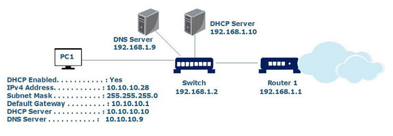
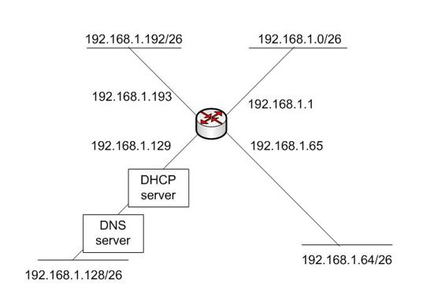
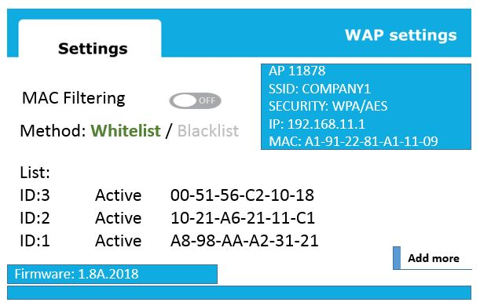
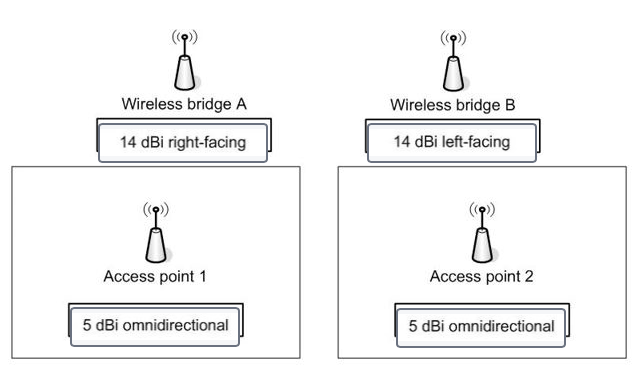

# CompTIA exam questions

## Easy (134)

1. Which mechanism is used by TCP to set up and synchronize a new TCP/IP connection?
    > **Three-way handshake**
 

2. A network engineer must ensure communications between an organization's branch offices and main HQ cannot be eavesdropped on. What should the engineer do?
    > **Configure site-to-site VPN between locations.**
 

3. A company is installing a large rack-mounted infrastructure to support a web server farm. High-availability is a critical concern for the company. You need to recommend a solution that will ensure continued availability without interruption if AC line power is lost. What type of technology does the company need to ensure this?
    > **UPS**
 

4. PC1 is unable to access the Internet in the network shown in the exhibit. What is the MOST likely cause?   
    > **A rogue DHCP server**
 

5. A policy includes the following statement: "Employees are not allowed to use company equipment to copy or distribute copyrighted material without the written permission of the holder of the copyright." Which policy would this statement be part of?
    > **AUP**
    >
    > - The statement would be part of the company's acceptable use policy (AUP). The AUP defines how company equipment and data may and may not be used. It typically includes detailed security guidelines and references to other policies, such as password policy requirements.
    > - This would not be part of a non-disclosure agreement (NDA). An NDA is a confidentiality agreement. It is a legally binding contract between two or more entities, such as between a company and an employee, designed to protect proprietary information and trade secrets. It does not address data or activity outside of the scope of the contract principals.
    > - This would not be part of a service level agreement (SLA). An SLA defines levels of service provided by a customer to its customers. For example, an SLA could define items such as performance metrics and guaranteed availability.
    > - This would not be part of a bring your own device (BYOD) policy. If personal devices are authorized through a BYOD policy, their acceptable use would be outlined in the AUP. The specific content of a BYOD varies by organization depending on its needs, security concerns, and network support for devices. Where possible, policies are typically enforced through network configurations and settings.
 

6. Match the network requirements to the network devices. Drag the appropriate device to each requirement. A device may be used once, more than once, or not at all:
    - A company needs a device to help centralize authentication, mitigate radio interference, provide load balancing, and improve bandwidth usage.
    - A company needs to evenly distribute traffic between web servers deployed in its perimeter network.
    - A company needs to add a layer of protection between internal network hosts and external websites.

    > - A **wireless controller** (or wireless LAN controller) can centralize authentication by forwarding requests to an authentication server, mitigate radio interference, provide load balancing, and improve bandwidth usage. It also provides for failover. Many versions can display a visualized map of the wireless network. Most include enhanced security features, such as detecting rogue access points and preventing some types of attacks.
    > - A **load balancer** can evenly distribute traffic between web servers deployed in the perimeter network. A load balancer is a device that is designed to distribute network or application traffic between multiple servers, decreasing the burden on any individual server. Distribution can be simply sent to each server in turn, based on the current number of connections to a server, or based on the current processing load on a server.
    > - A **proxy server** adds a layer of protection between internal network hosts and external websites. The proxy server uses its own address instead of the internal host's when connecting to an external site and returns the result to the originally requesting host. Most web proxy servers will also cache the result and serve subsequent requests from the cache instead of issuing a new request to the external server.
    > - A **Remote Authentication Dial-In User Service (RADIUS)** server does not match any of the scenarios. A RADIUS server provides a central point for managing authentication, authorization, and accounting (AAA).
    > - A **content filter** does not match any of the scenarios. A content filter can be software installed on a computer or a combination of software and a filtering device. A content filter is most commonly used to block objectionable content from websites or email. It may be used to block outgoing access to inappropriate or potentially hazardous websites. The use of content filters has expanded on wireless networks as more companies have introduced bring-your-own-device (BYOD) policies.
    > - A **VPN concentrator** does not match any of the scenarios. A VPN concentrator is a device that can access and manage multiple secure VPN tunnel connections.
 

7. A company wants to connect a remote office using a satellite internet service. What should be the main concern for this deployment?
    > **Latency**
 

8. A restaurant offers public Wi-Fi access to the Internet for its customers. A customer is prompted with a web page that requires the customer to agree to abide by use policies while connected. What is this an example of?
    > **Captive portal**
    >
    > - This is an example of using a **captive portal** as an access control. A captive portal displays a web page when a connection is made and can prompt for agreement to policies, as in this example. The portal can also request additional authentication credentials, require registration, request payment, or take other actions. The page can also be informational only, providing use guidelines but not requiring agreement.
    > - This is not an example of **network access control (NAC)** NAC uses policies and protocols to ensure t a device meets minimum qualifications before allowing it access to a network. This can include items such as up-to-date patches, current virus definitions, operating system versions, and so forth.
    > - This is not an example of **multifactor authentication**. For an authentication scheme to be multifactor authentication, it must include at least two DIFFERENT factors from the following:
    >   - Something you know
    >   - Something you have
    >   - Something you are
    >   - Somewhere you are
    >   - Something you do
    > - This is not an example of **media access control (MAC) address filtering**, though MAC address filtering can be integrated with captive portal. MAC address filtering would not be practical in this scenario because there is no way to know in advance the MAC address of customer devices.
 

9. A company has its own comms rooms and an on-premises data center containing all its servers and network devices. A network engineer wants to add some cloud on-demand solutions to the existing infrastructure. Which cloud model should the company use?
    > **Hybrid**
 

10. A company wants to configure a site-to-site VPN link between two offices. Users in each office should have access to resources in the other office, including shared folders and network services. What type of VPN should the company use?
    > **IPSec VPN** The company should use an IPSec VPN. An IPSec VPN can be used for remote client connections and to create site-to-site VPN connections. An IPSec VPN creates a full WAN link between the sites, with the ability to access resources from either end of the connection. Resource access is limited based on permissions, not on technology support.
    > - The company should not use an SSL VPN or TLS VPN. In common usage, the term SSL VPN is used to describe both types of VPN connections. This type of VPN supports a connection over port 443, making easy to implement for most network firewalls. This is the same port used for HTTPS connections. A significant limit is that access is limited to websites, web applications, and web-aware applications rather than providing support for full site-to-site connections.
    > - PPTP is an older remote access protocol and is no longer in common use. It can be used to create a VPN link, but this is not recommended, especially because of potential security issues.
 

11. Compare characteristics of NAS and SAN storage technologies. To answer, choose the appropriate storage type from the drop-down menus.
    > **SAN**:
    >   - Emulates directly attached storage for servers accessing storage.
    >   - Structured as a dedicated network consisting of multiple storage devices.
    >   - Preferred solution when extreme high-speed data transfer is required.
    > **NAS**:
    >   - Maintains its own file system, and data access is through remote file system I/O.

    > Network attached storage (NAS) refers to a single storage device connected directly to the network. It is recognized and accessed through its IP address. The device maintains its own file system, and data access is through remote file system 1/O, like any other shared network file server. NAS is necessary to support applications that require file-level access.
    > A storage area network (SAN) is a dedicated network of storage devices. A SAN can support an assortment of storage devices, including disk arrays and tape libraries. Because storage is structured as block storage, it emulates directly attached storage for servers accessing storage. The accessing server is responsible for the file system. This is the preferred storage solution when extreme high-speed data transfer is required.
 

12. A NIDS reports several attempts to download files from an external IP address. The Technical Services department determines that the source is a website that is made to look like a site from which network users download reference materials and blank PDF forms. Users enter the correct URL for the website but are being sent to a different IP address. Which type of attack is this?
    > **DNS poisoning** The redirection is through a DNS poisoning attack. In a DNS poisoning attack, a fake IP address replaces the valid IP address for a server or other device. When users attempt to navigate to the server, they are sent to a different server. This result of the redirection, users being sent to a fake website that looks like a valid website, is often referred to as a pharming attack. This is one of the forms that a pharming attack can take. Another is to use a close variation of a valid sites name and URL as a destination in a link.
    > - This is not an example of ARP poisoning. ARP poisoning is used to inject or replace Media Access Control (MAC) addresses in a host's ARP cache. The MAC address is used for final delivery of packets on a network, so ARP poisoning can be used to redirect traffic from its target to an attacker's computer. ARP poisoning is one of the ways that a man-in-the-middle attack is executed, where transmissions between two computers are monitored by a third computer.
    > - This is not an example of VLAN hopping. VLAN hopping is used to gain access to VLANs to which the attack would not have access. The attack is used as a way to intercept and collect data.
    > - This is not an example of an evil twin. An evil twin is a rogue access point that is set up to look like a valid access point. The rogue can be a wireless access point or a computer configured to act as a wireless access point.
 

13. Which of the following is an example of valid multifactor authentication factors?
    > **Facial recognition and PIN**
 

14. What type of attack is designed to flood a server with traffic, either crashing the server or making it unavailable?
    > **DoS**
 

15. A recent security audit reveals that users from all locations have full remote access to network devices. Which solution should be implemented to address that problem?
    > **ACL**
 

16. Part of a company's network is shown in the exhibit. Client computers are configured to receive IP addresses automatically from the DHCP server. All client computers currently have valid IP addresses. Computers on the 192.168.1.0 subnet are unable to resolve host names in other subnets but can access resources by IP address. Computers on other subnets are not experiencing this problem. What is the most likely cause? 
    > **Port 53 is blocked on the 192.168.1.1 interface.**
    > The most likely cause is that port 53 is blocked on the 192.168.1.1 interface. DNS name resolution uses port 53. Because name resolution is failing on the 192.168.1.0 subnet only, the most likely problem is that the port is blocked on the interface facing that subnet.
    > 
    > Port 53 is not blocked on the 192.168.1.129 interface. If it were, then other subnets would also be experiencing name resolution problems.
    >
    > The 192.168.1.1 interface is not failing. If the interface were failing, then computers on the 192.168.1.0 would be unable to access resources in other subnets.
    > 
    > You know that the DNS server is not failing because name resolution works for other subnets.
 

17. A junior network engineer receives a new router to configure. Which two configuration tasks should the engineer perform BEFORE he copies a standard configuration template onto the router?
    > - **Update the firmware**
    > - **Change the default username and password**
 

18. A company opens new warehouse space on its company campus. Network wiring for the warehouse is routed through a 110 punch block and patch panel. Wiring out to devices uses Cat 5e UP cable. Several devices in warehouse experience communication problems. After extensive testing, the problem is determined to be crosstalk. The company needs to correct the problem. Infrastructure changes should be kept to a minimum. What should the company do?
    > **Replace the failing cables with Cat 6 cables.**
    > The company should replace the failing cables with Cat 6 cables. Crosstalk occurs when a signal on one cable pair creates transmission errors with another pair through inductive or capacitive coupling. Crosstalk is minimized in copper wires through the twists placed in the pairs. Cat 6 cable is produced with much more stringent specifications for preventing crosstalk than Cat 5 or Cat 5e cable.
    >
    > The company should not replace the failing cables with Cat 5e STP cables. Shielded Twister Pair (STP) cable adds a shielding not present in Unshielded Twister Pair (UTP) cable to prevent electromagnetic interference (EMI). STP cable is no less susceptible to crosstalk than UTP cable.
    > 
    > The company should not replace the 110 punchdown block with a 66 punchdown block. A 66 punchdown block is not rated for network cabling above Cat 3. A 110 block can be used with Cat 5 and Cat 6 cable types.
    >
    > The company should not replace all cabling with fiber optic cable. This would solve the problem but would require significant infrastructure changes to add support for fiber optic. In addition, a media converter would likely be needed to transfer signals from copper cable to fiber optic.
 

19. A company wants to support multiple client computers running an application installed on a computer that runs Windows Server 2016. The clients should be able to take advantage of the memory and processor resources on the server. Each client will have a unique data set. Which technology should the company use?
    > **RDP** The company should use Remote Desktop Protocol (RDP). RDP is a Microsoft-proprietary desktop sharing protocol. Different operating systems are supported as clients, but the server must be a Microsoft Windows server. A new session is started as each client's user logs on, and each client can launch a new instance of the application. Key presses and mouse clicks are passed to the server, and changes to the display screen are returned to the client. Data is stored on the client computer.
 

20. A network engineer has installed three gigabit switches. The switches will provide access to NAS devices for end users. What should the engineer configure to avoid a bottleneck in the network with big file transfers?
    > **Trunks with port aggregation**
    > The engineer should configure trunks with port aggregation to avoid a bottleneck. A trunk is a special type of link that can carry traffic from multiple VLANs across switches. Port aggregation allows the network engineer to combine two or more ports on a switch to improve the aggregated file transfer speeds. Even though the company has ordered gigabit switches, a link between them would provide 1 Gbps only for all users, which could cause a bottleneck in the network.
    >
    > Port security will not improve the file transfer speeds. The network engineer could use port security to filter Media Access Control (MAC) addresses and limit the number of hosts in the network.
    >
    > The engineer should not use file transfer protocol (FTP) with secure shell (SSH) in this scenario. This would not help avoid a bottleneck. FTP with SSH is called FTPS and is used for secure file transfers.
    > 
    > The engineer should not implement a quality of service (QoS) policy here. It would not increase the bandwidth that is needed between all switches. QoS could improve overall user experience, but it will not help to prevent a bottleneck. The engineer should use port aggregation to improve the file transfer speeds between switches.
    > 
    > The engineer should not use Hot Standby Router Protocol (HSRP) or Virtual Router Redundancy Protocol (VRRP). HSRP and VRRP are designed to provide a virtual gateway for end devices and do not offer any aggregation services.
 

21. A network technician wants to deploy a new virtual firewall. The firewall has to support three interfaces: G0/0, G0/1, and G0/2. What should the technician configure at the VM level for these interfaces?
    > **vNIC** The technician should configure a virtual Network Interface Card (vNIC). Each interface requires a separate virtual NIC to operate. The technician should add three vNICs during the creation of a virtual machine (VM).
    >
    > Internet **SCSI** (iSCSI) cannot be used here. SCSI is a storage networking standard and does not offer virtual interfaces.
    >
    > The technician should not configure a **trunk**. A trunk is used to pass VLAN information between two switches.
    >
    > Finally, **VLAN** is not enough here. The technician should create a vNIC first, which could be associated with a VLAN, if necessary.
 

22. Which type of vulnerability would NOT be reported by a vulnerability scan?
    > **Zero day** One type of vulnerability that would not be reported by a vulnerability scan is a zero day vulnerability. By definition, a zero day vulnerability is unknown and previously undetected. Because there is no current reference by which to identify the vulnerability, it would go undetected.
    > 
    > A vulnerability scan is designed to look for a wide range of vulnerabilities, such as: 
    >   - Missing patches 
    >   - Missing passwords 
    >   - Configuration errors
    >   - Out-of-date virus definitions
    >   - Unnecessary open ports
    >   - Unnecessary running services
    >
    > Vulnerability scans are typically run on a periodic basis by in-house personnel. Many commercial security software suites include vulnerability scanners. There are also stand- alone versions. You should exercise caution before using web-based vulnerability scanners if you are not familiar with the source. These are often scams to sell you software you might not need or malicious software that will try to install malware on the computer being scanned.
 

23. Identify which statements describe exploits and vulnerabilities. To answer, select the appropriate threat category from the drop- down lists next to each statement.
    - **Vulnerabilities**:
      - An application has an open maintenance hook that provides access to configuration settings.
      - A database server's operating system is missing several security patches.
      - User login accounts have administrative rights to client computers.
    - **Exploits**:
      - Deceptive calls are used to gather critical information about network servers.
      - A data breach exposes personal information about customers.

    > A **vulnerability** is a flaw or a weakness in security that could lead to a security breach. Vulnerabilities can include things such software bugs, improper configuration settings, default administrators and passwords, or poorly trained users. An open maintenance hook, which may be left by programmers to get "back door" access to an application, missing patches, or assigning more rights than necessary are all vulnerabilities.
    >
    > An **exploit** is an attack that takes advantage of a vulnerability. This can be a program designed to breach security or a social engineering attack that employs deceptive practices to gain information. Deceptive calls to employees and data breaches that release information are both examples of exploits.
    >
    > Penetration testing is one way to find known vulnerabilities and test defenses against common exploits.
 

24. A company has deployed a new Microsoft Windows server behind a firewall. A systems administrator has been experiencing problems querying and modifying items in Active Directory from a remote location using an LDAP-based application. Which protocol should be allowed through the firewall?
    > **TCP port 636**
    > TCP port 636 should be allowed through the firewall. Lightweight Directory Access Protocol (LDAP) over SSL is a secure protocol used to query and modify items in directory services such as Active Directory.
    >
    > Remote Desktop Protocol (RDP) uses TCP port 3389. RDP can be used to connect to a server remotely. However, RDP does not support querying and modifying items in Active Directory. By default, RDP does not use SSL and is vulnerable to a man-in-the-middle attack.
    >
    > Secure Shell (SSH) uses TCP port 22 to provide secure remote access to a system, for example a router, a switch, or Linux server. SSH was created to replace telnet, which does not support public-key cryptography features. SSH does not offer a direct way to connect to directory services.
    >
    > Trivial File Transfer Protocol (TFTP) uses UDP port 69. TFTP is used to send and receive files on network devices. TFTP is not used to connect to Active Directory.
    >
    > Domain Name System (DNS) uses UDP port 53 for DNS queries. DNS uses TCP for larger packets and zone database transfers. DNS is required for Active Directory to run but is not used to query or modify directory items.
 

25. A company wants to deploy a new WLAN topology without running new electrical wiring. The solution has to support the 5Ghz band, MU-MIMO, and offer speeds of at least 2100 Mbps. The company wants to use a PoE solution providing at least 25W of power for a connected device. Which two components should be used? (Choose two.)
    > The company should use a switch supporting the 802.3at standard and an 802.11ac Wave 2 access point. There are multiple Power over Ethernet (Po) standards. The most common one is PoE+ described as 802.3at, which offers the maximum power of 25.5W and 600mA to a connected device.
    > 
    > The 802.11ac Wave 2 standard uses the 5Ghz frequency and offers downstream communications to many wireless devices using the multiuser multiple input, multiple output (MU-MIMO) technology. The 802.11ac standard supports a throughput of 2 Gbps and more (The physical layer (PHY) rate is up to 3.47 Gbps.).
    >
    > The 802.11ac Wave 1 standard does not meet the company's requirements. It offers single-user multiple input, multiple output (SU-MIMO) technology only and a throughput of around 850 Mbps (PHY of 1.3 Gbps).
    >
    > The 802.11n standard cannot be used for this scenario. The 802.11n offers single-user multiple input, multiple output (SU-MIMO) technology and a throughput of around 390 Mbps (PHY of 600 Mbps) only.
    >
    > The 802.3af standard (Po) does not meet the company's requirements because it offers no more than 12.95W of power to a connected device.
    >
    > The 802.1x is an authentication protocol for wired and wireless connections. There is nothing in the requirements that requires this standard to be implemented.
 

26. Users report that they cannot access any resources on the Internet using an FTP client. It is determined that the connections have been denied by the firewall. All hosts from the local subnet of 192.168.1.0/25 should have access. Which ACL rule should the company implement?
    > **An outbound rule: permit hosts from 192.168.1.0 255.255.255.128 to access any hosts on TCP ports 20 and 21**
 

27. The nslookup command fails and shows the error in the exhibit. What should the support team create to fix the problem?
    > The support team should create a **reverse lookup zone**. The error indicates a missing Pointer (PTR) record. PTR records resolve IP addresses to fully-qualified domain names (FQDN). The team should create a reverse lookup zone on a domain name system (DNS) server and verify the PTR records.
    >
    > The support team should not create a **Canonical Name (CNAME) record**. A CAME record creates an alias by mapping a name to another name. The error suggests a problem with a PT record.
    >
    > The team should not use a **TXT record**. TXT records contain information for sources outside of the main domain and are not related to reverse lookups.
    >
    > **Automatic Private IP Addressing (APIPA)** is a feature of Microsoft Windows operating systems. APIPA allows a computer to automatically assign an IP address when there is no DHCP server in the network. APIPA is not related to DNS records and zones.
    >
    > Creating a **static route entry** will not solve the problem. The problem is not related to the routing of packets. The team has to create a reverse DNS zone.
 

28. A technician configures an access point as shown in the exhibit. He creates a list of MAC addresses to allow on the network using MAC filtering. The technician realizes that despite this configuration, any device can still connect. What should the technician do? 
    > The MAC address filtering option has not been enabled. The technician can create a list of allowed MAC addresses, but he has to enable it globally for it to be used by the access point. 
    > 
    > MAC address filtering allows the technician to create a list of devices that are allowed to connect to the wireless network. Many reports suggest that it does not increase the security in the network, and it is rarely used in a production network. 
    > 
    > The technician should not change the method to Blacklisting. The technician wants to create a list of devices th to connect to the network. He should use a whitelist for that. 
    >
    > Changing the order of IDs will not fix the issue. The access point processes all IDs in the list, and the order is irrelevant. 
    >
    > The technician should not reboot the access point since this could cause a disruption to other authenticated users. The technician should enable the MAC filtering option.
 

29. A company is replacing a portion of its wired LAN with a wireless LAN configured for Wi-Fi Protected Access I1 (WPA2). The company needs to use the most secure encryption protocol for WPA2. Which protocol should the company implement?
    > **CCMP-AES**
    > The Counter Mode with Cipher Block Chaining Message Authentication Code Protocol (CCMP) with Advanced Encryption Standard (AES) is the default encryption protocol for Wi-Fi Protected Access II (WPA2). The standard requires mandatory use o CCMP-AES. Devices must support CCMP-AES to be certified as WPA2 devices. In addition to a high level of encryption, CCMP-AES supports data integrity and authentication.
    >
    > Temporal Key Integrity Protocol (KIP) with Rivest Cipher 4 (RC4) is supported by WPA2 devices and can be implemented in addition to CCMP-AES to provide backward compatibility for legacy devices. If it is not needed for legacy device support, you are not required to configure TKIP-RC4. TKIP-RC4 was the default encryption protocol for the earlier WPA standard.
    >
    > Extensible Authentication Protocol-Transport Layer Security (EAP-TLS) and EAP-Flexible Authentication via Secure Tunneling (EAP-FAST) are authentication protocols for initial client authentication, for when the client first connects to an access point, not encryption protocols for wireless broadcasts. Both are supported by WPA2 and provide for secure authentication.
 

30. A company must implement additional monitoring and analysis to meet compliance requirements related to work done for new customers. The company needs a solution that can collect log, event, and other security information from a variety of sources and correlate and analyze the data to identify threats. It should provide for long-term storage of the data collected and be able to identify trending threats. What type of device solution should the company use?
    > **SIEM**
    > The company should implement a security information and event management (SIEM) device or service. SIEM solutions vary in the functionality that they provide but most, at minimum, meet the scenario requirements. SIEM devices can collect data from network devices directly or through the use of client agents. Data is accepted in different formats. They provide for both real- time monitoring and reporting as well as analysis over time. One of the most common reasons for implementing SIEM technologies is to assist with meeting compliance requirements.
    >
    > An **intrusion detection system (IDS)** does not meet the scenario requirements. There are two common versions of IDS system. A signature-based system is designed to identify potential threats based on software signatures. An anomaly-based system relies on unexpected or "odd" network activity as opposed to a baseline. An IDS does not collect log or event data and does not provide the type of analysis needed.
    > 
    > A **server log** does not meet the scenario requirements. A server log is a network collection device, but it is limited to log information only and supports limited data formats. Usually, it is also restricted to a limited set of devices. A server log is primarily for collection and storage and is not designed to perform detailed analysis.
    > 
    > **Simple Network Management Protocol (SNMP)** is a standard protocol for collecting information from network devices and sending configuration requests to devices. Data collection is limited to information such as device type, configuration parameters, device properties, and so forth. It does not perform the type of data collection, correlation, and analysis needed.
 

31. A company is wiring a new office space to support 1000BaseT Ethernet. The network design calls for UTP cable. The majority of the cable will be routed through a suspended ceiling. Which cable should the company use?
    > **Cat 5e plenum** The company should use cat 5e plenum cable. Cat 5e unshielded twisted pair (UTP) cable is rated for use with 1000BaseT. Plenum cable should be used instead of PVC cable. Because the cable is being routed through the ceiling, fire-related risks must be considered. PVC cable insulation burns faster than plenum. PVC also releases hazardous fumes when it burns.
    >
    > Cat 7 cable should not be used. It is available as shielded twist pair (STP) only and is significantly more expensive and harder to work with than Cat 5e cable.
 

32. A company collects network traffic data from multiple subnets. Detailed analysis indicates that packets are being dropped by one of the routers. Technicians suspect this is due to misconfigured firewall ACLs. Where should technicians look for more detailed information?
    > **Firewall logs** Technicians should review the firewall logs. Firewall logs will have information about packets dropped and the reason they are dropped. Firewall rules define access control lists (ACLs) to determine when packets are passed or blocked and dropped by a firewall. When a packet is dropped because of ACL restrictions, it is recorded in the firewall log.
    >
    > Technicians should not review the **event logs**. Event logs contain entries generated by system, application, or auditing events. Dropped packets do not generate events that are logged in the event logs.
    >
    > Technicians should not review **vulnerability scans**. These might indicate weaknesses in firewall rules and ACLs, but they would not contain detailed information about dropped packets.
    >
    > Technicians should not review **port scans**. Ports scans identify open ports, not information about traffic and the status of packets.
 

33. What type of physical security device lets a company locate devices that have been moved to a new location?
    > **Asset tracking tags** Asset tracking tags provide a way to locate equipment. They can be used to help prevent equipment from being removed from secure areas or to prevent expensive equipment from being removed from the building. Asset tracking tags usually work on a radio-frequency identification (RFID)-based technology that can be tracked by various types of devices, including most smart phones.
    > 
    > Video surveillance, if in the right location, could provide information about when the equipment was removed, and possibly by whom, but it would not tell you where the equipment was taken. Video equipment is commonly used as a deterrent with the idea that if an area is under surveillance, it is less likely that someone would try to steal anything.
    > 
    > Motion detection can be used to log and possibly generate an alert or alarm when someone enters an area but, like video surveillance, it does not let you know where the equipment was taken.
    > 
    > A key fob is typically not used to protect or track assets. A key fob is usually a near field or RFID device. One common use is to activate locks to allow entry to a secure area when the fob holder approaches the area.
 

34. Network devices in one area of the office building experience communication problems. A cable tester shows that the signal on the RX pair is lower than expected. What is this an indication of?
    > **Attenuation** This is an indication of attenuation. The RX pair is the receive signal from the device context, the signal coming into the device. Attenuation is the loss of signal strength over distance, and it occurs with both digital and analog signals. Attenuation can occur over copper and fiber optic cable.
    > 
    > This is not an example of crosstalk. Crosstalk occurs when a signal on one cable pair creates transmission errors with another pair through inductive or capacitive coupling. Crosstalk is minimized in copper wires through the twists place in the pairs. Crosstalk does not reduce the signal strength but does corrupt the signal.
    > 
    > This is not an example of electromagnetic interference (EMI). This is interference generated external to the cable, such as from heavy equipment, compressors, copiers, and the like, and introduced on the data cable through induction. EMI does not reduce the signal strength but does corrupt the signal.
    > 
    > This is not an example of latency. Latency is a delay in the delivery of a signal.
 

35. A company wants to create a site-to-site VPN. Maximum security is required. Which set of protocols should the company use?
    > **AES for encryption and SHA512 for hashing** The company should use Advanced Encryption Standard (AES) for encryption and Secure Hash Algorithm (SHA) with 512 bits for hashing. AES is a symmetric algorithm that uses the same key for both encryption and decryption of a message. AES supports the key lengths of 128, 192, and 256 bits. AES is a recommended protocol for creating a secure infrastructure.
    > 
    > SHA is a cryptographic hash function divided into standards: SHA0, SHA1, SHA2, and SHA3. SHA0 and SHA1 produce a 160-bit hash and are considered insecure. The company should use SHA2 or SHA3, which offer hashes of up to 512 bits.
    > 
    > Data Encryption Algorithm (DES) and Triple DES are legacy encryption algorithms and should be avoided. A Next Generation cipher is recommended, for example AES.
    > 
    > Message-Digest algorithm 5 (MD5) is a hash function that has been severely compromised. The company should choose SHA2 or SHA3.
    > 
    > SSL is a very secure protocol, but the company should not combine it with a weak hash function like MD5.
 

36. A technician needs to execute command-line management commands on a Linux server located in a remote office. The technician should be required to log on at the server. All communication should be encrypted. What should the technician use?
    > **SSH** The technician should use secure shell (SSH). SSH lets you open and use a remote command session to run command-line commands. SSH requires authentication, and all session communication is encrypted. This provides for secure communication over an unsecure path, such as the Internet.
    > 
    > The technician should not use Telnet. Telnet supports remote command sessions and requires authentication, but it does not support encryption.
    > 
    > The technician should not use Virtual Network Computing (VNC). VNC is a graphic remote desktop sharing system that can be used to control another computer. Keystrokes and mouse actions are passed to the remote computer, and desktop screens are returned. VNC does not have native support for encryption, so it would not meet the requirement.
    > 
    > The technician should not use Remote Desktop Protocol (RDP). This provides for a connection through a remote desktop interface but is a Microsoft proprietary protocol and is supported with Microsoft Windows computers only as the managed computers.
 

37. Which type of backup takes the least time and uses the least amount of disk space?
    > **Incremental** An incremental backup takes the least time and uses the least amount of disk space. The typical backup sequence starts with a full backup. This also resets the bit that identifies a file as changed and needing backup. When an incremental backup is run, it backs up only those files changed (or added) since the full backup. When the next incremental backup is run, it backs up only those files changed since the previous incremental backup, and so on. Disk recovery requires recovery from the full backup and then each incremental backup in the order in which they were made.
    > 
    > A **full backup** backs up all files when it runs, so it is the most time consuming and, as a single backup, requires the most disk space.
    > 
    > A **differential backup** backs up all data changed since the last full backup. That means that each subsequent differential backup takes longer and uses more space that the one before. Disk recovery requires recovery from the full backup and the most recent differential backup.
    > 
    > A **copy backup** is similar to a full backup in that it backs up all files, changed or not, but it does not reset the flag identifying a file as changed, so it does not interrupt a backup sequence.
 

38. A company has deployed a new access point. A network administrator wants to proactively monitor the number of connected clients and available resources using a secure protocol. What Layer 7 network protocol should be used?
    > **SNMP** The network administrator should enable Simple Network Management Protocol (SNMP). SNMP is an application layer protocol that can be deployed to proactively monitor and manage network devices. The different versions of SNMP are SNMP version 1, SNMP version 2c, and SNMP version 3. SNMPv1 and SNMPv2c use a community string for authentication only. SNMPv3 improves security by offering confidentiality, integrity, and authentication. SNMP uses UDP port 161.
 

39. A company needs to have a reliable record of everyone who enters or leaves a locked secure area of the building. What should the company use?
    > **Video surveillance** The company should use video surveillance. This is an automatic method of recording the image of anyone entering or leaving the area. Even if one person unlocks the door to the area and lets someone else through, both will be recorded.
    > 
    > The company should not use a **motion detector**. This could be used to record if and when someone entered the secure area, but it does not record who.
    > 
    > The company should not use a **sign-in log**. The problem with this is that it relies on people signing in. There is nothing to prevent someone from entering the area without signing the log.
    > 
    > The company should not use a **biometric lock**. This would record who unlocked the area, but not if anyone else entered with them.
 

40. A network administrator would change the ID on a switch's native VLAN to mitigate what type of attack?
    > **VLAN hopping** A network administrator would change the ID on a switch's native Virtual Local Area Network (VLAN) to mitigate a VLAN hopping attack. VLAN hopping is an attack in which the attacker's computer gains access to a port that would normally not be accessible to that computer. One way the attack is executed is through a double-tagging attack, in which frames are given two tags, one for the attacking switch and one for the target switch, making it look like the frame was intended for the target switch.
    > 
    > An administrator would not change the ID on a switch's native VLAN to mitigate a **rogue trunk**. A rogue trunk occurs when a rogue switch establishes a trunk connection with a network switch. The attack then has access to all VLANs through the trunk, making this another version of a VLAN hopping attack. This attack is avoided by disabling trunking on any port that should not be used as a trunk.
    > 
    > An administrator would not change the ID on a switch's native VLAN to mitigate a **distributed denial-of-service (DDoS)** attack. In a DDoS attack packets are streamed at a target device or network at a high rate. This is designed to crash the device or make it unavailable. There are several ways to mitigate DDoS attacks by using devices that can block traffic type or recognize the a and act to block the attacking computers. Devices used include intrusion protection systems (IPSs), firewalls, and routers. Security settings available on switches, including bandwidth limiting and configuring access control lists (ACLs), can also help to prevent DoS attacks.
    > 
    > An administrator would not change the ID on a switch's native VLAN to mitigate an **address resolution protocol (ARP)** attack. An ARP attack floods a switch with ARP broadcasts, causing the switch to redirect traffic to the attacker's computer. This is one of the ways of executing a man-in-the-middle attack.
 

41. A company is setting up the wireless LAN (WLAN) shown in the answer area. The company must determine which antennas to use. The risk of intercepting the signal between the buildings must be minimized. Full coverage must be provided inside of each building. Which antennas should the company use? To answer, drag the appropriate antenna type to each access point. An antenna type may be used once, more than once, or not at all.
    >
    > 
    > 
    > An antenna's gain is measured in relative decibels (dB) in relation to a standard antenna used for reference. Gain refers to the relative measure of an antenna's ability to direct a signal in a specific direction. The dBi value is commonly used, which is decibels measured relative to an isotopic reference antenna. An isotropic antenna is one that radiates equally in all directions. This helps determine the antenna's coverage area.
    > 
    > For example, you would expect a 2 dBi antenna to have a 360 degree field of coverage, making it appropriate for use as an internal antenna for host connections. A higher dBi antenna has a narrower field and more directional signal. This makes it well suited for applications such as connecting buildings on a corporate campus. The narrow field pattern makes it less likely that someone would be able to intercept the signal.
    > 
    > This means that a 14 dBi directional antenna is the best choice for connecting the buildings with a narrow broadcast that is less likely to be intercepted. A 5 dBi omnidirectional antenna provides wide coverage throughout the client areas inside of the buildings.
 

42. Which network security device protects LAN devices from malicious attackers on the Internet?
    > **Firewall** A firewall is a network security device designed to protect Local Area Network (LAN) devices from malicious attackers on the Internet. Firewalls can be simple routers configured with strict access control lists (ACLs) that limit inbound and outbound traffic based on source and destination IP addresses. However, most next generation firewalls (NGFWs) track session states and offer complex rulesets. Beyond simple firewalling, they may also scan traffic for malware and offer intrusion prevention functionality.
 

43. Most of a company's network administrators are Windows operating system specialists. The company is cross training administrators to help perform periodic management and administrative tasks on Linux servers. This includes a mix of command-line and graphic utilities. Some of the administrators being trained are in remote offices. All trainers are in the company's main office. The administrators being trained log on and work locally from a Linux server. The trainer will connect to the Linux server from a client computer. Both computers need to display the same screen and allow commands and utilities to be used from either computer. Which remote connection technology should the trainers use?
    > **VNC** The trainers should use Virtual Network Computing (VNC). VNC is a platform-independent desktop sharing system. The client to and is authenticated by the server. Any clients connecting to the server share the same session, which means they share the same screen, and keyboard and mouse actions are accepted from the server and from any connected client. This would give the trainer a way to walk the trainee through procedures and observe as the trainee practices.
    > 
    > The trainers should not use Remote Desktop Protocol (RDP). RDP is a Microsoft-proprietary desktop sharing protocol. Different operating systems are supported as clients, but the server must be a Microsoft Windows server, so RDP would not work in this scenario. Each connection to the server opens a new session, so users cannot join a shared session for training.
    > 
    > The trainers should not use secure shell (SSH) or Telnet. Both allow you to open and use a remote command session to run command-line commands. Neither provides a graphic interface. The primary difference between the two is that SSH uses secure encrypted communications and Telnet does not. VNC can be run in the context of an SSH session, but SSH by itself does not meet the solution requirements.
 

44. Against which type of attack is end user training most effective?
    > **Phishing** End user training is one of the most effective ways to defend against phishing and other social engineering attacks. Phishing attacks use deceptive emails to try to collect sensitive or personal information. Users can be trained to recognize phishing attempts and the actions to take when they occur. This can be enhanced through technical controls, such as email filtering.
    > 
    > User training cannot defend against a man-in-the-middle attack. In this type of attack, the attacker enters the communication path between two computers, usually a client and a server, and collects the data passed between the computers. Ways to prevent man-in-the middle attacks include the use of secure encrypted protocols, strong encryption as wireless access points, and use of virtual private networks (VPNs).
    > 
    > User training does not effectively defend against war driving. War driving is the process of physically going to different locations with a mobile device to find unsecured access points. The best defense is encrypting data communication and requiring secure authentication.
    > 
    > User training does not defend against an attack by an evil twin. An evil twin is a rogue access point configured to look like a valid access point. The attack is able to gather information after a user connects to a rogue access point. Rogue access points are one of the methods used to launch a man-in-the-middle attack.
 

45. A branch office has been allocated the subnet of 192.168.1.64/26. Which three IP addresses can be used for user devices at this location?
    > Network address: 192.168.1.64/26
    > Subnet mask: 255.255.255.192
    > IP range: 192.168.1.65 - 192.168.1.126
    > Broadcast address: 192.168.1.127
 

46. A company is developing its business continuity and disaster recovery plans. The company needs to determine the reliability of a critical network device. Continuity plans will depend on how frequent the device is likely to fail. Which value should be used to determine this?
    > **MTBF** The mean time between failure (MTBF) is the value to use to project how often you can expect a device to fail. This defines how long the device should be operational before it fails. This value is usually available from the manufacturer's specification sheets.
    > 
    > The team should not use the mean time to repair (MTTR) value. This is the typical time it takes to repair a device after a failure occurs, but it does not imply how often failure occurs.
    > 
    > The team should not use the recovery time objective (RTO). This is the maximum time to return a critical device to operation before serious consequences occur.
    > 
    > The team should not use the recovery point objective (RPO). This determines the maximum time of data loss allowable, or the point to which data must be recovered to restore operations.
 

47. PC1 and PC2 are connected to a managed switch. PC1 uses port F0/5, which is in VLAN 7, and PC2 uses port FO/11, which is in VLAN 12. What is the minimum required configuration by a technician on PC1 and PC2 to exchange data?
    > **IP address, subnet mask, and default gateway** PC1 and PC2 should be configured with a valid IP address, subnet mask, and default gateway. An IP address and subnet mask are required for communication in the same LAN. PC1 and PC2 are in two different VLANs, which means they need a dedicated default gateway. A VLAN is considered a subnet and requires a Layer 3 device (such as a router) to support routing.

 

48. A company wants to open a new office. A wireless site survey reveals that there are 12 access points in the area immediately around the office and that they use channels 1, 6, and 11. What should the company do to address the interference problem?
    > **Use the 5GHz band** The company should consider using the 5 GHz band. The wireless on-site survey shows that there are many access points in the area and they are using all the available frequency space of the 2.4 GHz band. There are three non-overlapping channels in the 2.4 GHz band: 1, 6, and 11, which means the company would face some interference. The 5 GHz band offers more channels and can transmit data at faster speeds.
    > 
    > Channel bonding will not solve the interference problem. The company could use channel bonding to combine two adjacent channels to increase throughput, however. If there are many devices in the area, channel bonding can introduce more interference, because more channels are in use. There are no available 2.4 GHz channels for the company to use in this environment, so aggregating them will not fix the problem. The company should move to the 5 GHz band.
    > 
    > Installing an omnidirectional antenna will not solve the interference problem. An omnidirectional antenna might offer better coverage but will not increase the number of non-overlapping channels. coverage
    > 
    > The 802.1x protocol cannot be used to address the problem of interference. The company could consider the 802.1x infrastructure to enhance security and implement a centralized server for authentication.
 

49. A malware attack encrypts the data on a critical network server. A dialog box displays on the server display screen with instructions about how to pay for a recovery code to decrypt the server data. Which type of attack does this scenario describe?
    > **Randsomware**
    > This is an example of a ransomware attack. Ransomware attacks take various forms, including:
    >   - Encrypting user data to make it inaccessible
    >   - Threatening to overwrite or delete all data
    >   - Threatening to publish all data
    >
    > This attack demands that a fee (ransom) be paid by a specified time to receive a recovery code, in this case, to decrypt the data. There is always the risk that even paying the ransom, the victim never receives a recovery or unlock code.
    
 

50. A company deploys a new wireless network. The company secures access using WPA2-Personal. What is required for a client to connect to an access point?
    > **Pre-shared key** WPA2-Personal, also known as WPA2-PSK, uses a pre-shared key (PSK) of 64 hexadecimal digits or passphrase of 8 to 63 printable ASCII characters. Users are prompted to enter the PSK or passphrase the first time a client connects to the network. WPA2-Personal is designed for use in home office or small business office network environments.
    
 

51. A company is changing its network design as shown in the exhibit. The company plans to deploy a web server and a honeypot in the DMZ. Which two documents does the company need to update?
    > The company should update the logical and physical network diagrams. A logical network diagram shows network hierarchies, server roles, naming conventions, and so forth. A physical network diagram shows the servers and network devices on a network and their relative locations. The proposed changes impact both diagrams.
    >
    > The company should not update a rack diagram. A rack diagram does not apply in this scenario. A rack diagram is a two-dimensional representation of organization of equipment in a rack enclosure.
    >
    > Standard operating procedure (SOP) does not apply in this scenario. An SOP is step-by-step instructions to help workers complete a complex task.
    >
    > A change management document does not apply in this scenario. A change management document gives the guidelines for proposing, implementing, and tracking changes to the network. 
    
 

52. A company deploys a server on its perimeter network. The server will be used for transferring files. Specific requirements include: - Users authenticate with a user ID and password. - - All communication between the server and client is encrypted. - Open ports on the perimeter firewall are kept to a minimum. - No certificate is required at the server or client. What should the company select as a solution?

    > **SFTP** The company should select FTP over SSH (SFTP) as its file transfer method. SFTP uses the secure shell (SSH) protocol for authentication and data security. SFTP supports simple authentication based on user ID and password but can optionally be implemented using certificate-based authentication if greater security is required. All communication between the server and client is encrypted, including the user ID and password used for authentication. SFTP uses a single port, port 22, on both the client and server.
    >
    > FTP over SSL (FTPS) is another secure transfer option, but there are some significant differences between FTPS and SFTP. FTPS can be configured for authentication through user ID and password, but connecting with a server through FTPS requires a server certificate for SSL authentication. Also, FTPS requires multiple ports. By default, you must open either port 21 or 990 as the command and control port and identify a range of data ports, typically 2000 through 2500.
    >
    > FTP and Trivial FTP (TFTP) are not secure transfer options. FTP can be configured to require user ID and password, but this information is passed in clear text. TFTP is used when less command and control is required and is often referred to as a lightweight protocol, meaning it has minimal overhead. FTP requires ports 20 and 21. TFTP uses port 69.
    
 

53. Users report that they have lost access to a network shared drive. They open a new help ticket and expect a quick resolution to the problem. What should a technician do next?
    > **Gather more information from users** The technician should gather more information from users. Even if a ticket has a higher priority, the technician should follow the network troubleshooting methodology. The first step recommends questioning users and collecting information about the problem. The issue has not been described in detail and requires more information. At this stage, the technician could try and recreate the problem. Then, the technician should establish and test a theory of probable cause and establish a plan of action. They could then escalate the issue to another department at this stage. Finally, the technician can implement the solution, verify all systems, and document their findings.
    
 

54. A company runs call center services with 25 agents. Agents report that their softphones have random quality issues. Which performance parameter should be verified in the network?
    > **Maximum of 150 ms of delay**
    > The company should verify the delay parameter. The recommended design recommendations for Voice over IP (VoIP) are:
    >   - No more than 150 ms one-way end-to-end delay
    >   - No more than 1% of packet loss
    >   - No more than 30 ms of jitter
    > Users will notice quality issues if any of these parameters is not met. A network administrator could also verify the Quality of Service (QoS) settings to make sure that the VoiP traffic is isolated and receives the highest priority.
    >
    > The maximum packet loss value should be kept below 1%, not 10% for a quality VoIP call.
    >
    > The available bandwidth is not a key factor for most VoiP networks and depends on the number of concurrent calls, codecs in use, and QoS settings. On average, the company should provide at least 10 Mbps for 100 phone lines. It is It more important to verify the delay, packet loss, and jitter values, which may affect the quality of calls.
    >
    > The frame size of 9k is not required to provide the highest quality of VoiP network. A standard frame supports up to 1500 bytes, but a network administrator can enable jumbo frames to support up to 9000 bytes of data. Jumbo frames can improve network performance but can increase the packet loss. It is not a recommended setting to improve the quality of a VoiP network.
    
 

55. Which two attack types are examples of social engineering attacks?
    > Phishing and tailgating are examples of social engineering attacks. Phishing attacks use deceptive emails to try to collect sensitive or personal information. Users can be trained to recognize phishing attempts and the actions to take when they occur. This can be enhanced through technical controls, such as email filtering. Tailgating is a physical attack in which someone enters a secure area simply by following someone who is authorized to enter into the area
    > 
    > A man-in-the-middle attack is not a type of social engineering attack. In this type of attack, the attacker enters the communication path between two computers, usually a client and a server, and collects the data passed between the computers.
    > 
    > A spoofing attack is not considered a type of social engineering attack. In a spoofing attack, the attacker's computer masquerades as a valid network client by using its IP address and, in some cases, its Media Access Control (MAC) address. For example, an attacker can connect to a port protected by MAC filtering by spoofing a valid MAC address. It should be noted that social engineering might be one of the methods used to gather information that is used to launch a spoofing attack.
    > 
    > A logic bomb is not a type of social engineering attack. A logic bomb is malicious code left in an application that executes when specific conditions are met. The form that the attack takes and the impact of the attack when it executes vary depending on the programmer's goals. Because custom code is used, logic bombs usually go undetected by antimalware software. In some cases, a logic bomb is the result of an insider threat, left behind by a disgruntled employee.
 

56. Users complain about intermittent connection issues with a file server. A junior technician has gathered all information and determined that no changes have been made in the network. What should the technician do next?
    > **Use the OSI model to establish a theory of probable cause**
    > The technician should use the Open Systems Interconnection (SI) model to establish a theory of probable cause. There are steps in the Structured Troubleshooting Methodology. The technician has completed Step 1 by questioning all users and checking whether anything has been changed in the network. Step 2 requires brainstorming ideas to establish a theory of probable cause.
    > 
    > Here is the seven-step methodology:
    >   - Identify the problem
    >   - Establish a theory of probable cause
    >   - Test the theory to determine the cause
    >   - Establish a plan of action to resolve the problem and identify potential effects
    >   - Implement the solution or escalate as necessary
    >   - Verify full system functionality and, if applicable, implement preventative measures
    >   - Document findings, actions, and outcomes
     
 

57. A large organization has offices in several locations around the world. Each geographic location has primary responsibility for its network administration and management. The company wants to ensure consistent instructions and management throughout the company. What should the company use to help ensure this?
    > **Standard Operating Procedure (SOP)** The company should implement standard operating procedures (SOP) to help ensure consistent management throughout all locations. An SOP identifies step-by-step instructions to help workers complete a complex periodic or repeated task. This will ensure that administrators are taking the same actions in the same way throughout the company.
    > 
    > The company should not use **change management** in this scenario. Change management deals with the guidelines for proposing, implementing, and tracking changes to the network. Documented change management is useful in tracking some activities but does not provide guidelines for how to perform the activities.
    > 
    > Network configuration baselines do not apply in this situation. These refer to initial network configuration rather than ongoing management activities.
    > 
    > The company should not use an acceptable use policy (AUP) to ensure consistent management. An AUP provides guidelines for the appropriate use of company resources. For example, an AUP might specify that company computers cannot be used to download games or entertainment content from the Internet.
    >
    > The company should not use a service level agreement (SLA) to ensure consistent management. An SLA is an agreement between an organization and its customers that defines minimum expectations for services provided. This includes issues such as maximum downtime and service availability.
 

58. A technician has established a plan of action to resolve a problem on a network switch. The solution has been tested in a lab environment, and the technician has a list of commands to execute. After logging into the device, the technician realizes that the TACACS server blocks the commands they have to implement. What should the technician do?
    > **Assign the task to another person or department.** If the technician has insufficient admin rights, the Structured Troubleshooting Methodology model recommends escalating the issue. After establishing a plan of action, the solution should be implemented. If the technician does not have access to a system r has insufficient admin rights, the issue should be escalated to the appropriate person or department for implementation.
    
 

59. What is the role of an MIB when implementing SNMP for network management?
    > **It is a collection of manageable device definitions that identifies device property information.** A management information base (MIB) is a database of device definitions. The MIB contains information about device properties necessary for device management. Simple Network Management Protocol (SNMP) uses the MIB for device-specific management information. MB files are available for various sources, including device manufacturers, to facilitate network management.
    > 
    > The device configured to collect device information and issue command requests is known as the Network management station (NMS). The NMS uses GetRequest messages to retrieve information from managed devices and SetRequest messages to issue changes to properties and variables to manage devices.
    > 
    > The software installed on managed devices is known as the SNMP agent. For many devices, the SNMP agent is installed by default.
    > 
    > Transport Security Model (TSM) provides the method for authentication and encryption of messages used for device management. The TSM specification supports SSH and TLS for encrypted communication.
 

60. Users report that messages about duplicate IP addresses keep displaying on their computers. What should technicians suspect as a cause?
    > **Rogue DHCP server** The likely problem is a rogue DHCP server with a duplicate scope or duplicate addresses within its defined scopes. When a device requests to lease an IP address, any DHCP server with a valid available IP address will respond to the request. If a rogue DHCP server has duplicate addresses available, it can result in duplicate IP address assignments.
    > 
    > The problem is not an exhausted IP address scope. A device will configure itself with an Automatic Private IP Addressing (APIPA) address if it is unable to lease an address due to an exhausted scope.
    > 
    > IP address assignment is not related to name resolution. A name resolution error would not result in duplicate IP address assignment.
    > 
    > Host firewall settings can control the data into or out of a host computer. Host firewall settings could prevent a device from being a able to lease an address from a DHCP server but would not cause duplicate IP addresses.
 

61. 
    > 
    > 
    > 
    > 
    > 
    > 
    > 
 

62. 
    > 
    > 
    > 
    > 
    > 
    > 
    > 
 

63. 
    > 
    > 
    > 
    > 
    > 
    > 
    > 
 

64. 
    > 
    > 
    > 
    > 
    > 
    > 
    > 
 

65. 
    > 
    > 
    > 
    > 
    > 
    > 
    > 
 

66. 
    > 
    > 
    > 
    > 
    > 
    > 
    > 
 

67. 
    > 
    > 
    > 
    > 
    > 
    > 
    > 
 

68. 
    > 
    > 
    > 
    > 
    > 
    > 
    > 
 

69. 
    > 
    > 
    > 
    > 
    > 
    > 
    > 
 

70. 
    > 
    > 
    > 
    > 
    > 
    > 
    > 
 

71. 
    > 
    > 
    > 
    > 
    > 
    > 
    > 
 

72. 
    > 
    > 
    > 
    > 
    > 
    > 
    > 
 

73. 
    > 
    > 
    > 
    > 
    > 
    > 
    > 
 

74. 
    > 
    > 
    > 
    > 
    > 
    > 
    > 
 

75. 
    > 
    > 
    > 
    > 
    > 
    > 
    > 
 

76. 
    > 
    > 
    > 
    > 
    > 
    > 
    > 
 

77. 
    > 
    > 
    > 
    > 
    > 
    > 
    > 
 

78. 
    > 
    > 
    > 
    > 
    > 
    > 
    > 
 

79. 
    > 
    > 
    > 
    > 
    > 
    > 
    > 
 

80. 
    > 
    > 
    > 
    > 
    > 
    > 
    > 
 

81. 
    > 
    > 
    > 
    > 
    > 
    > 
    > 
 

82. 
    > 
    > 
    > 
    > 
    > 
    > 
    > 
 

83. 
    > 
    > 
    > 
    > 
    > 
    > 
    > 
 

84. 
    > 
    > 
    > 
    > 
    > 
    > 
    > 
 

85. 
    > 
    > 
    > 
    > 
    > 
    > 
    > 
 

86. 
    > 
    > 
    > 
    > 
    > 
    > 
    > 
 

87. 
    > 
    > 
    > 
    > 
    > 
    > 
    > 
 

88. 
    > 
    > 
    > 
    > 
    > 
    > 
    > 
 

89. 
    > 
    > 
    > 
    > 
    > 
    > 
    > 
 

90. 
    > 
    > 
    > 
    > 
    > 
    > 
    > 
 

91. 
    > 
    > 
    > 
    > 
    > 
    > 
    > 
 

92. 
    > 
    > 
    > 
    > 
    > 
    > 
    > 
 

93. 
    > 
    > 
    > 
    > 
    > 
    > 
    > 
 

94. 
    > 
    > 
    > 
    > 
    > 
    > 
    > 
 

95. 
    > 
    > 
    > 
    > 
    > 
    > 
    > 
 

96. 
    > 
    > 
    > 
    > 
    > 
    > 
    > 
 

97. 
    > 
    > 
    > 
    > 
    > 
    > 
    > 
 

98. 
    > 
    > 
    > 
    > 
    > 
    > 
    > 
 

99. 
    > 
    > 
    > 
    > 
    > 
    > 
    > 
 

100. 
    > 
    > 
    > 
    > 
    > 
    > 
    > 
 

101. 
    > 
    > 
    > 
    > 
    > 
    > 
    > 
 

102. 
    > 
    > 
    > 
    > 
    > 
    > 
    > 
 

103. 
    > 
    > 
    > 
    > 
    > 
    > 
    > 
 

1.   
    > 
    > 
    > 
    > 
    > 
    > 
    > 
 

1.   
    > 
    > 
    > 
    > 
    > 
    > 
    > 
 

1.   
    > 
    > 
    > 
    > 
    > 
    > 
    > 
 

1.   
    > 
    > 
    > 
    > 
    > 
    > 
    > 
 

1.   
    > 
    > 
    > 
    > 
    > 
    > 
    > 
 

1.   
    > 
    > 
    > 
    > 
    > 
    > 
    > 
 

1.   
    > 
    > 
    > 
    > 
    > 
    > 
    > 
 

1.   
    > 
    > 
    > 
    > 
    > 
    > 
    > 
 

1.   
    > 
    > 
    > 
    > 
    > 
    > 
    > 
 

1.   
    > 
    > 
    > 
    > 
    > 
    > 
    > 
 

1.   
    > 
    > 
    > 
    > 
    > 
    > 
    > 
 

1.   
    > 
    > 
    > 
    > 
    > 
    > 
    > 
 

1.   
    > 
    > 
    > 
    > 
    > 
    > 
    > 
 

1.   
    > 
    > 
    > 
    > 
    > 
    > 
    > 
 

1.   
    > 
    > 
    > 
    > 
    > 
    > 
    > 
 

1.   
    > 
    > 
    > 
    > 
    > 
    > 
    > 
 

1.   
    > 
    > 
    > 
    > 
    > 
    > 
    > 
 

1.   
    > 
    > 
    > 
    > 
    > 
    > 
    > 
 

1.   
    > 
    > 
    > 
    > 
    > 
    > 
    > 
 

1.   
    > 
    > 
    > 
    > 
    > 
    > 
    > 
 

1.   
    > 
    > 
    > 
    > 
    > 
    > 
    > 
 

1.   
    > 
    > 
    > 
    > 
    > 
    > 
    > 
 

1.   
    > 
    > 
    > 
    > 
    > 
    > 
    > 
 

1.   
    > 
    > 
    > 
    > 
    > 
    > 
    > 
 

1.   
    > 
    > 
    > 
    > 
    > 
    > 
    > 
 

1.   
    > 
    > 
    > 
    > 
    > 
    > 
    > 
 

1.   
    > 
    > 
    > 
    > 
    > 
    > 
    > 
 

1.   
    > 
    > 
    > 
    > 
    > 
    > 
    > 
 

1.   
    > 
    > 
    > 
    > 
    > 
    > 
    > 
 

1.   
    > 
    > 
    > 
    > 
    > 
    > 
    > 
 

1.   
    > 
    > 
    > 
    > 
    > 
    > 
    > 

   

## 